[皇帝](https://pewae.com/gaan/aHR0cHM6Ly93d3cuZG91YmFuLmNvbS9nYW1lLzI1OTIyMDg4Lw==)

机种：PC厂商：全崴资讯类别：SLG发行年月：1996-01耗时：13

跟金庸群侠传一样，这个游戏当年在小伙伴家里的奔腾166上远观而不可亵玩的游戏之一。我把它算在知新篇里，是因为当年只看过一次。而且乌泱乌泱围了七八条大汉，根本也没机会上手。
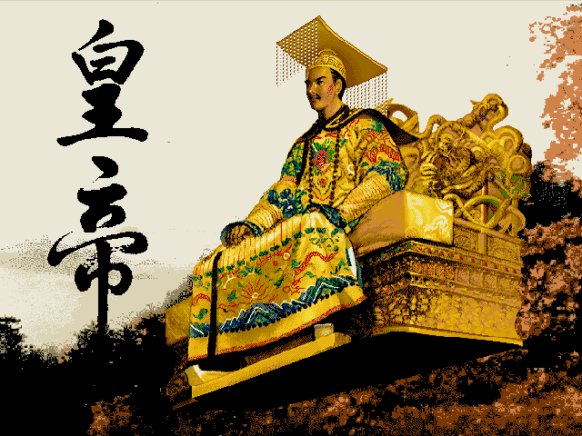

以当年的制作水平来衡量，这款游戏的质量真心挺高的。除了音乐糙点，难度高点，BUG恶心点以外就没啥别的毛病了。全崴资讯算是台湾的一家良心公司了，当年FC、MD上好几个启蒙级别的中文游戏都是他们的作品。
梦战式的开局问题，能提升一些基本属性。
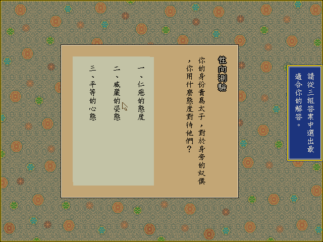

作为一个争霸类的SLG，本作采用了中国古代地图+虚构历史。刚开始的时候百废待兴，又穷又没人，旁边的异族还虎视眈眈。尤其是北面的东突厥，攻击性非常强，如果不先把它搞定的话，不出两年就OVER了。偏生这个游戏里，每个地方的长官是要上殿的，没丢一块地盘，上朝的时候屋里就少两个人。当被打得只剩一两块领地的时候，悲哀之情油然而生。
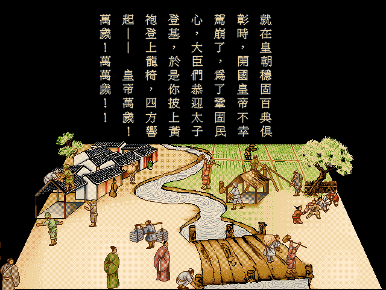
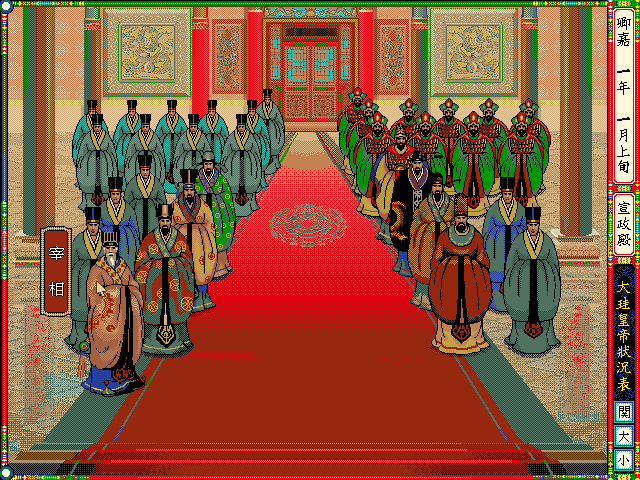
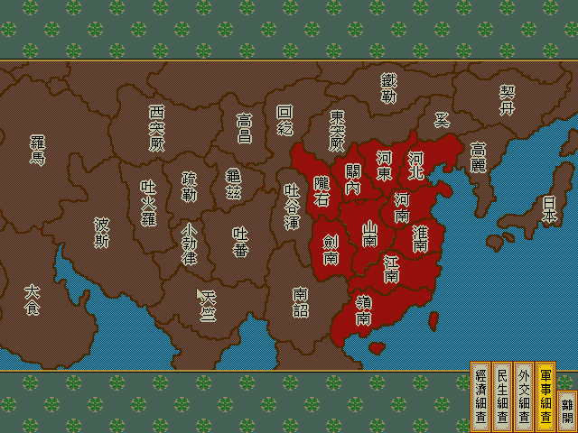

不修改的话，游戏的难度很高。每天的体力有限，做爱爱以外的任何事情都会消耗体力。地盘大的时候，管理国家都管不过来，所以要精心算计体力的分配。而刚开始的寿命也不长，必须要找道士炼丹嗑药，药方不对的话直接毒死。即使知道了药方，材料还得下属藩国进贡，所以还得早日踏平日本和高丽……最恶心的是，首都的治安还需要时不时关注一下，这还是个隐藏数值，等你想起好久没点治安的时候，就已经晚了。所以必须作弊啊。DOSBOX自带的即时存档功能可以说帮了大忙，因为游戏本身有个很奇怪的BUG:每次读档游戏的时间往后推一个月，用了等于自杀。
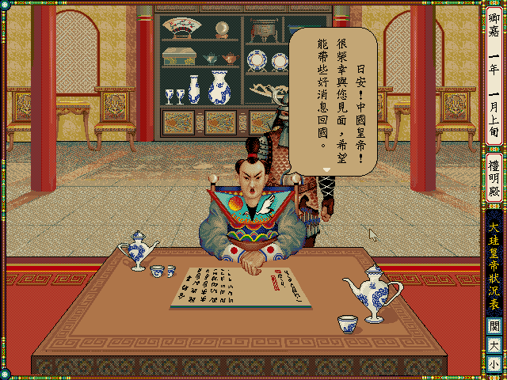
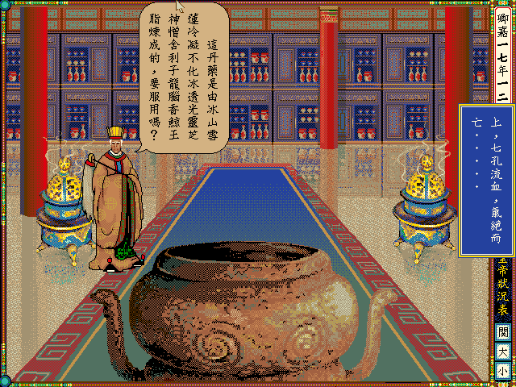
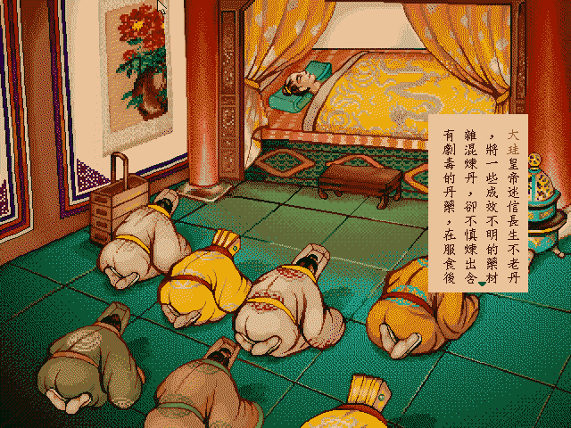
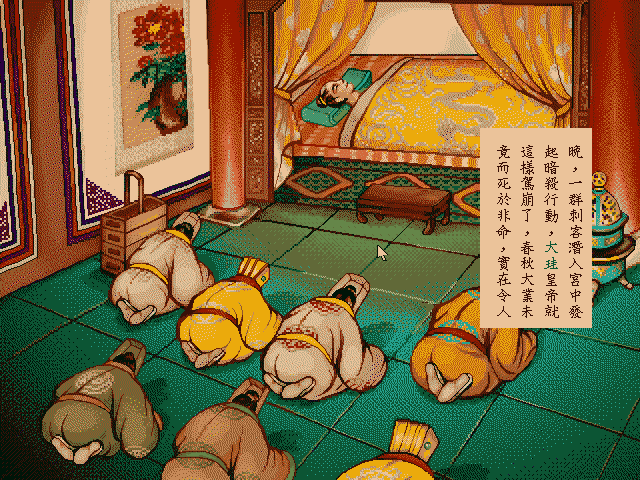

玩这种游戏就图个醉卧美人膝，醒掌天下权。这个游戏在这两点上做得非常非常出色。这也是我20多年对它念念不忘的原因。
先说美人。游戏里搞了个30人的名妃名单。临幸到名人的时候别管长得啥样，拿下就是了。这是有实际意义的。名妃=颜值高=恢复体力多。不过只有在一开始魅力低的时候才能找到名妃，所以游戏开始的一两年就拼命地睡姑娘吧。话说当年第一次玩的时候，我就在身后撺掇执行的表少爷一个劲地SL，十几次后终于搞出了陈圆圆，他们几个对我的游戏敏感性佩服得五体投地。
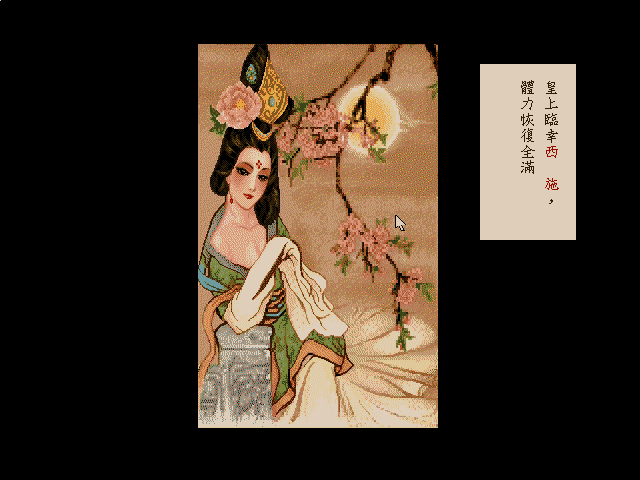
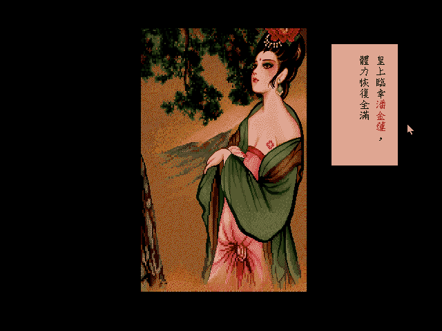
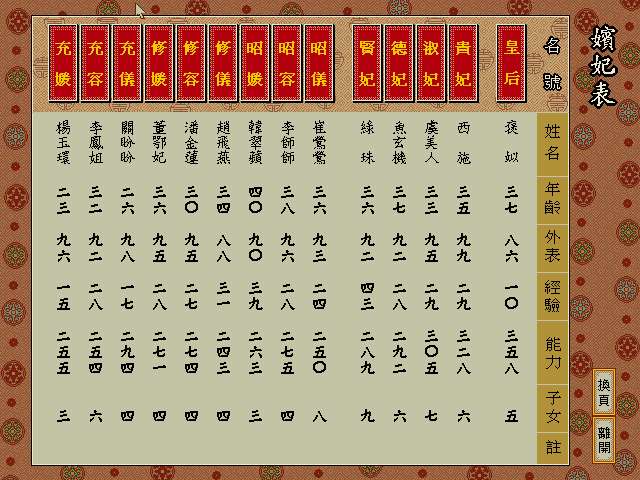

名臣比名妃多很多，可能有50个。只有魅力高了之后才能在科举的时候招到名臣。这些家伙有名是有名，可有的忠诚很低，有的清廉很低。忠诚低的派到地方就会叛乱，清廉低的到地方会影响税收，所以只能留在中央摆着看。
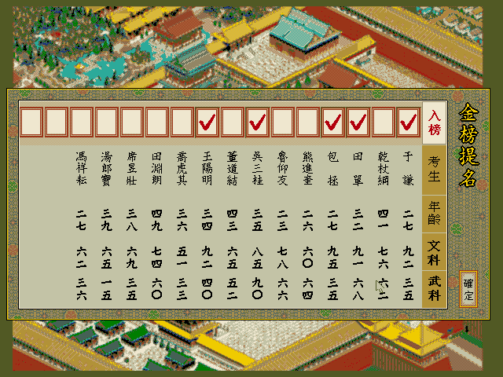
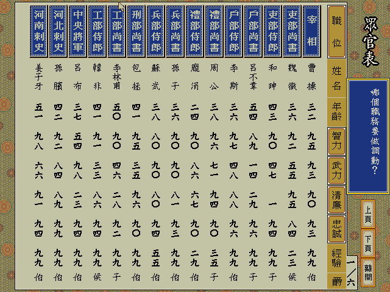

把忠诚低的二五仔放到地方，就是这个下场：
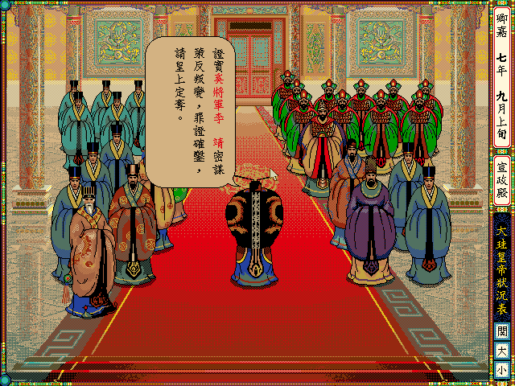

皇帝本身有几个属性，除了上面提到的魅力，还有武力和才艺，影响活多久的快乐和健康，以及除了影响最终评价没什么用的孝顺和爱子。各种属性的提升要利用退朝的时间访问宫内各种建筑，那个时期游戏都是这样。爱子是有空的时候要召见一下皇子，孝顺则是有空的时要去慈宁宫给太后请安。耗到第16年的时候，太后终于挂掉了。真好。
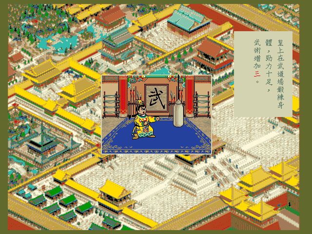
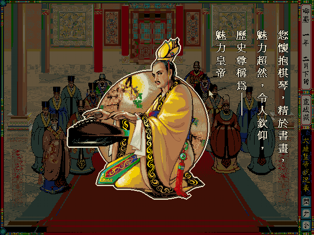
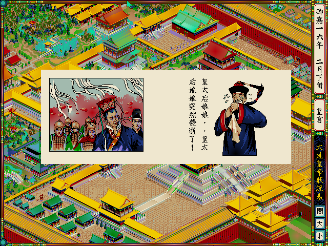

还有另外一个叫做皇威的属性，相当于综合评分。每500分可以封禅一次。
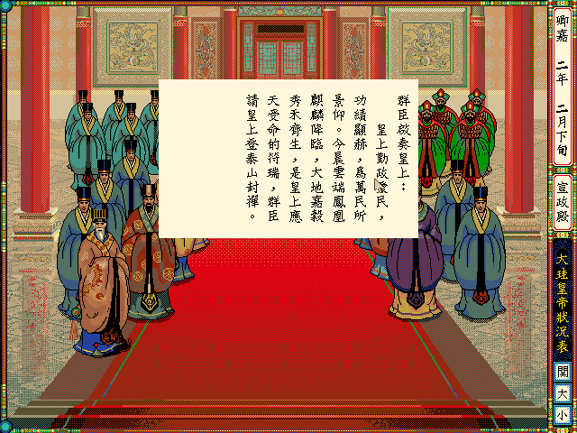
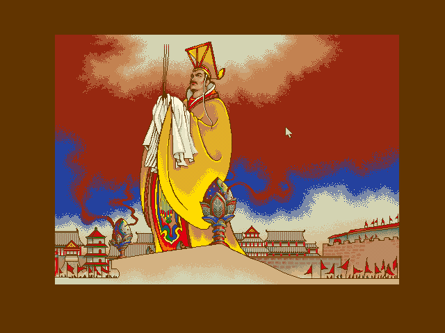

把周边的国家全部消灭或者签下保护条约之后，达成“天可汗”成就。其实把这个作为通关是不错的，可制作方不这么想。想要达成非意外死亡的结局，只能消灭所有国家或者在位50年自动退位。
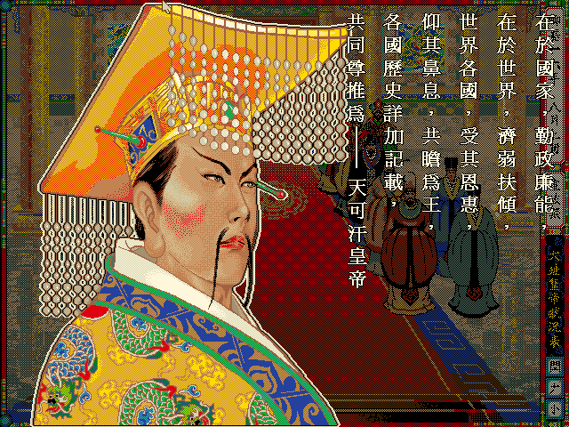

这种战略游戏的通病是，到了后期会非常无聊。所以50年是万万耗不起的，只能挥兵再灭一次天竺和日本。对了，这游戏打仗其实很简单，因为敌国的士兵数不会增长。一次打不过再来就好，慢慢磨死敌国就好。而且有岳飞或者韩信之后打仗也是很轻松的。
消灭最后一个国家之后，原地飞升。
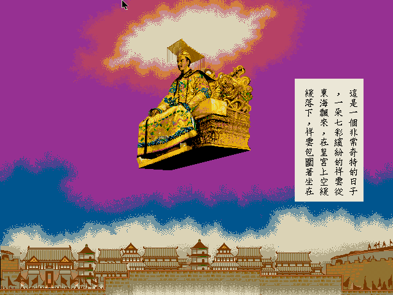

随后出现对于你这个皇帝的盖棺定论。因为地方建设搞起来太慢了，所以民生方面的评价不高。
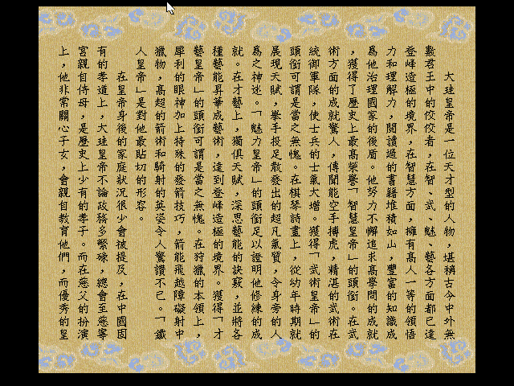
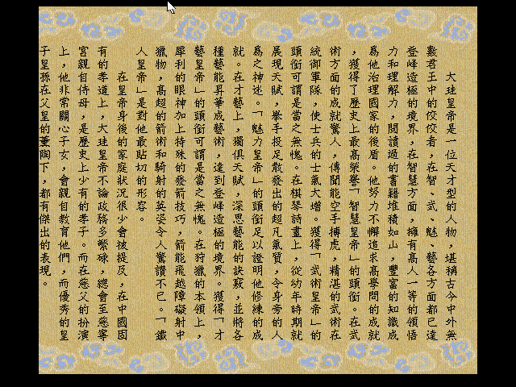
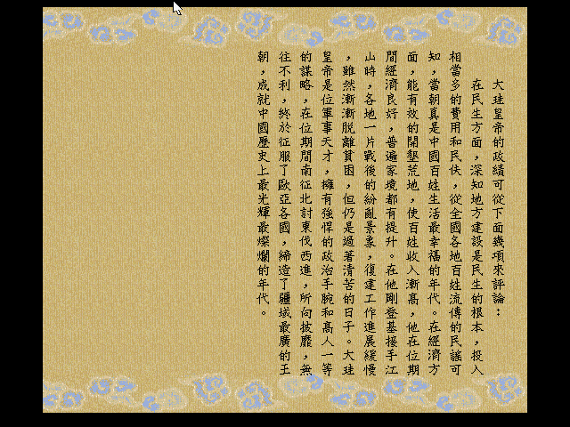

通关！
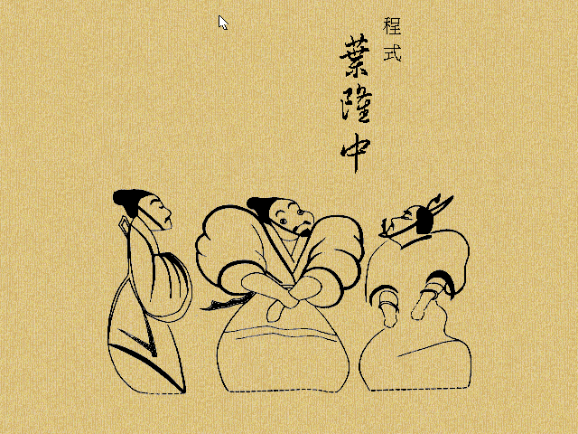
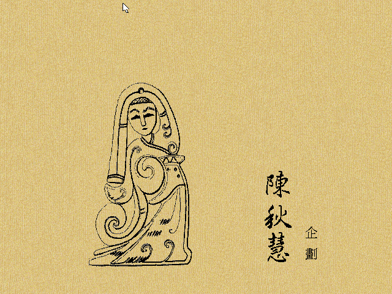
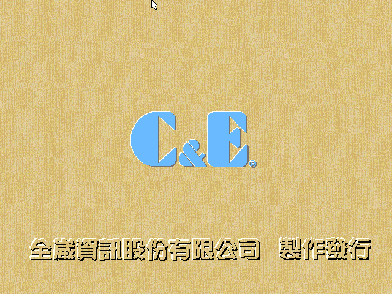