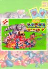

[科纳米世界](https://pewae.com/gaan/aHR0cHM6Ly93d3cuZG91YmFuLmNvbS9nYW1lLzEwODY3MTEwLw==)

原名：コナミワイワイワールド机种：FC厂商：科乐美类别：ACT / STG发行年月：1988-01耗时：10

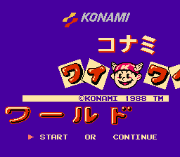
第一次接触这个游戏是1989年,就是那个什么事件之前的时候,一个下雨的星期三.到电游厅里的时候看到一个大概上高中的大哥在控制着沙罗曼蛇里的石像(摩艾)到处乱跑.还时不时的换大金刚和七宝奇谋的小矮子出来.更多的时候是用拿着大饭勺子的大叔乱敲.俺和俺同学打了大概两块钱的,发现这哥们还在到处乱跑,捡这个捡那个的.就一直好奇想看到他通关.结果大概十几分钟以后他没钱了.但是他做的事情越发另俺感到这个游戏的神秘:他跟老板要求宽限了几分钟,把游戏调到一个不知道什么地方,开始记录满屏幕的乱糟糟的蝌蚪文(俺知道那是日文).可能就是从那个时候俺体内的RPG基因觉醒了,立志今后一定要搞定这个游戏.其实科纳米世界也算不上什么RPG,就是一个解谜要素比较多的ACT而已.恶魔城3之后的版本倒继承了这个特点.

后来迷上了看”公关秘诀”(注意,那个时候都这么叫,不是女公关秘诀!!)发现一谈到这个游戏就长篇累牍,什么传送啊,什么道具的作用了啊等等.俺更是充分了解了KONAMI在FC时期的NB.WaiWai据说是指日本的”喧哗流”,所以这个游戏的名字就真有点”大乱斗”的意味在里面.游戏集合了当时科纳米的明星游戏石川五卫门(国内极为不流行),七宝奇谋(sanpi尤其擅长的游戏.可惜只有两作),恶魔城(说实话一代很烂,很难想像它后来会成为名作),月风魔传(后来除了大乱斗系列游戏也没出来过),大金刚(KONAMI做过一个金刚2,是由电影改编的,跟任氏大金刚没有关系),沙罗曼蛇(贡献了摩艾和射击关卡),兵蜂,魂斗罗(提供了背景和小杂兵.不过主角没出现,可能是操作性有冲突).

后来大概六年级的时候吧,跑到电游厅专门点播了一下.结果第一个五右卫门都没过去.最可恨的是电游厅老板的儿子,在俺愤愤离去的时候说了一句:其实**同时摁选择和暂停可以加血**…
注:盗版卡确实有这个功能.

当然,有了模拟器+修改器,一切就很轻松了.

简单攻略:
日本列岛:钥匙左上角,五右卫门右上角.
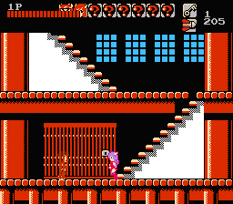
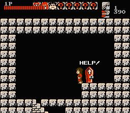
恶魔城:钥匙最下层幼教,西蒙右上方黑衣恶魔房间往右,穿过伸缩石柱.十字架在图示这个位置按右上.
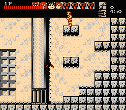
七宝奇谋:钥匙在中下方,麦琪在右边中段靠左的小屋,弹弓在左下方,激光枪在右上角.
大金刚:钥匙在下水道左脚,大金刚在左上方,香蕉在顶楼左角
复活节岛:要是在地道最底层,摩艾在左下角.
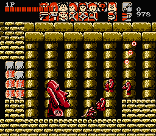
武器终于全了
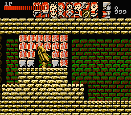
飞行关和飞行关BOSS,最恶心的是得重复打两遍
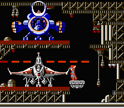
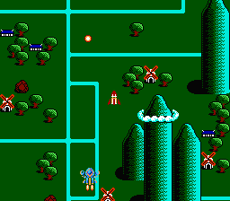
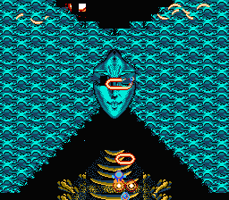
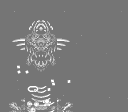
最后一关,先从飞机蹦下来一顿跑,然后在往回一顿跑,有时间限制的说.
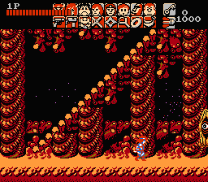
看到魂斗罗的影子了么
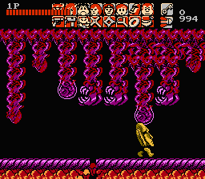
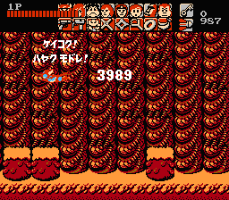
这个世界清净了…
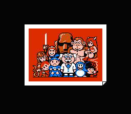

注意事项:
当有伙伴死去时,可以到游戏室使之复活.
**最后的射击关口,必须用沙罗曼蛇和兵蜂各打一次,否则无法通关!!**