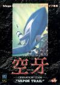

[空牙](https://pewae.com/gaan/aHR0cHM6Ly93d3cuZG91YmFuLmNvbS9nYW1lLzI2MzcyNTIzLw==)

原名：Vapor Trail机种：MD厂商：DATA EAST类别：STG发行年月：1991-08耗时：13

选关秘技:

在OPTION画面上,选择简单等级,自机数5,音效10,SE3.然后在SE响起声音时开始游戏.然后在自机选择画面上:

|  |  |
| --- | --- |
| 按住2P的A键不放再按1P开始键 | 第二关 |
| 按住2P的B键不放再按1P开始键 | 第三关 |
| 按住2P的C键不放再按1P开始键 | 第四关 |
| 按住2P的开始键不放再按1P开始键 | 第五关 |
| 按住2P的A+B键不放再按1P开始键 | 第六关 |

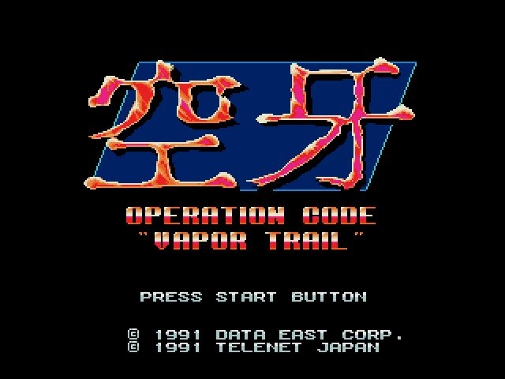
又是街机移植，又是1991，又是DATAEAST。在街机的光辉岁月，DATAEAST是非常强大的一家公司。
K开头的游戏不太多，《空牙》是难得的名作，而且无论中文日文英文名都是K开头，不推荐它简直没天理。
更何况，当年我手上是有这盘卡的。大约是宝宝的表哥最先弄到了这盘卡，后来处理给了汤球球，汤球球玩了几天又甩给了我这个接盘侠。
我从来都是一个爱玩游戏但不擅长玩游戏的人。这种需要反应力和操作天赋的STG尤其不适合我。即使把命数调到最大难度调到最低，我从来没翻越过第四关BOSS。
上面的秘技倒是从电软的系列书《秘技宝典》上得来的。在宝宝的配合下，我们俩也曾直接跳到过最后一关弄死过最终BOSS听过“胜利歌”。但仅有一次而已。一个人想完成同时操作1P和2P手柄才能实现的秘技，有点儿难。这是一个更适合双打的游戏。单打时如果挂掉了，会从固定的位置从头开始，水平凹的话，一个场景足以坑死全部的命。

如果不着急进入游戏的话，有一小段剧情动画可看。无非是说少年啊，该去拯救世界了……
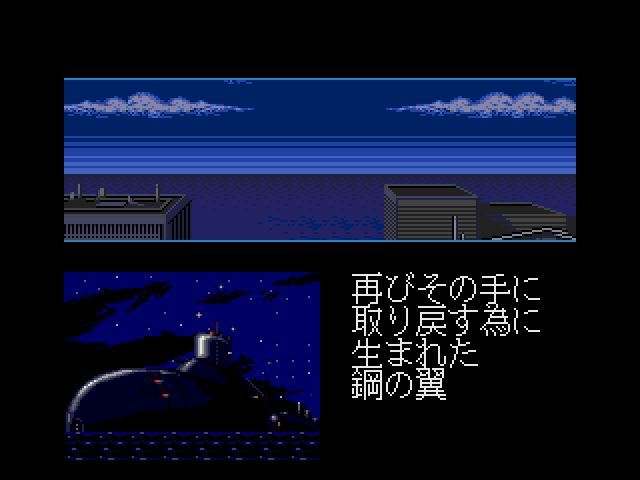
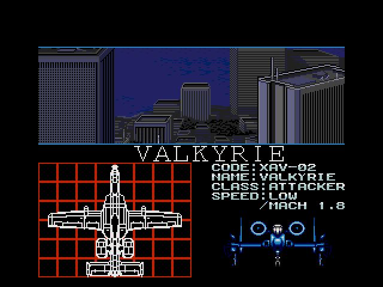
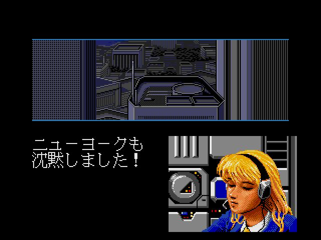
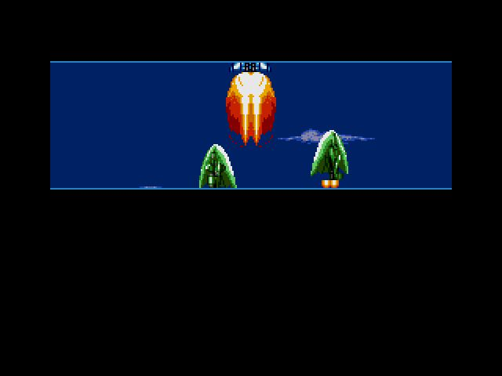
上面最后一副图里的场景，就是本作区别于其他作品而成为名作的重要原因：翻滚（Roll）。在空牙之前，大多数射击游戏的保命大招都是放炸弹。而空牙首创了一种自机无敌但敌人还需要你一枪一枪打的模式。而roll的能量使用之后能一点一点儿的恢复。这就使什么时候滚有了一丝战略层面的意味。据说高手放ROLL的目的都是集中活力消灭BOSS而不是猥琐地保命。咱是到不了那个层次了，只知道从无敌状态恢复的那一下，最容易挂。

进入游戏后，有三种飞机可以选。第一架均衡配置，第二架火力强速度慢，第三架速度最快而且向后的火力比前方猛。我以前在实机上从来不敢选第三架玩，因为那样意味着为了保持火力你的飞机要在画面中间待着，绝对的高手向。另外飞太快了也不好，因为本作有一个奇怪的秒躲子弹功能，就是小型子弹快击中你的时候，快速作出侧移的动作，子弹就从你身上飞过去了，但要是飞的太快，反而容易装上其它的子弹。
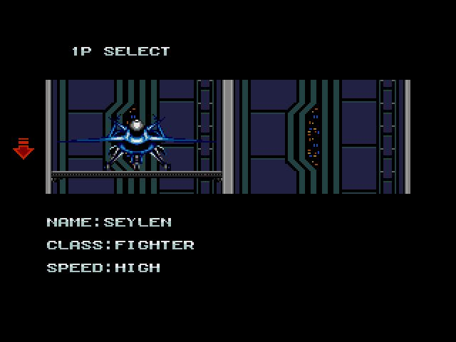
但后面的某些关卡里，可能三号机才是最合适的。比如下图。
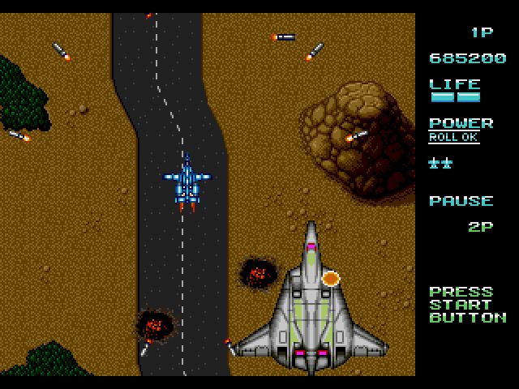

另外一个特点是攻关过程中可以捡到组件，挂上之后威力强大。按C键解除可以当全屏炸弹用。下面的图是一号机的霰弹带跟踪式，保住不掉的话基本可以扫全场了。
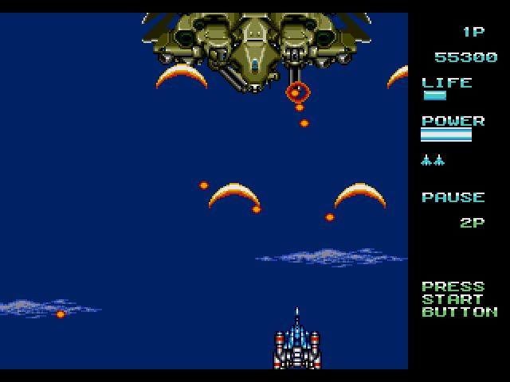

作为设计类游戏，多种多样的火力系统是必不可少的。
V是霰弹，一号机覆盖范围小，二号机范围最大呈扇形，三号机最奇葩，前面只有一股火力，屁股后面反倒有四支枪。
B是炸弹，三种飞机相同，直线射出大型炸弹，爆炸后光圈范围内的地方子弹会被抵消。但射速较慢，高手向。
D是在飞机四周放出一圈泡泡，三种飞机也相同。缺点同样是射速慢。
M是跟踪导弹。三种飞机的威力和射出方向略有不同，缺点是威力太小。捡上M后，这个游戏就变成了“按住B躲子弹”的游戏了。

是不是开山祖师无从考证，反正空牙里是有中BOSS的。而且某些中BOSS甚至要比大BOSS难打。费劲巴拉弄死的大家伙，发现飞过去之后不是过关画面，那种感觉简直了。
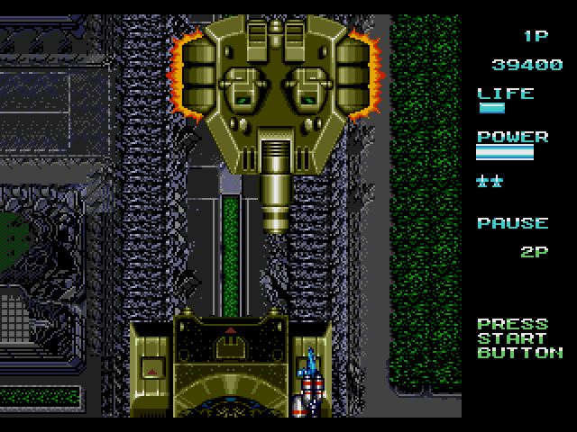

飞机游戏一大抄。这几只BOSS总有那么点儿雷同的感觉。尤其第三个，和雷龙谁抄谁真说不好。
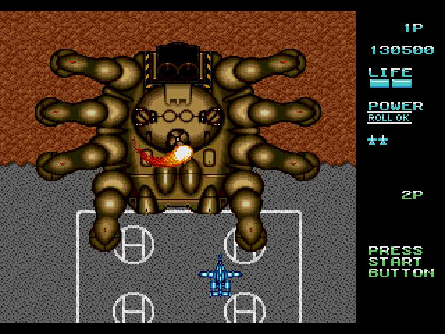
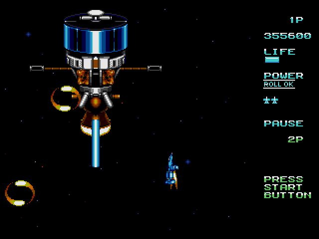
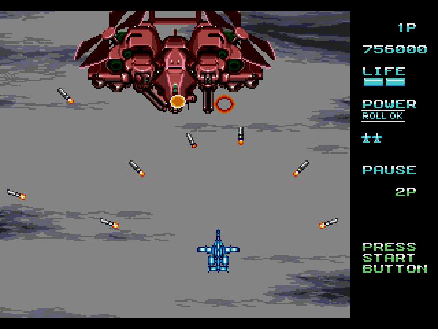

通关画面
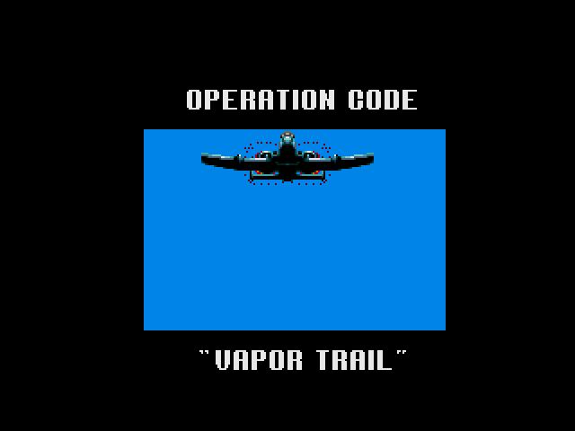
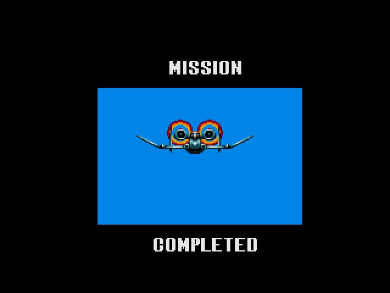
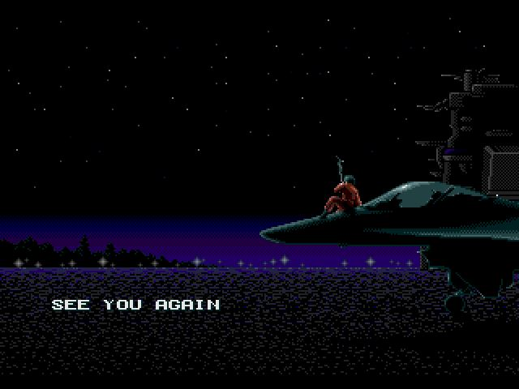

此游戏的音乐也值得一说。金属风格的主旋律节奏明快，非常动听。通关后的胜利曲不长但很抓人。
还有当时非常少见的真实语音，在出发和按下暂停的时候都会出现，相当带感。
现在看来，按下暂停时出现的语音是“Vapor Trail”，但小时候怎么听都是【vi-wachi-view】……

P.S：另有街机版BUG：当子弹为“B”或“D”是获得外部火力包后，保持连按开火键同时按下翻滚键，则爆炸火力能够一直保持，但如果中间断了按键，效果消失。日文wiki上说此秘技在MD版也可以使用，但我舍不得手柄，没试成功。