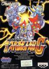

[第二次超级机器人大战G](https://pewae.com/gaan/aHR0cHM6Ly93d3cuZG91YmFuLmNvbS9nYW1lLzEwNzM0MDg1Lw==)

原名：第2次スーパーロボット大戦G机种：GB厂商：BANPRESTO类别：SLG发行年月：1995-09耗时：130

[攻略](https://pewae.com/gaan/aHR0cDovL3dpa2kucGV3YWUuY29tL2Rva3UucGhwP2lkPXdpa2k6Z2I6JUU3JUFDJUFDJUU0JUJBJThDJUU2JUFDJUExJUU4JUI2JTg1JUU3JUJBJUE3JUU2JTlDJUJBJUU1JTk5JUE4JUU0JUJBJUJBJUU1JUE0JUE3JUU2JTg4JTk4Zw==)
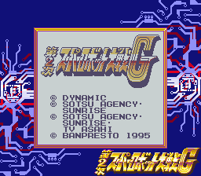

这是一款GB上的超级名作。从电软有电玩排行榜的那天起，就没掉出过GB榜的榜单之外。机战系列玩过得不算太多，只有4~5款，但不论是PS、SS或是GBA，亦不论画面和音乐怎么进化，加一起都比不上砖头机上的第二次G给我带来的快乐更多。32位机以上的主机一款机战都没通过。
出品方是俗称眼镜厂的BANPRESTO。BANPRESTO早期是BANDAI的第二方，后来又被BANDAI注资，最后干脆收购了。对于我这样的普通玩家来说，眼镜厂跟机战就是一体的。除了机战，它虽然也出过诸如高达之类的游戏，但影响力实在太有限了。据说高达G世纪的评价很高？
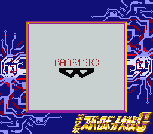

1997年的5月份偷着攒钱买了GB，没过几天学校组织去北京“看升旗，接受爱国主义教育”。某人晃点+老妈资金周转困难+对爱国主义这几个字天然抵触这几个原因共同导致了我没有跟班里的大部队一起去北京。[留在大连的日子](https://pewae.com/2015/01/rainy-season-at-17.html)里就躲着摄像机打GB。白天跟[汤球球](https://pewae.com/2014/10/older-tang.html)联机打热斗侍魂或者95，晚上躲被窝里就攻关第二次G，第二天，跟球球交流一下攻关心得之后继续联机……
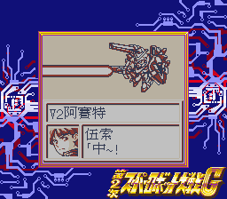

在我近30年漫长的游戏生涯里，在这个游戏上的非一次性投入可能是最大的——因为费电！！从战棋类SLG的角度来说，机战系列难度向来不大，前面十几关基本都可以做到十几分钟就过关。但是！机战的早期游戏BUG（设定？）决定了我这样的练级狂不可能老老实实地打过关。这个设定就是：在关卡中没中途存档过的话，如果己方全灭，会保留等级和金钱从头再来。所以又有钱又能练级岂非是一件喜闻乐见的事？早期我满大连市都买不到GB专用的外接电源（其实那时候胆小，不敢随便插一个电压一样的变压器上去）。所以就去学校边上的黑石礁综合市场买电池。二十几种款的电池统统试过一次之后，性价比最高的一种是8块钱一盒的（12板）。这种电池4节大约能用3小时40分钟。电池一次买一盒的不是没有，一盒电池一个礼拜就能用掉的，老板说就见过我一个。至于为什么不用充电电池？插在插座上充电不是等着被老妈抓现行？我GB可是偷着买的！
玩的时候我一般会先换上用过的电池探探路，看看这一关有哪些值钱的敌人，或者什么适合练级的地形，然后再看看怎么样死的最快（这对节约时间和电量非常重要）。之后才会换上新电池，一鼓作气，大约从晚上10点玩到半夜1点多，电池用得差不多再存个中途档。有时老妈进来查房，不能关机只能直接放沙发缝里，非常惊险。一方面要担心被搜出来，另一方面心疼浪费掉的电量。遇到18关这种满地是钱的关卡，会去买南孚，多出来的两个多小时游戏时间可真是用钱堆出来的啊！
当年日文版通了两遍，中文版通了两遍，24×4/12×8 +　4×10×2 = 144。电池钱。
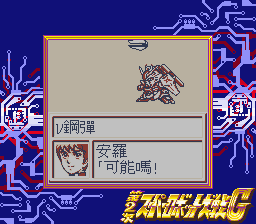
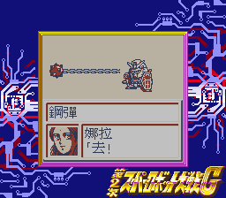

起初对这个游戏的印象并不好，因为第一关太简单而第二关有个bug会定版。真正建立起兴趣大约是在第五关之后，因为那一关钱多。这个系列等级非常好练，倒是钱的作用非常明显，在初期把正确的机甲和武器加强改满会获得非常大的收益。机甲改满时伴随特殊音效而来的隐藏机能的出现，能让人产生非常大的满足感。有一件事是颇不爽的：仓库里的资金的上限是999999，所以反复打钱之余一定要注意账户里的上限，不光要会攒，还要会花。

第四关是否击落盖塔-Q决定了宇宙路线还是地面路线这两大分支。能够得到的机体和人员稍有不同。强烈推荐宇宙路线。第一是能够得到的机体和角色多，第二是地面路线得到的两个人物（机体）都是废柴。机体平衡这种事从来就不是机战系列所考虑的问题，强者衡强弱者滚犊子才是眼镜厂的信条。简单总结一下我印象中好用的角色和机体：

格斗型：
流龙马（盖塔）多蒙（G高达）
流龙马简直是万能，打得了间无也打得了I立场，精神力还足，力气也大，最强武器不限量。可谓是从头牛到尾的输出中坚，整个游戏里最不用练级的就是他，打到最后一关轻松60级以上。
多蒙比伍索更像主角，毕竟是游戏标题里“G”的来源。石破天惊拳象征意义远大于使用意义，因为攒力长而射程长而且沦为鸡肋。但他的“分身”实在太BUG了，而且近身能力特别实用。有人说最后一关用流龙马+多蒙就足够搞定了。
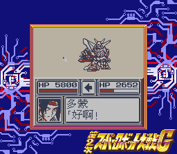

射手型：
伍索（V2)优卡（F91）阿姆罗（ν高达）塞巴斯塔（正树）娜拉（爱美斯）布鲁（MKII）（V高达）。
其中，推荐宇宙路线的一个原因是能得到优卡的加入。F91的原驾驶员西布克是个强化人间，敏捷度低也就罢了，精神力里没有必中太要命了，白瞎了F91那么强的火力。我是不喜欢把人换得乱糟糟的，但F91是必换的。优卡会必中热血必闪，可以为最后BOSS贡献两发力量。
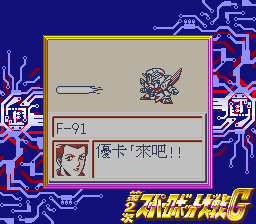
娜拉高敏，精神力也不错，可惜爱美斯不能用来打最后一关。幸运队里有个康尼跟娜拉的精神是一样的而敏捷稍低。娜拉最后都分不到机体，更不要提康尼了。

塞巴斯塔是我最喜欢的机体，因为它的地图武器范围大且不伤自己人，正树本身又带幸运，堪称赚钱小能手。正树的缺憾是弹量太小，全游戏最强武器宇宙诺亚只能冲着左面的比安博士打一发，太不过瘾了。
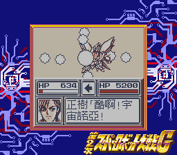
两架V高达算是还不错的机体，一般我会留给幸运队里的海伦和纯子驾驶，这两位有热血和必中，可以作为最后一关打两个下角的输出。

肉盾型：
铁也（大魔神）杜克（克林大汉）兜甲儿（铁金刚）布莱德（白色战舰）
其实白色战舰作为母舰，最大的一个作用是自杀，血长防高本是肉盾第一人选，可惜最后不能参战。
直感130以上可以二次移动的设定给了铁金刚新生。它的范围1的必中+热血正好用来放最后一关白河愁的风筝。
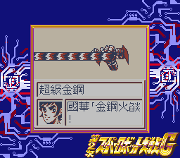

恢复型：
沙也加（木兰号）米切尔（闪电Q）法（美达斯）多玛修（白色圣柜）
米切尔本身的机体不是恢复型的，但她是有精神力“爱”的。白色圣柜作为唯二能补给的机体，不能参加最后一战实在太遗憾了。

搅屎棍型：
卡谬（Z高达）朱德（ZZ高达）
这两个NT都是高敏的代表，加上机体改满之后反应+15，普通敌人很难打中它们。ZZ的地图武器配合有幸运的更是练级用最佳机体（塞巴斯塔无法换乘）。但是这两只到后面的最终战就尴尬了，输出太低。

鸡肋型：
蝴蝶（蝴蝶鬼）杰克（德州马克）
敏捷不够高，防御也不够高，高不成低不就。好在这俩有幸运，可以用来捡钱。蝴蝶鬼还有“爱”，能当奶妈用。

废柴：
阿强机器人（阿强）琉尼……
阿强机器人的设定简直是见了鬼了：室内和宇宙不能出战。出战的时候所有攻击武器都需要先攒劲。命中率负值。练级狂人都不知道该怎么下手。即使他的座机带补给看起来挺重要的。
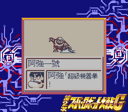
琉尼加入两关之后就离开了，给她升座机的话钱就真的打水漂了。
以及我不是针对谁，剩下的没点名的都是战五渣。

机器人大战系列为现代语言贡献了两个重要的典故。
第一是“地图炮”。
机战为了表现某些武器能一次打中多个目标，把这类武器设定成攻击的时候不显示1V1动画，而直接在地图上表现，并且在这类武器的后面标上一个M，是为地图武器。地图武器的两个重要特点：第一攻击多个目标，第二往往不区分敌我无差别攻击。所以现在它的引申义使用得非常得体。
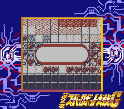
第二是“空手拆高达”。
机战的主要元素就是高达，而敌方真有一个角色能空手拆高达，他就是G高达多蒙的师傅——东方不败。可惜我被VBA坑了，前面的截图都被覆盖了，只剩下一张不那么有关联性的图。
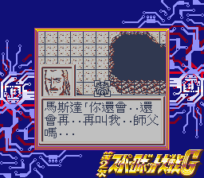

最后的boss，左面的比安博士光线武器无效，右面的白河愁只有攻击距离是1的武器才能打到。白河愁也是蛮拼的，专注当大反派20年。
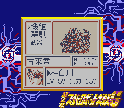
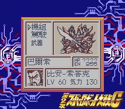

通关！
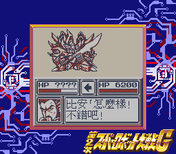
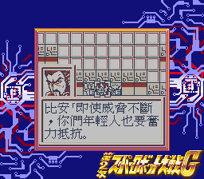
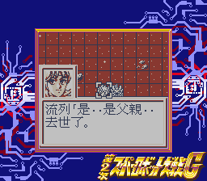
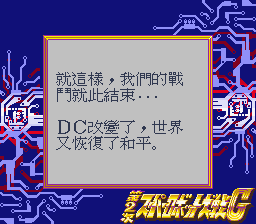
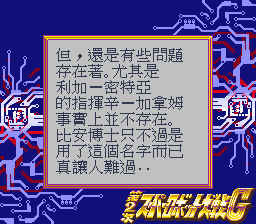
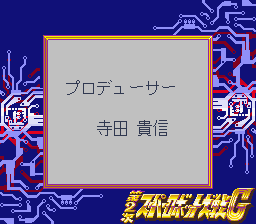

最后，表扬一下盗版商。除了把高达翻译成钢弹以及人员列表里米切尔有点儿错乱以外，本作的汉化质量非常高。