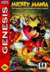

[米老鼠纪念版](https://pewae.com/gaan/aHR0cHM6Ly93d3cuZ2lhbnRib21iLmNvbS9taWNrZXktbWFuaWEvMzAzMC0xNjg3NS8=)

原名：Mickey Mania别名：米老鼠大集合机种：MD厂商：世嘉 / 卡普空类别：ACT发行年月：1994-11耗时：7

1995年，迪士尼联合索尼，出品了一款精品游戏《米老鼠纪念版》。不久，也被移植到了SEGA CD和超任，以及后来的PS上。版本间内容大同小异。本作品画面细腻，动作流畅，是MD后期有口皆碑的大作。
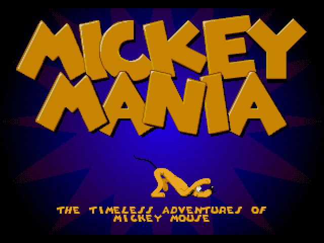
秘技：在音乐测试画面，把音效音乐和语音调成下图这几项，然后把光标停在exit上按住左，听到音效后进入游戏，即可选关。
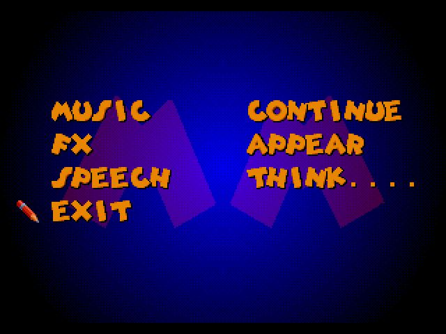
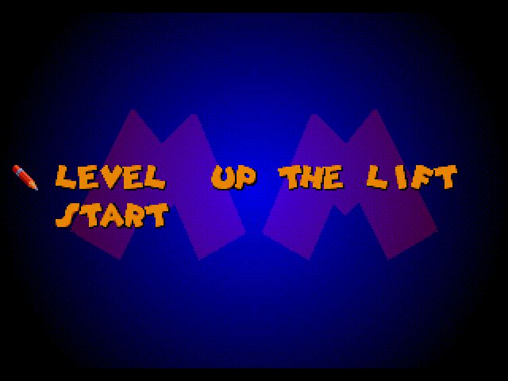

这是一款典型的动作游戏，米奇仅有跳和扔子弹两个动作。而且子弹的数量还有限。因为融入了米老鼠历代动画的经典场景和音乐，所以怀旧味道十足。反正我玩着玩着就回忆起了小时候周日六点半守在电视机前的情形。
游戏画面的左上角有一只手。竖起的手指表示米奇现在还剩余几滴血。数字表示还有几条命。游戏里捡到的土黄色圆球是子弹，星用来加血。一些犄角旮旯的地方能看到米老鼠的耳朵，那玩意儿大补，是加命道具。另外路上还会遇到烟花。同一个版面内，如果放过了烟花，那么一旦挂掉，会从烟花处继续。

第一关当然要从米老鼠的诞生开始，这个场景想必常看电影的都不会陌生。
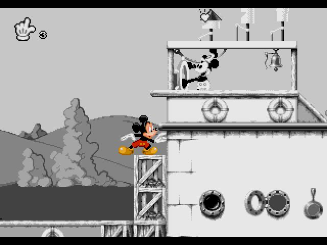

第二关一下从怀旧风变成了阴森的实验室，挑战疯博士，最后救出好伙伴普路托。
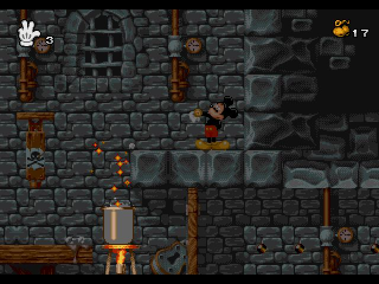
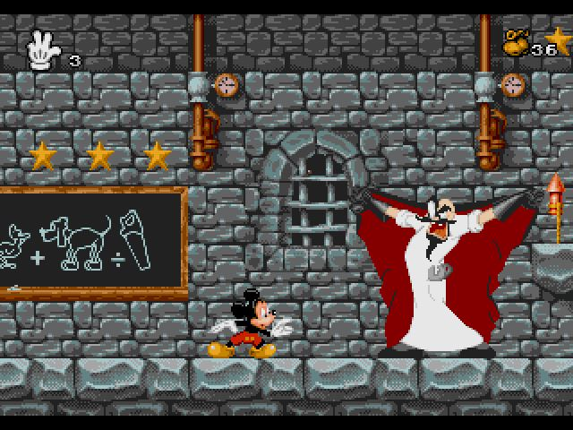
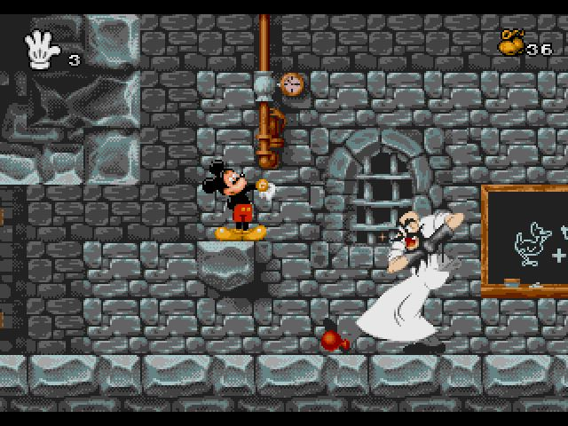
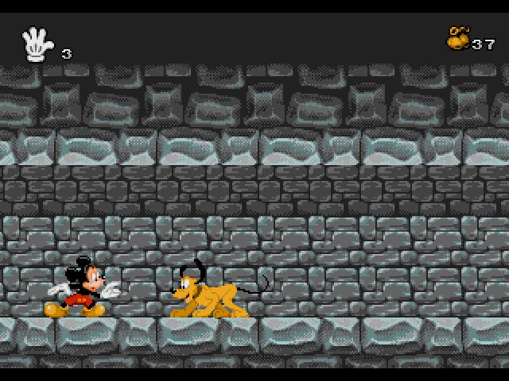
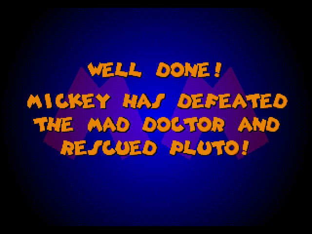
这关有个隐藏路线，能见到一只穿boss装的米奇。但我没当回事，所以没截图。

第三关摇身一变，成了类似赛车的游戏。各种被鹿追。第二个场景，必须要吃苹果保持速度才能过去。
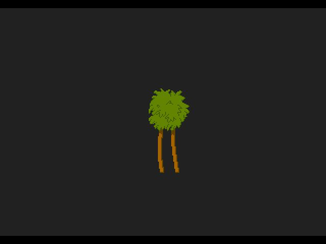
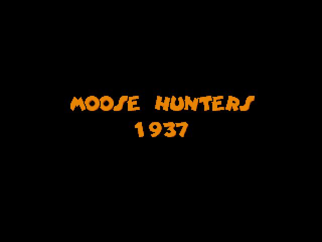
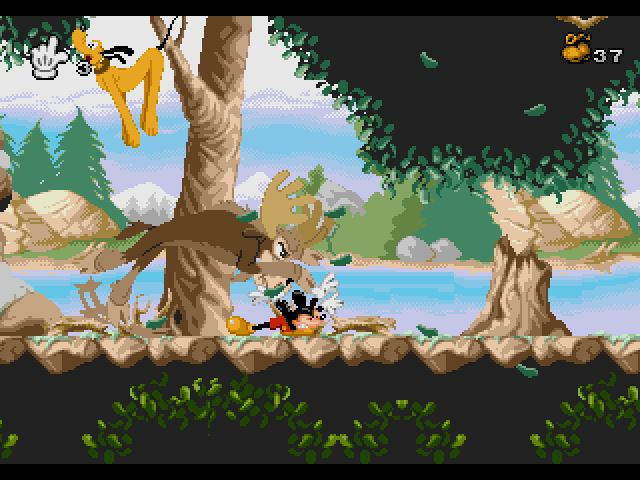
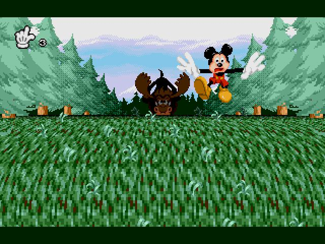
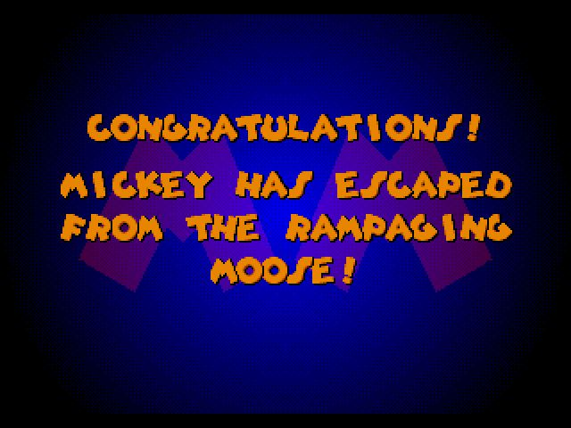

第四关是鬼屋。所有的鬼都不能踩。蹦啊蹦啊就过去了。没什么特点。
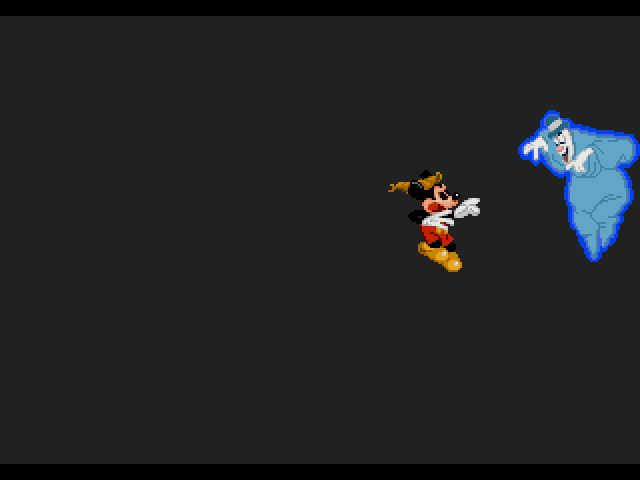

第五关是植物世界
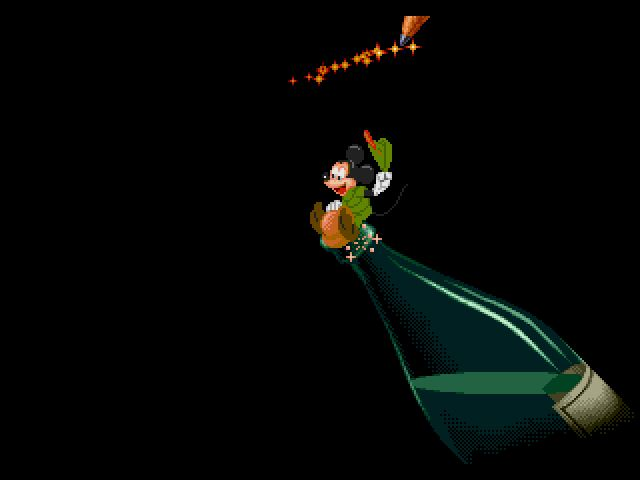
这个蜘蛛碰到就死，要过这块儿需要点智慧。
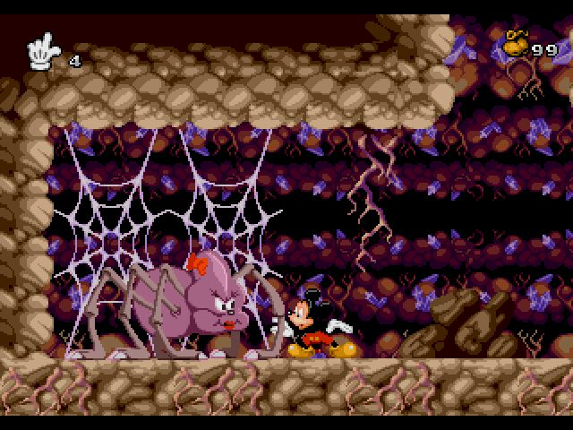
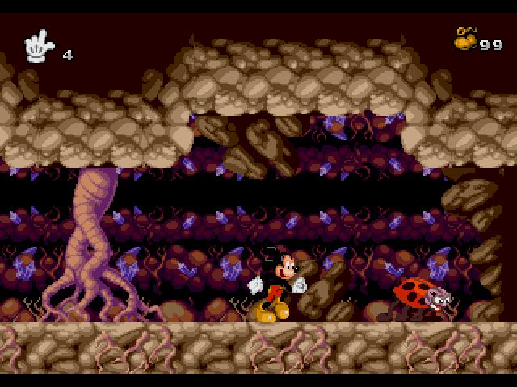
下面这个地方，踩着蝴蝶蹦到左侧的悬崖上有一个隐藏关，进入后跳箱子到最上层，得到一次continue作为奖励。
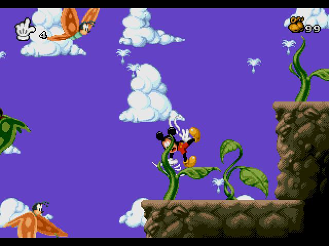
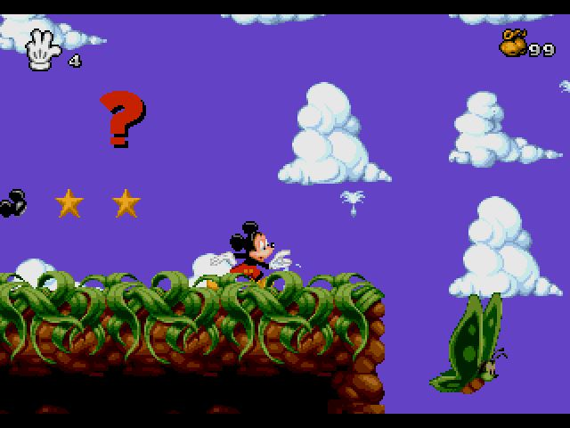
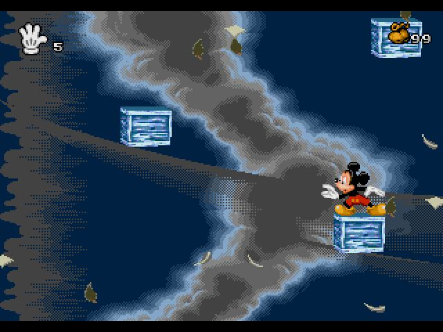
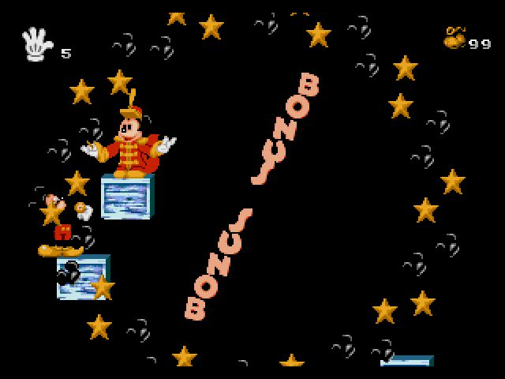

最后一关，救王子（为毛不是米妮？）。
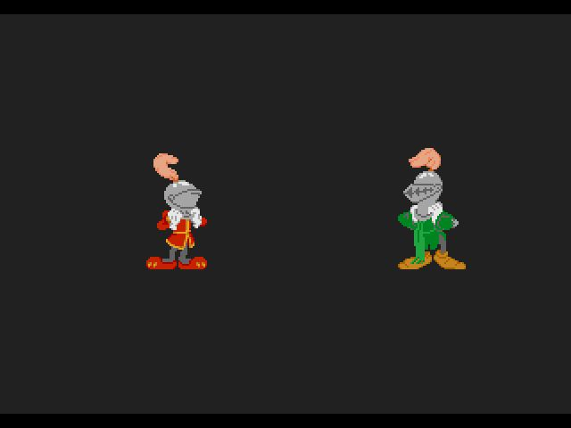
主要的敌人都长这样，感觉跟松鼠大战1最后一关的敌人撞脸了。
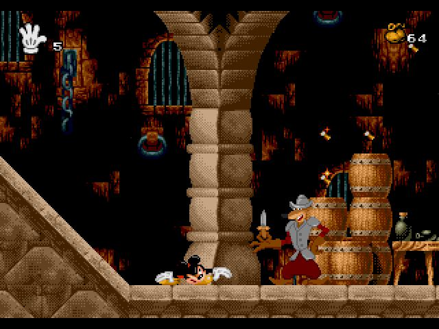
最终boss。分为两个阶段。第一阶段它坐下的时候天上会掉下一个针板，算准位置后把针推到它下次会落下的地方，扎菊花10次后，进入第二阶段。
进入第二阶段前，如果血不满，最好先去吃画面最右侧的星星。轮流顶两侧的开关，用铁球砸boss即可。
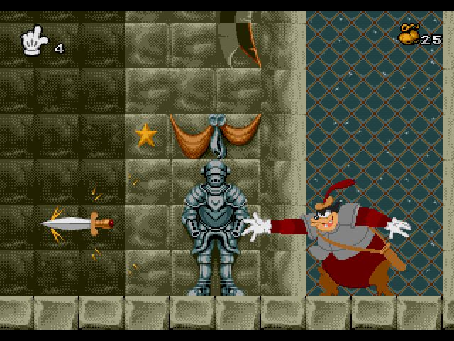
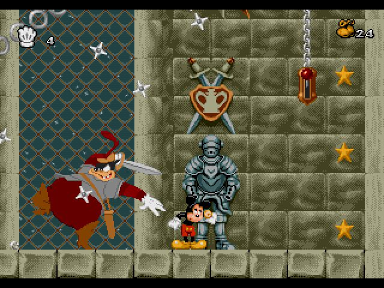

通关！
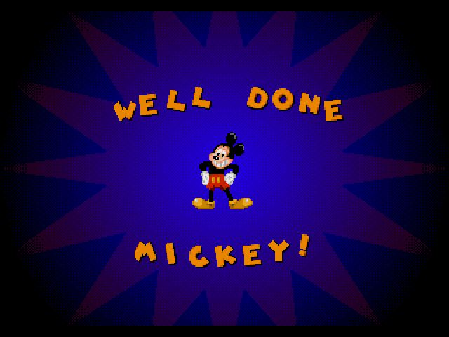
还会问你他们设计的两个隐藏要素你找到了吗？这是赤裸裸的勾引玩第二遍的节奏啊！
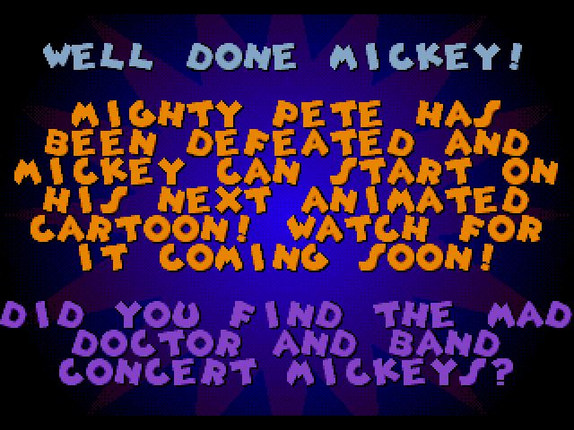
接下来是怪物图鉴。想想还是不放了。感兴趣的自己去相册里看好了。

THE END
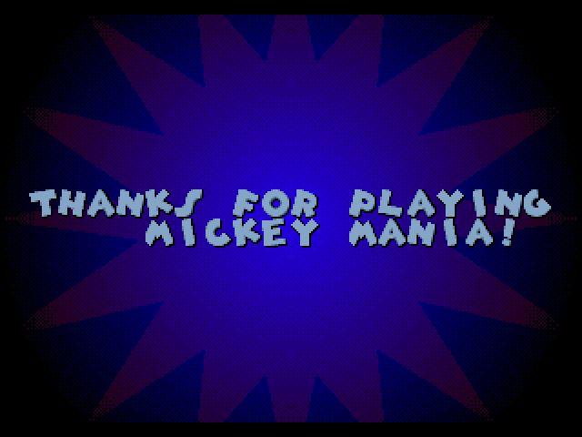