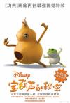
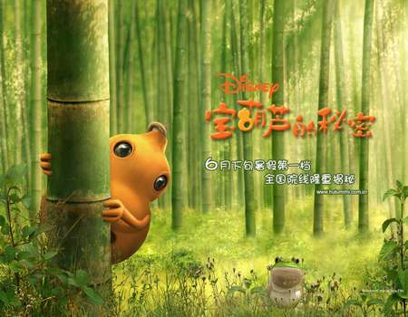

[宝葫芦的秘密](https://pewae.com/gaan/aHR0cHM6Ly9tb3ZpZS5kb3ViYW4uY29tL3N1YmplY3QvMTk2MDI5OC8=)

导演：朱家欣 / 钟智行主演：朱祺隆 / 梁咏琪 / 陈佩斯类型：剧情 / 家庭地区：大陆 / 美国 / 香港首映时间：2007

在上海那段消息闭塞的日子里,但知道6月底有个片片叫”宝葫芦的秘密”,却万万没想到真的就是上世纪50年代写成的那本
gf说要看,那就看看呗,反正也是好久没看电影了.

看完以后的体会么,就四个字:粗制滥造.

首先是编剧,充分暴露出这鸟人小学没上好.梁咏琪JJ在黑板上画的那道答案是小圆半径二倍的破题,分明是上了初中以后才有的几何题,而且是学了圆以后才有的,而上了初中以后的人,还能在课堂上问什么多少乘多少等于多少,多少除多少等于多少的小学三年级的问题?一转头的考试,卷子分明是求阴影面积,至少都初二了.也许学文科的编剧数学都不好吧…

其次是动画效果.应该说,在主角那个葫芦身上,迪士尼还是挺花费工夫的,入射光反射光环境光都搞得比较协调,可是其他的就太烂了,水花应该说是最能体现动画功力的东东,8过你要是看了葫芦从水里被钓上来那个镜头,就会得到肯定的结论:这是一部动画片.

最不可容忍的就是后期制作了,确切的说是字幕.可能这个东西要有大陆以外的版发行吧,不敢确定,但字幕实在是太讨厌了,动不动就把简体字和繁体字混着用,比如”出发”都写成了”出發”,”什么”都变成了”甚么”.天,拜托你们用个好点的翻译软件行不行?教坏了小孩子可怎办啊!!

后悔,不如把这钱省了,直接等看10天以后的变形金刚了.
~~貌似今天是个什么纪念日的说,放首歌吧.~~