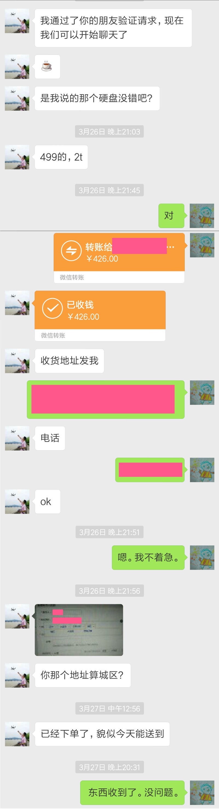

从过完年开始，我开始执行一个蛋疼无比的CD清理计划，打算把当年刻录的光盘东西都倒到硬盘上，然后把CD都扔了。
当然如果能找到高清的资源，会替换掉原来的版本。

一来二去，2T的存储用硬盘就被塞满了。
可巧瞌睡了有人送枕头，[老秦](https://qfsyj.com/)那边开始搞二手东的折扣活动。这年头买台式机硬盘显然网购是更靠谱的方式。平常信奉极简生活理念的我手上根本也没什么打折返利的网站，5%已经感觉很不错了，就立刻跟老秦联系了一下。
因为跟老秦也有7年的交情了，直接选择微信给他转账的方式付款，火速聊天，火速下单，火速用上新硬盘。（查历史发现一个有趣的现象，他在我这儿从来不敢自称大叔。）

从聊天记录就能看出来老秦真是个细心的家伙。
不过这么多年还不知道我在市区，差评。

硬盘本身就没什么可评的了，好坏也跟老秦无关啊。