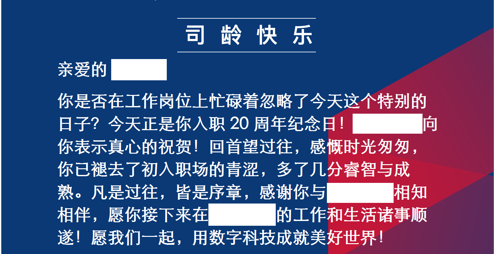

今天是我入职G记的纪念日。
在同一家公司待了20年，想想还挺带感的——俺爹40多年前在同一中型国营企业也不过干了15年。
没什么伤春悲秋的情绪，感慨只有那么一丢丢，毕竟纪念蹲坑20年总比纪念失业2周要幸福。
上班是无聊的事，20年前的那天已经记不起什么细节了。

期间耗走了3个董事长，3任总经理；公司上市，退市，跟人合并，再上市，再退市，大名改了4次，小名改了7次，发票名头变过8次；工资卡开户行变过3次；部门名换过11次，部长换过10个，跟过15个项目经理。
前两天整理通讯录，打过交道的离职的有联系方式的同事，刚好220人。

我为什么不跳槽？怕麻烦啊。
这辈子就是个得过且过的人，这家公司待得还挺恣意的。钱不多，活不多，加班不多，能管我的人同样不多。
干到退休不现实，再干5年，到闺女高考结束问题不大。