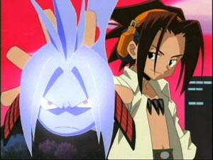

之黄金时代（2002-2006）

02年五一的时候，俺娘实在无法再忍受俺对电话线的霸占，让俺趁着世界电信日之前搞活动，去装了宽带。

因为家里电话挂在老娘厂子的名下，所以不能办理包年，只能办理包月。512M价格￥100/月。

彼时正值Q自己办的的论坛最火爆的阶段，Basara要我帮忙给她弄个动态签名档。在那还不知道版本控制为何物的年月，我自创了一种不丢失中间产品的方法：利用回收站。就是把抠图的中间结果和一些半成品，统统扔到回收站里，想反悔的时候再从回收站里给还原回来。
装宽带的大叔那天下午是酒后作业，醉醺醺地连接好硬件并装了个98下的拨号软件之后，说：“小伙，点这个就能用了。”然后转身就走。
俺当然不能放任他如此轻易离开：“不行啊，连不上。”
醉酒大叔倒也敬业，回来一看，果然是返回没有响应的错误。
重启，无效。
重装拨号软件，无效。
清空回收站（我猜他其实是想清空临时文件夹），无效。
你大爷的！没事动我回收站干什么！！我tm扣了好几天的图啊！！！
俺简直是无法遏制自己的愤怒了！直接就朝他脸上喷去：“宽带连不上跟回收站有个毛关系啊！我要投诉！！”
要说那大叔心理素质还真挺不错的，一边笨拙地给自己辩解：“别这样，回收站里的东西不就是不要的吗？你看，我也没删你小电影……”，一边给他的上层接口打电话。电话打完，解释说：“不好意思，小伙，到晚上的时候才能开通。”

大叔走后，俺立刻拨打了投诉电话。
…… ……
“你们的工作人员随意删我电脑里的数据！”
“请问删的是什么数据呢？”
“图片。”
“请问是什么图片呢？”
“魔幻游戏的。”
“请问您的图片存放在哪里呢？”
“E盘回收站。”
“回收站里的文件不就是不要了吗？”
“只有我能决定我的回收站里的文件是不是不要了，你们的人员凭什么删？”
“对不起，先生，我们不能受理您的投诉……”
过程中，俺只字未提大叔酒后的事儿。

宽带装了不久，俺就知道了bt和emule这两种形式，并且自行google到了若干资源站。
提起google，就不能不说google被封杀的事情。虽然百度一直不承认是它做的，但是明眼人都知道获益者是谁。在那次事件之前，鬼才知道百度是个神马东东。记得当时在百度里搜索“google好用”，百度会给替换成“您要找的是不是‘百度好用’？”；搜索“google是狗屎”，百度也会给替换成“您要找的是不是‘百度是狗屎’？”
所以，除了俺被逼给俺老舅的百度空间回帖而注册了一个用户以外，俺不使用任何百度的服务。
时常有同事的小孩儿问我，王哥，google都连不上，你怎么也不用百度？你怎么从来不上公司贴吧？
俺只是笑笑。
（就因为这段儿，俺找当年的截图找了一年，最终还是放弃了。）

下载，疯狂地下载。
主要是动画和mp3，电影AV漫画游戏什么的远远算不上疯狂。（详见 [我中了网通的计](https://pewae.com/2006/05/i-am-trapped-by-cnc.html) ）
三大民工动漫里，最早接触的是《海贼王》，从52集开始；火影是从第4集开始追的，算是跟得最早的；而死神则是Basara推荐的，从第8集开始看的。
04年要出差的时候，现巴巴拜托join帮忙下动画片，还特地嘱咐：“OP要枫雪的，火影要兰荫的。”等俺出差回来的时候，兰荫都tmd解散了。
嗯，还有柯南。本来是不追柯南的，后来一同事拜托俺帮忙刻盘，才开始填坑。
至于现在嘛，火影和死神动画版剧情太多，已经沦为每半年一听了，海贼倒还终于原著，但太拖，有时间的话漫画优先。倒是柯南一直断断续续地看。

03年非典开始，毕业之前的那段日子，俺整天待在家里（饭）醉生梦死。当时正值伊拉克战争时期，每天俺的作息时间是这样的：
早晨（？）10点半起床
然后陪老爹看新闻，
然后老爹去做饭，我回屋玩游戏
11点半，吃午饭，看体育新闻
12点半开始，看动画
18点出屋看体育新闻，吃晚饭
19点开始玩游戏（已经没有动画可以看了）
24点以后搜索新资源，挂上新下载，顺便刷刷论坛什么的
2点睡觉
——跟伊拉克人民同进退
嗯嗯，吃饭的时间有点儿长是吧？反正外面非典俺又没地方可以去。这就是俺体重从160飞涨到190的原因。

那时候的动画，包括《棋魂》、《通灵王》、《最游记》、《猎人OVA》、《钢炼》、《ROD》、《闪灵》、《高达Seed》、《足球小将》、《Last Exile》、《推理之绊》、《犬夜叉》、《赝品画廊》、《七武士》、《阿拉蕾1997》、《逮捕令》、《宇宙战士》、《我的女神》、《十二国记》、《鬼眼狂刀》、《全金属狂潮》……
7年了，动画内容都忘了，体重却硬硬的还在。

俺爹那个时候经常突如其来地闯进来以为俺在看神马小电影，却发现俺又靠在椅子上，半死不活的样子，看动画片。
“论文写了吗？”
“差不多了”
其实也差不多，毕业论文三天就[被俺搞定](https://pewae.com/2010/12/miss-dumpling.html)了。