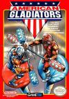

[美国角斗士](https://pewae.com/gaan/aHR0cHM6Ly93d3cuZG91YmFuLmNvbS9nYW1lLzM1MzcwNDg0)

原名：American Gladiators机种：FC厂商：Gametek类别：ACT发行年月：1991-10耗时：12

今天介绍的游戏对我来说是一直没能通关的童年阴影，美国角斗士（American Gladiators）。
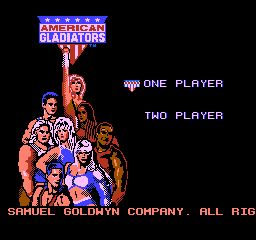
在卡带时代，这个游戏是我最后一批接触的动作类游戏之一，1996年开年的寒假，借来玩过两周。当时是盘4合1的合卡，上面写的什么名字不记得了，什么什么大对决之类的。因为没打通，所以在1999年接触模拟器后，是第一批重点复仇对象。但当时的记忆就已经产生了偏差，用“古希腊”、“对决”、“木棒”、“墙”、“运动会”之类的关键字进行搜索，结果一无所获。
后来开始这个系列，从字母A开始遍历，很快就轮到了。当时大喜过望，查了一下这个游戏的来历——American Gladiators是美国的一个竞技类娱乐节目，从1989年一直办到1996年，持续多季。有些类似国内早年引进过的西德的《夺标》，只不过德国人的游戏大多是集体项目，而这个节目尽是些个人项目。并且这个节目应该非常火爆，这款同名游戏不仅有FC版，在PC、SFC、MD上也有作品登场。油管上很容易搜到这个节目的录像。
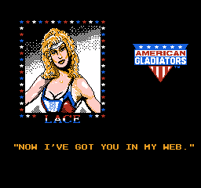

游戏有5个小游戏组成——
JOUST，是两个人各自手持一根包了头的木棒，站在平台上互捅，把对方捅到台下算赢；
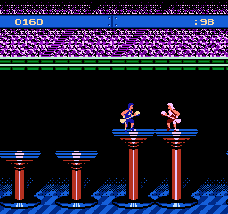
HUMAN CANNONBALL，是一方荡绳子，撞击位于平台上的另一方，把对手撞下平台算赢，否则输；
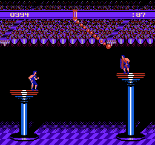
POWERBALL，场地里有5个台子和3个防守者，玩家从上下两端每次取一个球，限定时间内放满5个台子算赢，防守者可以用身体阻止玩家，有点像美式橄榄球；
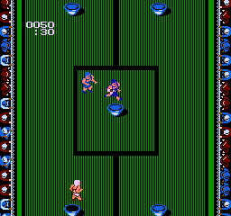
ASSAULT，对手坐着能横移的叉车向外扔子弹，玩家在掩体后面拿到武器后与对方对轰，三发命中后KO对手；
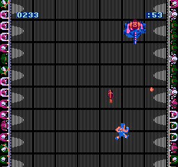
WALL，就是爬墙，躲避障碍物和从各个方向出现的敌人，碰到墙或者被敌人碰到都死。
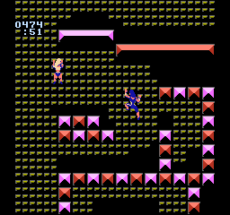

前4个小游戏都不算难，但是最后一个爬墙游戏简直是变态——给角色提供动力的方式是交替按下AB两键，有障碍有敌人，怕被敌人追上要按的快，不碰障碍还要能做到及时刹车。而且还有时间限制。而且红白机游戏有个特点——当你的右手折腾的频率越高，左手的虎口就酸得越快，小臂也会很快发僵。
我并不是个跟难度死磕的人，像忍龙那样死活过不去的游戏，也很少放在心上。但这个游戏就很会搓火，其余四个很简单，就这个爬墙，好像眼瞅着能行了，却总差那么一点儿。一不注意就搓到手抽筋也一无所获。
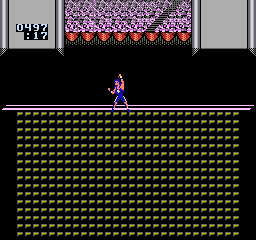

2005年的时候，借助即时存档功能，我曾经把5个小游戏都打过了。当时想当然的以为自己跨过了这座山。而且本作的操作性实在不好，除了掉凳时的音效以外可谓一无是处，所以A开头的游戏也没选它。
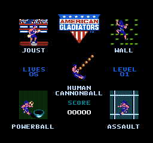

今天偶然看到一段通关视频，我才知道25岁的我还是太年轻了。我那只是通关了LEVEL1。人家真正的设置是每周目难度逐级增加，直到打通LEVEL4，才会出现极为变态的附加关，通关附加关后才会出现真正的结局。
我现在的水平，打到二周目爬墙的时候，大脑里说你还可以的，右手拇指与左手手肘已经在同时抱怨：滚犊子！
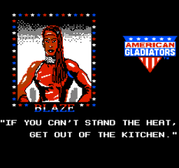
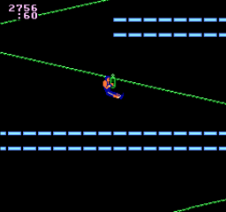

讨论红白机最难游戏的时候，本作竟然连一个提名都不能获得，这不科学！也许太多人跟我一样以为这只是个无限循环没有结局的游戏了吧。

游戏还是那么难，水平甚至比当年还退步了很多，但它再也无法在我心中掀起波澜了。所以今后我可能会陆续把这些阴影都翻出来挑战一下。
这个游戏没能通关。下面是我从别的地方搞到的通关画面：
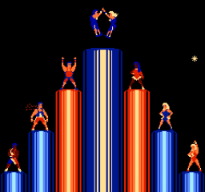
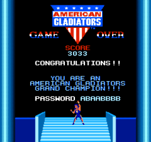