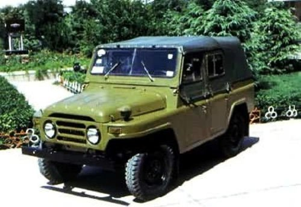

老头儿当年是一个千人厂的车队队长，并且是那一片企业的（车队）安全组组长，是比较牛叉的一个人。跟他聊天，了解了一些当年的故事。

（一）
“
有个徒弟，是当时纺织工业局党委组织部部长的侄子，硬给安排到我手下学车票。
考试老也不过，我也愁啊，领导安排的，怎么弄。
我就跟那时候一个考官姓Z的，商量找人替考了。
那时候也没有电脑也没有监控的，替考打个招呼太容易了。就过了。
事儿成了厂长给我放了三天假，开车拉着那个考官领着他老婆孩子上本溪水洞溜达了一圈。回来一切费用厂子给报销了。
完事儿不到半年厂长就升了，调局里了。
妈蛋也没我什么事儿，那小子再照面连声师傅都不叫。
”

（二）
“
赧徐大大（老丈人同学）的票也是我帮忙整的。
他学车那阵，三道沟练车场还没修完。这帮学员不光去练车，还得给交管队干活儿。
修道的沙子石头啊，道牙子啊，拉树苗啊，挖坑种树啊……你当那些警察能自己干？那时候也没那么多民工，全tm是各个企业车队的人给他们干的！
赧徐大大也是，两次都没过。
那些考官我都认识，他们也都给我面子，怎么，一旦他们要用车不还得找我吗？
我就帮他找了个姓X的考官，跟他说：‘个最『高』的那个是我朋友’。
考官就领会意思了。
就让赧徐大大出车去拉水。开半道儿考官受不了了：‘换我开吧，你连个弯都拐不好！’
水拉回来之后，就给了徐两个桶，让他给树浇水。
浇了一下午的树。
到了晚上，考官要发证了，先表扬了徐大大一番：‘徐XX，个头最小，今天干的活最多，所以第一个证发给他，谁有意见吗？’
他就这么拿到的车票儿。
”

（三）
“
那时候计委（注意我没打错字），管的血宽，企业弄点儿什么都得他们批。
像俺们厂想买辆解放拉货，得先审查你资格，企业多少人，什么级别，能不能配大货车。
俺厂子级别不够，怎么办？走路子买零件自己对付了一辆——你别以为八十年代就没有私底下交易了，零件都是长春厂出来的，有钱谁不挣！
车拼出来了，没有计委签字不给上牌子，怎么办？我上计委找了跟人，那个人给写了给条，让俺们这辆黑车上碧流河工地（引碧入连工程）给白干半年活，回来就自然而然有牌子了。
那时候工地上最少一半是这种黑车。
”

（四）
“
小车也有级别。市地级能配什么车，县团级能配什么车，都有规定。
俺们厂长是个科级，为了摆谱弄个车坐，绞尽脑汁啊。
最后发现厂里有个老太太是老红军，就以优待革命前辈的名义申请，给批了台212吉普。

我在厂里接近40年，从来就没见过这个老太太。
”

（五）
“
90年代领导干部负责制了，书记就不吃香了。
我承包车队，到年底了有余付，就给厂里大小领导都包了个红包。给书记包了100块钱。
书记感动毁了，拉手表示：‘老范，我也没别的能力，只要你上党办签个字，我就把你发展（成党员）了！’
我没答应，他就把赧妈（丈母娘）给报成预备干部了。
到厂子黄了也没预备上。
”

（六）
“
俺厂子黄的早，朱镕基提出下岗没多长时间厂子就黄了。
都盯着那块地皮。
结果地皮一早被计委扣下了，谁都拿不走。
一个老板，也不知道跟计委什么关系，就把地买了。他还买通了俺厂工会主席。别看工会主席没什么用，但也算是个领导，厂里开会商量价钱什么的都得带着他，就这么把底价透给人家了。
都下岗了，工会主席第一个跑那个老板那儿给人打工了，谁还看不出来啊？
那么大一块地，卖了六千万。不到俩月，那个老板就转手卖给下家了，1.2个亿，白白翻一倍。
而且厂里一个子儿都没看着，钱全在计委那儿。
”