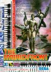

[联合前线](https://pewae.com/gaan/aHR0cHM6Ly93d3cuZG91YmFuLmNvbS9nYW1lLzI2OTMxNzcyLw==)

原名：The Hybrid Front别名：轨道战争机种：MD厂商：世嘉类别：SLG发行年月：1994-07耗时：44

万万没想到。距离上一篇每夜一游（火枪英雄）已经5年多快6年了。
博客方面的懒惰就不提了，选中的这H开头的游戏的某些属性，也着实让人恼火。

H开头的游戏，其实没多大悬念就选中了《联合前线》。主要原因就是当年电软上的怨念和曾经混过的狼窝上大拿们的推崇。但真正上手之后，感觉只有痛苦。
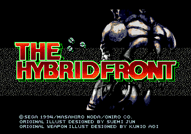
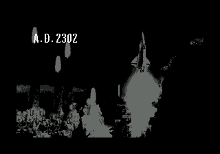

甫一上手，确实有些眼前一亮的感觉：
音乐非常动听，重金属的旋律让人热血沸腾，尤其是PETO行动的时候,有时都会产生”让他们多动一会儿吧”的错觉。作为大战略类的游戏，上手还是非常简单的，配合鲜明的人物和恰当的难度，确实不失为一部不错的作品。
尤其新颖的一个地方，是游戏始终有三方势力在混战。某些关卡任两组敌人狗咬狗也是不错的战术。
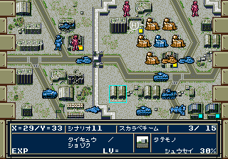
表扬到此为止。诸多的缺陷导致此作品在本胖子的心目中最多能打70分。
首先是角色。此作有个非常有意思的地方——长得帅长得凶长得年轻的厉害，长得囊的实力也囊。值得用心培养的就只有男女主人公，光头，黑小子，杨MM。
下面这个就是囊二号，成长到满之后甚至比不上长得好的小杂兵。
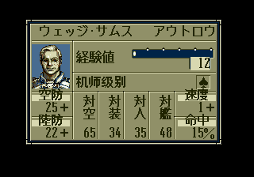
敌人也略显单调，第4话出场的boss一直活到最终话。
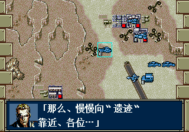

其次是载具变换太快太复杂，但强力的却不多，防空武器，远程武器之类威力与防御力完全不成正比。导致大多数时候只有两种战术——正面硬推和守株待兔。这也就牵扯到了第三个问题，敌人的AI实在是令人着急。就知道一个劲地傻冲。所以利用地利拉开敌人的距离形成多打一是最简单有效的战术。下面的两张图是最主要的两个类型的战场——陆地和太空。
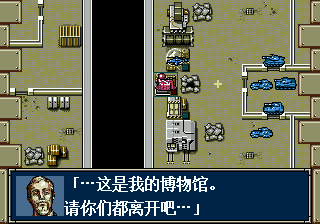
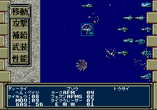

音乐固然好听，可架不住一成不变。三首曲子从头听到尾，当年在电视上玩的时候不知会不会有人开静音。

最后最致命的一个缺陷，就是流程太冗长了。其实这个游戏，大概到第16话左右的时候，还是有新鲜感的。三方势力的混战，什么逃脱战防御战打得都不错，如果停留在那个时期就刚刚好。但可惜这个游戏是26关。
是22关以后，地图也大，敌人分布也广。可除了数量上越来越多以外，质量上并没有什么大的提升。只要蹲点聚歼就完全没什么难度。但由于敌人行动的龟速，往往是自己行动10分钟，看15分钟敌人的动画。最后两关尤其令人发指，本来时间就不充裕，结果打一个回合就要接近一个小时，以至于再次重开游戏的时候状态全无，草草摆弄个十几分钟放弃存档，心想“有空再弄吧”。这一拖就是5年多。今天也是实在忍受不了自己的拖延了，索性锁定了一艘大舰的行动力和状态，一口气把最后一关的所有敌人都给突突了——即便是这样，也花费了一个半小时。

攻略啥的就不贴了，狼窝的那篇就很好。虽然未完成，但能打到最后四关的就一定能过去。难点反而是前面。

进入最后一关的对话
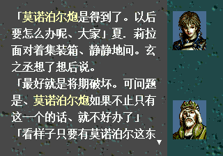
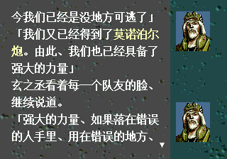

最后一关战斗中
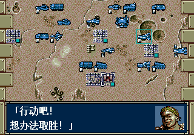
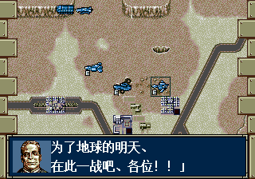

战BOSS
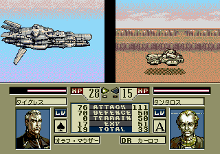
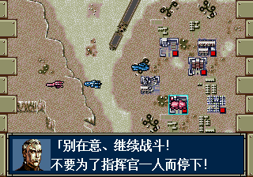

通关！！
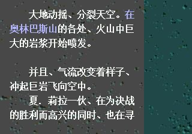
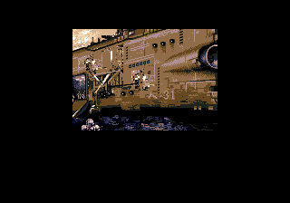
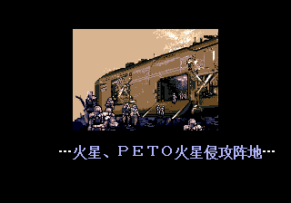
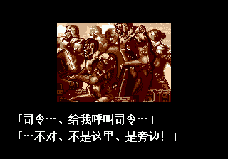
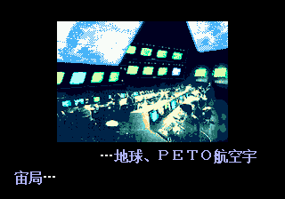
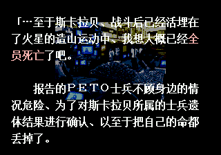
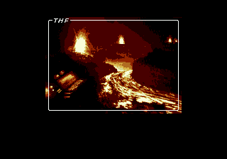
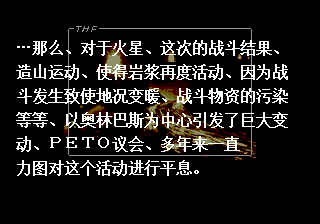
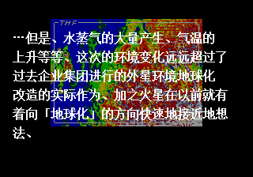
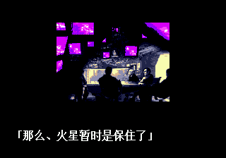
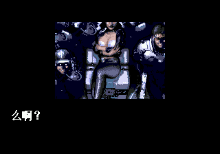
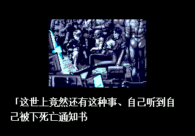
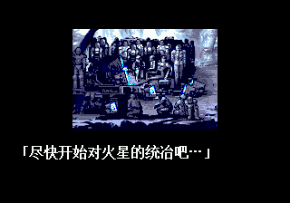
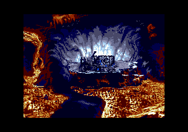
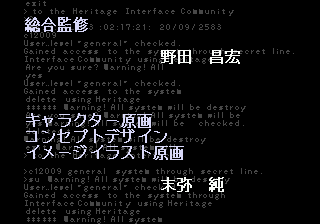

最后的结局，是反抗军（主人公）在火星上打败了两股敌对势力后，引爆了大炸弹。然后朝着地球上的那股势力（PETO）发出了假消息，说起义军都被消灭了，但火星变暖，将不再适合人类居住。然后就在火星上独立了。