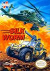

[联合大作战](https://pewae.com/gaan/aHR0cHM6Ly93d3cuZG91YmFuLmNvbS9nYW1lLzI2MzY2NzM4Lw==)

原名：Silk Worm别名：中东战争机种：FC厂商：sammy / TECMO类别：STG发行年月：1990-06耗时：15

史上最好玩的双打游戏之一.S开头的游戏可谓多如牛毛,所有带超级开头的(超级玛丽,超级魂斗罗,超级机器人大战…)都是S开头.但俺还是要选这个游戏作为S游戏的代表,完全是一股怨念在支撑.
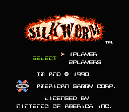
那是在遥远的公元1992年的夏天,在我三舅家等待看巴塞罗那奥运会的开幕式.在通关了数次南极冒险,并且数次龙牙冲击第二关未果之后,俺转向了这个游戏.
但是,那盒残忍的21IN1卡,每当到第四关这个地方的时候就会定版.而且从那以后,俺也基本上没遇到过能够顺利通过第四关的版本.唯一的一次,是在宝宝的邻居兼同学家里,那俩哥们配合从第3关开始就没死过,一口气打了通关,没轮上啊没轮上.
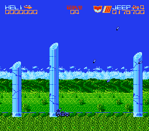
之所以爱用小车,就是因为几乎每次用飞机都会被火箭串糖葫芦.
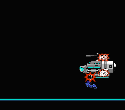
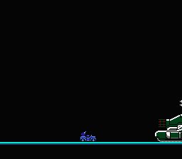
过关的统计画面.当年的游戏厅里总会有人在喊”变小鹰了”,”快变大鹰了”之类.
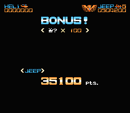
莫名出现的奖励分.
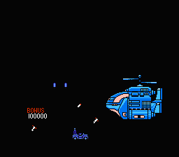
进最后一关前的简短过场.
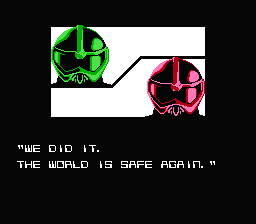
最后一关风格大变.
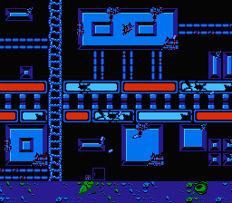
最终boss
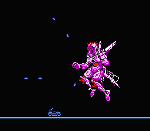
通关!
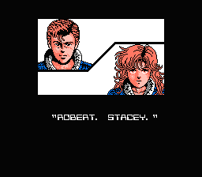
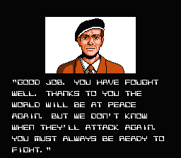
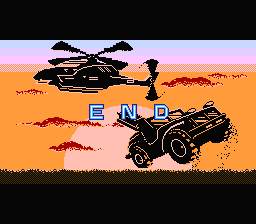