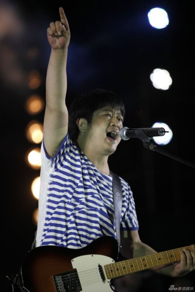

1995年，来了个新转校生给我当同桌。他叫老丛。我挺不乐意的，因为前任同桌十娘跟我一向配合默契。主要老丛还是个男淫。

老丛是个自来熟，很快跟后排的老黑、乌鸦、金刚、老驴以及我这几个混得很熟。
然后他就教我们几个唱歌：
我们生活的世界，就像一个垃圾场～～
我们擦啊！这歌太牛X了，谁唱的啊？？于是一盘老丛的正版磁带在哥儿几个手中传了几个月。
那盘磁带的名叫《摇滚乐中国势力》
魔岩三杰，当时名气降序排列下来是：张楚、窦唯、何勇。
张楚的《姐姐》已经家喻户晓了；窦唯不认识，但是提起黑豹（前）主唱，个个都知道。那么，何勇是谁？
这货带着他爹上香港演出，还嚣张地问香港的姑娘们你们漂亮吗，还能写出“是谁出的题这么的难，到处全都是正确答案”这么有这里的台词。
这货到底谁啊！？

老丛给我指点了迷津，说，何勇有一张自己的专辑，叫《钟鼓楼》。
赶紧去买回来大快朵颐。除了已经知晓的3首歌，《头上的包》和《幽灵》也听得如痴如醉。

之后的某日间操回教室，哼歌没看前面，一头撞上电门箱。被前座Andy嘲笑是长包的歌听多了，中了诅咒。

中考之前老丛又转回了原来的学校。

转眼上了高中，96年，学校为了给素质教育做做样子，特意开了音乐课试点。第一课，那个有点秃舌头的女老师故作大方，要同学们踊跃唱自己喜欢的歌。老汤（我在blog里第几次提这货了？）这坏种在一边挑唆：“大致，你要是敢唱何勇的歌，我就给你5块钱。”
有钱谁不唱？
我站起来就开始嚎《姑娘漂亮》，唱到“我的舌头就是那美味佳肴……”的时候，那个女老师就摔门走了。
时任班主任兼教导主任的某中年妇女把全班教训了一顿，说我们思想低下云云。好像文委MM还出来帮我辩解了一下，说是老师让随便唱的。
反正是不了了之了，音乐课取消。我也再没见过那个老师。

何勇后来得了精神病。再也没出过新歌，就更别提新专辑了。
不过唱摇滚的都是精神病，中国唱摇滚的第一张以后的专辑都是垃圾。也无所谓了。

2005年的时候，意外发现老丛竟然混进了我们单位。跟他打招呼的时候，他已经叫不上我的名字了。
貌似他没过试用期就离开了。

今年，听说何勇复出参加演唱会了。没看到画面资料，却只找到了这一张照片。

唉，岁月不饶人啊！要不是那件海魂衫，真就认不出了。
