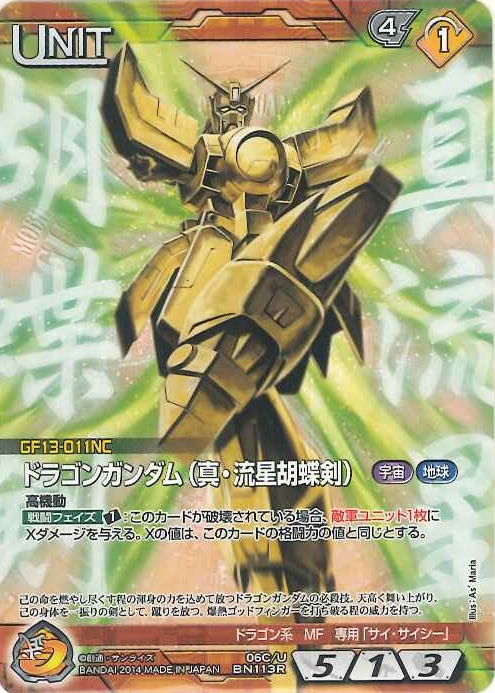

——重读古龙之《流星蝴蝶剑》

并没有太刻意地去选择第一本重读什么，只是随手抽出来的而已。

这本书当年是跟二徐换着看的，打着手电一个晚上就突突了出来，对情节的印象不深。倒是里面女主孙蝶出场的时候的那首词一下子就把我震撼到了。古龙写的时候只用了个头：“林花谢了春红太匆匆……”起先以为是古龙自己写的。但越品越不对，就找了班上对词研究最深的JJ。JJ一听我念的就笑了，他说：“你断句断错了，不是‘林花谢了 春红太匆匆’，而是‘林花谢了春红 太匆匆’……”于是李煜的这首《乌夜啼》就这样被我意外学会了。这种野路子来的知识记得最是牢靠了，书本不提考试不考我竟然能记了20年。

> 林花谢了春红，太匆匆，无奈朝来寒雨晚来风。
> 胭脂泪，相留醉，几时重，自是人生长恨水长东。

本书的开头非常之精彩。

> 流星的光芒虽短暂，但天上还有什么星能比它更灿烂，辉煌！ 当流星出现的时候，就算是永恒不变的星座，也夺不去它的光芒。 蝴蝶的生命是脆弱的，甚至比鲜艳的花还脆弱。 可是它永远活在春天里。 它美丽，它自由，它飞翔。 它的生命虽短暂却芬芳。 只有剑，才比较接近永恒。 一个剑客的光芒与生命，往往就在他手里握着的剑上。 但剑若也有情，它的光芒是否也就会变得和流星一样短暂。

流星自然是指代男主孟星魂，蝴蝶自然是指代女主孙蝶。那么，剑呢？我觉得是孟星魂的妻舅、孙蝶的哥哥孙剑。感觉古龙在这里用了一种反讽式的隐喻：短暂的流行和脆弱的蝴蝶留了下来，而接近永恒的剑，因为“有情”挂了。

**三**
印象中这部书一直算不得好。即使1971年是古龙最好的时段。重读时就一直在思考原因，或者说，一直在怀疑年少的自己是不是太囫囵地错过了某些重要情节。然而，再次读完之后，发现，还真是不太好。
男主和女主的爱情故事，太做作。寂寞的杀手在偶遇到同样寂寞的少女，两面之后，就跟人跑了——不仅放弃了自己的任务，而且背叛了把他养大把他变成男人的杀手组织首领。可是，这不科学啊！孟星魂30多岁了都，也不是啥纯情小处男，就因为一个跟自己同病相怜的女子，就不工作了？所以可能他只是厌恶了杀手的工作，找了个差不多的理由，摆脱了杀手组织而已。就像叶翔死的时候，陆漫天对孟星魂说的：“那只因你已变得聪明了，已不愿陪他死，就算你还有别的理由也一定是自己在骗自己。”而孙蝶那边也差不多，她对自己的孩子那么好，所谓的自杀什么的太显做作了。如果有自杀的勇气，为什么不去找自己的老爹说律香川是个畜生？孙蝶跟了孟星魂，也许只是为了找张长期的饭票而已。俩人在一起的故事，真实但不伟大。所以当孟星魂知道孙蝶不能给他生孩子的时候，那段剧情就格外的假。
说起来，整本书里最大的破绽，就是如此多智而近妖而且在乎女儿的孙玉伯为什么会不知道孩子的爹是谁。当然，如果知道了，也就没这部书了。

**四**
这是一个关于背叛的故事。黑帮老大孙玉伯的头号马仔衣钵传人律香川谋求上位背叛自己的老大；另一个敌对黑帮的重要人物屠大鹏与律香川勾结，同样背叛了自己的老大飞鹏王；养大四个孤儿杀手的高老大与四个杀手间互相背叛；孙玉伯的儿子孙剑出任务的时候被人背后捅刀子；律香川一直在欺骗自己的妻子；孙玉伯的死党陆漫天暗地里找杀手去刺杀他……甚至律香川最后的死法，也是被最信任的人背后捅刀子。
所以，无论哪个版本的电影电视剧，都无法拍出这个故事的精髓所在。
说起电视剧，就不能不提当年新加坡拍的那个《莲花争霸》。90年代中期，这部片子是大连二套在每天7点的时段准时放的。然而几年过后除了罗文的主题歌《走我路》和轰轰轰迈克贝附体的片头以外，竟然再无印象。
杨紫琼梁朝伟王祖贤的那版，剧情就更一塌糊涂了。大长脸演的高老大能被当作其代表作之一，我竟无言以对。

**五**
其实整部书的武侠味儿非常的淡，只能算是披着武侠外衣的黑帮书。
男主孟星魂根本没出手几次——先是干掉了几个小喽罗——用小马的方式，拳头打脸；然后潜伏到黑帮头号打手韩棠的身边，没下了手还不得不挨了一刀装死，最后跟大反派律香川打的时候更是像两个流氓在打架。
大反派律香川的武功则一直是侧面描写，说他办事得力暗器厉害。真正的出手也就一次，用暗器射老大孙玉伯，还是在背后。整部书里也就这么一点儿地方出现了一个武器名——那是律香川暗器的名字。
孙玉伯倒是出手了几次。但加在一起也没用上一百个字。三次用拳头，一次用别人的剑，砍了叶翔。
可能古龙是为了紧扣流星的主题，把整部书的节奏都变得非常的快。或者说，都是背后出手，不需要第二下？

**六**
跟主角的暗弱不同，这部书里古龙塑造了几个可圈可点的小人物。
一个是接应孙玉伯出逃的那个姓马的。为了恩情，首在一个地方十几年，娶妻生子。对自己的女儿溺爱到了老婆都无法理解的程度。接应完之后，在饭菜里下药毒死全家，只为了保守住秘密。
第二是律香川唯一的朋友夏青，同样是受了恩惠开了一家小酒馆。律香川唯一的精神归宿就是在那里买醉。剧情最后的时候，这个唯一的朋友把走投无路的律香川杀了请功。
第三是早早领盒饭的主角背后的替补，小何。高老大有意无意透露了主角的任务，小何在发现孟星魂进展不力的情况下，跳出来抢人头，反倒误了性命。
还有失去了家族庇佑的南宫公子，只能靠卖情报过活。
正因为这些有血有肉的小人物，古龙的江湖才更显鲜活。

**七**
最欣赏的人物，是叶翔。
叶翔是孟星魂之前快活林的头号杀手。因为在一次任务中，刺杀韩棠失败，失去了所有的地位。但他是男主孟星魂的朋友和精神导师。后来孟星魂被高老大和陆漫天联合出卖，执行杀孙玉伯任务到了最关键的时候，叶翔舍生而出，只为了告诉孟星魂和孙玉伯，他们与小蝶之间的身份羁绊，用生命阻止了一次翁婿间的相爱相杀。
叶翔很纯粹。他不能让孟星魂或者孙玉伯死，因为有一个死了，小蝶会伤心。他爱小蝶。
胭脂泪，相留醉，几时重，自是人生长恨水长东。
这是古龙送给叶翔的。

