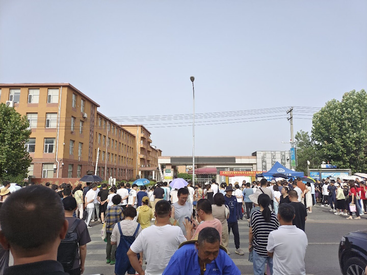

6月23日，臭宝迎来了人生中的第一场考试（不算之前生物实验）：初升高地生考试。
辽宁省的初升高考试安排颇耐人寻味，第三天上午考初三的最后一场政史，下午考初二的第一场地生，正所谓起点也是终点。

备考前最后一天是周四，学校忽然接到紧急通知说对教材的检查极严，严禁往书上粘贴任何印刷品，严禁任何两页书的厚度多于两页纸。于是周五特意请假一天，在家帮闺女撕下两年来累积粘贴上的提纲，并且誊写到书中的空处。这小半天差不多写了过去10年的写字量。
听说有的家长还是厉害，直接把字打在了书上。我始终搞不通，16开的书，不把书拆了怎么能做得到。
其余要准备的东西倒是不多，新买了个透明书袋；然后孩儿娘翻箱倒柜找出了一块带指针的表，并去市场换了电池。

老婆大人怕臭宝吃坏了肚子，连续几天都是清汤寡水大礼包。

考试周日下午三点开始，考场所在的学校离我们家这边距离不算太远，直线距离5千米左右。学校要求学生自行前往，提前两小时四十分钟（13：20）集合，13：40进考场。
离考点还有一千米左右就开始缓行。到400米的时候我们看到有个挺大的停车场，并且为了考试特意把杆都抬了起来示意免费停车，那还不赶紧停进去。

果然不久后把车停在学校门口路边的大聪明们都被交警撵了出来。

因为臭宝学校的考生被平均分配到了三个考场，班主任只能跟一个。臭宝的考点委托给了某位妈妈。
所托非人。某妈不仅没有确认同一考点所有小伙伴的联系方式，也没跟班主任和学校的带队老师进行任何事先的沟通。
某妈自己到的就不早，所以集合地点也没定，还是先到的某位小朋友机灵，把一家药店定成了集合地并在群里发了图片。

往书上打字的达人刚好有一位就在我们考场，臭宝带着无比好奇的我去瞻仰了他的书：妈蛋，他妈就是把书拆了，打印，再给订回去。

到了集合截止时间，还有两位没到。某妈才急匆匆想起来联系那两位的家长。偏偏考场开始测试信号屏蔽器，这好一通“喂喂操”啊~
好不容易人齐了，某妈又外路精神的张罗起来拍“迎战合照”。队形还没排好，就被找我们班半天的学校教导主任直接把人全领走了。边走边抱怨：“20个班都进去了，就差你们了。谁带的队，听不着我喊集合啊！拍完照片发出来让全区笑话你们缺考吗？”
我心说，她是蠢，可您也不见得聪明啊！我不仅听到你喊集合了，还看到是你在喊12班集合。可你又不说哪个学校集合，我tm认识你是谁啊！

教导主任当然是夸张了。
孩子们进门要先过两道安检，然后在操场上又等了将近半个小时，才让进楼。期间有别的学校包车前来的，下车也慢慢悠悠毫不紧张。
安检队伍只有6个保安和4个官员样子的人，大热天的，并没有传说那么严，而且好像是越往后进考场，查的就越松。
所有考生进了考点教学楼，家长在外面也没啥看头了。一看表，才14：10。

虽然是大太阳天，手机上显示的温度也达到了28度，不过好在有风。只要不站在大太阳下面就还——
——还个屁啊，我跟老婆坐在学校500米外蜜雪冰城唯6的座位上愉快地喝冷饮了啦！
一杯美式下肚，离考试开始还有15分钟。

老婆大人批评了我的浅薄：“全区学校虽多，但初二年级超过12个班的只有4所，而其中又只有我们学校出现在这个考点。所以教导主任喊的集合命令是没有歧义的。”

反正就熬呗，熬到考试结束，学生走出考场。

至于考得怎么样，咱也不敢问。
人家娘俩把我扔在公交站自生自灭，径自逛街happy去也。一直到晚上22：00才回家，因为臭宝发誓要把这几天的清汤寡水都补回来。

考完试后的周一，臭宝他们直接搬去了之前初三的教学楼，教室上的牌子也变成了九年X班。
当年我初升高考完之后，就再没回过教室吗？完全不记得了哎！