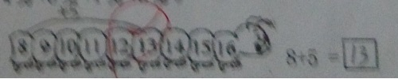
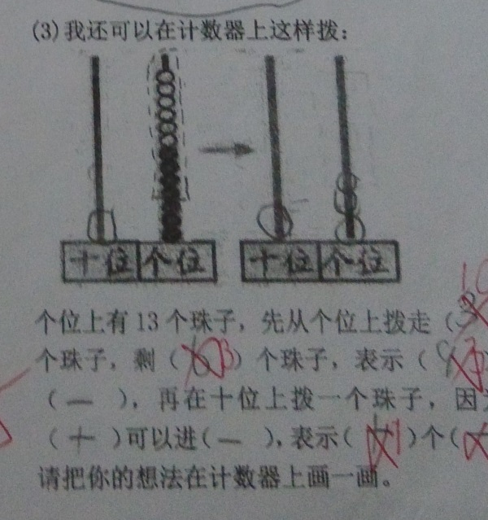
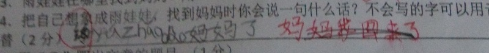

喜迎开学。把上学期期末考卷拿出来晒一晒。卷子不让往回带，手机有两张拍糊了，所以文字跟图片混发。
闺女成绩真的非常一般。

数学错题1：

> 把15根香蕉分给2只猴子，可以分成（）根和（）根，也可以分成（）根和（）根。

闺女的答案：2，13，13，2。
我觉得闺女没错，批卷老师傻逼。

数学错题2：
认表。分为正常表盘和电子表表盘，题干是“写出表上时间”。其中电子表表盘在上课的时候提的要求写出“几点几分”，而臭宝看到6:30直接在横线上也写了6:30。
单看答案没错，但不符合老师提的要求的话，就是错了。好像闺女根本不把老师说过的当一回事儿啊。

数学错题3：

这题做过也错过，要画箭头是课堂上提出的潜规则，就是记不住。

数学错题4：

这是最后一道大题。闺女根本没看懂题。我觉得这应该怪她语文老师而不是数学老师。虽然她们数学语文是同一个老师。

语文错题1：

> “里”字第五笔是（）。

闺女想都没想，写了个5。这脑回路简直了。

语文错题2 ：

> 我会照样子填空
> 例 蓝蓝的天空 小小的船 （）的贝壳

闺女填的是wucai。词性没错，但没用叠词。以前做过，错了不应该。

语文错题3：

> “星”“花”可以分成上下两部分，那么（）（）可以分成左右两部分。

闺女答案：里、王——她理解成左右对称了，也亏她能想出来。

语文错题4 ：
阅读题

本来答得没毛病，可终于的终非不用拼音，结果写了别字。逞强可不是个好习惯。