看球，也有20+年了。
平时跟人讲什么阵型啊打法啊战术啊状态啊体能啊心理啊也头头是道。可心里明白，看球看球，看的其实还是球星。再高的段位也如此。
好比说，俺一直逢人就说喜欢前两届的厄瓜多尔的防守。实际上还是欣赏德拉克鲁斯和艾斯皮诺萨，以及他们之间的配合。
只不过随着年龄的增长，对球星的关注点有变化了而已：以前喜欢埃德蒙多的张扬，现在欣赏米利托的效率而已。
所以，趁无事，信马由缰地整理一下自己的思路，以标准4-4-2来填充一个看球以来最爱的阵容吧。第一个想到谁就算谁，直觉是最准的。

**守门员：帕柳卡**（备选：托尔多、范德萨）
问：什么样的守门员是好守门员？
答：看顺眼就行。
1994年。宋世雄爷爷用那独特的嗓音反复播报：意大利的守门员帕格里乌卡被红牌罚下，这是世界杯历史上第一个被红牌罚下的守门员……
从那时起，这个胡子拉茬的帅哥就成了俺看最顺眼的守门员。没有别的理由。
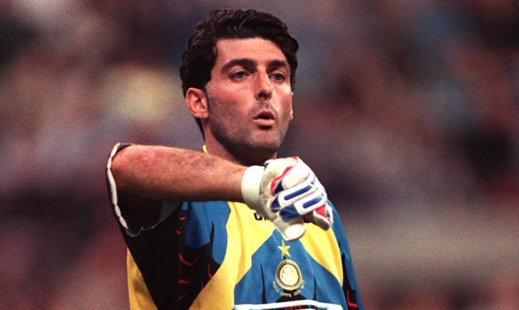

**左后卫：纽曼**（备选：里瑟、勒索克斯）
那个时代世界上最好的左后卫。没有之一。没有罗卡洛斯。没有保罗马尔蒂尼。无所不在，无所不能。
最记对阿根廷的1/4比赛，连过三人后的一脚传球。
98年如果不是因为他停赛……
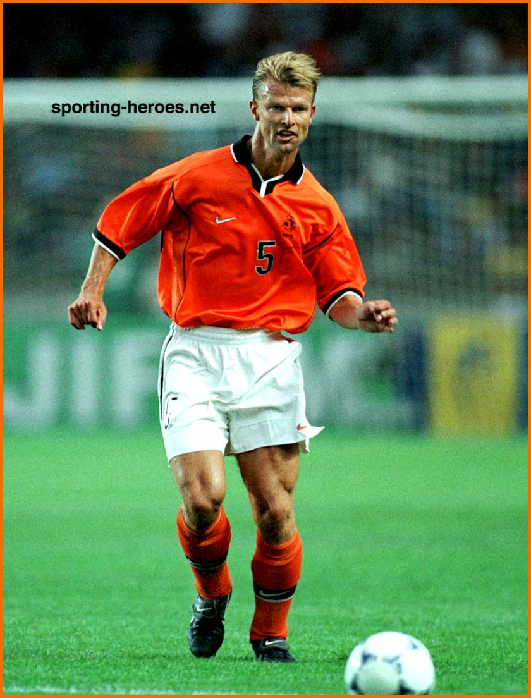

**中后卫：萨默尔**（备选：马特拉齐、迪斯汀）
这家伙96年欧洲杯进了3个球。还记得那个追火车的广告吗？
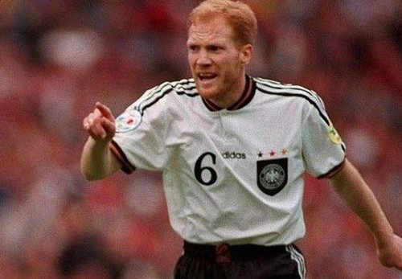

**中后卫：索尔多**（备选：科曼）
他为斯图加特打了300多场比赛。某场联赛，第92分钟突然冲到前场远射扳平了比分。
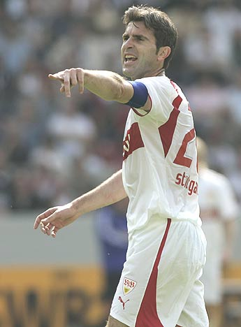

**右后卫：托里切利**
他是我踢球时的场上模板和奋斗目标
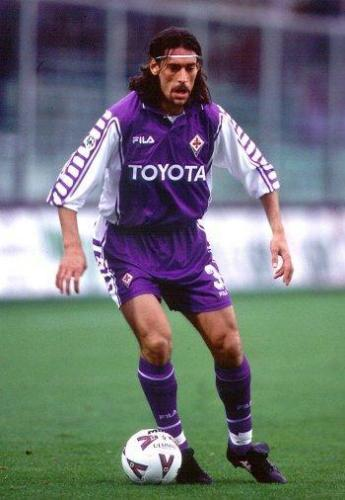

**左前卫：麦克马纳曼**（备选：维森特、怀斯）
我承认，我就是因为那一年热身赛他戏耍了范志毅而深深爱上了他。
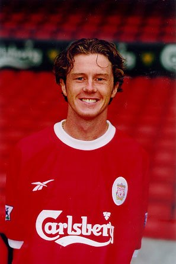

**后腰：里杰卡尔德**（备选：戴维斯、马斯切拉诺、科库）
原因见[这里](https://pewae.com/2007/11/bozheshengui_day09_idle_by_mistake.html)
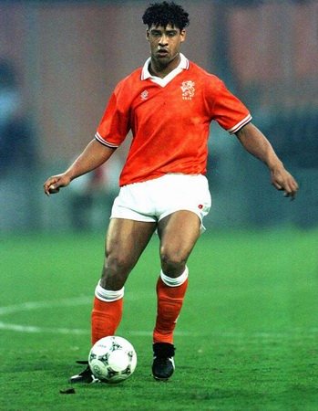

**右前卫：古力特**（备选：格伦夏尔、巴斯勒、卡伦布、罗本）
原因同上。这可是我正牌偶像。追他去了桑普，追他漂流到切尔西——在那之前是不看英超的。大开大阖的风格，至今魂牵梦萦。
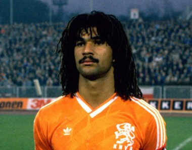

**前腰：巴拉科夫**（备选：艾马尔、哈维、小劳德鲁普）
好吧，我很俗，我是那支斯图加特的球迷，怎样?
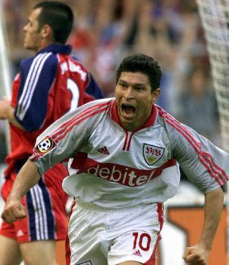

**前锋：巴蒂斯图塔**（备选：维耶里、希勒）
更俗烂的来了吧，哈哈，实事上是从佛罗伦萨降级而这个人不离开而开始关注巴蒂的，随后他又在接下来的意甲和美洲杯表现出色。巴蒂是迄今为止最有中锋气质的中锋。站桩、回做、转身、强行射门，巴蒂做的，就是一个中锋应该做的。
真是怀念那个时候的佛罗伦萨啊——最喜欢的紫色、豪迈的巴蒂和飘逸的科斯塔、木讷的托尔多、疯狂的球迷，就连赞助商都是任天堂。
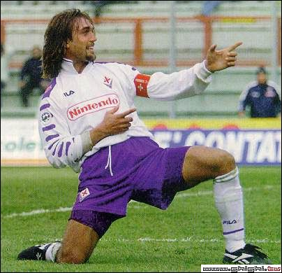

**前锋：拉尔森**（备选：迪卡尼奥、埃尔伯、布兰科）
让我因为喜欢一个人而喜欢上一个球队。
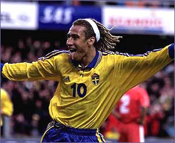