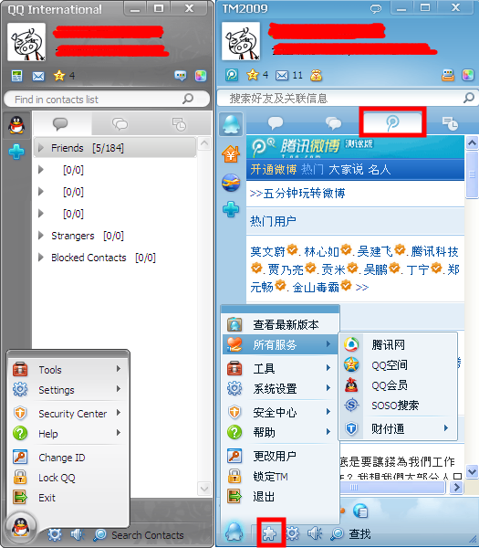
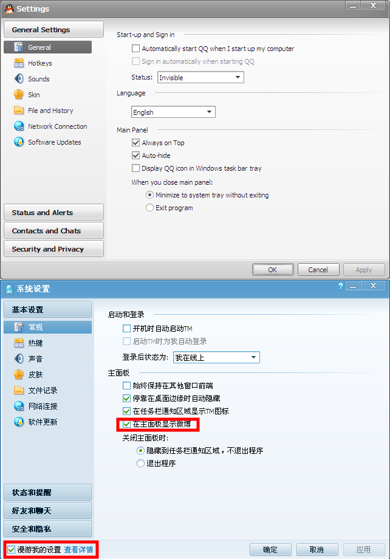
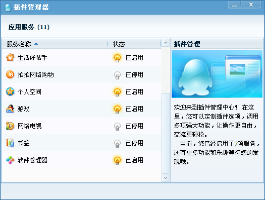

首先，我并不是不知道TM这个东西。相反，在这个东东一出来的时候就试用过了。但是用过之后就放弃了。因为这家伙最早的版本不是UTF-8编码的，所以在单位的日文系统上得先起转码工具后才能运行。（这也是我们部门再忠诚的360用户也无法在单位用之的原因。）
这是偏见。结果就是之后的TM，都没有使用过，甚至没有去关心过。

好，既然那么多人说它好，我就下一个看看它究竟是什么东东。

> TM是Tencent Messenger的简称，是腾讯公司推出的一款面向个人的即时通讯软件，能够与QQ互联互通，具有无广告、抗骚扰、安静高效的特点，风格简约清新，侧重在办公环境中使用。

实际上这个东西在腾讯的下载页点两次“更多”才能找到。而且人家叫TM，而不是什么QQTM或者TMQQ。因为当时出这个东西就是为了区别用户群，分离“商务用户”与“娱乐用户”。我推测，之所以藏得那么深，是因为这厮属实不赚钱。只是推测。

安装之后，惊喜地发现，跟昨天说的QQIntl好雷同啊！！

要么是TM改头换面去了点什么功能变成QQIntl，要么是QQIntl加上小鸡鸡伪装成TM。
究竟是前者还是后者并不太重要。重要的是，差的这点儿功能究竟是什么？
是腾讯念念不忘的“服务”、快速启动栏和插件。
什么服务？QQ会员是直接要钱的；QQ空间和财付通是隐晦着要钱的；腾讯网和搜搜是为了扩大自身影响力的……
快速启动栏默认是显示的，网络硬盘，股市，生活小帮手和携程旅游。三个自家的无聊服务和一个合作赚钱项目。
插件呢？默认的音乐播放器、股票资讯、手机无线、生活小帮手、个人空间、游戏和软件管理器7项是**启动**的。也就是说，在你什么都不知道的情况下，捆绑了一堆你可能用得上可能用不上的功能。如果你一辈子不注意左下角那个拼图图标的话，这些捆绑就一辈子停不掉。

所以说，即使是在你们夸耀的TM上，腾讯也还是憋着心思想赚钱的。只不过没有QQ本尊那么露骨而已。只不过可能用起来确实是不弹窗吧。

QQIntel里的plugin目录没有删除，卸载程序的说明文字还是中文的。所以应该是TM改的QQIntel。但是TM的版本号和版权信息要比QQIntel要新，可能是在TM上新附加了微博功能吧？
TM跟QQ，腾讯方面一直想把它们塑造成两个不同的东西。所以我也是遵照它的意思把它们看成了不同的东西。就像我老婆非要把炸鸡跟炸鸡腿看成不同的东西一样。但是，谁叫你新推出的产品叫QQ International而不是TM International呢？谁叫你的QQ International里只有英法日文而没有中文呢？我干嘛不跟QQ比而非要跟TM比？就像我在拿金正淫跟毛太孙做比较，你非要把彭大娘的老公搬出来比较一样——不是不可以比，而是为什么要这么比？？

这都是皮毛，说到上边为止。
重点是，为什么给在国内用户用的QQ和TM上就肆意捆绑，在国际版上就进行自我阉割了？
第一个可能的原因是市场定位。可能是觉得在国际上赚不到钱，倒不如光棍一些把乱七八糟的东西都拿掉，赚个名声玩玩先。能不能开出市场日后再说。如果是这样，那么腾讯就是只赚中国人的钱不赚外国人的钱，这部分的钱是为在香港买了它股票的世界股民创造的利润，所以腾讯是给帝国主意国家创造利润的汉奸。
第二个可能的原因是合法性。可能法国米国日本对于捆绑啊垄断啊青少年啊付费啊之类的规定比较严格，腾讯不敢去触动人家的红线，怕给人告死，萎了。对外自我约束而对内肆意妄为，谄媚外国人，所以腾讯是欺软怕硬的汉奸。
第三个可能原因是自身能力。他们不是不想弹新闻，而是采集不到国际新闻或者抓不住新闻热点；他们不是不想加入股票信息，而是根本获得不了世界各个证交所的合法实时数据；他们不是不想加QQ形象，而是根本设计不出受非中国90后人种认同的形象；他们不是不想加入微博，而是怕那点儿技术根本挡不住国际化的敏感问题把自己拽泥坑里。就这样的公司还在国内辩驳什么安全什么医生什么保证，欺骗国人，所以腾讯是欺世盗名的汉奸。

在我的字典里，汉奸是个中性词。
所以冷静下来之后把昨天的东西做了一点儿小改动。
这样就不算骂人了…吧？