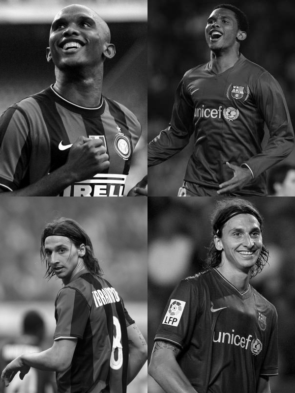
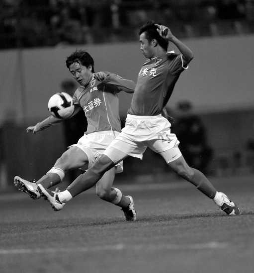

今早兴冲冲爬起来打算观赏国米对巴萨的冠军杯半决赛。我承认，在哀悼日里一清早起来找乐子是我的不对。
可是，我实现并不知道哀悼日这回事。
甚至两点半起来之后，欣赏了半个小时的李梓萌的播报艺术之后，才领悟到事情不对。赶紧做到电脑前开网页。发现一个二个地都换成了黑色主题，就知道是怎么回事情了。

只能睡去。
于是整个小半夜就在琢磨，你说，这足球比赛咋就算成娱乐了呢？那要是把解说去了，把画面换成黑白信号，能不能符合要求呢？？
进一步的，开始研究巴萨和国米的队服在黑白的情况下该怎么区分。
在没有付诸实践的前提下，想到了这样几点：
1、听背景音。国米主场，所以进攻的时候场外有助威声的是国米。
2、看宽窄。巴萨的队服竖条要宽一些。、
3、看身后的人名，但对米利托兄弟无效。
4、看胸前。巴萨的胸前广告是联合国儿童基金会，而国米是倍耐力。队徽也不一样，国米的队徽上方还有一颗装逼用的星星。另外国米在胸口位置有意大利国徽。
5、认人。别把伊布跟埃托奥整混了就行，当然国米里有好多龙套是不认识的。
6、看字幕。一般说来场上位置跟字幕方向是一致的。不一致也只有认倒霉。

哪知道早上到了单位之后，一开网页发现完全是杞人忧天，人家欧足联早想到了，巴萨穿的是丑陋的客场粉色队服。
而且，通过实验得知，即便巴萨不换衣服，在黑白片里双方也还是泾渭分明。
有图为证：

怀疑巴萨的原始董事会里怕有人是色弱吧……

相比之下，中国联赛还真是显得足够业余的说。图片来自2009年的一场联赛。你能分辨出双方是谁吗？
