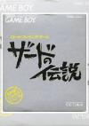

[萨德传说](https://pewae.com/gaan/aHR0cHM6Ly93LmF0d2lraS5qcC9nY21hdG9tZS9wYWdlcy8yMjA2Lmh0bWw=)

原名：ザードの伝説机种：GB厂商：Vic Tokai类别：RPG发行年月：1991-10耗时：6

[攻略](https://pewae.com/gaan/aHR0cDovL3dpa2kucGV3YWUuY29tL2Rva3UucGhwP2lkPXdpa2k6Z2I6JUU4JTkwJUE4JUU1JUJFJUI3JUU0JUJDJUEwJUU4JUFGJUI0)

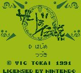
按说，26个字母里最艰难的IUV已经过去了，X开头的选择面虽不如S那么广，但有很多中文字撑着，还是有很多备选游戏的。
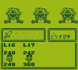
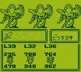

然则本作既不出名，也不精彩，只是一部中规中矩的RPG作品。选择这么一个生僻游戏，纯是因为我的一股怨念。
话说当年我曾经痴迷初代《口袋妖怪》，手上有合卡红绿蓝各一部。GB的盗版合卡还是很强大的，带的游戏都不错。这个传统的RPG在三盘合卡里都有出现。彼时正值我在GB上照着攻略连续拿下了日文版的吞食天地、saga2和saga3，对RPG产生了迷之自信，觉得一个传统RPG不过尔尔。五十音图十分之一都认不全的我产生了挑战生啃这个游戏的念头。结果当然是失败了，这个游戏也就当然加入了我的“有生之年”列表。
如鲠在喉不至于，如尿在泡差不多。终于在2014年的时候，我找到了一篇日文攻略。跟当年比起来，我的日文只多是会了个五十音而已，然而会这一点儿，能查资料就够了，所以才有了今天的大仇得报。我也把这份来之不易的攻略翻译成了汉语。虽然这个年代全中国乃至全日本都可能找不到第二个还在玩这个游戏的人了……
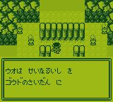

这部作品真的是一部非常死板的RPG，处处抄袭DQ，却不懂得变通。GB的分辨率比FC还要可怜，却偏偏把地图做得很巨大，往往出现主角站在地上，四周白茫茫一片，完全不辩东西的诡异情形。关卡的设计也很敷衍。前期的小BOSS是后期的杂兵（这事儿在早期RPG里很常见），十几处迷宫都是一部模子下来的，只是长短和规模有区别。02年左右玩“新仙剑”的时候，我曾经对制作方把将军坟和凤凰巢处理成上下两层完全一样的变态做法破口大骂，岂不知我要是早几年真把这部作品打通了，挨骂的就是日本鬼子了。
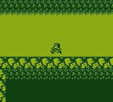

出品方名叫“大东海(vic tokai)”，跟另一家知名公司太东（TAITO）没有任何血缘关系。该公司的名字很搞笑，因为即使英和混搭，大东海也应该是big tokai。然而起名的傻逼用日式英语把big拼成了vic，充分说明了该公司的董事长可能连小学都没毕业。日语里没有“v”的发音，外来语需要用到“v”的时候都会用“b”代替，所以才有very very good = 巴黎巴黎顾答的著名段子。但是反过来用还能用错的情形，实在太罕见了。这家公司从红白机时期到世嘉DC一共出了不到20款游戏，没有特别出名的作品，早已销声匿迹了。
其实本作品的英文名是“Xerd no Densetsu”而不是“Zerd no Densetsu”，也是很奇怪的事。
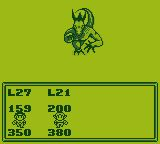
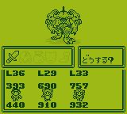
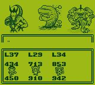

唯一的亮点是游戏的音乐。GB的硬件条件非常可怜的情况下，音乐的节奏音色都很令人振奋。GBC上的续作配乐更是被誉为GB上殿堂级的音乐表现。
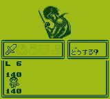

当年卡住的地方还不到整个流程的1/20，就是某个路口有个怪，不吃物理攻击，只能用魔法打。我当年已经猜到这一点了，却不知道为什么自己的魔法栏都是空的，只好闷头练级练级，练到快50级都没学会魔法，才放弃的。现在才知道，这部作品里的魔法不是学会的，而是要开箱子或者在商店买，然后要用“装备”命令装在身上才可以。
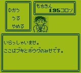

这年头打这样的RPG，真的就没啥趣味性了，偏生这部作品还特别死板，只有在村子里才能存档，打怪也除了钱什么都不掉，最恶心的是剧情发生在城堡里，而补给都在村子里，后期2小时的剧情没村子什么事儿，买个药还得先飞回村里……
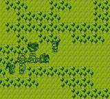

练级、练级、练级……跟DQ一样需要水磨工夫。小怪一直都很厉害，没一定的等级做保证，打小怪都很容易挂掉。
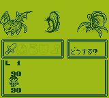

本来截了好多小BOSS的图，后来发现都会出现在大地图上，就放弃了。来看一下最后的四大天王和最终BOSS吧！反正最终BOSS乍一看还挺有气势的。
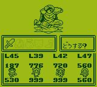
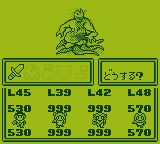
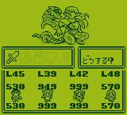
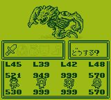
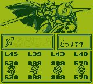

负分差评的通关画面。
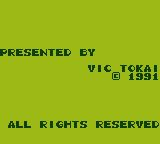