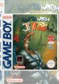

[蚯蚓战士](https://pewae.com/gaan/aHR0cHM6Ly93d3cuZG91YmFuLmNvbS9nYW1lLzI1ODgyNjg2Lw==)

原名：Earthworm Jim别名：蚯蚓吉姆机种：GB厂商：Shiny类别：ACT发行年月：1995-01耗时：4

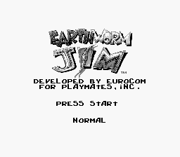

GB的Q篇有些难产。本来备选的是我在真机上经常打的益智游戏Q-BALLON，奈何岁数大了智力退化，完全打不穿；又尝试换成QIX（天蚕变），确是只能过关无法通关。浪费了近半个月才换到蚯蚓战士。
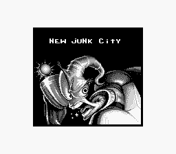

《蚯蚓战士》系列是90年代风靡一时的动作游戏，尤其深受欧美玩家的追捧。因为其风格幽默动作流畅在各个平台上都有移植。本来MD的时候蚯蚓战士就是备选，但最终E给了更有世嘉特色的《海豚历险记》，Q给了接触时间更久的《雀侦物语》，因而把《蚯蚓战士》房子SFC备选的位置上。但现在情况又有变化，SFC的不打算做了，于是才介绍GB上的《蚯蚓战士》。需要强调的是，MD上的蚯蚓战士才是最好的，MD不愧是为动作游戏而生的主机平台。
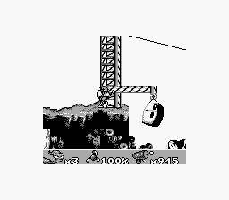

所以GB版蚯蚓战士……创意满分，但针对GB的优化几乎为零。最大的毛病出在画面上。要知道GB是只有160*144分辨率，4级灰度显示的黑白机。4级灰度，可以简单理解为只有4个色，完全处理不了复杂的背景颜色和纹理，所以老任自家的游戏非常注意这个弱点，出品的游戏要么是白背景，要么是人物白衣服勾线，就是怕玩家看不清楚。可这蚯蚓战士倒好，好几关都是从别的平台直接扒过来的，这花里胡哨的一坨实在是太为难中年大叔了。
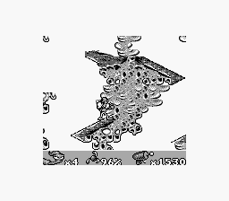

另外一些动作没有好好调试，手感僵硬。最典型的就是蚯蚓把自己拉长找支点荡秋千的动作，是非常难get到合适的距离的。
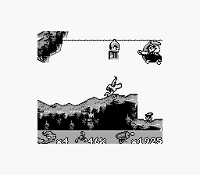

作为深受欧美玩家喜爱的游戏，这一作在Gamefaq上竟然罕见的没有攻略，只有一篇SMS的近似攻略能供参考。我想可能是因为太难了。第六关蹦极互殴，第七关抽打小怪物，以及第八关的遍地尖刺，都搞得人痛不欲生，同时开动即时存档和FPE两大杀气才堪堪搞定。
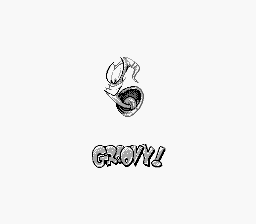

前四关还好，普通的动作游戏。
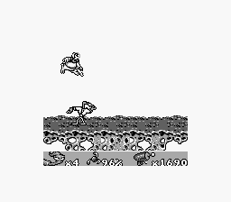
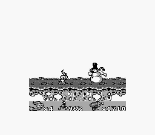

从第五关开始，噩梦降临。
第五关的飞碟追逐关，我修改了时间，大概用了限定99秒的4倍才过去。
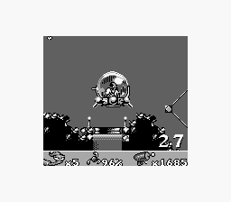
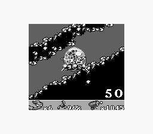

第六关跟一只不知什么动物比蹦极，互相撞，输的一方掉下悬崖。靠着即时存档也没玩明白，4局完全是靠命填过去的。
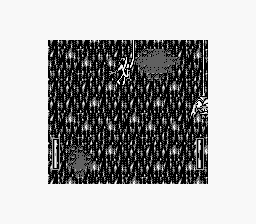
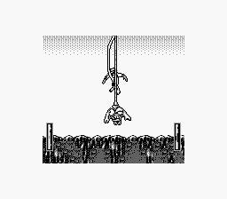

本作有纵向伪3D的公路追逐关，蛮有创意的。可画面处理得太糟糕了，障碍和奖励都是黑乎乎一坨，远处很难分辨清楚。
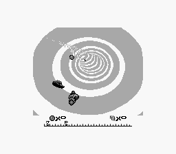

第七关地上有个看不清楚的小东西，不能掉坑里，掉进去就反噬你把你带回起点。锁血也没有用，完全要靠手速和反应，我最讨厌这样的游戏了。
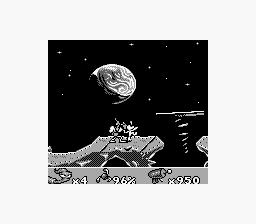
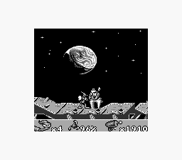

最后一关，简直是节能环保的典范，也太tm黑了！这一关堪称变态难，遍地是刺，一拍两瞪眼那种。锁血之后反倒是不在乎了，一路趟过去就是。
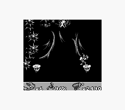

最后一关很难，总boss却很弱，甚至不能让你调一滴血，抽啊抽啊就通关了。
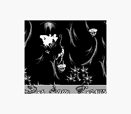

通关动画，蚯蚓战士遇到一只母蚯蚓，还没等近前就被一只奶牛砸死了。
可想想蚯蚓本是雌雄同体的动物，这结局细思极恐啊！

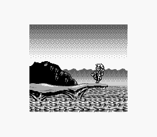
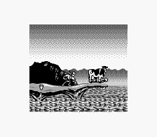