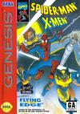

[蜘蛛侠与X战警](https://pewae.com/gaan/aHR0cHM6Ly93d3cuZG91YmFuLmNvbS9nYW1lLzM1Mjg2MzI0)

原名：Spider-Man / X-Men: Arcade's Revenge机种：MD厂商：Software Creations类别：ACT发行年月：1994-06耗时：24

童年阴影系列，微笑继续。
1998年的暑假，我的好朋友[汤球球](https://pewae.com/2014/10/older-tang.html)把他的MD卖给了我，这样我就有了两台MD。他的几盘游戏卡也在拉扯一番之后不得不送给了我。于是这个冷门游戏成了我的藏品的一部分。这种高难的动作游戏在我手里就是鸡肋，玩又玩不过，换又换不出去。一年之后上了大学，转眼间模拟器遍地开花，MD游戏卡更是成了明日黄花，仅供观赏了。
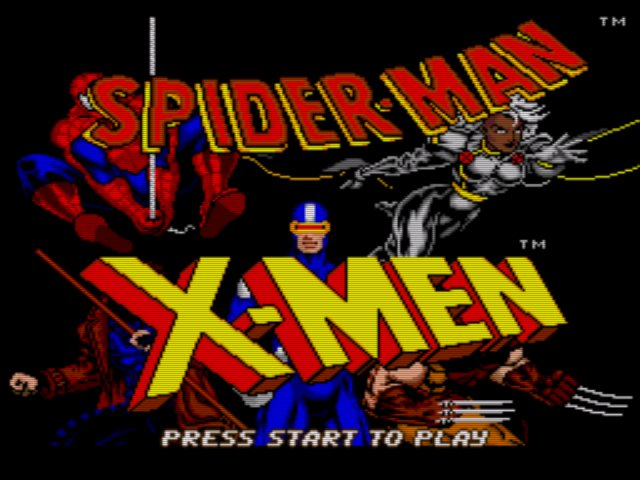

跟上次的[《电击作战》](https://pewae.com/2019/03/clash-at-demonhead.html)类似，本作冷门到连它的同名超任版也算上，我都找不到一个标准的译名。

“蜘蛛侠与X战警”这样的叫法，其实忽略了副标题“Arcade’s Revenge”。话说这个副标题当年可是直接把我干蒙了——什么叫街机的复仇？不应该是街机的复刻吗？Revenge这个词难道还有别的含义？这个小困惑直到20多年后的今天写这篇的时候才得到了答案：有歧义的不是Revenge，而是Arcade。Arcade是漫威的一个反派，能力是创造高科技陷阱和心理战术搞事情，是蜘蛛侠漫画和X战警漫画出现过的反派，也搞过复仇者、夜魔侠、惊奇队长、黑豹什么的。但是他的能力还是偏弱，从未在20世纪福克斯、索尼、迪士尼的任何漫威题材电影、衍生剧或者动画片中出现过！这个过程里，这部以Arcade为最终BOSS，应该被叫做“街机人的复仇”的游戏作品究竟提供了正向还是反向的反馈，不得而知。
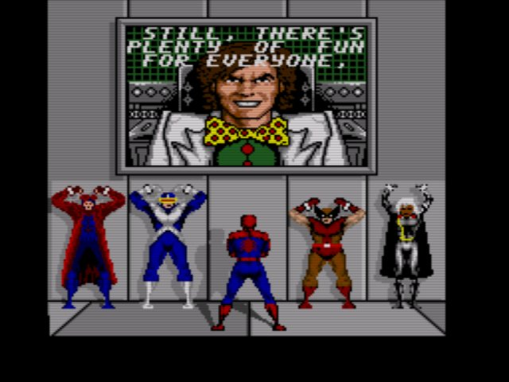

当年，这个游戏我只能打过白给的第一关。第一关通过后出现金刚狼、镭射眼、暴风女和牌皇四个X战警，加上蜘蛛侠自己，每个角色有两个特色关卡。这些关各有各的难，我一关都过不去！最好成绩是蜘蛛侠和金刚狼的关卡能见到BOSS。两手生疼原地踏步的滋味可不好受。
下面备述一下各关难在哪里。

首先还是得说说起始关，它一点儿也不难，却非常单调无聊。必须控制蜘蛛侠按顺序吃掉地图上的N个道具，完全没有捷径可走。并且这个游戏的片头介绍还特别长，也就是说在后面的关死光以后，必须从头忍受一个无聊的片头和单调冗长的第一关才能回到正题，背好的版子早就忘了大半，还谈什么过关呢！
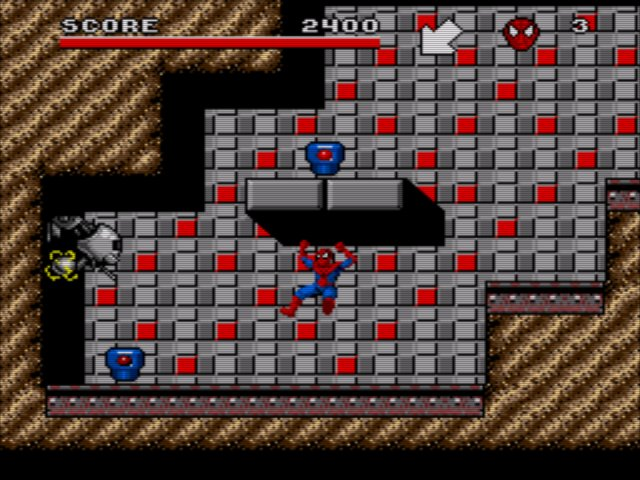

蜘蛛侠的两关难点在于地形复杂。可能是为了突出蜘蛛侠的飞檐走壁能力吧，很多地方需要控制小蜘蛛利用蛛丝荡过去，或者需要忍龙式的爬墙反跳。几个地方设计得咫尺天涯，明明不远却在若干次尝试后发现只能从上方或下方绕过去。蜘蛛侠关卡的背景还特别花，地图也大，对于背版来说特别不友好。
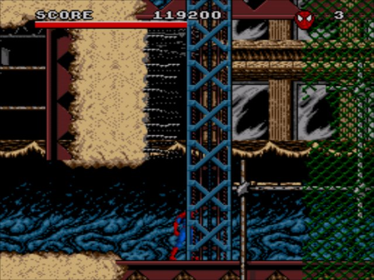

蜘蛛侠第二卡的BOSS是毒液和犀牛。毒液可以被堵角里实施惨案，犀牛行动单调，利用荡蛛丝踢能磨死。当年根本走不到这里。
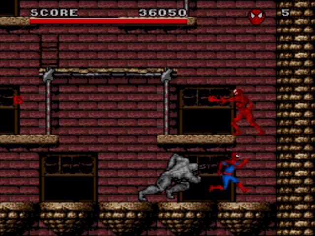

金刚狼的第一关是个普通的动作关卡，大部分时间花在找路和对付杂兵身上。这个游戏的所有杂兵都挺肉的，需要多磨几下才会死。这关里有挺多需要复杂操作才能躲过的机关，跟敌人配合，看着就忍不住想卖血过，但是血这个东西，卖着卖着就空了啊。金刚狼在操作上也有个槽点，就是他那个爪子啊，默认是不伸出来的，按↑+A会切换有爪/无爪状态。有爪的情况下打人特别狠，有些墙也需要用爪子给挠开。岁数大了手不稳，挠着挠着墙爪子忽然收回去了，就很扫兴。金刚狼场景的背景也花得厉害，看着都头疼。
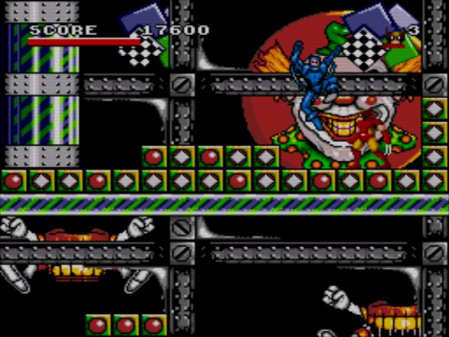

金刚狼的第二关是非常讨厌强制逃跑游戏。追兵是著名反派红坦克。之前的20年都以为是简单的逃跑，这次好不容易跑到头没路了，还是被一头撞死。只得上网去找录像，竟然要一边跑一边把路上悬着的各种铁块挠下来砸红坦克的脑袋，并且要尽量利用路上的地雷和敌人小兵扔出的炸弹，最后的悬崖边上还要回头捅几下，把红坦克捅死。关键红坦克又没有血条，不说谁能知道需要这么玩啊！“跑”跟“打一下就跑”可是两种完全不同的游戏。
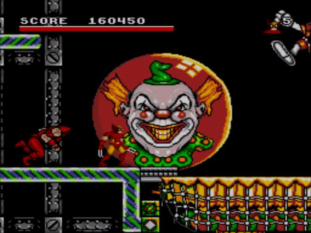

镭射眼的两关可能是最简单的，地图虽然很大，但背景简单很多，有利于找路。这两关的难点是轨道上有一碰就死的敌人，以及轨道跟普通路面的识别不明显，肉身上轨道也是即死。两关末尾都要打哨兵，最后还要打一只巨大的机械哨兵。镭射眼的操作也别扭，按方向键下他就会蹲下，蹲下之后就不能移动了，所以误操作的时候经常把自己陷入想跑跑不了的境地。
但是镭射眼的造型和动作实在太猥琐了。
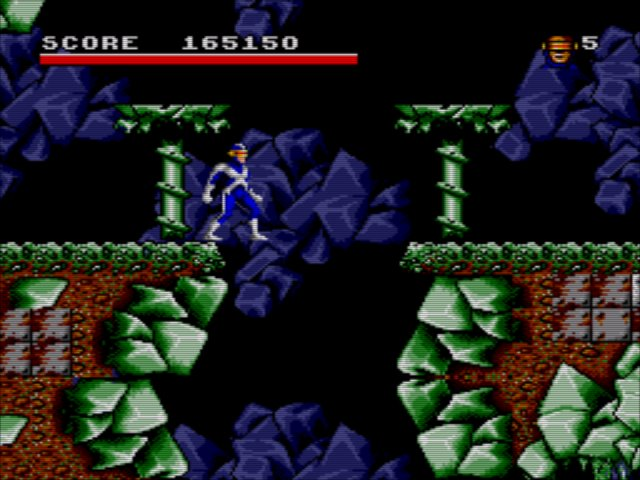
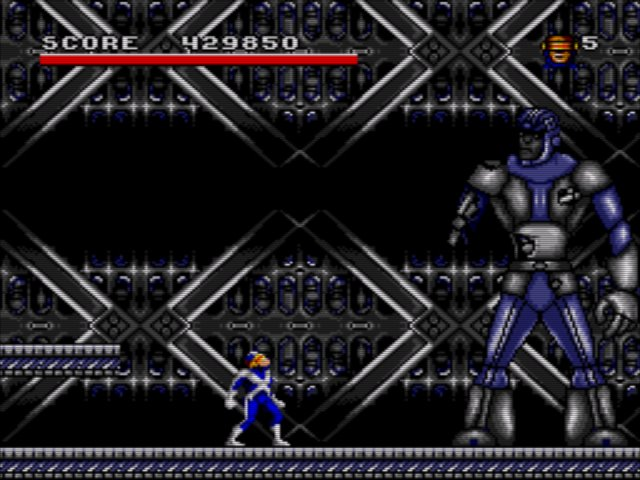

暴风女的关卡跟之前说过的[《激龟忍者传》](https://pewae.com/2006/07/teenage-mutant-ninja-turtles.html)的水下关很像，恶心程度还要更甚。至少人家小乌龟在水下是不用考虑换气问题的，而暴风女则需要时刻计算好剩余的气量，及时回到水面上或者找到贝壳呼吸回气。操作不便的同时，这关的美工简直是屎，子弹和食人鱼的颜色跟背景非常像，老眼昏花的，看到就已经来不及了。
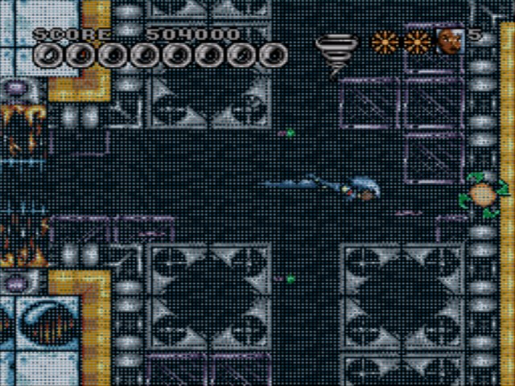
关底倒是挺简单的，把各个方向的机关打碎即可，如果不考虑换气的话。
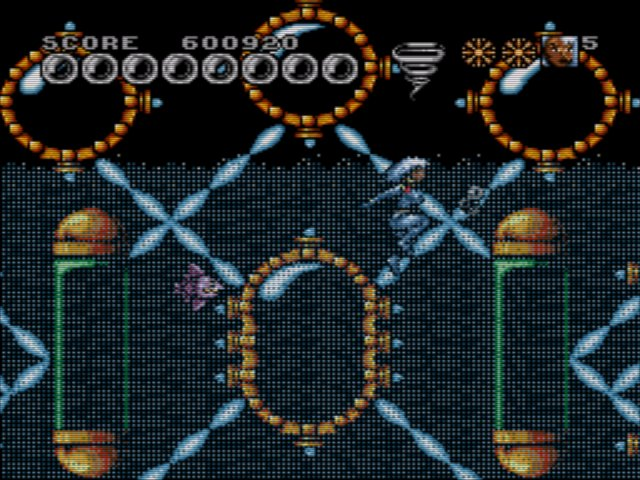

牌皇关是噩梦级别的难度。首先，这是前有追兵后有堵截的强制卷轴关卡，第一关向右，第二关向上，对跑位的要求非常高。
其次是牌皇的攻击范围超级小，有两个砖块拦路的时候，一张牌只能打碎一块砖，另一块必须移动一小步才能打碎。这一小步经常卡不准，再试两次基本就要被卡死了，容错率特别低。
第三是，有走不通的死路存在，实在是恶意满满。
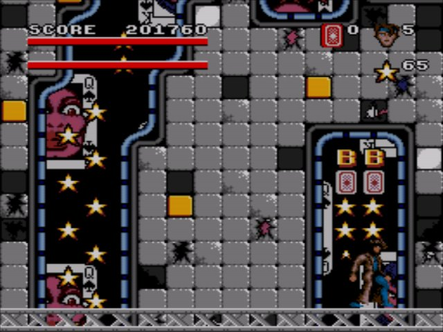
年轻那会儿因为牌皇比另外四位少见，故而青眼有加，投入了不少精力来打，也因此死得最惨。换现在，整个卡我直接就给撇了，玩了我的我不玩。
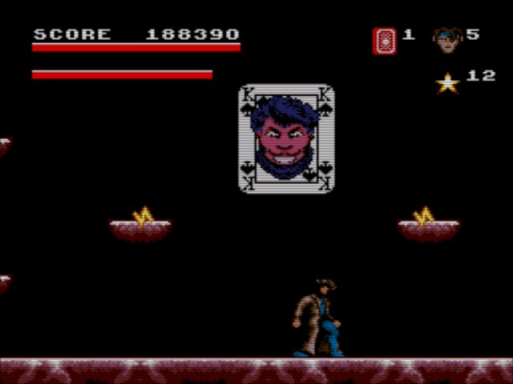
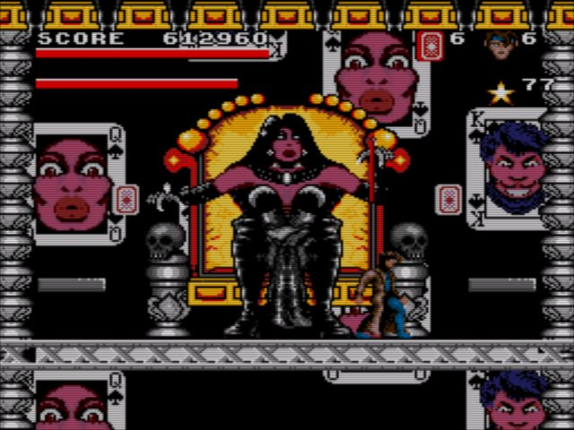

每个角色的两个专属关卡通过后，是5个人分别的脱出剧情，这部分就简单了不少。尤其暴风女在陆地上的操作性非常的好，蹦一下嗷嗷高，咋就给安排成水鬼了呢？漫威除了海王就没有会水的了，还是没版权？
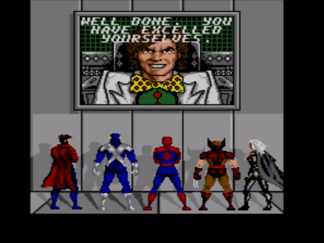

最终BOSS，由蜘蛛侠主攻，其余四位站在两侧撇道具。BOSS有两种形态，第一种机器人形态会被越打越小，第二种人形状态会分身。
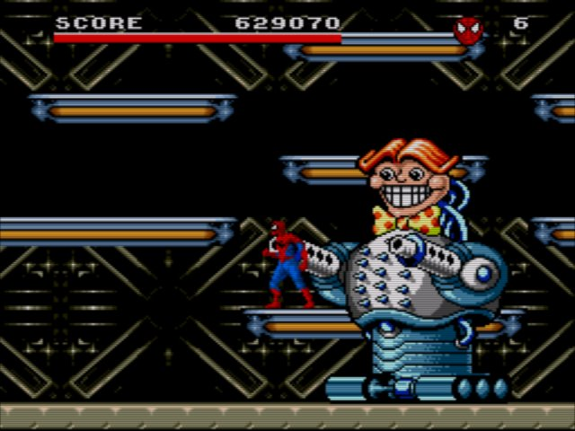
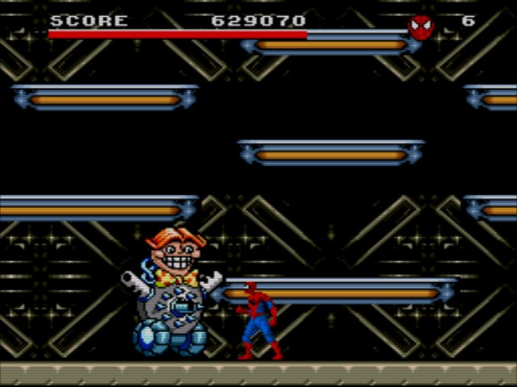
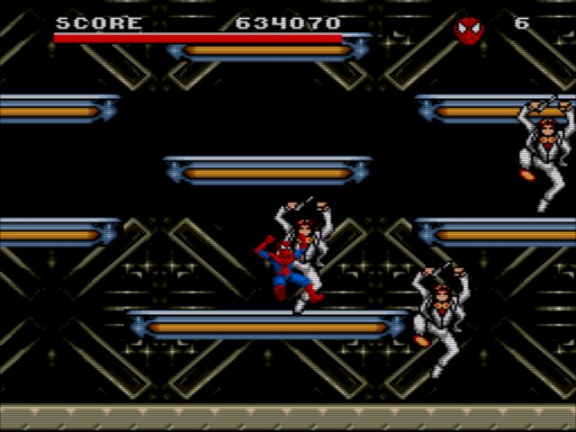

通关是俗套的反派留了个大烟花。
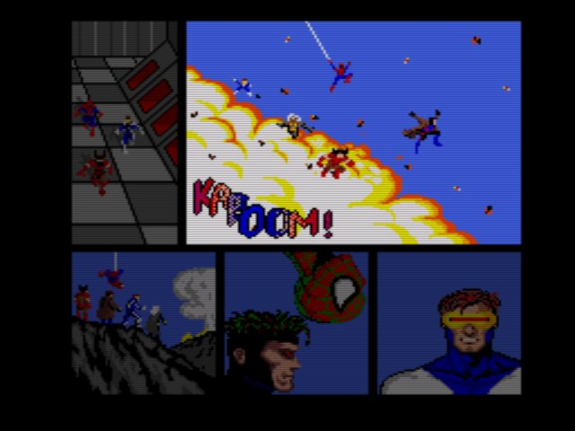