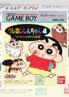

[蜡笔小新4：我的恶作剧大变身](https://pewae.com/gaan/aHR0cHM6Ly93d3cuZG91YmFuLmNvbS9nYW1lLzM0ODE5NzYzLw==)

原名：クレヨンしんちゃん4 オラのいたずら大変身机种：GB厂商：万代类别：ACT发行年月：1994-08耗时：20

这么多年了，终于轮到万代出场了。动漫有关题材的游戏，十之七八会跟BANDAI产生交集。出来这么晚只能说在电视游戏上我对改编题材兴趣不大。而掌机则不同。
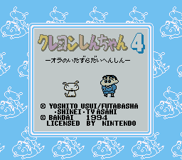
蜡笔小新的游戏，各个平台都有，动作游戏占了绝大多数。总体水平还都不错。这个题材最大的特点是轻松。
当年玩GB砖头机实机的时候，我最喜欢用这款游戏来放松——难度低，流程短，趣味性高。十几分钟打通关正好给脑子充电。
蜡笔小新这部作品，最早看的是漫画，可画风属实不喜欢，觉得构图太脏。但这款游戏扭转了我的印象，在实机上这个游戏把GB有限的几层卷轴表现得淋漓尽致，非常非常漂亮。
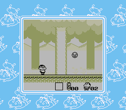

这一部的故事是说——呃——小新的小伙伴都被不良少年抓走了，小新出马拯救。
所谓的大变身，就是三种动物——狐狸鸡和虫子。
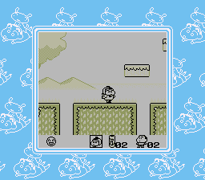
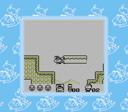
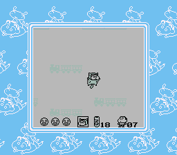

当年还不知道小白。这里小白是中继站，如果挂掉了可以从小白的位置出发。
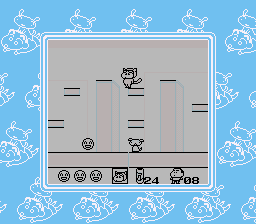

游戏里能够捡到小太阳，被碰一下可以扣一个小太阳而不损命。小太阳带过关的话可以当成游戏币，玩迷你游戏。第一个射击游戏，过关能得半条命；第二个抓虫子，过关能抽一个变身，用处不大；第三个是滑滑梯，直接奖命，但难度太高，对GB的按键压力识别要求特别高。
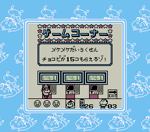
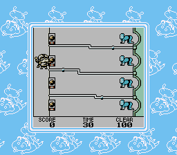
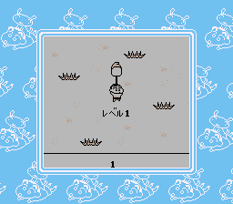
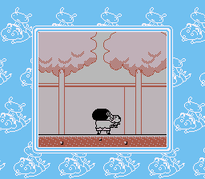

最后的BOSS。轻松得不要不要的。
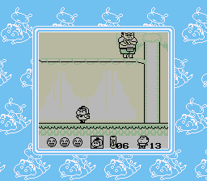

最后，当然是都救出来了……
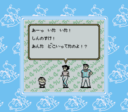
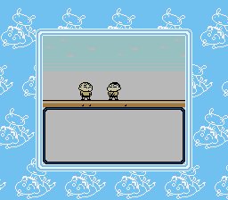
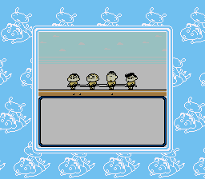