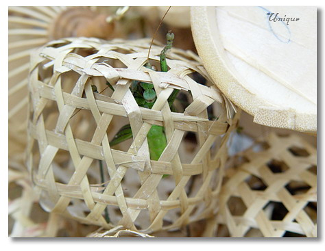

说，有起错的名字，没有起错的外号。
俺想补充的是，自己起的不算。
姓李的往往自号李子，姓唐的往往自称糖糖，但总归没那么普遍，因为自己给自己起外号这事儿属实没太大意思，也没太多人会按官方指定的外号去喊一个人。
但姓郭的先生小姐们却是例外，他们都喜欢让别人叫他蝈蝈。
如果叫李子的先生长得不发紫或者叫糖糖的小姐不苟言笑，那他们的自号也就瞎了，没人会用。
蝈蝈则不然。姓郭的可不一定聒噪，更不一定皮肤发绿。只是蝈蝈这俩字叫起来顺口罢了。

其实是俺小的时候是一直不知道蝈蝈究竟是一种怎样的虫的。直到小学高年级左右了吧，忽然在市场上看到有卖乖乖的，却又不敢确定，上去问被老板告知卖的是蝈蝈。买了一只回家打开一看，才知道原来乖乖就是蝈蝈，蝈蝈就是乖乖。
乖乖好抓，这东西肚子大行动缓慢，几乎不费什么力气就能抓到。可抓是抓，抓到的却不好玩——很奇怪，能抓到的母乖乖居多，而母的是不会叫的，只能拿去喂蚂蚁玩。
买来的乖乖的一生实在是太凄惨了——从娘胎里出来，就先淘汰掉所有的女同胞，然后就一天天吃饲料在笼子里长大。直到有一天成熟了会叫唤了，就被分派到单间的笼子里（蜗居这东西在我们这边传统的称呼就是乖乖笼子），得不到跟母乖乖交配的机会。如果被人买回家就更惨，连饲料都吃不上，每天吃的食物就只是辣椒，越吃越叫唤，叫死拉倒。

所以，总觉得这种动物是不吉的。虽然据说在某些地方因为发音跟官儿官儿像而寓意吉祥，可是官儿再大，也得有命来当啊！！
可偏偏认识的几位郭同学，都喜欢别人叫它蝈蝈。

第一只，是同学。小学同学，女生，白，大眼睛，羊角辫子，文委，会弹琴。印象深刻不是因为人家长得好看，而是小学二年级过新年的时候因为收了她一张贺卡被俺爹俺娘好一顿盘问……那时候俺也倔，坚持认为人家对俺青眼有加死活不招供。不了了之之后若干个月，才知道人家给每个班干部都发了张贺卡……其实俺爹娘也一直惦记着人家，大学毕业之后，俺娘就曾装作不经意地问：“你跟蝈蝈还有联系吗？”…………

第二只，也是同学。也是小学同学，女生，黑，大眼睛，蘑菇头，同桌。话说她是俺小学转学之后的第三任同桌，只坐了几天。因为在那几天里，她天天中午带饭是虾仁馅饺子。还总是热情洋溢地邀请我一起就餐。可哥哥我吃虾过敏啊，闻到味道就想吐。也就是说，俩人坐一起，她刚打开饭盒盖，我就在一边做干呕状——搁谁也受不了啊。所以她哭着跟老师提出换座位之后，直到小学毕业也没讲过几句话。

第三只，还是同学。高中同学，大学也在沈阳念，男生。男生就不形容相貌了。高中时期，就酷爱踢足球，边锋/边前卫。后来他在东北大学，差点混进东大足球校队。后来自己放弃了。问之，答曰：“你知道吗？李英明是我们足球老师。丫在校队选拔赛的时候亲自上场吹哨，跑得比前锋都快，越位吹得老准了。就这样的到假A还总犯错误，这不明摆了黑哨么？我可不在黑哨手底下踢球。”

第四只，我认识它它不认识我。就是现在在辽台“说天下”的那只了。大学时期，她还在电台，貌似跟辽大的什么剧社有合作，所以迎新晚会啊十大歌手啊之类的都找她来主持。迎新晚会回来，上铺老六就老兴奋了：“蝈蝈长得太漂亮了，那身材，那嗓子……”从此蝈蝈在电台电视台的节目他只要有时间期期不落。直到有一天，老六从外面遛回来之后没有像往常一样打开~~电梯~~收音机。俺就奇怪地问：“咋不听了？”他说：“刚才在学校里看见蝈蝈本人了，那脸，太长了！！”

请听题：昨天晚上做梦，我梦到了一起吃饭的是哪一只呢？
