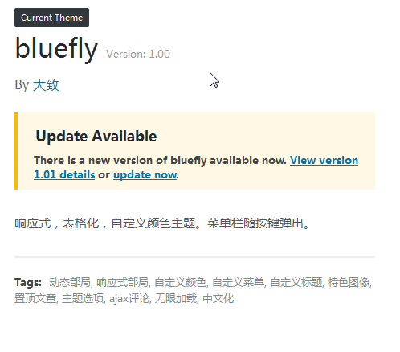

日前见懿古今兄分享了他的主题增加自动更新的办法。但他的主题是放在自己空间上的，自动更新这回事儿对主题的使用者有意义，对主题的创作者本身却没卵用。每次手动修改服务器的版本文件，手动打包上传实在是太专门利人毫不利己了，这不符合我的审美。但如果能为存放在GitHub上的代码增加个自动升级可以保证本地调试代码、Git代码以及服务器上使用的代码一致。没错，大多数时候我连上传文件到服务器这事儿都懒得动手。
于是顺藤摸瓜搜了下存放在GitHub上的代码是不是有什么自动升级的手段。还真被我找到了。

使用方法还蛮简单的。
**1.[下载GitHub Updater插件](https://pewae.com/gaan/aHR0cHM6Ly9naXRodWIuY29tL2FmcmFnZW4vZ2l0aHViLXVwZGF0ZXI=)，上传安装。**

该插件有瑕疵。第一是不在WP的官方插件上；第二是功能过于强大，80%的机能都用不到。
我知道很多人喜欢“免插件”，但这个插件还挺有意义的——有好多个人开发者不愿意忍受WP官方对主题和插件的严苛审核而把自己的作品挂在GitHub上。对于装了这些主题插件的人来说，GitHub Updater是个福音，当然前提是开发者得支持这个插件。

**2.修改你放在GitHub上的主题/插件。**

主题的话，要在style.css里加上一行：

```
GitHub Theme URI: lifishake/bluefly
```

或者

```
GitHub Theme URI: https://github.com/lifishake/bluefly
```

lifishake是你的用户名，bluefly是你的工程（主题）名。
如果要进行自动更新的分支不是master的话，要另增加一行

```
GitHub Branch:     branchx
```

默认的master就不必了。

插件同理，在插件的同名php描述里增加

```
GitHub Plugin URI: lifishake/apip
```

或者

```
GitHub Plugin URI: https://github.com/lifishake/apip
```

即可。

**3.Release主题或者插件。**
用Git客户端Release一个版本。并给这个版本打一个版本号。当然想让作品正常升级的话，版本号必须是正常增长的。

```
$ git tag v1.0.0
$ git push origin v1.0.0
```

GitHub主页上也可以进行Release操作，不过用Git的人一般都没这么笨的吧。

好了，这样就OK了。以后每次更新完毕就再也不用担心正在使用的版本跟GitHub上的版本不一致了。看看效果，是不是跟真的一样？

总之这个方案的缺点是主题或者插件的用户需要另外装一个插件。反正麻烦的又不是作者自己，对于姜太公钓鱼式的开发者来说，已经是很不错的解决方案了。

哦对了，顺便说一下，我把主题和N合一插件放在GitHub上的原因，只是为了遵守GPL，一点儿没有要技术输出的意思。所以想抄的随便抄，代码对错自己理解，别指望我提供技术支持。