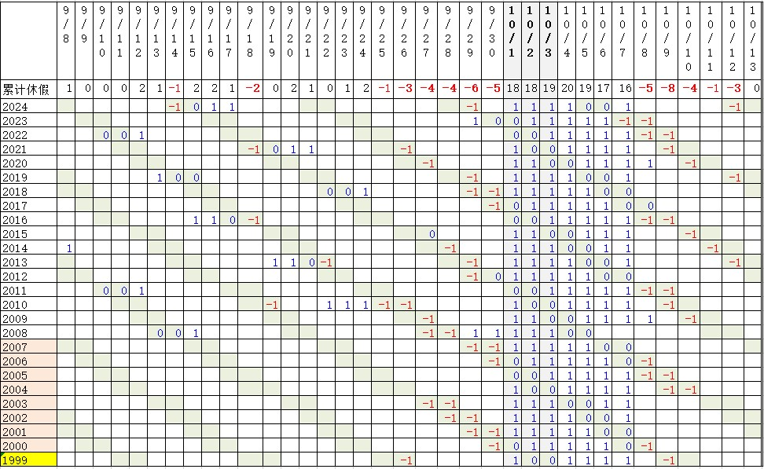
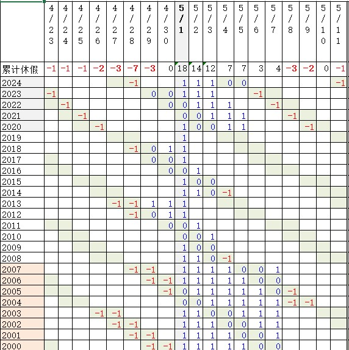
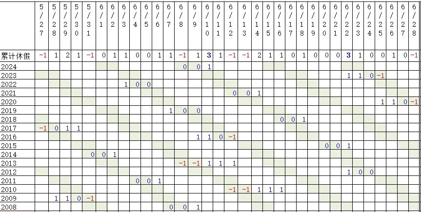
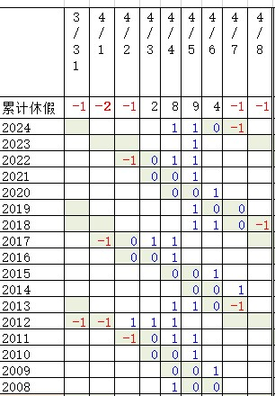
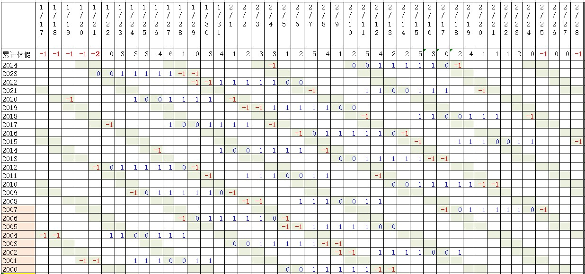
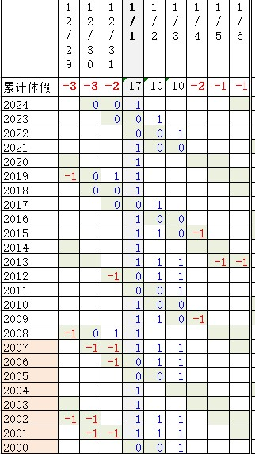

今天是2024年9月28日星期六，是我闺女的生日。今天能休息，好好陪孩子过个生日，我还挺意外的。因为印象中这天哪怕赶上了周六周日，也会被“十一黄金周”的调休政策给调整掉。

我是非常介意生日不放假这个事儿的。你说我过个生日，没生在中秋节、五一、元旦、10月3号这样放假好日子咱就认了，可凭啥明明赶上了周六周日，还非要给我调走啊？
过农历生日确实是个解决方案。但这个年代，农历生日它不好记啊。除了6个长辈和本人，或者生在正月初一七月十五之类的蹊跷日子，根本就不会有第8个人记得你的农历生日好吧？死一个少一个的存在。
倒也是可以请假过生日，可你不能让你的亲朋好友都请假吧。一个人过的生日那还叫过生日吗？

于是乎我生出一个想法：我闺女生日这天，究竟被调休掉多少次呢？我用了几个小时的时间，汇总了自1999年十一以来的所有调休资料，统计出了一份调休日期的分布资料。以前我总是感性地认为我的生日、我闺女的生日，以及后来我老婆的生日总是在调休的问题上吃亏，这下咱手上终于有了证据。
总结下来就是：“天之道，损有余而补不足；人之道，损不足以奉有余。”
规矩是人定的，所以是占便宜者恒占便宜，倒霉者恒倒霉。节前的日期要比节后的更倒霉一些，因为往回补的机会，节后更多。

表拉的有些长，所以得分段说。先从调休的始作俑者，也就是即将开始的“十一黄金周”说起吧。

1999年9月18日，国家发布了《全国年节及纪念日放假办法》，增加每年公众节假日到10天。1999年的10月1日到7日也就成了中国历史上第一个“黄金周”假期。2007年国家又调整颁布了《全国年节及纪念日放假办法》，取消了“五一黄金周”，把五一的公众假期降为1天，并增设了清明端午中秋3天传统节日为公众假期。因为中秋往往跟国庆临近，所以我统计的时候把中秋和国庆放在一起。表里的数字意思很简单：当天是周末，没放假被调了，吃了亏，就记作-1；当天是周末，放假了，不亏不赚，记作0；当天不是周末，天降横假，占了便宜，记作1。最上面一排就是若干年累积下来，这一天的额外休假数，正数表示休的多，负数表示干活多。

从图上可见，最大的大冤种就是10月9日。自从1999年的26年来，10月9日有4次周六4次周日，8次休息都毫无意外被调休掉了。十一调休有三种薅羊毛方式：从前、从后、从两头。但10月9日这一天不论是哪种方式、不论是周六还是周日，都难逃被调整掉的命运。
只要现行的调休制度不改变，那么能拯救10月9日的就只有中秋节了。遗憾的是，我把万年历一直翻到了2124年，中秋节最远在2071和2090年落在10月8日。**10月9日不放假，100年不变。**我有一个叫[宝宝](https://pewae.com/2010/11/baobao.html)的朋友，正好是10月9日生日。从学生时代结束以后，就没在正日子给他庆过生。

10月8号被调整没的次数也很多。不过8号有个优势，就是如果中秋节落在十一期间的话，8号这一天往往能被补回来。所以综合起来，10月8日只被调过5次。
9月29、9月30这两天也被坑得很惨。其中9月29日是全表第三号大冤种。而且十一前调休的规则很迷，似乎是遇到中秋还有可能给补回来。这里我就要吐槽一下10月4567这几天了。123是法定假期没啥说的，你们4个凭啥得吃得喝啊？十一又不是春节必须从初一开始，怎么就不能把你们给换掉，往前连形成长假呢？实际上只有2023年的10月7日被扣了一天，补在9月29日上，其余时间这四天的地位稳如老狗，跟法定节日一个待遇。最典型是在2015年，9月27日是中秋节，10月4日是周日。只要把10月4日给调到前面，就能形成9月26日到10月3日的连休。但人家偏不！愣是把中秋这一天假补到了4567的某天身上。即将到来的假期也同样，明明可以调更近的10月5日、6日到前面的9月30日和10月4日身上形成连休，偏不，偏要去动人家离老远的10月12日！
国庆三天永不倒数，爱咋咋地！

我闺女的9月28日，大部分时候，逢周日会被调掉，逢周六则会正常休息。因为在节前第四天，所以万万没有补回来的可能。未来几年还有逢周日但又是中秋节的情况出现，总之还是亏，还是有理由骂调休的。
一个有意思的意外发现是中秋节假期的出现还造就了一个小倒霉蛋，就是918国耻日。被调休两次，目前还没有一次被补回来。

再说说曾经的五一黄金周。

五一调休经历了三个阶段。
2000-2007年，5月1日到5月3日是法定节假日，调休以后形成7天黄金周。
2008年-2019年，节假日仅存5月1日一天，此阶段会从前后调休1~2天，形成三连休，唯一一次没有调休发生在2019年，5月1日是周三，只在当天休息一天。
2020年到今年的5年，虽然节假日仍旧是1天，却硬要凑成5天的连休。于是五一调休的波及面被扩大，上至4月23日，下至5月11日都被拖下了水。
4月28日是整个统计表里的2号大冤种。除了上面提到的2019年没进行任何调休，正常休了周日以外，无论是在7天时代还是在5天时代都没有一次能躲得过，一共有7次被调走，从来没有被调回来过。只要5天的政策不变，4月28日也永远没有放假的可能。我的另外一个朋友，徐大炮，刚好是4月28日生日，他倒是找我给他过过两次生日，都是下班以后约，喝到第二天一身酒气去上班。
跟10月类似，5月8日和5月9日在五一黄金周时代被薅，到了五一5连休时代又重新被开始薅，也是只有出项没有进项。
节前的4月26~4月29都被调得厉害。好在近几年的五一5连休，并不拘泥于把5月1日放到假期的开始，所以4月29、4月30两天开始见到一丝丝曙光。甚至4月30日还把黄金周时代欠下的账补了回来，变成了0。

中秋、端午、清明是2008年以后才有的法定假日。
端午节调休分布在5月27日到6月28日的区间范围内。因为历史没那么长，调休也仅限在3天以内，所以大多数日期都在一两天，可以接受的范围内。

端午节造就了两个小幸运儿。6月10日和6月22日。已经分别多休了3天假。

我老婆生日是4月2日，跟清明节调休产生了交集。

清明节落在4月4日的情况还是有的，所以4月2日被调走两天的同时，还被调回来过一天。不过总体来讲还是4月5日过清明的时候多。4月2日也是吃亏的时候更多。
更吃亏的是4月1日，目前已经被扣过两次。而且这种节前被扣的，也是万万没有补回来的可能。

接下来是春节。

作为历史悠久传统节日，在公历的调休表现上符合正态分布，1月末2月初的日子占便宜，靠两头的吃亏。1月17日~1月21日，2月25日~2月28日这些日期凡是被调了的，断无补回来的可能。
比较有趣的是1月29日和2月17日，被调走和调回的次数都很多，总计为0，仿佛标志着春节假期最常落在这两个日期中间。

最后是跟我本人相关的元旦假期。表里的12月指的当然是前一年的12月。

全年10天公共假期的时代，上头可能觉得美好的一年要从放假开始，非要把1月1日作为休假的开头，后面连着休2号和3号，我的12月30日也因此被调走过好几次。但从2008年以后，不再拘泥于把1月1日作为假期的开头，12月30日就再没被打过主意。赶上周六周日就能休，赶不上也绝对占不到便宜。我的一直以来的耿耿于怀，只是因为之前被欠的太多了。
相邻的12月29日可就惨了，属于逢周六必被调，逢周日看心情被调。即将到来的2025元旦就是周三，12月29日这次能否逃过一劫，让我们拭目以待。

资料来源：
国务院办公厅关于2024年部分节假日安排的通知（https://www.gov.cn/zhengce/content/202310/content_6911527.htm）
国务院办公厅关于2023年部分节假日安排的通知（https://www.gov.cn/gongbao/content/2023/content_5736714.htm）
国务院办公厅关于2022年部分节假日安排的通知（https://www.gov.cn/gongbao/content/2021/content_5651728.htm）
国务院办公厅关于2021年部分节假日安排的通知（https://www.gov.cn/gongbao/content/2020/content_5567750.htm）
国务院办公厅关于2020年部分节假日安排的通知（https://www.gov.cn/gongbao/content/2019/content_5459138.htm）
国务院办公厅关于2019年部分节假日安排的通知（https://www.gov.cn/gongbao/content/2018/content_5350046.htm）
国务院办公厅关于2018年部分节假日安排的通知（https://www.gov.cn/gongbao/content/2017/content_5248221.htm）
国务院办公厅关于2017年部分节假日安排的通知（https://www.gov.cn/gongbao/content/2016/content_5148793.htm）
国务院办公厅关于2016年部分节假日安排的通知（https://www.gov.cn/gongbao/content/2016/content_2979719.htm）
国务院办公厅关于2015年部分节假日安排的通知（https://www.gov.cn/gongbao/content/2015/content_2799019.htm）
国务院办公厅关于2014年部分节假日安排的通知（https://www.gov.cn/gongbao/content/2014/content_2561299.htm）
国务院办公厅关于2013年部分节假日安排的通知（https://www.gov.cn/gongbao/content/2012/content_2292057.htm）
国务院办公厅关于2012年部分节假日安排的通知（https://www.gov.cn/gongbao/content/2011/content_2020918.htm）
国务院办公厅关于2011年部分节假日安排的通知（https://www.gov.cn/gongbao/content/2010/content_1765282.htm）
国务院办公厅关于2010年部分节假日安排的通知（https://www.gov.cn/gongbao/content/2009/content_1487011.htm）
国务院办公厅关于2009年部分节假日安排的通知（https://www.gov.cn/gongbao/content/2008/content_1175823.htm）
国务院办公厅关于2008年部分节假日安排的通知（https://www.gov.cn/zhengce/content/2008-03/28/content_1645.htm）
国务院办公厅关于2007年部分节假日安排的通知（https://www.gov.cn/zhengce/content/2008-03/28/content_1761.htm）
国务院办公厅就2006年部分节假日安排发出通知（https://www.gov.cn/jrzg/2005-12/22/content_133837.htm）
光明网：国务院办公厅就2005年部分节假日安排发出通知（https://www.gmw.cn/01gmrb/2004-12/21/content_151867.htm）
百度百科：国务院办公厅关于2004年部分节假日安排的通知（https://baike.baidu.com/item/%E5%9B%BD%E5%8A%A1%E9%99%A2%E5%8A%9E%E5%85%AC%E5%8E%85%E5%85%B3%E4%BA%8E2004%E5%B9%B4%E9%83%A8%E5%88%86%E8%8A%82%E5%81%87%E6%97%A5%E5%AE%89%E6%8E%92%E7%9A%84%E9%80%9A%E7%9F%A5/16848331）
百度百科：国务院办公厅关于2003年部分节假日休息安排的通知（https://baike.baidu.com/item/%E5%9B%BD%E5%8A%A1%E9%99%A2%E5%8A%9E%E5%85%AC%E5%8E%85%E5%85%B3%E4%BA%8E2003%E5%B9%B4%E9%83%A8%E5%88%86%E8%8A%82%E5%81%87%E6%97%A5%E4%BC%91%E6%81%AF%E5%AE%89%E6%8E%92%E7%9A%84%E9%80%9A%E7%9F%A5/16848354）
百度百科：国务院办公厅关于2002年部分节假日安排的通知（https://baike.baidu.com/item/%E5%9B%BD%E5%8A%A1%E9%99%A2%E5%8A%9E%E5%85%AC%E5%8E%85%E5%85%B3%E4%BA%8E2002%E5%B9%B4%E9%83%A8%E5%88%86%E8%8A%82%E5%81%87%E6%97%A5%E4%BC%91%E6%81%AF%E5%AE%89%E6%8E%92%E7%9A%84%E9%80%9A%E7%9F%A5/16848453）
律师门户网：国务院办公厅关于2001年春节、“五一”、“十一”放假安排的通知（https://m.055110.com/law/1/28037.html）
百度知道：2000年国家法定节假日（https://zhidao.baidu.com/question/1550908965383733187.html）
哔哩哔哩：1999年放假安排（https://www.bilibili.com/read/cv36542758/）