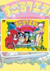

[赌神](https://pewae.com/gaan/aHR0cHM6Ly93d3cuZG91YmFuLmNvbS9nYW1lLzI2MzY2MzAz)

原名：すごろクエスト ダイスの戦士たち / Sugoro Quest:Dice no Senshi Tachi别名：赌神：掷骰战士 / 赌王 / 王者密令机种：FC厂商：TECHNOS类别：RPG发行年月：1991-06耗时：10

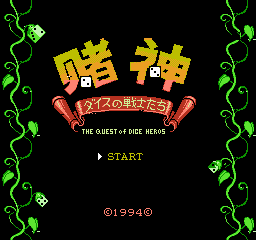
我已经记不太清当年这盘卡是94年底还是95年初买的了。当时正是受了《GAME集中营》的蛊惑，我决定把自己生命中的第一次攒钱买卡奉献给《赌神》。
彼时国家执行”大礼拜”，周六隔周休息。当天是个“小礼拜”的周六，本来全天有课。但临时有事，半天就放了。所以中午放学第一时间就拽着死党宝宝便去了旧货市场。那时旧货市场还在现在奥林匹克广场的位置，大概是在东北角吧，其实是单独的“电子市场”。说来奇怪，新世纪以前瘟都最大的游戏摊位一直在旧货市场里面。
只有一位戴眼镜的大叔的摊位上有这张卡，要价260，讲价讲到220，实在讲不下去了。我身上只带了200块钱，没办法跟宝宝借了20，才把卡拿下。说起这位大叔，我只在他那儿买过这一盘卡。后来在市场货比三家，他总是要幌子要的最多的那个。对于不擅长讲价的我来说，最讨厌这种老板。但其实他这盘卡真没怎么多要我钱。正常上价就很贵，他这盘是从别人手里收的二手，所以要的还算便宜。
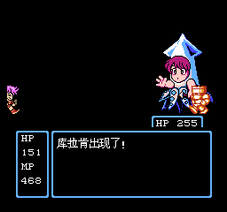
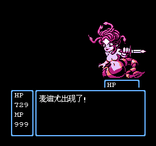

非要记这是哪天的话，翻故纸堆可能真能找到——那天我回家的时候老爹在看“中国乒乓球擂台赛”，当天因为某位老队员退役了，王楠第一次在“中国乒乓球擂台赛”上以擂主身份出战。
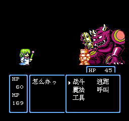

宝宝之前就提出想收藏一套《侠探寒羽良》，我们俩合钱买。这书当时已经7卷出全了，协商的结果是，我买1357，他买246，书放他那一年，一年后完全归我。
这不是欠了他20块钱嘛，协议就自然变成了1234卷都由我来买。每卷5本，每本2块3，所以这卡最终花了我223块大洋。这也是我这辈子买的最贵的一盘游戏卡。
接下来的周一我就把卡带到了学校，继而中午带着跑到宝宝家，玩上20~30分钟。当然大多数时间是他在用手玩，我在用嘴玩。
除了在新华书店站着看人家玩了4个小时的《荆柯新传》和宝宝弄来我们俩只研究过一个下午的《圣火列传》，这个游戏便是我玩RPG的真正启蒙。
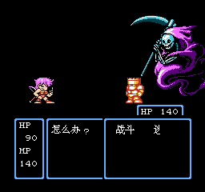

宝宝玩这个游戏顺风顺水的地打了通关。
换我却脸太黑，怎么练级也过不去第二关。没办法接了他一个第五关开始的记录才打通。当时听信了电软攻略，只练了战士。这游戏有个特别坑的设定，第六关打倒2个中BOSS后，第三个会把你当前使用的人物抓走，你必须换个角色打才行。当时战士被抓走真是欲哭无泪啊，本着有女的选女的的原则，用了精灵。偏偏本作的攻击魔法非常不给力，花了好长的时间才把总BOSS磨死。
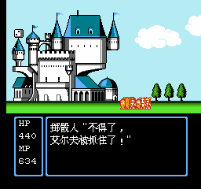

这次重温，找了别家的攻略才知道，最好用的是最后的角色半妖精。三大辅助魔法：提升自己点数+降低对手点数+攻击力翻倍，组合着用简直太爽了。而且地图画面还能用控制骰子点数的魔法控场。
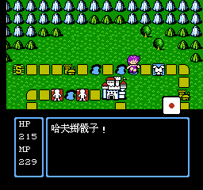

说起“骰子”，不得不说电软找的翻译太学院派了。叫色子有啥不好，害得我们还特意把这个生字抄下来查了字典。这位翻译明显不知道游戏里的专用名词。ファイター、エルフ这些常见的词竟然按照片假名音译成“法伊特”、“艾鲁夫”，レベルアップ翻译成水平上升，哥布林翻译成科普林，真是太有ACG初级阶段的特色了。
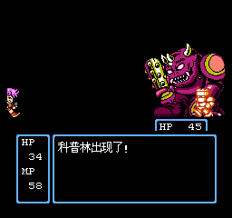
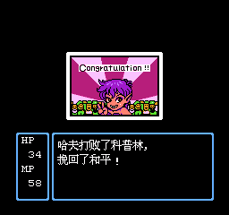

TECHNOS并不是以RPG见长的公司，所以本作也不是传统的RPG游戏。游戏并不能像普通RPG那样能在地图上到处乱走，而是分成了6关，每关在固定的地图上，像飞行棋那样扔色子靠点数行进。《赌神》这个名字翻译的倒是贴切，因为游戏的战斗要靠双方先扔色子决定由谁攻击，由点数差决定攻击倍数。最刺激的就是扔出相同的点数，那样会在第一个色子的基础上扔出第二个，最多还能累积到第三个。如果出现累积色子的情况，最终输掉的一方底层的点数是完全作废的，往往一波流就带走了。
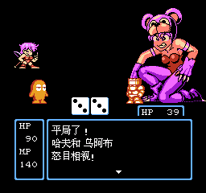

所以这个游戏虽然上手很容易，但过程实在是太看脸了。即使不练级装备不好，只要运气好也能过关。像我这样脸黑的，费劲巴拉在打第一关BOSS前升了2级的，却还是过不了。要不就是打BOSS前没回复够血。要不就是打BOSS时被连续干晕，要不就是召唤出的掷骰人跑路或者自己把自己砸晕。
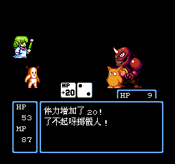

另外一个赌性很强的地方，是可以跟国王玩赌博游戏，赢了以后还能无限加倍。有了模拟器的即时存档功能以后，你懂的……唯一要注意的是金钱有65535的上限，再往上就装不下了。
而本作最后的装备只要有钱随时可以买到，所以用上面的赖招可以在游戏初期建立不小的优势。
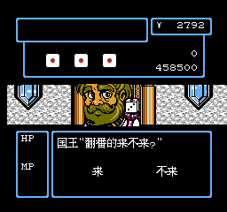

故事方面在早期RPG里算中庸，除了比较折腾人，第三关和第四关的故事还都挺具备早期游戏的小趣味。
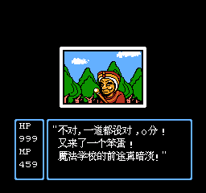

怀疑游戏在地图上省下的容量都花在了人物贴图上。本作的敌人贴图都特别的大，美工也颇具水准。好评。
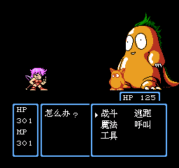

最后一关的BOSS，画风突变，一个比一个硬，不用哈夫的无赖魔法还都挺难打。
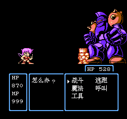
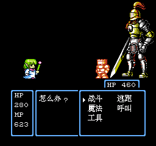
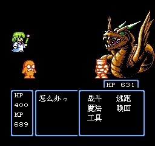

最终BOSS其实没有倒数第三个厉害。
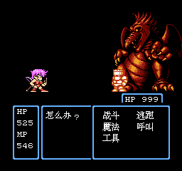

通关！
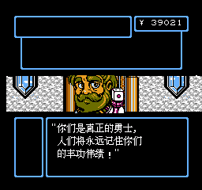
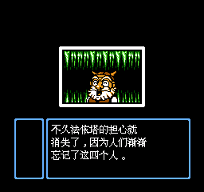
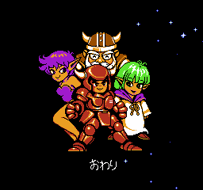