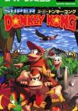

[超级大金刚](https://pewae.com/gaan/aHR0cHM6Ly93d3cuZG91YmFuLmNvbS9nYW1lLzI2MzM5NjQy)

原名：スーパードンキーコング别名：大金刚国度 / Donkey Kong Country / Super Donkey Kong机种：SFC厂商：RARE / 任天堂类别：ACT发行年月：1994-11耗时：7

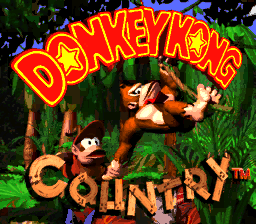

这是款超任历史上销售量排名第二的超级名作。日版名《超级大金刚》，美版名《大金刚国度》。
超任游戏，小时候根本没碰过是常态。
2000年左右的时候瘟都教育台有个电话点播后打游戏的骗钱节目，好像每周会出现一次大金刚。可是那个节目只是换台时路过，并不确信是超级大金刚的哪一作。
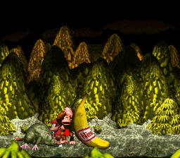

这部作品其实是大金刚系列的成名作。虽然大金刚是红白机的首发作品，但是红白机上的三作都发售得特别早，并没有形成自己的风格。尤其是大金刚3，基本就是个欧版的换皮的骗钱游戏。可以说这个IP在很长一段时间里只是任天堂的板凳选手。直到1994年，任天堂相中了RARE的3D图形技术，收购了RARE49%的股份，双方展开合作。任天堂要求RARE从角色库中选一个出来做一款3D动作游戏，驴子刚就此被选中，从此成就一番合作的佳话。
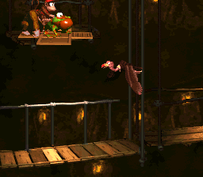

RARE的技术放在1994年的超任上真的是天花板级别。画面精美，动作流畅，对卷轴的使用可以算天花板级别。最喜欢本作的恰到好处的3D效果。其实只是3D贴图了，我讨厌的其实是主视角3D，如此视角完全可以接受。
雪地一关把卷轴效果玩得太溜都有些看不清地形了。
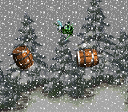

大卫·怀斯的音乐悠扬柔美，两首主题音乐都有很多拥趸。只是最常出现的那首节奏太柔和了，跟火爆的动作游戏有些不搭。
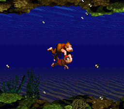

在我看来，这款游戏的一大优点是“恰到好处的难”。以跳为主的游戏嘛，掉坑就死是基本设定。也没什么血量的设定，就一个驴子刚一个迪迪刚，被敌人碰一些就要换人，算只有两滴血。结合什么传送带什么升降台什么绳子什么抹黑什么雪地之类的地形杀，手法不纯熟很容易死掉。但是又不会有那种极端考验手速和手法的操作，多试几次总能过去。而且命还来得容易，挑战的成就感来之不易而又唾手可得，拿捏得很好。
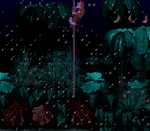

本作有非常多的隐藏要素，甚至这也成为了大金刚系列后续作品的一个传统。每个关卡中都会出现三五处隐藏地形，能够获得香蕉、命活着动物伙伴标志的奖励。但是100个香蕉奖一条命，每收集3个动物伙伴进入固定奖励场景还是捡香蕉也就还是相当于命。说来说去只有命一种奖励，也会造成审美疲劳——一方面想探索每一关的隐藏内容，另一方面又觉得我都99条命了还有什么可研究的。
可以说超任上的《超级马里奥世界》和《超级大金刚》这两部作品奠定了之后任天堂所有明星动作游戏的内核——无论是靠变身的卡比和瓦里奥，半变身的马里奥还是不能变身的大金刚——都成了探索隐藏要素为主，通关为辐的游戏。
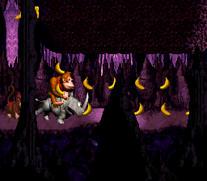

关卡太过花样繁多，相比之下每个世界的BOSS战就有些不给力。怪鸟，马蜂，油罐，土拨鼠。感觉你还没出力，它就倒下了。怪鸟还很敷衍地换个颜色又出场一次。
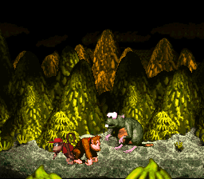
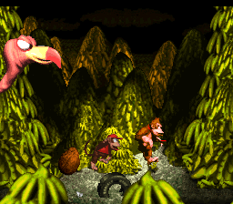
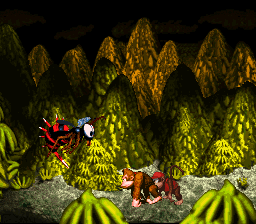
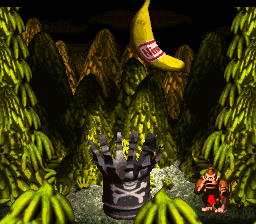
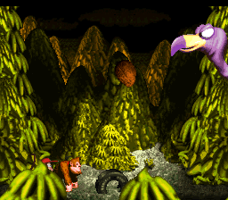

最终BOSS更是毫无创意，跟库巴七人众里的某位一样，整个帽子脱下来戴上去的，非常无聊。
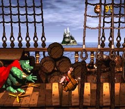
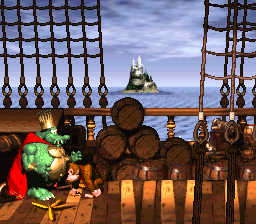

通关。出来跟你唠叨的老猩猩说你还有很多隐藏东西没找到，其实就是世界隐藏内容探索没到100%。懒得再整了。
对了，这只老猩猩就是红白机一代被马里奥关起来的CrankyKong，而主角就是红白机二代的小猩猩，也就是DonkeyKong，也就是大金刚，也就是驴子刚，也就是森喜刚……
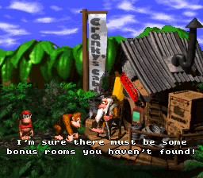
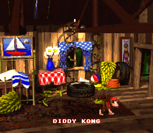
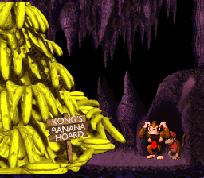

反正我是绝对不会承认森喜刚这个糟烂名字的。