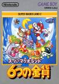

[超级马里奥大陆2：6枚金币](https://pewae.com/gaan/aHR0cHM6Ly93d3cuZG91YmFuLmNvbS9nYW1lLzI2MzQ3MTk5)

原名：スーパーマリオランド2 6つの金貨 / Super Mario Land 2: 6 Golden Coins机种：GB厂商：任天堂类别：ACT发行年月：1992-11耗时：3

上次@老秦问我截图能不能大点儿，便换了个能实现所见即所截多机种模拟器。FC、MD都试验过了，GB亟需一枚游戏练手，就想到了这部作品。
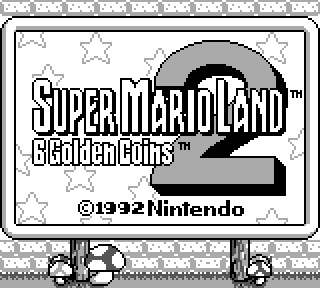

这个游戏在GB漫长的职业生涯中，算非常不错的作品。大多数榜单中都会把它排在GB黑白游戏的前十之列。
而买合卡的时候，偶尔也看到过名字，却总是因为别的卡带中有更吸引我的元素而失之交臂。
说起来真是羞愧，虽然我曾经拥有过2台GB砖头机和1台GBC，却从来未曾玩过一盘正版GB卡。
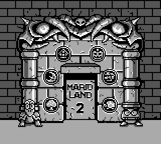

上手之后发现，不愧是续作《[瓦里奥大陆](https://pewae.com/2018/05/super-mario-land-3-wario-land.html)》的前作，系统、操作、手感方面都比较像，但都是全面弱化了的。换句话说，《瓦里奥大陆》改掉了本作的所有缺点。
本作发售的时间点紧随正统马里奥系列历史上最重要的两部转型作品《超级玛丽3》和《超级马里奥大陆》之后，正是开疆辟土巩固新玩法的重要阶段。因此，地图选关、大地图小地图结合、隐藏关卡等“大陆”概念，在这部作品继续巩固并发扬光大 。
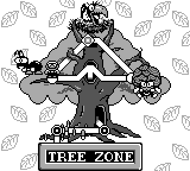

不同与GB版一代，这部作品把玩家操纵的马里奥搞得个头很大，敌人的个头也不小，玩起来非常过瘾。但一个隐患随之而来：关卡中的“地形杀”设计还跟以往的马里奥游戏差不多，可设计者可能是忽略了GB的屏幕比例是接近正方形的8：7，跟TV的4：3比起来更接近正方形而宽度不足，而人物变大之后视野变得更小，很多地形第一次过的时候根本看不见而导致丧命。最典型就是月球大关里有一小关，是类似《气球大战》中无尽模式的强制卷轴+躲星星。如果拉开架势的话，难度根本不高，但由于视野受限制，如果选位不对，障碍出来的时候根本没法躲，这就令人没那么愉快了。
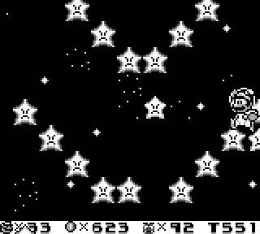

但窃以为本作最有特点的恰恰也是“月球”世界。马里奥在这一大世界中的跳跃能力得到强化。跳跃着“悠着”前进的感觉，真有那么点阿姆斯特朗月球步的意思。
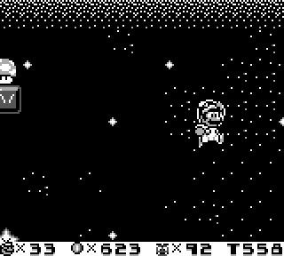

系统上，马里奥系列从本作开始告别了“分数”，取而代之的是金币。但是本作的金币并没有什么用处，而且上限只到999，随便捡捡就达到了。钱没有意义，命有意义但又用不完，隐藏要素要么奖命要么奖钱，于是乎早早便失去了探索隐藏道具的兴趣，开始什么都不要的“逃课”玩法。想必这也是后面瓦里奥设计成赚钱盖房子的事由。
同时，隐藏关是有的，但没有任何鼓励玩家探索隐藏关的要素，哪怕像三代那样所有隐藏关找到后存档记录开始放光也好哇！
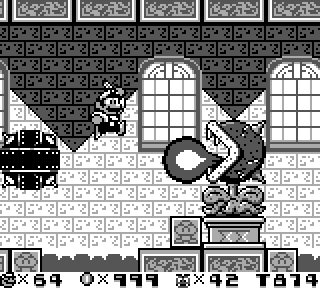

本作马里奥除了火球变身和普通变大以外，还有一种能够滑行的“兔子头”形态。这种形态跟玛丽3的松鼠有两个最大的不同：一是除了踩人顶人没有其他攻击手段，二是如果按键速度足够快，那么就会变滑行效果为飞行效果，非常强大。马里奥正传全系列我并没有玩过很多作，这个设计是仅见的。
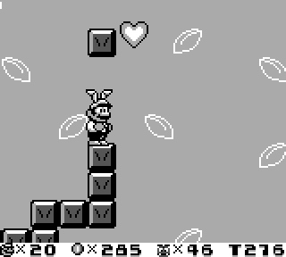

6个普通BOSS，都太简单了，没有任何一个能够留下深刻印象。
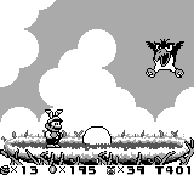
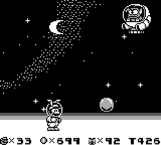
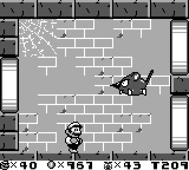
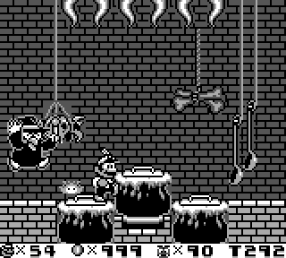
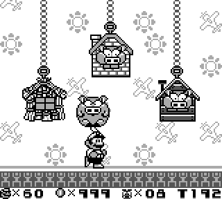
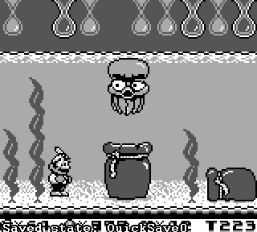

其实这部作品最伟大之处在于为任天堂帝国又提供了一个角色IP。
Wario作为最终BOSS初登场，有三次变身，恰好跟本作中马里奥的三个变身一致，可以看作是马里奥的“贰心”。
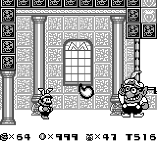
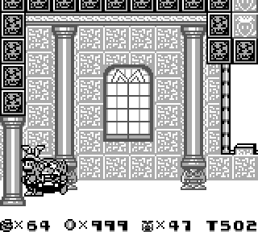

第一次出场的瓦里奥长得真心丑。不过大地图上的马里奥跟瓦里奥其实一模一样。
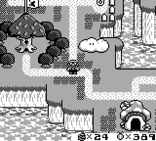

通关！马里奥夺（qiang）回（zhan）了瓦里奥的城堡。
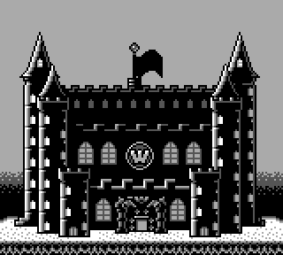
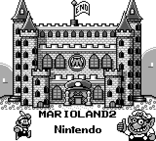