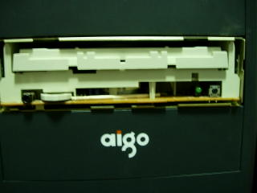

我不讨厌下雨。但是我讨厌在我需要办正经事的时候下雨。尤其是在这个说热不热说冷不冷稍微有点冷的季节。

昨天跟华城电脑的客服联系好了，今天来给我处理光驱which has been broken for 2 weeks 的问题。

2月20号，在连续刻坏了第7张盘的时候，我才认识到这烂货罢工了。
后悔啊，当初不该听信导购小姐的谗言，不该贪当天特价的便宜，不该违反自己的原则买回了LG这种韩国货。

华城的人在10点钟雨下的最大的时候到了。雨中送伞啊，不过是我给他送。
哥们倒挺痛快，听说了我已经采用替换法确认刻录机坏掉了的以后，直接开了单字，带着返厂去了。他很有职业水准，竟然没忘记把伞还给我。

到了下午，准备整理软件出门之前，忽然发现老康宝也当了，我使出一阳指弹指神通葵花点穴手射杀咚咚波指枪小兔子乖乖法芝麻开门术均不能开启它的门户。

怒了！

出去骗吃了3颗草莓1个橘子骗喝了200ml冰咖啡搭进去20块钱打车费以后，我作出了决定，拆之。
作为一个不怎么诚实但向往以诚实为原则的26周岁不到的有为青年，不管愿不愿意承认我都必须承认，之前我确实只有两次浅尝辄止的拆光驱经验。就这么对伴随了我3年多的刻录机动手，吾心还真有那么点戚戚然。

不过不要紧，手头上还有一个3P他们当年用过的不知道几手货。拆开研究了1个多小时，并确信能完好的将之重新组装后，开始对小康动手。
其实真的找不到问题所在，但本着拆一遍再重新装说不定就好了的万试万灵推理法，还是把小康肢解后又重新装了一遍。

惴惴地安了回去，果然没反应，甚至还不如装之前。
丰富的修机经验告诉我，没插电。
所幸的是，插了电跟没插一样，仍旧天衣无缝。

再拆再装，再无效。
用万能曲别针法，门开了，但曲别针掉了进去。
三拆。
三装，三无效。

曲别针成本还是太高，换牙签的话需要把洞开大。
于是第四次装的时候，我决定删除前面板和托盘版这两个组件。

饿地神啊，我确定一定以及肯定，你是存在的。
