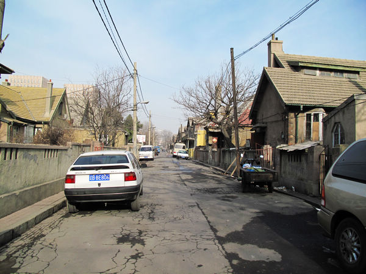
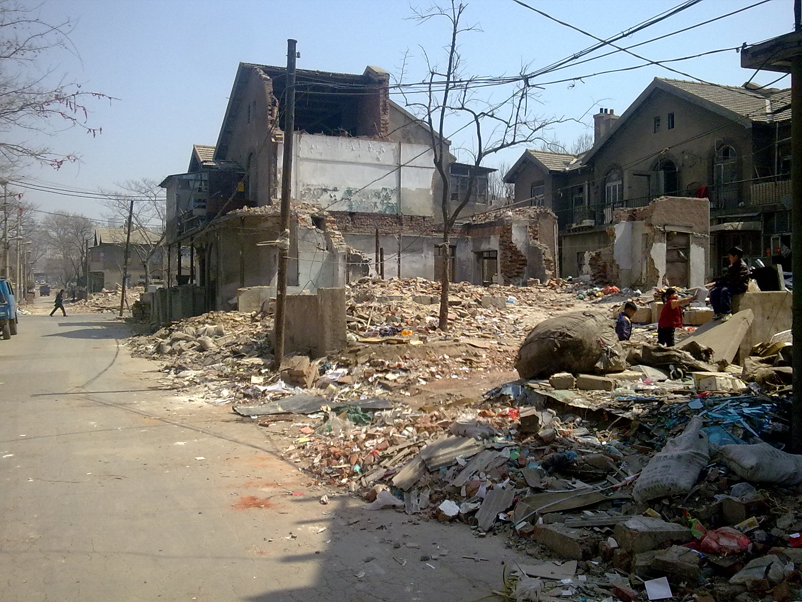
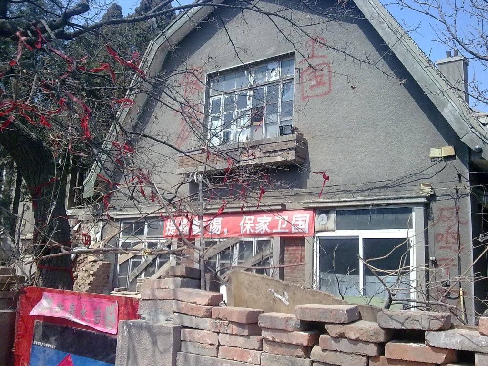
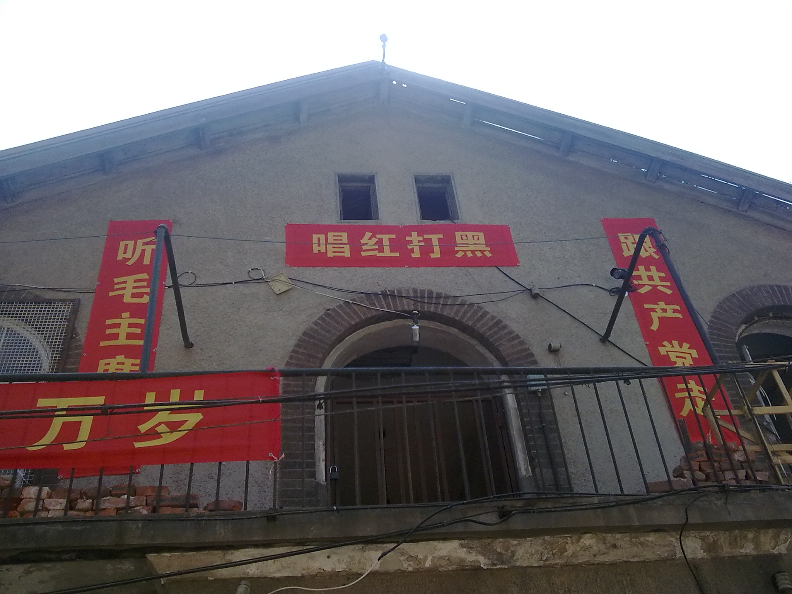

小长假，路过体育场南面的拆迁中的老街——凤鸣街。

一阵聒噪的《太阳最红，敏感词最亲》吸引了我的注意，指引我走进了一堆废墟之中。

过去，基本是没有人提起“凤鸣街”这个名字的。一个老大连人回答你“家住体育场”，绝对不是指他在体育场的院子里打更，而是指生活在这一片不起眼的日本房里。

体育场拆了，皮之不存之下安有完卵？

最早的回忆来自1987年，那个时候我还没上小学。春节过后，二月初几，胳膊摔骨折后没几天，被老娘拖着去体育场串亲戚。那还真是个正经亲戚——俺娘的老姑，俺叫老姑姥的。
当时老姑姥已经失明了，老太太坐在炕沿上拉着俺娘的手，就从俺姥爷去世的时候（1953年）开始回忆：“菊子啊，你和你妈都命苦啊，你说你一个背生子,blabla……”
这事儿不是编的，印象深刻。因为老太太念叨完，已经快8点了，俺跟俺娘差点儿没赶上末班车。更怨念的是，俺错过了六点半开始的《米老鼠和唐老鸭》。同样，那句话也不是编的。在那之前不知道什么是“背生子”，特意问了老娘。

1998年，修奥林匹克广场的时候，老房子就拆了一大片。当时有个老房的房梁就是弄不断，坊间传闻是房基里挖出了柳仙（蛇），不断有民工出事故，没人敢动了。当时的人大主任于老头还专门跑到本地新闻栏目《新视点》上辟谣，说，“那个房子不是出了什么问题，而是留一个遗址，纪念这次史无前例的快速动迁……”
可后来广场修成了以后，并没有找到这个拆了大半的纪念性建筑，从此坚定了“敏感词都是骗人的”的信念。

2003年，长春路改造。我姥姥忽然神秘地对俺娘说：“其实，咱家在长春路有38间房子。是你爹他们哥三个的，一家十三间，咱家少一间，但是门洞子和水井是咱的。地契在我这儿……”
后来考虑到三家已经分家几十年了，就算打下官司来也还得再起内部纷争，就那么算了。

（2007年的凤鸣街，作者色影无忌网友什么宝贝。）

话题回到2011年。
废墟中，几个捡破烂二代或者三代在愉快地玩着游戏。

从东头往里走，路的两旁满眼是残垣断壁了。这一对儿完整的房子特别地醒目。
北边的写着“保家卫国”，院子里的老槐树上栓满了祈福辟邪用的红布条。窗子为了防止别人砸，钉上了木板。

南边儿的挂着巨大的条幅。小二楼的高音喇叭里大声放着“红歌”。短短10分钟，放了之前提到的那首，《大海航行靠舵手》和《爱我中华》。音量开得很大。

这一次，我觉得这户人家的做法有些些不妥——扰民啊！
你要抗争便抗争，你要博同情便卖萌，可无辜的人犯不上陪你一起让耳朵受罪啊，更何况听红歌损害的还不仅仅是耳朵。

但往北走了几步，听到那轰鸣的钻地声音之后，又释然了。人都搬走了，还扰个gdp的民啊！！

记忆中的大连，又缺了一个角。

P.S：关于凤鸣街拆迁的更多故事，大连的新青年论坛上有具体内容。