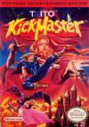

[踢王](https://pewae.com/gaan/aHR0cHM6Ly93d3cuZG91YmFuLmNvbS9nYW1lLzIzNjE4OTQ0Lw==)

原名：Kick Master机种：FC厂商：TAITO类别：ACT发行年月：1992-01耗时：8

这个游戏的命运比较悲惨.一直无法将游戏合名称对上号.而且这个游戏也是相当的有名,盖因95年电软上武汉的一位叫金扬的同学以这个游戏为例,分析如何破解游戏密码.
上一次整理rom的时候,竟然错过了这个游戏.其实早在92年的时候,在老软他们家楼下附近上个台阶才能找到的那家游戏厅里,就有人专门玩这个游戏.小时候还想当然的以为,那个家伙有血不拣是白痴.这两天玩的时候才知道,最重要的宝物就是经验!
游戏的系统比较特别,每打死一个怪物必然会弹出三个宝物,包括经验,血,魔法和分(毫无用处)经验每攒够1000点会学会新的绝招,一共可以升7级.游戏的操作感相当好,而且有丰富的宝物系统和隐藏要素,本身又不是特别难,是偶喜欢的游戏类型.要说缺点,就是音乐差了点.听着总像是跟别人抄的似的.
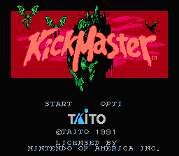
其实,又是个老套的英雄救美的故事
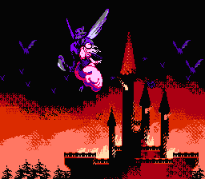
这个动作是不是很熟悉?怎么没有人指控指环王抄袭涅?
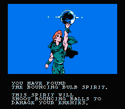
几个boss
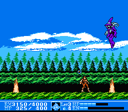
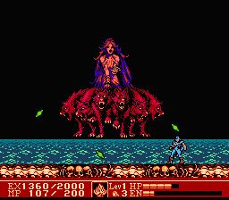
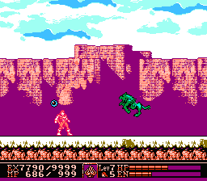
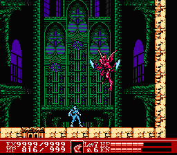
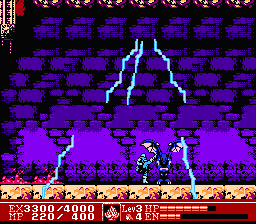
最终boss,一点boss气质都没有.
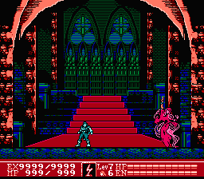
通关!
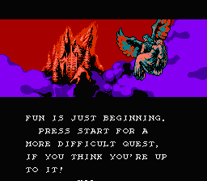