## 摘要

年度佳作：《梦之安魂曲》、《刺杀》、《七月与安生》、《窒息》、《癫佬正传》、《浪潮》、《悲伤的贝拉多娜》、《沉默的教室》、《月球》
年度抵制：《日不落酒店》、《警察日记》
年度惊喜：《寻汉记》、《寂静之地》、《艾玛好色》、《屏住呼吸》、《青春似火》、《吉祥如意》
年度失望：《侵袭与抑郁》、《扎克·施奈德版正义联盟》、《树上有个好地方》、《无依之地》、《心慌方》、《沙丘》、《皮皮鲁与鲁西西之罐头小人》
年度特别推荐：《青春似火》

年度最佳导演：《梦之安魂曲》达伦·阿伦诺夫斯基
年度最佳剧本：《11：14》格雷格·马克斯
年度最佳男主角：《一秒钟》张译（饰张九声）
年度最佳女主角：《感官世界》松田英子（饰阿部定）
年度最佳男配角：《黄金时代》王志文（饰鲁迅）
年度最佳女配角：《你好，李焕英》刘佳（饰中年李焕英）
年度最佳音乐：《七月与安生》
年度最佳画面：《悲伤的贝拉多娜》
年度最佳续集或翻拍：《狼溪2》

年度最差导演：《日不落酒店》冯一平/刘峻萌/郝心悦
年度最差剧本：《黑白魔女库伊拉》凯莉·马塞尔
年度最差男主角：《三国无双》王凯（饰曹操）
年度最差女主角：《怪物猎人》乔沃维奇（饰阿特密斯）
年度最差男配角：《老炮儿》李易峰（饰张晓波）
年度最差女配角：《树上有个好地方》马银秀（饰贾苗红）
年度最差续集或翻拍：《鸭王2》

## 总结

辛丑年是平年，全年353天。
共观影221部，比去年减少14部，减少约6%，未完成去年定下的减至200部以下的目标。主要是因为欧洲杯来了，疫情也没结束。
平均分5.31，比去年降了0.18，符合几年来的标准。
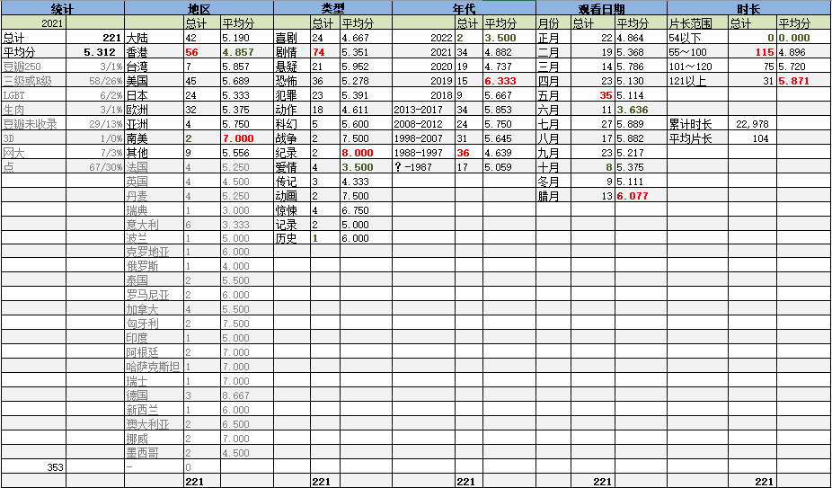

今年没有产生满分电影。9分电影倒是有9部。各有缺陷，难称完美。
9分电影里比较纠结的是大鹏的作品《吉祥如意》。这是一部难以描述的电影，大鹏相当于把自己家里人都给卖了。从影片质量上来说，除了导演表述有些霸道再没太大的缺点，但是从情感上来说，难以接受对自己亲戚如此冷血的曝光者。
今年同样也没有0分电影，得1分的也只有一部不值一提的网大。

在电影院仍旧只看了三部电影，分别是（农历）新年阶段的《你好，李焕英》、《刺杀小说家》和跨年的新片《李茂扮太子》。得知李茂是烂片明灯常远扮演的时候，本来打了退堂鼓。但老婆大人表示闲着也是闲着，就不得不忍受了。

豆瓣250再刷3部，《狩猎》、《浪潮》和《奇迹男孩》，确实得分较高。
豆瓣没有记录的电影有29部，占13%；R级电影占26%，；露点电影占30%。所以终究我是个爱黄暴更爱猎奇的俗人。

今年新增一个“年度特别推荐”，用于那些分数并不高，却有非常独到之处的电影。
这次特别推荐的是革命电影《青春似火》。这部电影的独特之处在于，中后期，上层所认为的正确的思想是怎样的，正确的行动方式是怎样的。“以XXXX为纲”都听说过，可是你见过吗？“无限上X上X”在八十年代是一句常用的批评的话，可是你真的知道这是一种怎样的做法吗？看过本片，上述问题都会得到一定程度的解答。反正我的观感是，遇见女主角这样的人，我一定会躲得远远的，否则沾上就是个死。

从地区来看，港片蝉联冠军。今年确实有意在等待开场和中场休息的时候刷了很多当年不是很有名的港片。不论好坏，能找找小时候的感觉。
其余美陆欧日所占比例跟上一年比相差不大；差别大的是亚洲其它地区的影片，今年很少看印度片和泰国片。
新地区拓展了罗马尼亚和瑞士。两部罗马尼亚电影都挺有社会主义风范的，瑞士那部有点中世纪神神叨叨的特色，算各有千秋，都不亏。

从类型来看，观看恐怖片数量第一次超过了喜剧片成为第一。毕竟疫情肆虐了两年，想必同样的小成本电影，恐怖片想必还是要比喜剧片更好拍一些。
抛去数量少的分类，得分最高的是悬疑片，最低的是动作片。我的喜好也是没什么变化。

从影片上映年代来看，分布还是比较均匀的。最多的是80年代至90年代中期，得分很低，正是特意观看港片造成的。2021年的影片刷了34部，得分也惨不忍睹，显然两年的疫情对于艺术创作来说也是非常不利的大环境。
比较有意思的是，1月份还看了两部2022年的新片。为此还特意修改了公式。

按观影日期统计，看片最多的是农历五月，欧洲杯嘛。
看片最少的是十月和冬月。因为这两个月开始，大部分的业余时间被写代码占据了。这次玩的比较大，快三个月了也只完成了一半。
农历七月初七那天是个周六，老婆一早就带孩子洗温泉去了，所以那天一口气刷了7部片子，全年最多。

今年新增加了对于片长的统计。
所有影片的平均片长是104分钟，略高于电影一般90分钟的片长。
片长最长的电影是长达4个多小时的《扎克·施耐德版正义联盟》。这部片子在我看来充斥着无聊的慢动作，看得瞌睡连连，这种导演不给他剪辑权就对了。
接下来，《黄金时代》、《长津湖》、《十二宫》、《罗马帝国艳情史》、《沙丘》、《较量2》、《在无爱之森呐喊》这7部影片片长都超过了150分钟。其中的一半是比较热闹的片子，跟去年相比数量上虽然增加了，却并没有看得致郁的情况发生。
今年没有看短片。

明年一定一定要控制到200部以下！

## 详情

[爱恋](https://pewae.com/gaan/aHR0cHM6Ly9tb3ZpZS5kb3ViYW4uY29tL3N1YmplY3QvMjU5MzM4OTgv)

原名：Love导演：加斯帕·诺主演：伊莎贝尔·尼库 / 克拉拉·克里斯汀 / 卡尔·格洛斯曼 / 奥米·穆尤克 / 文森特·马拉瓦尔 / 斯黛拉·罗夏 / 胡安·萨维德拉 / 贝努瓦·戴比 / 阿隆·佩奇斯 / 黛博拉·海薇类型：剧情 / 情色 / 爱情地区：比利时 / 法国首映时间：2015

《不可撤销》导演的作品，依旧神神叨叨像嗑药了一样。
故事细碎，几个女主身材都很好。

[你好，李焕英](https://pewae.com/gaan/aHR0cHM6Ly9tb3ZpZS5kb3ViYW4uY29tL3N1YmplY3QvMzQ4NDEwNjcv)

导演：贾玲主演：丁嘉丽 / 何欢 / 刘佳 / 包文婧 / 张小斐 / 沈腾 / 王琳 / 贾玲 / 韩云云 / 黄小猫类型：剧情 / 喜剧 / 奇幻地区：大陆首映时间：2021

虽然贾导演手法稚嫩，但诚意十足，非常非常适合我们这种40郎当岁的80前观看。
青年王琴的扮演者韩云云不错。
片长应该找个好剪辑再控制控制。

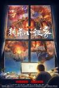

[刺杀小说家](https://pewae.com/gaan/aHR0cHM6Ly9tb3ZpZS5kb3ViYW4uY29tL3N1YmplY3QvMjY4MjYzMzAv)

导演：路阳主演：于和伟 / 佟丽娅 / 刘天佐 / 杨幂 / 杨轶 / 王圣迪 / 董子健 / 董洁 / 郭京飞 / 雷佳音类型：冒险 / 动作 / 奇幻地区：大陆首映时间：2021

国内好剪辑就这么难找吗？剪掉半小时，评分能到7。
红色盔甲蛮帅的。

[11:14](https://pewae.com/gaan/aHR0cHM6Ly9tb3ZpZS5kb3ViYW4uY29tL3N1YmplY3QvMTM5NDgyNS8=)

导演：格雷格·马克斯主演：亨利·托马斯 / 克拉克·格雷格 / 布莱克·赫伦 / 希拉里·斯万克 / 帕特里克·斯威兹 / 斯塔克·桑德斯 / 本·福斯特 / 杰森·席格尔 / 瑞切尔·蕾·库克 / 科林·汉克斯类型：悬疑 / 犯罪地区：加拿大 / 美国首映时间：2003

多线叙事严谨到刻板的程度。
美国真不愧是车轱辘上的国家，所有的支线都围绕汽车展开。

[邪恶外星人](https://pewae.com/gaan/aHR0cHM6Ly9tb3ZpZS5kb3ViYW4uY29tL3N1YmplY3QvMTgxMjY3Ni8=)

原名：Evil Aliens导演：JAKE WEST主演：Emily Booth / Jamie Honeybourne / Sam Butler类型：喜剧 / 恐怖 / 科幻地区：英国首映时间：2005

屎尿屁血浆，典型的搞笑恐怖片。
英国佬自己调侃自己的石阵。
地球上的农具太危险了。

[假期](https://pewae.com/gaan/aHR0cHM6Ly9tb3ZpZS5kb3ViYW4uY29tL3N1YmplY3QvMjc2MTE0MzEv)

原名：Holiday导演：伊莎贝拉·爱卡洛芙主演：Adam Ild Rohweder / Adam Strand / Bo Brønnum / Lai Yde / Laura Kjær / Michiel de Jong / Morten Hemmingsen / Stanislav Sevcik / Yuval Segal / 泰斯·罗默类型：剧情 / 犯罪地区：丹麦 / 瑞典 / 荷兰首映时间：2018

丹麦语无字幕。
说的好像是斯德哥尔摩综合症的事，但是，好无聊。

[我们都是超能力者！电影版](https://pewae.com/gaan/aHR0cHM6Ly9tb3ZpZS5kb3ViYW4uY29tL3N1YmplY3QvMjYzMjg0Nzkv)

原名：みんな！エスパーだよ！导演：园子温主演：今野杏南 / 安田显 / 富手麻妙 / 星名美津纪 / 柄本时生 / 染谷将太 / 柾木玲弥 / 槙田雄司 / 池田依来沙 / 深水元基类型：剧情 / 喜剧 / 悬疑地区：日本首映时间：2015

好假的卖肉番。

[血腥地狱](https://pewae.com/gaan/aHR0cHM6Ly9tb3ZpZS5kb3ViYW4uY29tL3N1YmplY3QvMzUxOTg5ODYv)

原名：Bloody Hell导演：阿里斯特·格里尔森主演：Daniel Weaver / David Hill / Jack Finsterer / Ryan Tarran / Scott George / Sean Lynch / Sophia Emberson-Bain / Travis Jeffery / 卡罗琳·克雷格 / 吉姆·克诺贝洛赫类型：恐怖 / 惊悚地区：澳大利亚 / 美国首映时间：2020

反杀还算干脆利落。
前面的精分剧情拖沓无必要。

[我是大哥大 电影版](https://pewae.com/gaan/aHR0cHM6Ly9tb3ZpZS5kb3ViYW4uY29tL3N1YmplY3QvMzM0MDA1Mzcv)

原名：From Today, It导演：福田雄一主演：仲野太贺 / 佐藤二朗 / 健太郎 / 吉田钢太郎 / 山本舞香 / 柳乐优弥 / 柾木玲弥 / 桥本环奈 / 泉泽祐希 / 清野菜名类型：喜剧地区：日本首映时间：2020

过多且雷同的动作戏。
日式校服打起架来还真蛮帅的。

[鬼请你睇戏](https://pewae.com/gaan/aHR0cHM6Ly9tb3ZpZS5kb3ViYW4uY29tL3N1YmplY3QvMTMwNzUzNC8=)

原名：鬼請你睇戲导演：钟少雄主演：吴镇宇 / 姚乐怡 / 孙佳君 / 张文慈 / 李蕙敏 / 汤盈盈 / 钱嘉乐 / 陈浩民 / 雷宇扬 / 黎耀祥类型：恐怖 / 惊悚地区：香港首映时间：1999

众多明星出演的烂片，毫无逻辑可言。
B哥在片里的造型一言难尽，可怜他一秒钟。
孙佳君后来怎么就消失了呢？

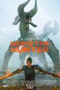

[怪物猎人](https://pewae.com/gaan/aHR0cHM6Ly93d3cuaW1kYi5jb20vdGl0bGUvdHQ2NDc1NzE0Lw==)

原名：Monster Hunter导演：保罗.W.S.安德森主演：Ron Perlman / 托尼·贾 / 米拉·乔沃维奇类型：冒险 / 动作 / 奇幻地区：加拿大 / 南非 / 大陆 / 德国 / 日本 / 美国首映时间：2020

卡普空能不能别在找这两口子了，霍霍了一个生化危机还不够，又来搞怪物猎人了。
平心而论，比生化危机强不少，雄火龙出现的时候还有那么点游戏的感觉，但是全片最大的问题就是没有破头的爽感。
米拉乔沃维奇永远一幅痛经的表情，受够了。

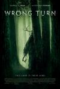

[致命弯道：重启](https://pewae.com/gaan/aHR0cHM6Ly9tb3ZpZS5kb3ViYW4uY29tL3N1YmplY3QvMzAzNTI4OTcv)

原名：Wrong Turn导演：迈克·P·纳尔逊主演：rhyan elizabeth hanavan / vardaan arora / 夏洛特·维嘉 / 比尔·萨奇 / 艾玛·杜蒙特 / 迪伦·麦蒂 / 阿丹·布拉德利 / 阿德里安·法维拉 / 马修·莫迪恩 / 黛茜·海德类型：恐怖 / 惊悚地区：德国首映时间：2021

前面的沦陷和邪教设定都有些套路。
最后的反杀带劲。

[低俗喜剧](https://pewae.com/gaan/aHR0cHM6Ly9tb3ZpZS5kb3ViYW4uY29tL3N1YmplY3QvNjg2OTM5NS8=)

导演：彭浩翔主演：叶山豪 / 杜汶泽 / 杨千嬅 / 林雪 / 薛凯琪 / 詹瑞文 / 邵音音 / 邹凯光 / 郑中基 / 陈静类型：喜剧地区：香港首映时间：2012

最后的底不错，中间几个小段不错，整体较散。
郑中基是不是本色演出？
一定要看粤语未删减版。

[发财日记](https://pewae.com/gaan/aHR0cHM6Ly9tb3ZpZS5kb3ViYW4uY29tL3N1YmplY3QvMjc1OTQ2NTMv)

导演：宋小宝主演：宋小宝 / 张一山 / 沙溢 / 王祖蓝 / 肖央 / 肖添仁 / 艾伦 / 韩彦博 / 马丽 / 马汉毅类型：剧情 / 喜剧地区：大陆首映时间：2021

宋小宝挺用心的，但也仅限于此，段子都太老了。
年代片没拍出年代感，除了刘德华。
全片的演技担当是沙溢，辽宁民间艺术团客串出演车匪路霸毫无违和感。

[温暖的抱抱](https://pewae.com/gaan/aHR0cHM6Ly9tb3ZpZS5kb3ViYW4uY29tL3N1YmplY3QvMzQ4NjkzNjIv)

导演：常远主演：乔杉 / 吴莫愁 / 常远 / 张一鸣 / 张子栋 / 李沁 / 沈腾 / 王宁 / 王成思 / 王智类型：喜剧地区：大陆首映时间：2020

这片绝对不像风评分那么低，算是常远主演的片子里分最高的了。
李沁漂亮是很漂亮，就是力气没使对地方，跟喜剧的氛围格格不入。
虎头蛇尾严重。

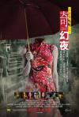

[李碧华鬼魅系列：奇幻夜](https://pewae.com/gaan/aHR0cHM6Ly9tb3ZpZS5kb3ViYW4uY29tL3N1YmplY3QvMjI3NTk3NTIv)

导演：刘国昌 / 泰迪·罗宾 / 陈嘉上主演：关楚耀 / 尹扬明 / 岑嘉其 / 张国强 / 林家栋 / 泰迪·罗宾 / 莫绮雯 / 谭淇淇 / 陈法拉 / 陈耀荣类型：恐怖地区：香港首映时间：2013

中规中矩。
第一个故事陈嘉上拍得温吞水，第三个故事泰迪罗宾太恶心。
第二个故事拍得是最好的，可惜故事是最没新意的。

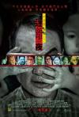

[李碧华鬼魅系列：迷离夜](https://pewae.com/gaan/aHR0cHM6Ly9tb3ZpZS5kb3ViYW4uY29tL3N1YmplY3QvMjI3NTk2NjAv)

导演：任达华 / 李志毅 / 陈果主演：任达华 / 元秋 / 卢海鹏 / 林雪 / 梁家辉 / 邵美琪 / 邵音音 / 陈慧琳 / 陈滢 / 陈静类型：恐怖地区：香港首映时间：2013

任达华这么大岁数了第一次当导演，第一个故事被他拍得支离破碎主次不分。
第二个故事的主演颜卓灵太有灵气了，第三个故事的陈静就很可惜，一直坐着白瞎了好身材。
陈果的第三个故事是最棒的，恰到好处。

[侵袭与抑郁](https://pewae.com/gaan/aHR0cHM6Ly9tb3ZpZS5kb3ViYW4uY29tL3N1YmplY3QvMzUzMDU3MzMv)

原名：Corona Depression导演：Linda Sandkvist主演：Hedvig Lagerkvist类型：剧情 / 喜剧地区：瑞典首映时间：2020

好久不见的纯独角戏，唯一的配角是一只电动玩具。
反映了新冠独自在家的无聊。
我都不知道应不应该把它放进无字幕的统计中，因为全片没有对白。

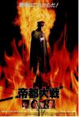

[帝都大战](https://pewae.com/gaan/aHR0cHM6Ly9tb3ZpZS5kb3ViYW4uY29tL3N1YmplY3QvMjMzOTc1MC8=)

原名：Tokyo: The Last War导演：一濑隆重 / 蓝乃才主演：丹波哲郎 / 加藤雅也 / 南果步 / 岛田久作类型：动作 / 恐怖地区：日本首映时间：1989

一代鬼才蓝乃才，都向日本国进行文化输出了。
主次不分，拍得极烂。

[大赢家（2020）](https://pewae.com/gaan/aHR0cHM6Ly9tb3ZpZS5kb3ViYW4uY29tL3N1YmplY3QvMzQ2NzAyMTgv)

原名：大赢家导演：于淼主演：代乐乐 / 夏甄 / 大鹏 / 孟鹤堂 / 张子贤 / 张帆 / 张绍荣 / 杜源 / 杨砚铎 / 柳岩类型：喜剧地区：大陆首映时间：2020

笑点略尴尬，诚意还可以。
喜剧片演夸张一些完全可以接受。
缺点是好多前后无关联又不好笑的废剧情。

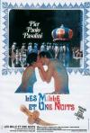

[一千零一夜](https://pewae.com/gaan/aHR0cHM6Ly9tb3ZpZS5kb3ViYW4uY29tL3N1YmplY3QvMTI5NDY1NC8=)

原名：Arabian Nights导演：皮埃尔·保罗·帕索里尼主演：Abadit Ghidei / Alberto Argentino / Barbara Grandi / Claudia Rocchi / Francesco Paolo Governale / Gioacchino Castellini / Salvatore Sapienza / Zeudi Biasolo / 伊丽莎白·吉诺维斯 / 伊内斯·佩莱格里尼类型：剧情 / 历史 / 喜剧 / 奇幻 / 爱情地区：意大利 / 法国首映时间：1974

露点镜头毫无亮点，切蛋蛋的镜头倒是很cult。
字幕时间不对，因为是意大利语也完全不会调，近乎啃生肉。
演《意大利人在俄罗斯的奇遇》的那位男演员献身了。

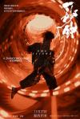

[一秒钟](https://pewae.com/gaan/aHR0cHM6Ly9tb3ZpZS5kb3ViYW4uY29tL3N1YmplY3QvMzAyNTc3ODc=)

导演：张艺谋主演：于洋 / 余皑磊 / 刘云龙 / 刘浩存 / 常海军 / 张译 / 张邵勃 / 曹瑞 / 李延 / 范伟类型：剧情地区：大陆首映时间：2020

很好的片子，荒诞而又真实。
张译和范伟的表现无可挑剔，女主角那个小女孩身体跟不上眼神，还需练级。
结尾据说是补拍的那段很糟糕，停在男主被带走时的误会应该是最好的。

[老炮儿](https://pewae.com/gaan/aHR0cHM6Ly9tb3ZpZS5kb3ViYW4uY29tL3N1YmplY3QvMjQ3NTE3NTYv)

导演：管虎主演：于和伟 / 冯小刚 / 刘桦 / 吴亦凡 / 宁浩 / 尚语贤 / 尹力 / 张涵予 / 李易峰类型：剧情 / 犯罪地区：大陆首映时间：2015

冯小刚、张涵予、刘桦、许晴这些老一辈个顶个的好，年轻的李易峰和吴亦凡烂出天际。
冰面上的慢镜头实在是败笔，拖垮了节奏，把前面铺垫好的情绪给浪费光了。
片尾丁武出场却响起老崔的歌，这是褒贬谁呢？

[甜蜜电影](https://pewae.com/gaan/aHR0cHM6Ly9tb3ZpZS5kb3ViYW4uY29tL3N1YmplY3QvMTQ2NjI5MA==)

原名：Sweet Movie导演：杜尚·马卡维耶夫主演：Berndt Stein / Hansi Roll / Herbert Stumpfl / Jane Mallett / Louis Bessières / Otto Mühl / Renate Steiger / Roy Callender / Therese Schulmeister / 凯瑟琳.索拉类型：剧情 / 喜剧 / 情色地区：加拿大 / 德国 / 法国首映时间：1974

基本没看懂。
几个场景特别clut，比如一边吐一边吃。
如果你对电影能拍成什么样子有好奇心，那我推荐这部电影。

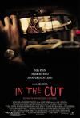

[裸体切割](https://pewae.com/gaan/aHR0cHM6Ly93d3cuaW1kYi5jb20vdGl0bGUvdHQwMTk5NjI2Lw==)

原名：In the Cut导演：Jane Campion主演：Jennifer Jason Leigh / Mark Ruffalo / 梅格·瑞恩类型：惊悚 / 神秘地区：法国 / 澳大利亚 / 美国 / 英国首映时间：2003

为艺术献身的女艺术家之梅格瑞恩。
悬疑片拍得一点悬疑都没有，无聊。

[感官世界](https://pewae.com/gaan/aHR0cHM6Ly93d3cuaW1kYi5jb20vdGl0bGUvdHQwMDc0MTAyLw==)

原名：愛のコリーダ导演：大岛渚主演：中岛葵 / 松井康子 / 松田英子 / 藤龙也类型：剧情 / 爱情地区：日本 / 法国首映时间：1976

女主角虽然不是特别漂亮，但气质独特，是很多人心目中的类型，身材也很好。
连日本人都觉得变态而把它禁掉的片子，确实部变态又刺激的好片。
男主角后来一直活跃在影视界，还拿过上海电影节影帝，难道就没有人嘲笑他丁丁小？

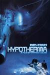

[摄氏32度](https://pewae.com/gaan/aHR0cHM6Ly9tb3ZpZS5kb3ViYW4uY29tL3N1YmplY3QvMTI5NzUyNS8=)

导演：梁柏坚主演：刘青云 / 吴倩莲 / 林志泰 / 韩载锡 / 黃莎莉类型：剧情 / 动作 / 惊悚地区：香港首映时间：1996

银河映像的第一部作品，吴倩莲刘青云元彬杜琪峰全伙到齐，稍显稚嫩的暗黑风格已经显现。
可能是背后有韩国金主爸爸，那个韩国人很突兀。
吴倩莲的波波头造型粉嫩粉嫩的。

[村戏](https://pewae.com/gaan/aHR0cHM6Ly9tb3ZpZS5kb3ViYW4uY29tL3N1YmplY3QvMjY3MzgyMDQ=)

导演：郑大圣主演：吕爱华 / 张亚豪 / 张慧娟 / 李志兵 / 梁春柱 / 王春明 / 陈晨类型：剧情地区：大陆首映时间：2017

还可以，但没有传说中那么好，革命题材总是容易获得超出自身水平的高评价。
大反派和女主演得好，男主和他儿子太绷。
某几个镜头非常带感，比如马恩列斯毛下面坐了五个老头儿。

[逃狱三王](https://pewae.com/gaan/aHR0cHM6Ly9tb3ZpZS5kb3ViYW4uY29tL3N1YmplY3QvMTI5MjI2NA==)

原名：O Brother, Where Art Thou?导演：乔尔·科恩 / 伊桑·科恩主演：Chris Thomas King / Del Pentecost / 丹尼尔·冯·巴根 / 乔治·克鲁尼 / 弗兰克·考利森 / 李韦弗 / 查尔斯·德恩 / 约翰·古德曼 / 约翰·特托罗 / 罗伊斯·D.阿普勒加特类型：冒险 / 喜剧 / 犯罪地区：法国 / 美国 / 英国首映时间：2000

政治意味太浓。
克鲁尼太帅了以至于演喜剧不够亲切。
音乐有特色。

[黑水](https://pewae.com/gaan/aHR0cHM6Ly9tb3ZpZS5kb3ViYW4uY29tL3N1YmplY3QvMzAzMzE5NTkv)

原名：Dark Waters导演：托德·海因斯主演：丹尼尔·R·希尔 / 凯文·克劳利 / 威廉·杰克森·哈珀 / 安妮·海瑟薇 / 斯嘉丽·希克斯 / 梅尔·温宁汉姆 / 比尔·坎普 / 比尔·普尔曼 / 王明 / 维克多·加博类型：剧情地区：美国首映时间：2019

前半段虽然没有什么特别抓眼的剧情，却很好地讲述了故事的来龙去脉，到后面打官司就没意思了。
危言耸听式的结局。
海瑟薇已经是标准的中年妇女了。

[在无爱之森呐喊](https://pewae.com/gaan/aHR0cHM6Ly9tb3ZpZS5kb3ViYW4uY29tL3N1YmplY3QvMzAzMzc3NjAv)

原名：愛なき森で叫べ导演：园子温主演：中屋柚香 / 川村那月 / 日南响子 / 椎名桔平 / 海 / 满岛真之介 / 真飞圣 / 绪方义博 / 镰泷绘理类型：惊悚 / 犯罪地区：日本首映时间：2019

充满病态与杀戮，饱满的园子温作品。
洗脑与反洗脑的故事，可能是给耐飞准备的缘故，故事单薄了点儿。
缺点是缺少突破。

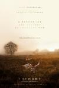

[狩猎](https://pewae.com/gaan/aHR0cHM6Ly9tb3ZpZS5kb3ViYW4uY29tL3N1YmplY3QvNjk4NTgxMC8=)

原名：The Hunt导演：托马斯·温特伯格主演：亚历山德拉·拉帕波特 / 安妮·路易丝·哈辛 / 安妮卡·韦德科普 / 托玛斯·博·拉森 / 拉丝·弗格斯托姆 / 拉斯·兰特 / 苏西·沃德 / 麦斯·米科尔森类型：剧情地区：丹麦 / 瑞典首映时间：2012

关于社死的话题，可供感触的地方挺多的。
北欧还真是夜不闭户啊。
人未必有鄙视别人的权利。

[铁幕性史](https://pewae.com/gaan/aHR0cHM6Ly9tb3ZpZS5kb3ViYW4uY29tL3N1YmplY3QvMTQwMTIwOA==)

原名：Sexmission导演：尤利尤斯·马胡尔斯基主演：伯格斯拉娃·帕韦莱茨 / 博热娜·斯特雷伊库芙娜 / 多萝塔·斯大林斯卡 / 奥尔基尔德·鲁卡斯瑟维克茨 / 尤利乌什·卢比奇-利索夫斯基 / 彼得·斯特凡尼亚克 / 汉娜·斯坦库芙娜 / 瑞丝扎德·哈宁 / 米罗斯瓦娃·马尔海卢克 / 索菲娅·普莱温斯卡 / 维斯瓦夫·米赫尼科夫斯基 / 耶日·斯图尔 / 芭芭拉·卢德维然卡 / 贝娅塔·蒂希基维茨 / 雅努什·米哈沃夫斯基类型：冒险 / 喜剧 / 科幻地区：波兰首映时间：1984

楚门的世界不会是照这个抄的吧
东欧的片子从来就是说脱就脱，毫不犹豫。
波兰能拍出如此讽刺的电影，所谓的社会主义不会出不了莫斯科吧。

[A级优等生下海记](https://pewae.com/gaan/aHR0cHM6Ly9tb3ZpZS5kb3ViYW4uY29tL3N1YmplY3QvMjY5NzU2MjU=)

原名：From Straight A导演：凡妮莎·帕里斯主演：Garrett Black / Imali Perera / Peter Graham-Gaudreau / Sasha Clements / 乔瓦娜·休盖特 / 亚历克斯·潘本 / 安德里亚·斯特凡西科瓦 / 弗雷泽·艾奇逊 / 强·库斯勃特 / 杰茜卡·路类型：剧情地区：加拿大 / 美国首映时间：2017

想看没看到就最寂寞，起这么个片名，从头到尾半个点都没露一下，制片人你的良心不会痛吗？
一部无聊的女权片。
出卖女主的亚洲人长了一张欠干的脸。

[梦之安魂曲](https://pewae.com/gaan/aHR0cHM6Ly9tb3ZpZS5kb3ViYW4uY29tL3N1YmplY3QvMTI5MjI3MA==)

原名：Requiem for a Dream导演：达伦·阿伦诺夫斯基主演：亚伯拉罕·阿罗诺夫斯基 / 克里斯托弗·麦克唐纳 / 夏洛特·阿罗诺夫斯基 / 斯科特·富兰克林 / 杰克·奥康耐 / 杰瑞德·莱托 / 欧嘉·梅雷迪斯 / 玛西娅·让·库尔茨 / 珍妮特·萨诺 / 艾伦·伯斯汀类型：剧情地区：美国首映时间：2000

虽然是意识流作品，却能让观众直接跟上意识流，牛逼。
片子最后时段的快速剪辑蒙太奇环环相扣，让人透不过气来。

[皇家师姐4：直击证人](https://pewae.com/gaan/aHR0cHM6Ly9tb3ZpZS5kb3ViYW4uY29tL3N1YmplY3QvMTQ2MTM1Mw==)

原名：In the Line of Duty IV导演：袁和平主演：杨丽菁 / 王敏德 / 甄子丹 / 袁日初类型：动作 / 犯罪地区：香港首映时间：1989

除了动作场面以外一无是处。
中期骑摩托车抡铁锹和铁锤对战的场面相当有爱。
主演之一的袁日出是袁和平的弟弟。

[春情荡漾](https://pewae.com/gaan/aHR0cHM6Ly9tb3ZpZS5kb3ViYW4uY29tL3N1YmplY3QvMzA0ODI2NzY=)

原名：グラグラ导演：高原秀和主演：木庭博光 / 本橋由香 / 柴田明良 / 永岡怜子 / 江泽翠 / 湯江タケユキ类型：爱情地区：日本首映时间：2019

胸。

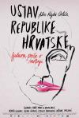

[克罗地亚宪法](https://pewae.com/gaan/aHR0cHM6Ly9tb3ZpZS5kb3ViYW4uY29tL3N1YmplY3QvMjY3NTQxMDE=)

原名：Ustav Republike Hrvatske导演：拉伊科·格尔利奇主演：伊莲娜·乔瓦诺娃 / 克塞尼娅·马林科维奇 / 兹登科·杰尔克 / 内博伊沙·格洛戈瓦茨 / 博兹达尔·斯密贾尼克 / 卢卡·德拉季奇 / 德扬·阿西莫维奇 / 泽利科·杜夫尼亚克 / 泽利科·科尼斯内特 / 玛拉登·赫仁类型：剧情 / 同性 / 喜剧地区：克罗地亚 / 北马其顿 / 捷克 / 斯洛文尼亚首映时间：2016

细腻是够细腻，稍微有些闷。
LGBT向的电影还是不怎么能理解。

[中华赌侠](https://pewae.com/gaan/aHR0cHM6Ly9tb3ZpZS5kb3ViYW4uY29tL3N1YmplY3QvMTMwMDM4MQ==)

导演：程小东主演：古天乐 / 张家辉 / 朱茵 / 林国斌 / 钟丽缇类型：动作 / 喜剧地区：香港首映时间：2000

虽然是程小东导演，却是典型的王晶的速食骗钱作，那时流行的扑克玩法还是大老二。
有一段恶搞黎明和舒淇的《爱天爱地》。
林国斌是不是也没演过好人。

[凶宅怪谈](https://pewae.com/gaan/aHR0cHM6Ly9tb3ZpZS5kb3ViYW4uY29tL3N1YmplY3QvMzQ5NjE2MzI=)

原名：事故物件导演：中田秀夫主演：Megumi / 加藤谅 / 坂口涼太郎 / 奈绪 / 宇野祥平 / 小手伸也 / 有野晋哉 / 木下邦家 / 江口德子 / 泷川英次类型：剧情 / 恐怖地区：日本首映时间：2020

一切都还算凑合。
算是粉丝向的恐怖片吧。

[忠贞](https://pewae.com/gaan/aHR0cHM6Ly9tb3ZpZS5kb3ViYW4uY29tL3N1YmplY3QvMzQ4NzUyNjE=)

原名：Vernost导演：尼吉娜·赛福莱娃主演：亚历山大·帕里 / 叶夫根尼娅·格罗莫娃类型：情色地区：俄罗斯首映时间：2019

女主角身材超级棒。
絮絮叨叨。

[扎克·施奈德版正义联盟](https://pewae.com/gaan/aHR0cHM6Ly9tb3ZpZS5kb3ViYW4uY29tL3N1YmplY3QvMzUwNzY3MTQ=)

原名：Zack Snyder's Justice League导演：扎克·施奈德主演：J·K·西蒙斯 / 亨利·卡维尔 / 埃兹拉·米勒 / 塞伦·希德 / 威廉·达福 / 康妮·尼尔森 / 戴安·琳恩 / 本·阿弗莱克 / 杰森·莫玛 / 杰瑞米·艾恩斯类型：冒险 / 动作 / 奇幻 / 科幻地区：美国首映时间：2021

无穷无尽无节制的慢镜头，当得起一句又臭又长。
画面确实不错。
我确实不喜欢美漫电影，无论是漫威还是DC。

[风花雪月](https://pewae.com/gaan/aHR0cHM6Ly93d3cuaW1kYi5jb20vdGl0bGUvdHQwMDc2NDA4)

导演：李翰祥主演：余莎莉 / 岳华 / 恬妮 / 王莱 / 田青 / 谷峰 / 邵音音 / 陈萍类型：剧情地区：香港首映时间：1977

邵音音年轻的时候也不算特别漂亮，但脸型真是有特色，身材也好。
王莱真是独一档的好演技。

[恶魔的艺术3：鬼影随行](https://pewae.com/gaan/aHR0cHM6Ly9tb3ZpZS5kb3ViYW4uY29tL3N1YmplY3QvMzA5NTE4OQ==)

原名：ลองของ 3导演：Art Thamthrakul / Isara Nadee / Kongkiat Khomsiri / Pasith Buranajan / Putipong Saisikaew / Seree Phongnithi / Yosapong Polsap主演：Kalorin Supaluck Neemayothin / Namo Tongkumnerd / Napakapapa Nakaprasit / Paweena Chariffsakul / Sommart Praihirun / Supakorn Kitsuwan类型：恐怖地区：泰国首映时间：2008

2的前传，讲女教师是如何被邪神控制的，故事有些牵强。
虐杀是有，但缺少恐惧感。
忽然感觉泰国人受伤和恐惧时的叫喊声很难听。

[白百合](https://pewae.com/gaan/aHR0cHM6Ly9tb3ZpZS5kb3ViYW4uY29tL3N1YmplY3QvMjY4NTU2OTA=)

原名：ホワイトリリー导演：中田秀夫主演：三上市朗 / 伊藤可可 / 山口香绪里 / 松山尚子 / 林田麻里 / 榎本由希 / 町井祥真 / 西川可奈子 / 镰仓太郎 / 飞鸟凛类型：同性 / 情色地区：日本首映时间：2016

无法理解的虐恋。

[1917](https://pewae.com/gaan/aHR0cHM6Ly9tb3ZpZS5kb3ViYW4uY29tL3N1YmplY3QvMzAyNTI0OTU=)

导演：萨姆·门德斯主演：丹尼尔·梅斯 / 乔治·麦凯 / 克里斯·瓦利 / 安德鲁·斯科特 / 本尼迪克特·康伯巴奇 / 杰米·帕克 / 理查德·德姆西 / 理查德·麦凯布 / 理查德·麦登 / 科林·费尔斯类型：剧情 / 战争地区：加拿大 / 印度 / 大陆 / 美国 / 英国 / 西班牙首映时间：2020

废墟逃亡和橄榄球式狂奔在视觉效果上来说简直完美。
配乐很忧伤，战争就是这么操蛋的东西。

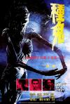

[种鬼](https://pewae.com/gaan/aHR0cHM6Ly9iYWlrZS5iYWlkdS5jb20vaXRlbS8lRTclQTclOEQlRTklQUMlQkM=)

导演：杨权主演：卫嘉文 / 徐少强 / 易木焜山 / 玄智慧 / 田蜜 / 高飞类型：恐怖地区：香港首映时间：1983

特效虽然受制于当时的条件，但非常认真，气氛渲染得相当到位。
据说是港片里东南亚降头类的鼻祖，还特意找了个印尼降头大师来作噱头。
徐少强也有这种时候，哈哈。

[人潮汹涌](https://pewae.com/gaan/aHR0cHM6Ly9tb3ZpZS5kb3ViYW4uY29tL3N1YmplY3QvMzQ4ODAzMDI=)

导演：饶晓志主演：万茜 / 刘天佐 / 刘德华 / 国义骞 / 狄志杰 / 程怡 / 肖央 / 路阳 / 郭京飞 / 黄小蕾类型：喜剧 / 犯罪地区：大陆首映时间：2021

刘劳模果然差香川太君好远，万茜也差广末凉子好远。
冷幽默给改热了，效果未必好。
讴歌的配乐是败笔。

[刺杀](https://pewae.com/gaan/aHR0cHM6Ly9tb3ZpZS5kb3ViYW4uY29tL3N1YmplY3QvMzQ5MDc0MTY=)

原名：Assassins导演：瑞恩·怀特主演：Anna Fifield / Doan Thi Huong / Hadi Azmi / Siti Aisyah类型：纪录地区：美国首映时间：2020

光知道两个女的把金正男杀了，还真不知道这俩人被放了。
其实我到觉得控方所说的两个女人并非无意在逻辑上挺充分的，哪想到就那么就结束了。
马来西亚政府前倨后恭的样子，正好体现了政治的龌龊。

[脑髓地狱](https://pewae.com/gaan/aHR0cHM6Ly9tb3ZpZS5kb3ViYW4uY29tL3N1YmplY3QvMTQzNzQ5NQ==)

原名：ドグラ・マグラ导演：松本俊夫主演：室田日出男 / 松田洋治 / 桂枝雀类型：恐怖 / 悬疑 / 科幻地区：日本首映时间：1988

剧情本身就复杂，又被导演用颠而倒之倒而颠之的手法排得神经兮兮的。
一旦主角的种种行为被冠以神经病进行解释，那么故事的好玩程度就会直线下降。
演主角妈妈的演员称得上端庄秀丽。

[风平浪静](https://pewae.com/gaan/aHR0cHM6Ly9tb3ZpZS5kb3ViYW4uY29tL3N1YmplY3QvMjc1ODk5MzM=)

导演：李霄峰主演：丁冠中 / 叶青 / 周政杰 / 宋佳 / 张建亚 / 李鸿其 / 林津锋 / 王砚辉 / 章宇 / 赵龙豪类型：剧情 / 爱情 / 犯罪地区：大陆首映时间：2020

不是很好，不是很差，对我来说最大的问题是92年和07年的年代感缺失。
宋佳的角色太突兀了。
雨用的太多太猛。

[唐人街探案3](https://pewae.com/gaan/aHR0cHM6Ly9tb3ZpZS5kb3ViYW4uY29tL3N1YmplY3QvMjc2MTk3NDg=)

导演：陈思诚主演：三浦友和 / 刘昊然 / 妻夫木聪 / 尚语贤 / 张子枫 / 张钧甯 / 托尼·贾 / 染谷将太 / 浅野忠信 / 王宝强类型：喜剧 / 悬疑地区：大陆 / 日本 / 香港首映时间：2021

唯一的优点是节奏还不错，其余无论作为喜剧还是作为悬疑片来看，都不入流，最大的毛病是太长骗钱。
日本的演员们都很敬业，长泽雅美再次奉上了迷之演技，铃木保奈美甚至陪着跳了尴尬到不行的片尾舞。
植入的广告尬到不行，我都恨不得把钱包里的招行卡直接扔掉。

[校园大逃杀](https://pewae.com/gaan/aHR0cHM6Ly9tb3ZpZS5kb3ViYW4uY29tL3N1YmplY3QvMzQ5MzA4MDE=)

原名：Run Hide Fight导演：凯尔·兰金主演：April McCullough / Brandon Germaine / Carlton Caudle / Catherine Davis / Gerardo Davila / Shelby Mayes / 乔尔·迈克利 / 伊莎贝尔·梅 / 伊莱·布朗 / 奥利·索罗坦类型：动作 / 惊悚 / 犯罪地区：美国首映时间：2020

女主颜值演技都不错，是根好苗子。
结局也还可以。
可惜中间穿插了各种政治正确，血量也不够大。

[不文小丈夫](https://pewae.com/gaan/aHR0cHM6Ly9iYWlrZS5iYWlkdS5jb20vaXRlbS/kuI3mloflsI/kuIjlpKsv)

导演：叶辉煌主演：南庆姬 / 周海媚 / 崔贞子 / 林利 / 陈奕诗 / 黄光亮 / 黄霑类型：喜剧地区：香港首映时间：1990

原来黄光亮也有不演坏人的时候。
那个时候的韩国女艺术家还真是廉价啊，出场就脱；而名字叫南庆姬的女主角竟然是个台湾人。
周海媚年轻的时候眉眼竟然跟郑爽有几分相像。

[不文小丈夫之银座嬉春](https://pewae.com/gaan/aHR0cHM6Ly9iYWlrZS5iYWlkdS5jb20vaXRlbS8lRTQlQjglOEQlRTYlOTYlODclRTUlQjAlOEYlRTQlQjglODglRTUlQTQlQUIlRTQlQjklOEIlRTklOTMlQjYlRTUlQkElQTclRTUlQUMlODklRTYlOTglQTUv)

导演：叶辉煌主演：岸居子 / 邵传勇 / 陈奕诗 / 黄光亮 / 黄霑类型：喜剧地区：香港首映时间：1991

跟前一部太雷同了。
六神丸+可乐，希望霑叔在天之灵没有说瞎话。

[纳粹荒淫史](https://pewae.com/gaan/aHR0cHM6Ly93d3cuaW1kYi5jb20vdGl0bGUvdHQwMDc1MTYzLw==)

原名：Salon Kitty导演：丁度·班德拉斯主演：helmut-berger / ingrid-thulin / 特里萨·安妮·萨沃伊类型：剧情 / 战争地区：德国 / 意大利 / 法国首映时间：1976

以猎奇的心理来看还蛮好。
但是啊，那些花里胡哨的东西把剧情分割得特别散.
剧情的转折太过于生硬。

[真·三国无双](https://pewae.com/gaan/aHR0cHM6Ly9tb3ZpZS5kb3ViYW4uY29tL3N1YmplY3QvMjY3NDc4Njk=)

导演：周显扬主演：刘嘉玲 / 古力娜扎 / 古天乐 / 吕良伟 / 姜皓文 / 张建声 / 杨祐宁 / 林雪 / 王凯 / 韩庚类型：动作 / 古装 / 奇幻地区：大陆首映时间：2021

1分给古天乐，1分给林雪，不要说什么游戏迷会给高分，鬼扯！
游戏里也没傻逼到一帮诸侯大佬跑一个山洞里会盟。
虎牢关在西，联军在东，吕布出城迎战桃子三兄弟，骑着赤兔缓缓前进，阳光打在他的左脸上……

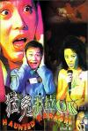

[猛鬼卡拉OK](https://pewae.com/gaan/aHR0cHM6Ly9tb3ZpZS5kb3ViYW4uY29tL3N1YmplY3QvMTMwODAyMw==)

导演：邓衍成主演：吴志雄 / 吴育枢 / 徐忠信 / 李兆基 / 罗兰 / 苑琼丹 / 邹凯光 / 钟甄 / 陈法蓉 / 陶大宇类型：喜剧 / 恐怖地区：香港首映时间：1997

不带脑子看蛮有趣的。
结局是败笔，非要搞陶大宇的父母出来升华主题，你邓衍成是能拍出世间真善美的人吗？
陈法蓉演电影的时候总有些端着的感觉，出戏。

[双瞳](https://pewae.com/gaan/aHR0cHM6Ly9tb3ZpZS5kb3ViYW4uY29tL3N1YmplY3QvMTMwNTA0Ng==)

导演：陈国富主演：刘若英 / 大卫·摩斯 / 戴立忍 / 杨贵媚 / 林涵 / 梁家辉 / 郎雄类型：剧情 / 悬疑 / 惊悚 / 犯罪地区：台湾 / 香港首映时间：2002

很好的悬疑片，虽然神神叨叨的，但很有层次感。
最后的部分败笔，罗嗦。
那时的刘若英还挺粉嫩的。

[女色狼](https://pewae.com/gaan/aHR0cHM6Ly93d3cuaW1kYi5jb20vdGl0bGUvdHQwMzUxMjY5Lw==)

原名：Indecent Woman导演：李兆基主演：徐锦江 / 曹查理 / 杨梵 / 林伟键类型：惊悚 / 犯罪地区：香港首映时间：1999

投资方名字一看就是山寨公司，而且很可能就是导演自己开的。
杨梵身材真是没什么可说的，演技也同样没什么可说的，演不了女主就是演不了女主。

[与蛇共舞](https://pewae.com/gaan/aHR0cHM6Ly93d3cuaW1kYi5jb20vdGl0bGUvdHQwMTA0MDQ4Lw==)

导演：李健生主演：曹查理 / 李中宁 / 狄威 / 范丽生 / 许曼华 / 邱玉茹 / 黄信钧类型：喜剧 / 奇幻地区：香港首映时间：1992

唯一的好处就是能找找当年偷租录像带的感觉吧。

[爱情与灵药](https://pewae.com/gaan/aHR0cHM6Ly9tb3ZpZS5kb3ViYW4uY29tL3N1YmplY3QvMzA3ODYwOQ==)

原名：Love & Other Drugs导演：爱德华·兹威克主演：乔什·加德 / 乔治·席格 / 凯特·詹宁斯·格兰特 / 凯瑟琳·温妮克 / 吉尔·克雷伯格 / 奥利弗·普莱特 / 安妮·海瑟薇 / 朱迪·格雷尔 / 杰克·吉伦哈尔 / 汉克·阿扎利亚类型：剧情 / 喜剧 / 爱情地区：美国首映时间：2010

为艺术献身的女艺术家之安妮海瑟薇。
我真是get不到爱情片的点，而且没看出来海瑟薇的帕金森的设定究竟有什么用。
也没看出来吉伦哈尔卖药是怎么厉害的。

[10+10](https://pewae.com/gaan/aHR0cHM6Ly93d3cuaW1kYi5jb20vdGl0bGUvdHQyMjQzMTIzLw==)

导演：何蔚廷 / 吴念真 / 张艾嘉 / 朱延平 / 王小棣 / 王童 / 郑有杰 / 陈国富主演：吴中天 / 庹宗华 / 张孝全 / 张韶涵 / 戴笠忍 / 桂纶镁 / 舒淇 / 高捷类型：剧情地区：台湾首映时间：2011

多个导演的拼盘作品，亮眼的并不多。
多数导演都有台湾电影特有的那种变态文艺风。
最喜欢直接开嘲的《潜规则》。

[日不落酒店](https://pewae.com/gaan/aHR0cHM6Ly9tb3ZpZS5kb3ViYW4uY29tL3N1YmplY3QvMjcwOTg2MDI=)

导演：冯一平 / 刘峻萌 / 郝心悦主演：何子君 / 刘背实 / 孙珍妮 / 张慧雯 / 张晔子 / 沈腾 / 陶亮 / 陶海 / 高叶 / 黄才伦类型：喜剧地区：大陆首映时间：2021

这片子不好全怪导演，乱七八糟，根本没有驾驭无限轮回的能力。
后面帮忙开始更是全线崩溃，就是一个字：乱。
本来片尾的腾格尔大叔算亮点，竟又出现了大杂烩舞蹈这一恶心人设定。

[死神的十字路口](https://pewae.com/gaan/aHR0cHM6Ly9tb3ZpZS5kb3ViYW4uY29tL3N1YmplY3QvMzEyNjE4Nw==)

原名：Phobia导演：Paween Purikitpanya / Youngyooth Thongkonthun / 柏德潘·王般 / 班庄·比辛达拿刚主演：Apinya Sakuljaroensuk / Kantapat Permpoonpatcharasuk / Pongsatorn Jongwilak / 查特朋·纳塔彭 / 玛妮娜·甘姆雯 / 赖拉·邦雅淑类型：剧情 / 恐怖 / 悬疑 / 惊悚地区：泰国首映时间：2008

四个小故事组成，第二个太过于俗套。
第一个把泰式恐怖片生生拍成了日式的。
四个故事里鬼的造型真是五花八门。

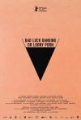

[倒霉性爱，发狂黄片](https://pewae.com/gaan/aHR0cHM6Ly9tb3ZpZS5kb3ViYW4uY29tL3N1YmplY3QvMzUyNDI5NDI=)

原名：Babardeala cu bucluc sau porno balamuc导演：拉杜·裘德主演：亚历山德鲁·波托切安 / 克劳迪娅·耶利米亚 / 奥林匹娅·马莱 / 安迪·瓦斯卢亚努 / 尼科丁·恩古里亚努类型：剧情 / 喜剧地区：罗马尼亚首映时间：2021

要论尺度大，好莱坞在欧洲电影前面就是弟弟，本片前面5分钟简直就像是从P站扒下来的。
片子分三部分，中间部分相当无厘头，但很有趣。
第三部分虽然重要，但掺杂了罗马尼亚历史，女权，同性恋，宗教什么乱七八糟的各种观点，就很枯燥了。

[西环浮尸](https://pewae.com/gaan/aHR0cHM6Ly93d3cuaW1kYi5jb20vdGl0bGUvdHQwMTE0OTk1Lw==)

导演：林义雄主演：关海山 / 吴毅将 / 夏萍 / 杨玉梅 / 欧阳震华 / 钟淑慧 / 黄允材类型：恐怖 / 犯罪地区：香港首映时间：1995

冲着名单里的吴毅将和钟淑慧以为这波妥了，结果什么都没有。
感谢名单里赫然出现深圳市南山区法院。

[寻汉计](https://pewae.com/gaan/aHR0cHM6Ly9tb3ZpZS5kb3ViYW4uY29tL3N1YmplY3QvMzA0NjQ5MDE=)

导演：唐大年主演：仁龙 / 任素汐 / 刘丹 / 史航 / 张本煜 / 曹征 / 李保田 / 李勤勤 / 柳小海 / 王子川类型：喜剧地区：大陆 / 香港首映时间：2021

挺有想法的片子，不差。
任素汐演得不错，但总觉得有些套路化，该跳出舒适圈了。
不知不觉间，李保田老师都那么老了。

[城市女猎人](https://pewae.com/gaan/aHR0cHM6Ly9tb3ZpZS5kb3ViYW4uY29tL3N1YmplY3QvMjE0Njg1NQ==)

导演：江约诚主演：惠英红 / 杨丽菁 / 陈淑兰 / 黄光亮 / 黄秋生类型：动作地区：香港首映时间：1993

剧情确实是抄袭城市猎人漫画的，其余可谓毫无特色。
但就冲惠英红的突破性演出就值得一看。
黄光亮难得演好人，黄秋生难得演正常人。

[黑狱断肠歌2无期徒刑](https://pewae.com/gaan/aHR0cHM6Ly9tb3ZpZS5kb3ViYW4uY29tL3N1YmplY3QvMzc5NzgyMw==)

导演：梁宏发主演：何家驹 / 刘以达 / 刘锡贤 / 吴镇宇 / 容锦昌 / 徐锦江 / 李兆基 / 龙方类型：惊悚 / 犯罪地区：香港首映时间：2000

虽然剧情很一般，但这帮香港电影的老混混们演得一个赛一个好。
梁焯满不错。
如何区分容锦昌和樊少皇？

[七月与安生](https://pewae.com/gaan/aHR0cHM6Ly9tb3ZpZS5kb3ViYW4uY29tL3N1YmplY3QvMjU4Mjc5MzU=)

导演：曾国祥主演：周冬雨 / 姚欣言 / 李昊芳 / 李程彬 / 李萍 / 沙全泽 / 蒋亭轩 / 蒙亭宜 / 蔡纲 / 马思纯类型：剧情 / 爱情地区：大陆 / 香港首映时间：2016

能把安妮宝贝的矫情玩意儿拍得这么完整，曾国祥真他娘是个人才。
七月就是安生，周冬雨和马思纯的双黄蛋影后给得一点毛病没有。

[阳光劫匪](https://pewae.com/gaan/aHR0cHM6Ly9tb3ZpZS5kb3ViYW4uY29tL3N1YmplY3QvMjY5MzMxNTg=)

原名：Tiger Robbers导演：李玉主演：宋佳 / 张海宇 / 文文 / 方励 / 曾志伟 / 杨迪 / 沙溢 / 詹瑞文 / 谢锐韬 / 马丽类型：喜剧 / 奇幻地区：大陆首映时间：2021

有记录以来第一次有影片因为主题歌太难听了而被扣了一分。
老虎都整出来了，完全可以更夸张一些。
结尾莫名其妙地强行煽情，太小学生作文了。

[我的姐姐](https://pewae.com/gaan/aHR0cHM6Ly9tb3ZpZS5kb3ViYW4uY29tL3N1YmplY3QvMzUxNTgxNjA=)

导演：殷若昕主演：孙嘉灵 / 张子枫 / 朱媛媛 / 朴松日 / 梁靖康 / 段博文 / 王圣迪 / 肖央 / 金遥源 / 陈永胜类型：剧情 / 家庭地区：大陆首映时间：2021

非常罕见的题材，前面大部分时间不错，结尾无法接受。
时间过得可真快，张子枫已经可以担纲大女主了。
张楚竟然把《姐姐》的歌词改了，然后王源给唱了个稀碎。

[五毒](https://pewae.com/gaan/aHR0cHM6Ly9tb3ZpZS5kb3ViYW4uY29tL3N1YmplY3QvMTMwNzYwNQ==)

导演：张彻主演：孙建 / 江生 / 罗莽 / 郭追 / 韦白 / 鹿峰类型：剧情 / 动作 / 古装地区：香港首映时间：1978

仿佛是王晶《满清十大酷刑》的灵感源泉。
郭追演得真好，可惜后来转幕后了。

[惊变](https://pewae.com/gaan/aHR0cHM6Ly93d3cuaW1kYi5jb20vdGl0bGUvdHQwMTE1NTExLw==)

导演：邱礼涛主演：任达华 / 张坚庭 / 温碧霞 / 黄子华类型：惊悚 / 爱情 / 犯罪地区：香港首映时间：1996

温碧霞都为艺术献身到那种程度了，竟然连个三级都没评上，难道是嫌温女士罩杯不够？
张坚庭最后被按在地上反复碾压，非常邱礼涛。
有那么一丢丢黄子华的风格。

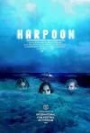

[渔枪](https://pewae.com/gaan/aHR0cHM6Ly9tb3ZpZS5kb3ViYW4uY29tL3N1YmplY3QvMzAxNTE5ODQ=)

原名：Harpoon导演：罗伯·格兰特主演：Kurtis David Harder / Robert Spina / Ron Webber / 克里斯托弗·格雷 / 布伦特·吉尔曼 / 罗伯·格兰特 / 艾米莉·泰拉 / 迈克·彼得森 / 门罗·钱伯斯类型：喜剧 / 恐怖地区：加拿大首映时间：2019

非常精彩的小成本佳作。
结局略显草率。

[地狱少女](https://pewae.com/gaan/aHR0cHM6Ly93d3cuaW1kYi5jb20vdGl0bGUvdHQ4OTkxNTY0Lw==)

原名：Hell Girl导演：kôji shiraishi主演：manami hashimoto / tina tamashiro / tom fujita类型：奇幻 / 恐怖地区：日本首映时间：2019

没找到字幕也就罢了，某瓣也没有记录，不知什么情况。
磨磨叨叨的，一丢丢恐惧感全给整没了。

[黑白魔女库伊拉](https://pewae.com/gaan/aHR0cHM6Ly9tb3ZpZS5kb3ViYW4uY29tL3N1YmplY3QvMjY3MDMxMjE=)

原名：Cruella导演：克雷格·吉勒斯佩主演：乔尔·弗莱 / 保罗·沃尔特·豪泽 / 凯万·诺瓦克 / 柯尔比·豪威尔-巴普蒂斯特 / 约翰·麦克雷 / 艾玛·斯通 / 艾玛·汤普森 / 艾米丽·比查姆 / 詹米·德米特鲁 / 马克·斯特朗类型：喜剧 / 犯罪地区：美国首映时间：2021

都什么年代了，还整这种洒狗血的剧情。
艾玛斯通现在演啥都一个味儿。
一只眼的小狗是亮点。

[窒息](https://pewae.com/gaan/aHR0cHM6Ly9tb3ZpZS5kb3ViYW4uY29tL3N1YmplY3QvMjY4NzkxNTk=)

原名：A martfűi rém导演：亚珥拔的·索普塞特主演：佐尔特·安格尔 / 加博·贾斯贝埃尼 / 卡洛伊·哈伊久克 / 普特·巴拉内 / 泽索特·斯里 / 索菲娅·绍莫希 / 莫妮卡·巴尔赛类型：惊悚 / 犯罪地区：匈牙利首映时间：2016

虽然是匈牙利电影，但感觉就发生在自己身边。
不是电影的问题就是人的问题，反正不是社会主义制度的问题。
“国家不希望法制的权威被质疑。”

[巴乔：神奇的马尾辫](https://pewae.com/gaan/aHR0cHM6Ly9tb3ZpZS5kb3ViYW4uY29tL3N1YmplY3QvMzUzNjYzMzY=)

原名：Baggio: The Divine Ponytail导演：莱蒂齐娅·拉马蒂雷主演：安东尼奥·扎瓦特里 / 安娜·费鲁佐 / 安德烈·阿坎杰利 / 安德里亚·彭纳基 / 托马斯·特拉巴齐 / 瓦伦蒂娜·贝莱类型：传记 / 剧情 / 运动地区：意大利首映时间：2021

传记片都那样，本片稍有不同的地方是重点描写了父子关系。
可是球迷们并不关心巴乔他爹啊。
演巴乔老婆的女演员很漂亮。

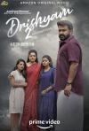

[较量2](https://pewae.com/gaan/aHR0cHM6Ly9tb3ZpZS5kb3ViYW4uY29tL3N1YmplY3QvMzUzMTAxNTM=)

原名：Drishyam 2导演：吉图·乔瑟夫主演：Aneesh Menon / Anjali Nair / Ansiba / Antony Perumbavoor / Asha Sharath / Boban Samuel / Esther Anil / Ganesh Kumar / Meena / Murali Gopy类型：剧情 / 惊悚 / 犯罪地区：印度首映时间：2021

印度片特有的冗长又回来了，无关的剧情实在太多太多了。
剧情非常非常不严谨，闹着玩一样。

[吃人大叔](https://pewae.com/gaan/aHR0cHM6Ly9tb3ZpZS5kb3ViYW4uY29tL3N1YmplY3QvMzUxNDM0NzE=)

原名：Uncle Peckerhead导演：Matthew John Lawrence主演：Adam R. Brown / Alex McKelvey / Chet Siegel / David Littleton / Joey Maron / Kevin Lawrence / Lucy McMichael / Maureen McGowan / Mike Lawrence / Ruth Lolla类型：喜剧 / 恐怖地区：美国首映时间：2020

各方面都很平庸。
作为一部以摇滚乐为题材的电影，里面的歌过于难听。

[鸭王](https://pewae.com/gaan/aHR0cHM6Ly9tb3ZpZS5kb3ViYW4uY29tL3N1YmplY3QvMjYyNzkxNjY=)

原名：The Gigolo导演：区焯文主演：何华超 / 何浩文 / 何珮瑜 / 单立文 / 卢宛茵 / 唐紫睿 / 喇英 / 梁敏仪 / 樊玲 / 江美仪类型：喜剧 / 情色 / 爱情地区：香港首映时间：2015

多少年了，王晶难得诚意一次。
这年代你真的很难分清演员与东莞特邀之间的界限。

[鸭王2](https://pewae.com/gaan/aHR0cHM6Ly9tb3ZpZS5kb3ViYW4uY29tL3N1YmplY3QvMjY2MTQ2NDU=)

原名：The Gigolo 2导演：姜国民主演：何华超 / 何浩文 / 文凯玲 / 林子善 / 林莉娴 / 梁敏仪 / 梁焯满 / 钟采羲 / 陈依娜类型：剧情 / 情色地区：香港首映时间：2016

毫无诚意的骗钱续作。

[巨乳排球](https://pewae.com/gaan/aHR0cHM6Ly9tb3ZpZS5kb3ViYW4uY29tL3N1YmplY3QvMzYxMjg1MA==)

原名：おっぱいバレー导演：羽住英一郎主演：仲村亨 / 光石研 / 大后寿寿花 / 小岛藤子 / 绫濑遥 / 青木崇高类型：喜剧地区：日本首映时间：2009

虽然是奶遥主演，但从头至尾包裹得严严实实，连乳摇都不给看一下。
巨乳根本是个误译，直译应该叫“奶子排球”。

[循环自杀](https://pewae.com/gaan/aHR0cHM6Ly93d3cuaW1kYi5jb20vdGl0bGUvdHQwMzEyODQzLw==)

原名：自殺サークル导演：园子温主演：mai hosho / masatoshi nagase / ryo ishibashi类型：剧情 / 恐怖 / 犯罪地区：日本首映时间：2001

虽然故事驴唇不对马嘴，但节奏感很好，很有感觉。
早期园子温的味道更充分。

[鬼吹灯之黄皮子坟](https://pewae.com/gaan/aHR0cHM6Ly9tb3ZpZS5kb3ViYW4uY29tL3N1YmplY3QvMzU0Nzg5MDg=)

导演：陈聚力主演：刘超 / 吴双 / 周澄奥 / 孙雅丽 / 杨冬麒 / 赵梓冲类型：奇幻 / 悬疑地区：大陆首映时间：2021

鬼吹灯系列电影中最好的一部竟然是部网大！
事实证明不瞎改就不会蹦。
可惜建国以后不能成精，一切推诸于幻觉失去了很多悬念。

[秃鹰档案](https://pewae.com/gaan/aHR0cHM6Ly9tb3ZpZS5kb3ViYW4uY29tL3N1YmplY3QvMjMwMTQzMw==)

导演：李钊 / 田启文主演：任达华 / 关海山 / 卢惠光 / 夏占士 / 李赛凤 / 田启文 / 莫少聪 / 高城富士美类型：动作地区：香港首映时间：1991

毫无特色，完全靠反派任达华撑场面。

[暴劫倾情](https://pewae.com/gaan/aHR0cHM6Ly9tb3ZpZS5kb3ViYW4uY29tL3N1YmplY3QvNDgwODU0NQ==)

导演：梁本熙主演：任达华 / 叶玉卿 / 张睿羚 / 敖志君 / 林韦辰 / 黄佩霞类型：剧情 / 情色 / 惊悚 / 爱情地区：香港首映时间：1996

任达华和叶玉卿演得都好，故事太恶心。
稍纵即逝。

[六魔女](https://pewae.com/gaan/aHR0cHM6Ly9tb3ZpZS5kb3ViYW4uY29tL3N1YmplY3QvMTI5NTUzNQ==)

导演：马天耀主演：乐蓉蓉 / 何家驹 / 彭丹 / 李雪慜 / 王书麒 / 钟秀娴 / 陈星类型：犯罪地区：香港首映时间：1996

除了彭丹和钟秀娴以外都没什么特色。
而彭丹自己又没脱。

[杀人渡假屋](https://pewae.com/gaan/aHR0cHM6Ly9tb3ZpZS5kb3ViYW4uY29tL3N1YmplY3QvMjYzMTcyNDA=)

导演：刘宝贤主演：Chiu Chiu Chan / Ka-Chun Au / Shirley Suet-Ying Hung / Yuk-San Cheung / 何家驹 / 刘锡贤 / 张小蕙 / 林雪 / 梁焯满 / 罗兰类型：恐怖 / 悬疑地区：香港首映时间：2000

林雪也有拿捏不好用力过猛的时候，哈哈！

[喜爱夜蒲](https://pewae.com/gaan/aHR0cHM6Ly93d3cuaW1kYi5jb20vdGl0bGUvdHQxOTg4Njg5Lw==)

导演：钱国伟主演：何佩瑜 / 冼色丽 / 沈志明 / 王宗尧 / 连诗雅 / 郑融 / 陈柏宇 / 陈静 / 黄伊汶类型：剧情 / 喜剧 / 爱情地区：香港首映时间：2011

床戏不露点，有名也白演。

[夜魔先生](https://pewae.com/gaan/aHR0cHM6Ly9tb3ZpZS5kb3ViYW4uY29tL3N1YmplY3QvMzA2Njg5MQ==)

导演：刘观伟主演：周弘 / 张坚庭 / 李赛凤 / 林蛟 / 楼南光 / 郑婉雯类型：喜剧 / 恐怖地区：香港首映时间：1990

中规中矩的喜剧片。
林蛟老先生演的瞎子真好。
很多当时的熟面孔客串，团团圆圆的。

[我是女生，也是男生](https://pewae.com/gaan/aHR0cHM6Ly9tb3ZpZS5kb3ViYW4uY29tL3N1YmplY3QvMjA4NDcyMQ==)

原名：XXY导演：卢西娅·普恩佐主演：Martín Piroyansky / 伊娜丝·艾芙隆 / 卢西亚诺·诺维莱 / 里卡多·达林类型：剧情地区：法国 / 西班牙 / 阿根廷首映时间：2007

话题可以说是非常另类了。
女演员牺牲很大，胸那么平还要露。
有些平淡。

[靓妹系列之不羁十七岁](https://pewae.com/gaan/aHR0cHM6Ly9tb3ZpZS5kb3ViYW4uY29tL3N1YmplY3QvMjY2MDI5Njg=)

导演：刘国伟主演：何沛东 / 文雋 / 梁十一 / 植敬雯 / 罗敏庄类型：剧情 / 情色地区：香港首映时间：1992

罗敏庄当时可真是青春靓丽啊。
剧情有中深深的无力感，难以想象文隽能搞出如此深刻的东西。

[癫佬正传](https://pewae.com/gaan/aHR0cHM6Ly9tb3ZpZS5kb3ViYW4uY29tL3N1YmplY3QvMTMwMzgyMw==)

导演：尔冬升主演：冯淬帆 / 叶德娴 / 周润发 / 岑建勋 / 梁朝伟 / 秦沛 / 陈国新 / 马斯晨类型：剧情地区：香港首映时间：1986

尔冬升导演处女作，非常灰暗的写实作品。
秦沛、周润发、梁朝伟自毁形象，分别演了三种不同类型的疯子，不得不佩服人家的起点就比很多人的巅峰还要高。
叶德娴片尾曲好听。

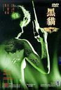

[黑猫](https://pewae.com/gaan/aHR0cHM6Ly93d3cuaW1kYi5jb20vdGl0bGUvdHQwMTAxNDYzLw==)

导演：冼杞然主演：仇云波 / 任达华 / 梁铮类型：动作 / 惊悚 / 爱情地区：加拿大 / 香港首映时间：1991

梁铮为了表现“倔强”，从头至尾脖子都没怎么正过。
虽然没露点，但是轻薄的白T恤冲水和白色内裤出逃出卖了导演的意图。

[浮城谜事](https://pewae.com/gaan/aHR0cHM6Ly9tb3ZpZS5kb3ViYW4uY29tL3N1YmplY3QvMTA0Mzg0MjY=)

导演：娄烨主演：常方源 / 朱亚文 / 瞿颖 / 祖峰 / 秦昊 / 郝蕾 / 齐溪类型：剧情 / 犯罪地区：大陆 / 法国首映时间：2012

片子拍的黏糊，不爽利。
郝蕾演得不好。
朱亚文的那个角色毫无意义。

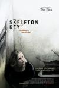

[万能钥匙](https://pewae.com/gaan/aHR0cHM6Ly9tb3ZpZS5kb3ViYW4uY29tL3N1YmplY3QvMTQxODc1Mg==)

原名：The Skeleton Key导演：伊恩·索夫特雷主演：乔伊·布赖恩特 / 凯特·哈德森 / 吉娜·罗兰兹 / 安·达芮普 / 弗里斯特·兰蒂斯 / 彼得·萨斯加德 / 托马斯·尤斯卡利 / 松雅·斯塔森 / 楚拉·M·马库斯 / 法隆尼·R·哈里斯类型：剧情 / 恐怖 / 悬疑地区：德国 / 美国首映时间：2005

探讨了什么是迷信，当你相信的时候，巫术才开始起作用，可以说相当有哲学意义了。
你真的能斩钉截铁地说出“我不信”吗？

[血衣天使](https://pewae.com/gaan/aHR0cHM6Ly9tb3ZpZS5kb3ViYW4uY29tL3N1YmplY3QvMTMwMzgwNg==)

导演：李志毅 / 邓衍成主演：关之琳 / 夏文汐 / 尔冬升 / 林琪欣 / 汤镇业类型：恐怖 / 惊悚地区：香港首映时间：1988

关之琳奉献了演艺生涯唯一一场（被）强奸的戏，还有半秒稍纵即逝的露（替身的）点。
夏文汐的屁股，啧啧。
汤镇业演黑老大太舒服了。

[偷窥无罪](https://pewae.com/gaan/aHR0cHM6Ly93d3cuaW1kYi5jb20vdGl0bGUvdHQwNDEwNDMzLw==)

导演：麦子善主演：任港秀 / 吴彦祖 / 姜皓文 / 林雅诗 / 王嘉荧 / 麦家琪类型：惊悚 / 神秘地区：香港首映时间：2002

脱而不露而言，麦家琪算相当敬业的一个了。
片子很简陋，摆明就是为了蹭当时璩美凤事件的热度。
吴彦祖好呆。

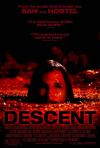

[黑暗侵袭](https://pewae.com/gaan/aHR0cHM6Ly9tb3ZpZS5kb3ViYW4uY29tL3N1YmplY3QvMTQzNzEwOQ==)

原名：The Descent导演：尼尔·马歇尔主演：克雷格·康威 / 奥列佛·米尔本 / 娜塔莉·杰克逊·门多萨 / 玛安娜·本灵 / 肖娜·麦克唐纳 / 萨斯基亚·马尔德 / 诺拉简·努恩 / 阿里克斯·瑞德类型：冒险 / 恐怖 / 惊悚地区：法国 / 英国首映时间：2005

小成本恐怖片成功的典范。
比洞穴更黑暗的是人性。

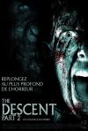

[黑暗侵袭2](https://pewae.com/gaan/aHR0cHM6Ly9tb3ZpZS5kb3ViYW4uY29tL3N1YmplY3QvMzA2NjA4Mw==)

原名：The Descent: Part 2导演：约翰·哈里斯主演：Doug Ballard / Jessika Williams / Josh Cole / Krysten Cummings / 乔希·达拉斯 / 加万·奥赫利希 / 娜塔莉·杰克逊·门多萨 / 安娜·斯科莱姆 / 玛安娜·本灵 / 肖娜·麦克唐纳类型：冒险 / 恐怖 / 惊悚地区：英国首映时间：2009

情节过于狗血，而且场景都不带换的，就是加了两个酱油男演员。
审美疲劳了。
结局是恐怖片常规操作，毫无意外。

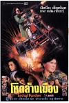

[惊天龙虎豹](https://pewae.com/gaan/aHR0cHM6Ly93d3cuaW1kYi5jb20vdGl0bGUvdHQwMDk5Mzc4Lw==)

导演：何志强主演：何家驹 / 卢惠光 / 吴启华 / 宫本洋子 / 方中信 / 林聪 / 玄智慧 / 胡慧中 / 谭镇渡 / 黄允才类型：动作地区：台湾 / 香港首映时间：1990

胡慧中就是打酱油的，主打的是韩国的玄智慧和日本的宫本洋子，都脱了。
那个时候香港无脑枪战片的典型，用料很足。
吴启华样子好贱啊。

[疯狂翘课之七日大作战](https://pewae.com/gaan/aHR0cHM6Ly9tb3ZpZS5kb3ViYW4uY29tL3N1YmplY3QvMTg5MjMzMw==)

原名：ぼくらの七日間戦争导演：菅原浩志主演：五十岚美穗 / 仓田保昭 / 大地康雄 / 大泽健 / 安孙子里香 / 室田日出男 / 宫泽理惠 / 工藤正贵 / 浅茅阳子 / 田中基类型：剧情 / 动作 / 喜剧地区：日本首映时间：1988

坦克开出来的一刻真是非常解气。
十五岁的宫泽理惠啊！

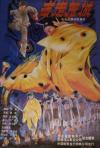

[夜走鬼城](https://pewae.com/gaan/aHR0cHM6Ly9tb3ZpZS5kb3ViYW4uY29tL3N1YmplY3QvMjA2NDc4MA==)

导演：胡刚主演：刘克明 / 陶青类型：恐怖地区：大陆首映时间：1989

脑洞蛮有趣的，各个角色都有些脸谱化。
那时期的电影总有些为了打而打的意思。
老神婆演得真好。

[老表发钱寒](https://pewae.com/gaan/aHR0cHM6Ly9tb3ZpZS5kb3ViYW4uY29tL3N1YmplY3QvMzA1MzEzMQ==)

原名：Easy Money导演：柯星沛主演：叶子楣 / 尹光 / 成奎安 / 雷宇扬 / 黄一山类型：动作 / 喜剧 / 爱情 / 犯罪地区：香港首映时间：1991

典型的跟风喜剧，尹光根本没演出大陆人的特色。
虎头蛇尾非常严重，前半部分还凑合，后面黄一山就是在硬拗。

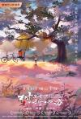

[树上有个好地方](https://pewae.com/gaan/aHR0cHM6Ly9tb3ZpZS5kb3ViYW4uY29tL3N1YmplY3QvMzAyOTkwNDA=)

导演：张忠华主演：刘盼 / 张新锋 / 杜旭光 / 许小周 / 陈骊山 / 马银秀类型：儿童 / 剧情 / 喜剧 / 家庭地区：大陆首映时间：2020

分数虚高太严重了，对我来说年代感是最大硬伤，怎么都不像90年代的故事。
美好的实习老师这个题材也太过时了。
所有的大小演员都在端着演，难受。

[团鬼六 女美容师绳饲育](https://pewae.com/gaan/aHR0cHM6Ly9tb3ZpZS5kb3ViYW4uY29tL3N1YmplY3QvNjAxNTkxNw==)

原名：団鬼六 女美容師縄飼育导演：伊藤秀裕主演：上野淳 / 中丸信 / 佐瀬陽一 / 南寿美子 / 布施绘里 / 志麻泉 / 木下隆康 / 松田章 / 沢木美伊子 / 麻吹淳子类型：情色地区：日本首映时间：1981

脑洞不错。
身材太普通。

[尸忆](https://pewae.com/gaan/aHR0cHM6Ly9tb3ZpZS5kb3ViYW4uY29tL3N1YmplY3QvMjYzNzMxNTQ=)

原名：The Bride导演：谢庭菡主演：严正岚 / 吴慷仁 / 江青霞 / 池端玲名 / 田中千绘 / 谢欣颖 / 陈楚翔类型：恐怖 / 惊悚地区：台湾 / 日本首映时间：2015

台湾恐怖片比大陆好的地方是真的可以有鬼。
但是来回穿插叙事的方法不喜欢，故弄玄虚。

[情色](https://pewae.com/gaan/aHR0cHM6Ly9iYWlrZS5iYWlkdS5jb20vaXRlbS8lRTclOTklQkQlRTUlQTQlQUElRTklOTglQjMvNTA1MDEzNj9mcm9tdGl0bGU9JUU2JTgzJTg1JUU4JTg5JUIyJmZyb21pZD03OTg3MTA=)

导演：朱延平主演：冯萃帆 / 吴敏 / 苏有朋 / 连碧东 / 郑家榆类型：剧情 / 爱情地区：台湾首映时间：1996

朱延平果然跟他自己说的一样，不会拍文艺片。
雨里的小猫好惨啊。
居然是严歌苓的原著。

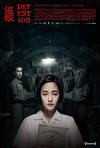

[返校](https://pewae.com/gaan/aHR0cHM6Ly93d3cuaW1kYi5jb20vdGl0bGUvdHQxMDgwNTQzMi8=)

导演：徐汉强主演：傅孟柏 / 张本渝 / 曾敬骅 / 朱宏章 / 王净 / 蔡思韵类型：恐怖 / 惊悚 / 神秘地区：台湾首映时间：2019

氛围营造比较成功，悬疑效果相当于没有。
其实片子是说美好生活来之不易，并且赞美反抗精神的，封禁实在是过敏了。

[红心女王](https://pewae.com/gaan/aHR0cHM6Ly9tb3ZpZS5kb3ViYW4uY29tL3N1YmplY3QvMzAyMzQ4OTE=)

原名：Dronningen导演：梅尔·图琪主演：丽芙·埃斯玛·丹妮曼 / 卡拉·菲利普·罗德 / 古斯塔夫·林德 / 埃拉·索尔加德 / 埃里亚斯·布德·克里斯滕森 / 崔娜·蒂虹 / 弗兰丹尼可·达尔·汉森 / 彼得·霍里 / 斯坦·吉登克恩 / 普雷本·克里斯滕森类型：剧情 / 情色地区：丹麦 / 瑞典首映时间：2019

题材之大胆令人咋舌，要说这尺度还得看欧洲电影。
老女人真恶心啊。

[阳光姐妹淘（2021）](https://pewae.com/gaan/aHR0cHM6Ly9tb3ZpZS5kb3ViYW4uY29tL3N1YmplY3QvMjY5MjQxNDM=)

原名：阳光姐妹淘（内地版）导演：包贝尔主演：倪虹洁 / 周洁琼 / 张歆艺 / 曾黎 / 梁颂晴 / 殷桃 / 王清 / 王玥婷 / 蒋小涵 / 马苏类型：喜剧地区：大陆首映时间：2021

没降到负分是因为原版底子太好了，成年演员演得也好，尤其是殷桃、倪虹洁和蒋小涵。
包贝尔的97年打造的太失败了，97年怎么可能有新潮少女还在听91年的《潇洒走一回》和《爱》，怎么可能有人花钱去看大烂片《大话西游》，怎么会有高中生的哥哥还没被消灭的，细节啊！
万万没相当我的童年偶像蒋小涵现在只能演胖妹。

[甩皮鬼](https://pewae.com/gaan/aHR0cHM6Ly9tb3ZpZS5kb3ViYW4uY29tL3N1YmplY3QvMjEzMzQwNQ==)

导演：陈会毅主演：何沛东 / 林正英 / 楼南光 / 翁世杰 / 谢伟杰 / 谢韵诗 / 金十二 / 金少龙 / 钟碧颖 / 陈颖芝类型：恐怖地区：香港首映时间：1992

僵尸片末路之作，晚期的英叔真是接了大量的烂片。
剧情虽然无稽，演员表现倒不差，最大的问题是港片特有的那种拍哪儿算哪儿的拖泥带水。

[最后的清晰时刻](https://pewae.com/gaan/aHR0cHM6Ly9tb3ZpZS5kb3ViYW4uY29tL3N1YmplY3QvMzAxNTAxNDc=)

原名：Last Moment of Clarity导演：Colin Krisel / James Krisel主演：John S. Howell Sr. / Kathy Sanders / Lucky Harmon / Mark Joy / Nicole Ansari-Cox / Robert Bess / 乌多·基尔 / 卡尔·E·兰德尔 / 卡莉·查肯 / 哈尔·奥赞类型：惊悚地区：美国首映时间：2020

为艺术献身的女艺术家之萨马拉维文。
非常无趣。

[黑狱圣女](https://pewae.com/gaan/aHR0cHM6Ly9iYWlrZS5iYWlkdS5jb20vaXRlbS8lRTklQkIlOTElRTclOEIlQjElRTUlOUMlQTMlRTUlQTUlQjM=)

导演：罗曼迪主演：何家驹 / 吴毅将 / 曹查理 / 罗棋 / 钟淑慧 / 高飞类型：动作地区：香港首映时间：2000

钟淑慧没脱，但是另两位女艺术家身材很有料。
吴毅将就是打了个酱油。
曹查理何家驹卧龙凤雏，表现相当不错。

[追爱时光机](https://pewae.com/gaan/aHR0cHM6Ly9tb3ZpZS5kb3ViYW4uY29tL3N1YmplY3QvMzAxOTIwODM=)

导演：吴琼主演：刘耀阳 / 潘春春 / 马聿泽类型：剧情 / 爱情地区：大陆首映时间：2018

意料之中的无聊。
这年头还有人仿着徐冬冬给自己起艺名（潘春春）。
一分给女主的假体。

[追虎擒龙](https://pewae.com/gaan/aHR0cHM6Ly9tb3ZpZS5kb3ViYW4uY29tL3N1YmplY3QvMzI0OTM2NjY=)

导演：王晶 / 许悦铭主演：何浩文 / 刘浩龙 / 古天乐 / 吴镇宇 / 姜皓文 / 李天翔 / 林子善 / 林家栋 / 梁家辉 / 胡然类型：剧情 / 动作 / 犯罪地区：大陆 / 香港首映时间：2021

典型的编了一半编不下去了，草草收尾。
一个雷洛，王晶整整玩了30年，也该够了吧，即使这次能够看出是有很多顺应时代的变化的。
香港电影就像垂垂老矣的梁家辉吴镇宇古天乐林家栋郑则仕们，挂在脸上的勉强。

[大人的事情](https://pewae.com/gaan/aHR0cHM6Ly9tb3ZpZS5kb3ViYW4uY29tL3N1YmplY3QvMzUxMjc1NDY=)

原名：おとなの事情 スマホをのぞいたら导演：光野道夫主演：东山纪之 / 常盘贵子 / 木南晴夏 / 渊上泰史 / 田口浩正 / 益冈彻 / 铃木保奈美类型：喜剧地区：日本首映时间：2021

日本版改动挺大的，也是很失败的，窃以为最大的败笔是大量的独白稀释了人物间冲突的紧张感。
铃木保奈美和常盘贵子真是美人迟暮啊。
创新的部分是给7个人的相遇安排了一个共同遭遇台风的事由，虽然无关紧要。

[消失的子弹](https://pewae.com/gaan/aHR0cHM6Ly9tb3ZpZS5kb3ViYW4uY29tL3N1YmplY3QvNjk5MTExMA==)

导演：罗志良主演：井柏然 / 刘青云 / 吴刚 / 廖启智 / 杨幂 / 江一燕 / 王紫逸 / 谢霆锋 / 郑希怡 / 高虎类型：动作 / 悬疑 / 犯罪地区：大陆 / 香港首映时间：2012

悬疑片最容易出现好评和差评，平庸是很难做到的，本片恰恰平庸。
杨幂、廖启智、井柏然、江一燕都是让人出戏的存在，这应该怪导演。

[寂静之地](https://pewae.com/gaan/aHR0cHM6Ly9tb3ZpZS5kb3ViYW4uY29tL3N1YmplY3QvMjY5OTc2NjM=)

原名：A Quiet Place导演：约翰·卡拉辛斯基主演：凯德·伍德沃德 / 桃乐丝·麦卡锡 / 米利森特·西蒙兹 / 约翰·卡拉辛斯基 / 艾米莉·布朗特 / 诺亚·尤佩 / 里昂·拉瑟姆类型：恐怖 / 惊悚地区：美国首映时间：2018

节奏感非常棒的恐怖片，或者说“紧张”片。
真希望每节地铁车厢里都有一只这种怪物。

[警察日记](https://pewae.com/gaan/aHR0cHM6Ly9tb3ZpZS5kb3ViYW4uY29tL3N1YmplY3QvMjA0MjY5NzM=)

导演：宁瀛主演：侯岩松 / 孙亮 / 王景春 / 白波 / 袁利坚 / 陈维涵类型：剧情 / 悬疑 / 惊悚 / 犯罪地区：大陆首映时间：2014

假得可爱的主旋律片，有理由相信豆瓣是有人控评的，虽然王景春演得确实不错。
间接宣传了一波鬼城风光。
最可恨挖坑不填。

[左拉](https://pewae.com/gaan/aHR0cHM6Ly9tb3ZpZS5kb3ViYW4uY29tL3N1YmplY3QvMzAyNDg1MjA=)

原名：Zola导演：加妮克扎·布拉沃主演：Ben Bladon / Ernest Emmanuel Peeples / Joseph Sanders / Tommy Foxhill / Tony Demil / 丽莉·吉欧 / 卡梅伦·布鲁姆布罗 / 安德鲁·罗马诺 / 尼可拉斯·博朗 / 尼尔西·索弗朗类型：剧情 / 喜剧 / 犯罪地区：美国首映时间：2020

42分钟高能预警。
其余时间就演了个寂寞。

[哗鬼旅行团](https://pewae.com/gaan/aHR0cHM6Ly9tb3ZpZS5kb3ViYW4uY29tL3N1YmplY3QvMTMwMTI1Nw==)

导演：刘仕裕主演：吴君如 / 曹查理 / 林正英 / 熊欣欣 / 胡枫 / 邱建国 / 黄一飞类型：喜剧 / 恐怖地区：香港首映时间：1992

烂到吴君如和林正英都接不住，笑点都很尬。
黑大陆黑得毫无水准。

[大脑中的猫](https://pewae.com/gaan/aHR0cHM6Ly9tb3ZpZS5kb3ViYW4uY29tL3N1YmplY3QvMjk4MTU3OQ==)

原名：A Cat in the Brain导演：Lucio Fulci主演：David L. Thompson / Jeoffrey Kennedy / Lucio Fulci / Malisa Longo / Robert Egon类型：恐怖地区：意大利首映时间：1990

血量和奶量都很充足。
一个恐怖片导演分不清现实和虚幻的故事，因为是导演自导自演的，所以也可能是本人写照。
配乐走位风骚。

[勾魂妖女](https://pewae.com/gaan/aHR0cHM6Ly9tb3ZpZS5kb3ViYW4uY29tL3N1YmplY3QvMTI5NTA5Ng==)

原名：Dolcemente atroce导演：Tonino Cervi主演：Gianni Santuccio / Guido Alberti / Haydée Politoff / Ida Galli / Ray Lovelock / Silvia Monti类型：恐怖地区：意大利 / 法国首映时间：1970

意大利聊斋小故事
一切都很平庸，甚至不是铅黄，因为没有露点。

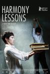

[和谐课程](https://pewae.com/gaan/aHR0cHM6Ly9tb3ZpZS5kb3ViYW4uY29tL3N1YmplY3QvMjEwOTg3MjU=)

原名：Uroki garmonii导演：埃米尔·拜加津主演：Adlet Anarbekov / Anelya Adilbekova / Asan Kirkabayev / Aslan Anarbayev / Bagila Kobenova / Beibitzhan Muslimov / Daulet Anarbekov / Erasyl Nurzhakyp / Mukhtar Andassov / Nurdaulet Orazymbetov类型：剧情地区：哈萨克斯坦 / 德国 / 法国首映时间：2013

各国都很喜欢的校园霸凌题材，拍得很收敛。
掺杂了中亚的贫困和宗教题材。
某些镜头过于刻意，总体很不错。

[牧人的性玩偶](https://pewae.com/gaan/aHR0cHM6Ly9tb3ZpZS5kb3ViYW4uY29tL3N1YmplY3QvMzgwNDc5MA==)

原名：Sennentuntschi: Curse of the Alps导演：迈克尔·斯特内主演：Carlos Leal / Joel Basman / Nicholas Ofczarek / Roxane Mesquida类型：悬疑地区：瑞士首映时间：2010

两根时间轴来回交替制作悬念玩得相当不错。
剥皮填草这种说法，原来欧洲也有啊。
女主角颜值相当能打。

[黑道丧尸](https://pewae.com/gaan/aHR0cHM6Ly9tb3ZpZS5kb3ViYW4uY29tL3N1YmplY3QvMzUzOTEyMDk=)

原名：Witness Infection导演：安迪·帕尔默主演：Gary Anthony Williams / 埃瑞恩·海耶斯 / 塔拉·斯特朗类型：喜剧 / 恐怖地区：美国首映时间：2021

无聊。

[浪潮](https://pewae.com/gaan/aHR0cHM6Ly9tb3ZpZS5kb3ViYW4uY29tL3N1YmplY3QvMjI5NzI2NQ==)

原名：Die Welle导演：丹尼斯·甘塞尔主演：于尔根·福格尔 / 克里斯蒂娜·度·瑞格 / 克里斯蒂安娜·保罗 / 埃利亚斯·穆巴里克 / 弗雷德里克·劳 / 詹妮弗·乌尔里希 / 雅各布·马琛茨 / 马克思·雷迈特 / 马克斯·毛夫 / 马克西米利安·福尔马尔类型：剧情 / 惊悚地区：德国首映时间：2008

从小事做起，直到集权的巅峰。
我太喜欢结尾了，有种被推着不受控的癫狂。
所以欧洲人才把共产主义叫做幽灵吧。

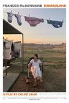

[无依之地](https://pewae.com/gaan/aHR0cHM6Ly93d3cuaW1kYi5jb20vdGl0bGUvdHQ5NzcwMTUwLw==)

原名：Nomadland导演：赵婷主演：卡特·克利福德 / 大卫·斯特雷泽恩 / 弗兰西斯·麦克多蒙德 / 德里克·贾尼斯 / 泰·斯特雷泽恩类型：剧情地区：美国首映时间：2020

孤独感是有的，但太零碎了。
就这？可能是没有公路文化的原因吧，根本无法引发共情。
麦克多蒙德演技快要溢出屏幕了。

[奇迹男孩](https://pewae.com/gaan/aHR0cHM6Ly9tb3ZpZS5kb3ViYW4uY29tL3N1YmplY3QvMjY3ODc1NzQ=)

原名：Wonder导演：斯蒂芬·卓博斯基主演：丹妮尔·罗丝·拉塞尔 / 伊扎贝拉·维多维奇 / 凯尔·布瑞特科夫 / 布莱斯·吉扎尔 / 戴维德·迪格斯 / 曼迪·帕廷金 / 朱莉娅·罗伯茨 / 欧文·威尔逊 / 泰·孔西利奥 / 米莉·戴维斯类型：儿童 / 剧情 / 家庭地区：美国 / 香港首映时间：2018

因为故事简单，所以想拍好就更难，这个导演做到了。
一切都特别美好，我喜欢女儿的那个朋友。
朱莉娅罗伯茨比20年前要漂亮。

[吸血鬼生活](https://pewae.com/gaan/aHR0cHM6Ly9tb3ZpZS5kb3ViYW4uY29tL3N1YmplY3QvMjU3OTQyMzA=)

原名：What We Do in the Shadows导演：塔伊加·维迪提 / 杰梅奈·克莱门特主演：乔尼·布鲁 / 凯伦·奥利里 / 切尔西·普雷斯顿·克雷福德 / 埃琳娜·斯泰伊科 / 塔伊加·维迪提 / 斯图·拉瑟福德 / 本·弗兰舍姆 / 杰姬·凡·比克 / 杰梅奈·克莱门特 / 杰森·霍伊特类型：喜剧 / 奇幻 / 恐怖地区：新西兰 / 美国首映时间：2014

老掉牙的吸血鬼题材还能玩出伪纪录片的花，相当难得。
片中的特效特别简朴，好玩。
抛开创意就很一般了。

[一个经典的恐怖故事](https://pewae.com/gaan/aHR0cHM6Ly9tb3ZpZS5kb3ViYW4uY29tL3N1YmplY3QvMzUxODU0OTQ=)

原名：A Classic Horror Story导演：Paolo Strippoli / 罗伯托·迪·菲奥主演：Cristina Donadio / Francesca Cavallin / Peppino Mazzotta / Yuliia Sobol / 弗朗西斯科·罗素 / 玛蒂尔达·鲁茨 / 维尔·梅里克 / 贾斯汀·科罗夫金 / 阿利达·巴尔达里·卡拉布里亚类型：剧情 / 恐怖 / 悬疑 / 惊悚地区：意大利首映时间：2021

啥也不是，分是给血量的。

[悲伤的贝拉多娜](https://pewae.com/gaan/aHR0cHM6Ly9tb3ZpZS5kb3ViYW4uY29tL3N1YmplY3QvMTQ3NzMxNw==)

原名：哀しみのベラドンナ导演：山本映一主演：中山千夏 / 仲代达矢 / 长山蓝子类型：剧情 / 动画 / 奇幻地区：日本首映时间：1973

手冢大神制作的风格极为抽象写意的黄色动画片。
故意做成了卡帧的样子，但是每一帧都是艺术品。
美中不足就是结尾时说教味太浓。

[流浪汉世界杯](https://pewae.com/gaan/aHR0cHM6Ly9tb3ZpZS5kb3ViYW4uY29tL3N1YmplY3QvMzYxOTA3MQ==)

导演：关信辉主演：元华 / 刘以达 / 孙耀威 / 张晋 / 林嘉华 / 王祖蓝 / 许绍雄 / 黄德斌 / 黎姿类型：剧情 / 运动地区：香港首映时间：2009

励志是真励志，生硬是真生硬。
黎姿这片的时候已经不年轻了，真是漂亮啊。
孙耀威就不是演电影的料，不过他唱的主题歌挺好听。

[鸡鸭恋](https://pewae.com/gaan/aHR0cHM6Ly93d3cuaW1kYi5jb20vdGl0bGUvdHQwMTEwMTk0Lw==)

原名：Gigolo and Whore导演：唐基明主演：任达华 / 刘嘉玲 / 梁韵蕊类型：喜剧地区：香港首映时间：1991

第一次觉得刘嘉玲年轻的时候长相还是有可取之处的。
任达华演鸭绝对有一套。
缺乏整体性。

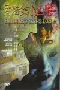

[香港第一凶宅](https://pewae.com/gaan/aHR0cHM6Ly9tb3ZpZS5kb3ViYW4uY29tL3N1YmplY3QvMTMwNDAyMw==)

导演：杜励智主演：张玉珊 / 林尚义 / 罗兰 / 黄秋生 / 黎姿类型：剧情 / 恐怖地区：香港首映时间：1998

不出色也不出戏。
黄秋生的角色找黄秋生来演，浪费了。

[敦煌夜谭](https://pewae.com/gaan/aHR0cHM6Ly93d3cuaW1kYi5jb20vdGl0bGUvdHQwMTAxNzU0Lw==)

导演：李翰祥主演：周洁 / 王小凤 / 王霄类型：冒险 / 剧情 / 爱情地区：台湾 / 香港首映时间：1991

李翰祥大师后期作品，强烈的古早味。
资料上说是港台合拍，实际上是三地合拍，片中的敦煌鸣沙山月牙湖是实地取景的，主题歌和插曲是田震唱的。
王小凤竟然也演过这种片，不过那个露点镜头应该是裸替。

[狼溪](https://pewae.com/gaan/aHR0cHM6Ly9tb3ZpZS5kb3ViYW4uY29tL3N1YmplY3QvMTQyNDY2MQ==)

原名：Wolf Creek导演：克瑞格·麦克林恩主演：Andrew Reimer / David Rock / Geoff Revell / Gordon Poole / Guy O类型：恐怖地区：澳大利亚首映时间：2005

还可以，平均水平的恐怖片。
前半部分叙事太墨迹。
某些镜头take得很唯美。

[狼溪2](https://pewae.com/gaan/aHR0cHM6Ly9tb3ZpZS5kb3ViYW4uY29tL3N1YmplY3QvMTA3NDU0MTI=)

原名：Wolf Creek 2导演：克瑞格·麦克林恩主演：克洛伊·博勒姆 / 安妮·拜伦 / 尚恩·康纳 / 本·杰拉德 / 杰拉德·肯尼迪 / 瑞安·柯尔 / 约翰·贾瑞特 / 菲利普·克劳斯 / 香努·艾诗琳类型：惊悚地区：澳大利亚首映时间：2014

导演进步很大，保持了“嘎嘣脆”的风格，比大多数好莱坞恐怖片要流畅。
反正就是难逃一死，纯粹的坏人更有表现力。
就是逻辑上不大说得通，澳洲警察都是吃屎的。

[风中有朵雨做的云](https://pewae.com/gaan/aHR0cHM6Ly9tb3ZpZS5kb3ViYW4uY29tL3N1YmplY3QvMjY3Mjg2Njk=)

原名：The Shadow Play导演：娄烨主演：井柏然 / 单宝中 / 宋佳 / 张颂文 / 梁致力 / 王维申 / 秦昊 / 罗义民 / 胡伶 / 陈伟榕类型：剧情 / 悬疑 / 犯罪地区：大陆首映时间：2019

在文艺和矫情之间反复横跳，这正是熟悉的大导演娄烨的味道。
马思纯的选择绝对失败，她演不好这种小女孩。
张颂文非常出色。

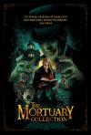

[停尸房收藏](https://pewae.com/gaan/aHR0cHM6Ly9tb3ZpZS5kb3ViYW4uY29tL3N1YmplY3QvMzAyNTczODY=)

原名：The Mortuary Collection导演：瑞恩·斯宾德尔主演：Ben Hethcoat / Bradley Bundlie / Brennan Murray / 克兰西·布朗 / 克里斯汀·基默 / 凯特琳·卡斯特 / 山姆·艾德森 / 巴拉克·哈德利 / 汤姆·伍德鲁夫 / 珍妮弗·厄文类型：奇幻 / 恐怖地区：美国首映时间：2019

第二个印象最深刻，从哪儿进，从哪儿出。
最后的反转虽然是意料之中，但在美式恐怖片里已然算上乘之作了。

[恐惧岛](https://pewae.com/gaan/aHR0cHM6Ly9tb3ZpZS5kb3ViYW4uY29tL3N1YmplY3QvMzA3MjE3NA==)

原名：Fear Island导演：Michael Storey主演：凯尔·施密德 / 海莉·达芙 / 露西·海尔类型：恐怖 / 悬疑 / 惊悚地区：加拿大首映时间：2009

中规中矩的悬疑片，对于阅片量一定程度的观众来说，没藏住。
女主角不错，其余卡司不太行。

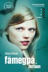

[艾玛好色](https://pewae.com/gaan/aHR0cHM6Ly9tb3ZpZS5kb3ViYW4uY29tL3N1YmplY3QvNTE1MjMzMw==)

原名：Få meg på, for faen导演：杨尼克·西斯泰德·雅各布森主演：Arthur Berning / Helene Bergsholm / Henriette Steenstrup / Julia Bache-Wiig / Julia Schacht类型：喜剧地区：挪威首映时间：2011

非常不错的青春期女权电影。
挪威的小镇感觉轻松。
结局可以说是相当温暖了。

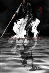

[影](https://pewae.com/gaan/aHR0cHM6Ly9tb3ZpZS5kb3ViYW4uY29tL3N1YmplY3QvNDg2NDkwOA==)

导演：张艺谋主演：关晓彤 / 吴磊 / 孙俪 / 封柏 / 王千源 / 王景春 / 胡军 / 邓超 / 郑恺类型：剧情 / 动作 / 古装 / 武侠地区：大陆 / 香港首映时间：2018

炫技的张艺谋。
王景春演得好棒。

[好梦一日游](https://pewae.com/gaan/aHR0cHM6Ly9tb3ZpZS5kb3ViYW4uY29tL3N1YmplY3QvMzAzNzE4MTg=)

原名：La Belle Époque导演：尼古拉斯·贝多斯主演：丹尼尔·奥特伊 / 吉约姆·卡内 / 多莉亚·蒂利耶 / 德尼·波达利德斯 / 皮埃尔·阿迪提 / 芬妮·阿尔丹类型：剧情 / 喜剧 / 爱情地区：比利时 / 法国首映时间：2019

令人身心愉快的轻喜剧，法国风味浓郁。

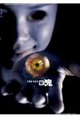

[见鬼十法](https://pewae.com/gaan/aHR0cHM6Ly9tb3ZpZS5kb3ViYW4uY29tL3N1YmplY3QvMTMwOTIxNw==)

导演：彭发 / 彭顺主演：古宇 / 杨淇 / 梁洛施 / 陈柏霖 / 雷·麦克唐纳类型：喜剧 / 恐怖 / 惊悚地区：香港首映时间：2005

看如何看待这部片子了，如果当恐怖片，那么一无是处，但如果当成港式特色的恐怖喜剧片，就还算不赖。
梁洛施的颜值巅峰，陈柏林也挺有趣的。
主线弱了点。

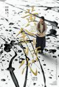

[黄金时代（2014）](https://pewae.com/gaan/aHR0cHM6Ly9tb3ZpZS5kb3ViYW4uY29tL3N1YmplY3QvMTA1NDU5Mzk=)

原名：黄金时代导演：许鞍华主演：丁嘉丽 / 冯绍峰 / 冯雷 / 张译 / 朱亚文 / 汤唯 / 沙溢 / 王千源 / 王志文 / 田原类型：传记 / 剧情 / 爱情地区：大陆 / 香港首映时间：2014

片名真的不如直接叫萧红传，现在的片名太大了，剧情撑不起来。
拍出了萧红一生的凄苦，但是最后香港的故事太拖沓了。
王志文难得演一回善长仁翁，特别有气度。

[屏住呼吸](https://pewae.com/gaan/aHR0cHM6Ly9tb3ZpZS5kb3ViYW4uY29tL3N1YmplY3QvMjY3MDQ2MjA=)

原名：Don't Breath导演：费德·阿尔瓦雷兹主演：丹娜·克拉克 / 丹尼尔·祖瓦图 / 克里斯蒂安·泽吉亚 / 卡提亚·波克 / 史蒂芬·朗 / 奥利维亚·吉尔斯 / 弗兰西斯卡·托朗西斯科 / 瑟吉·诺普科 / 简·利维 / 艾玛·博科维奇类型：恐怖 / 惊悚地区：美国首映时间：2016

恐怖片在双方都没有超能力的情况下开整，真是好多年没见过了。
瞎子老头靠闻鞋确定了家里不仅一个入侵者，一种名为合理的味道。
女主角跟普通烂片一样作死的设定是唯一的遗憾。

[利刃出鞘](https://pewae.com/gaan/aHR0cHM6Ly9tb3ZpZS5kb3ViYW4uY29tL3N1YmplY3QvMzAzMTgxMTY=)

原名：Knives Out导演：莱恩·约翰逊主演：K·卡兰 / 丹尼尔·克雷格 / 克里斯·埃文斯 / 克里斯托弗·普卢默 / 凯瑟琳·兰福德 / 勒凯斯·斯坦菲尔德 / 唐·约翰逊 / 安娜·德·阿玛斯 / 弗兰克·奥兹 / 托妮·科莱特类型：剧情 / 喜剧 / 悬疑 / 犯罪地区：美国首映时间：2019

作为悬疑片，最重要的节奏感非常棒。
逻辑上只能说中规中矩，符合对商业片的一般要求。
一帮好莱坞老戏骨的表演绝对有加分。

[河豚](https://pewae.com/gaan/aHR0cHM6Ly9tb3ZpZS5kb3ViYW4uY29tL3N1YmplY3QvMzU0OTY4MDM=)

导演：邢健钧主演：张睿 / 钟欣潼类型：剧情地区：大陆首映时间：2021

片子拍得配不上拉来的虎皮：“最高人民检察院影视中心”。
悬念还是有的，但是剧本的细致程度、服化道和演员的水平都不太行。

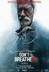

[屏住呼吸2](https://pewae.com/gaan/aHR0cHM6Ly9tb3ZpZS5kb3ViYW4uY29tL3N1YmplY3QvMjY5MTU5MjE=)

原名：Don导演：罗多·赛亚格斯主演：亚当·扬 / 克里斯蒂安·泽吉亚 / 史蒂芬·朗 / 布兰登·萨克斯顿 / 戴安娜·巴尼科娃 / 斯蒂芬妮·阿西拉 / 罗奇·威廉姆斯 / 罗恩·罗格尔 / 马德琳·格雷斯 / 鲍比·斯科菲尔德类型：恐怖 / 惊悚地区：塞尔维亚 / 美国首映时间：2021

第二部跟第一部比真是差了好多好多，紧张感完全消失了。
一句话总结剧情，就是抛弃自己狗的人没有好下场。

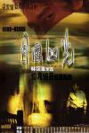

[目露凶光](https://pewae.com/gaan/aHR0cHM6Ly9tb3ZpZS5kb3ViYW4uY29tL3N1YmplY3QvMTMwNTg0Mw==)

导演：林岭东主演：关宝慧 / 刘青云 / 梁家辉 / 邹兆龙 / 郭蔼明 / 钟景辉 / 黎耀祥类型：恐怖 / 惊悚地区：香港首映时间：1999

前小半部分不算太好，过于神叨叨的，但是等到黎耀祥死掉，转入后半部分之后，实在太爽了。
大概是香港人面对金融危机的真实感触吧。

[老师·好](https://pewae.com/gaan/aHR0cHM6Ly9tb3ZpZS5kb3ViYW4uY29tL3N1YmplY3QvMjc2NjM3NDI=)

导演：张栾主演：于谦 / 何冰 / 吴京 / 孙艺杨 / 张国立 / 徐子力 / 徐紫茵 / 汤梦佳 / 王广源 / 田雨类型：剧情地区：大陆首映时间：2019

于谦老师拍片的水准真的不低。
客串阵容实在太浪费了。
什么鬼结尾。

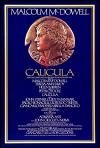

[罗马帝国艳情史](https://pewae.com/gaan/aHR0cHM6Ly93d3cuaW1kYi5jb20vdGl0bGUvdHQwMDgwNDkxLw==)

原名：Caligula导演：丁度·班德拉斯主演：彼得·奥图尔 / 海伦·米伦 / 特里萨·安妮·萨沃伊 / 马尔科姆·麦克道威尔类型：剧情 / 历史地区：意大利 / 美国首映时间：1979

除了场面宏大以及尺度大以外，倒也没什么别的特色了。
演主角他妹的演员惊艳，而且70年代都不剃毛的。
这部片子推进了欧洲分级制度的建立，但本身确实是未分级的。

[老板娘](https://pewae.com/gaan/aHR0cHM6Ly9tb3ZpZS5kb3ViYW4uY29tL3N1YmplY3QvMzUzOTEyODQ=)

导演：姜国民 / 王晶主演：刘腾远 / 徐冬冬 / 方敏婷 / 桂晶晶 / 解斯童 / 谢苗类型：剧情 / 动作地区：大陆首映时间：2021

王晶对徐冬冬可真是捧啊。
谢苗竟然长残成了这样。
网大真是什么烂剧本都敢拍。

[X特遣队：全员集结](https://pewae.com/gaan/aHR0cHM6Ly9tb3ZpZS5kb3ViYW4uY29tL3N1YmplY3QvMjY3NDE2MzI=)

原名：The Suicide Squad导演：詹姆斯·古恩主演：乔尔·金纳曼 / 伊德里斯·艾尔巴 / 内森·菲利安 / 华金·科西奥 / 大卫·达斯马齐连 / 彼得·卡帕尔迪 / 斯托姆·瑞德 / 杰·科特尼 / 玛格特·罗比 / 皮特·戴维森类型：冒险 / 动作 / 喜剧 / 科幻地区：加拿大 / 美国 / 英国首映时间：2021

导演风格强烈的一部作品，合格的爆米花。
这种反超级英雄风还挺对胃口的。
叛军有个大咪咪秘书，可惜给的镜头太少了。

[成人婴儿的进攻](https://pewae.com/gaan/aHR0cHM6Ly9tb3ZpZS5kb3ViYW4uY29tL3N1YmplY3QvMjcwODI4MzY=)

原名：Attack of the Adult Babies导演：多米尼克·布伦特主演：Andrew Dunn / Andy Abrahams / Charlie Chuck / Howard Ellis / Kate Coogan / Keith Hardy / Nicky Evans / Samantha Daniels / Simon Corble / Steph Easter类型：恐怖地区：英国首映时间：2017

吃屎拉黄金这个设定如果好好搞，会非常有趣，可惜制作团队心有余而力不足。
一个优点是所有人都死得很干脆，没有狗血反杀。
女主角后半段脸上一直有屎，干的漂亮。

[逃出珊瑚海](https://pewae.com/gaan/aHR0cHM6Ly9tb3ZpZS5kb3ViYW4uY29tL3N1YmplY3QvNDMxMDIzNA==)

原名：Escape from Coral Cove导演：张家振主演：左燕翎 / 张耀扬 / 方中信 / 梁婉静 / 秦煌 / 胡枫 / 陈奕诗类型：恐怖地区：香港首映时间：1986

当年的噱头卖点应该是水下摄像机，不过作为恐怖片实在是买点缺缺。
那时候的胡枫也不怎么年轻。

[出埃及记](https://pewae.com/gaan/aHR0cHM6Ly9tb3ZpZS5kb3ViYW4uY29tL3N1YmplY3QvMjIyOTQyNw==)

导演：彭浩翔主演：任达华 / 余安安 / 刘心悠 / 单立文 / 张家辉 / 林家栋 / 温碧霞 / 詹瑞文 / 邵美琪 / 邵音音类型：剧情 / 喜剧 / 犯罪地区：香港首映时间：2007

不知最终是否达到了彭导想要的效果，但这个男人堕落的故事实在没必要拍那么复杂。
刘心悠表现不错。

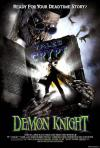

[魔鬼骑士](https://pewae.com/gaan/aHR0cHM6Ly9tb3ZpZS5kb3ViYW4uY29tL3N1YmplY3QvMTI5MzU2NQ==)

原名：Tales from the Crypt: Demon Knight导演：Gilbert Adler / 厄内斯特·R·迪克森主演：威廉姆·赛德勒 / 比利·赞恩 / 约翰·卡西尔 / 贾达·萍克·史密斯类型：恐怖 / 惊悚地区：美国首映时间：1995

拍摄得相当不错，除了宗教意味有点浓。
最大亮点是魔鬼各个击破进行诱惑。
没想到九十年代中期就是遇到鬼后只活一个女黑人的设定了。

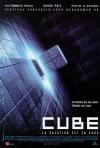

[心慌方](https://pewae.com/gaan/aHR0cHM6Ly9tb3ZpZS5kb3ViYW4uY29tL3N1YmplY3QvMTMwNTkwMw==)

原名：Cube导演：文森佐·纳塔利主演：大卫·休莱特 / 妮可·德波儿 / 妮基·瓜达尼 / 安德鲁·米勒 / 朱利安·瑞钦斯 / 毛里斯·迪恩·温特 / 韦恩·罗布森类型：悬疑 / 惊悚 / 科幻地区：加拿大首映时间：1997

大名鼎鼎的异次元杀阵，多次错过后终于有空看了，但实在是平平，加1分类型鼓励分。

[波西米亚狂想曲](https://pewae.com/gaan/aHR0cHM6Ly9tb3ZpZS5kb3ViYW4uY29tL3N1YmplY3QvNTMwMDA1NA==)

原名：Bohemian Rhapsody导演：布莱恩·辛格主演：基兰·哈德卡斯托 / 拉米·马雷克 / 本·哈迪 / 杰克·罗思 / 格威利姆·李 / 梅内卡·达斯 / 汤姆·霍兰德 / 约瑟夫·梅泽罗 / 艾丹·吉伦 / 艾伦·里奇类型：传记 / 剧情 / 同性 / 音乐地区：美国 / 英国首映时间：2019

看完的真实感受是，这号人也配作传……

[一个勺子](https://pewae.com/gaan/aHR0cHM6Ly9tb3ZpZS5kb3ViYW4uY29tL3N1YmplY3QvMjU5MjYyNjc=)

导演：陈建斌主演：王学兵 / 王旭峰 / 蒋勤勤 / 金世佳 / 陈建斌类型：剧情 / 喜剧地区：大陆首映时间：2015

角度不错，中戏人就是首先注重戏剧冲突。
王学兵不错的。
新导演的通病，用力过猛，想法太多。

[重金属](https://pewae.com/gaan/aHR0cHM6Ly9tb3ZpZS5kb3ViYW4uY29tL3N1YmplY3QvMTI5OTMxOQ==)

导演：梁小熊主演：李婉华 / 梁琤 / 王盛德 / 陈启泰类型：动作地区：香港首映时间：1994

梁铮和李婉华两位糊咖主演，剧情一塌糊涂。
动作戏平平。

[猛鬼爱情故事](https://pewae.com/gaan/aHR0cHM6Ly9tb3ZpZS5kb3ViYW4uY29tL3N1YmplY3QvNjg3MDY5Mg==)

导演：叶念琛 / 王晶主演：周秀娜 / 杨梓瑶 / 梁家仁 / 梁进龙 / 罗子溢 / 谢婷婷 / 邓丽欣 / 鲍起静类型：剧情 / 恐怖 / 惊悚 / 爱情地区：香港首映时间：2011

两个故事，第一个王晶自己拍的，可以说相当混乱，不及格。
但是第二个叶念琛拍得相当可以，悬念感足足的。
邓丽欣的形象惊艳。

[凶男寡女](https://pewae.com/gaan/aHR0cHM6Ly9tb3ZpZS5kb3ViYW4uY29tL3N1YmplY3QvMzA2NTQyOQ==)

导演：王晶 / 钟少雄主演：何华超 / 张耀扬 / 梁敏仪 / 谢天华 / 钟丽缇类型：惊悚地区：香港首映时间：2005

导演对不起王晶策划的故事。
钟丽缇其实很少演戏份重的女一，这次只能说中规中矩，时不时冒出推动剧情的独白只能说导演是饼才，最后演疯子是在卖萌吗？
大天二角色设计得很失败，张耀扬的第一句台词一出来就知道大BOSS是谁了。

[沐浴之王](https://pewae.com/gaan/aHR0cHM6Ly9tb3ZpZS5kb3ViYW4uY29tL3N1YmplY3QvMzQ4OTQ3NTM=)

原名：Bath Buddy导演：易小星主演：乔杉 / 刘循子墨 / 卜冠今 / 巴多 / 张本煜 / 彭昱畅 / 房子斌 / 朱时茂 / 柯达 / 桑平类型：喜剧地区：大陆首映时间：2020

太一般。
最有趣的一小段是乔杉酒吧遇到假酒那块，但几个老阿姨后面就没呼应了，这就很没意思。
张本煜身材真不错。

[好莱坞俗套大吐槽](https://pewae.com/gaan/aHR0cHM6Ly9tb3ZpZS5kb3ViYW4uY29tL3N1YmplY3QvMzU1ODAxNjc=)

原名：Attack of the Hollywood Cliches!导演：Alice Mathias / Ricky Kelehar / Sean Doherty主演：Francine Stock / Franklin Leonard / Jack Howard / Nathan Rabin / 乔纳森·罗斯 / 基斯·卢卡斯 / 安德鲁·加菲尔德 / 山姆·哈格雷夫 / 弗洛伦丝·皮尤 / 桑吉夫·巴哈斯卡类型：喜剧 / 纪录地区：美国首映时间：2021

没比豆瓣上的人总结得更好，但是剪接是很专业。
素材用的片子都比较有名。

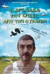

[一丝偶然](https://pewae.com/gaan/aHR0cHM6Ly9tb3ZpZS5kb3ViYW4uY29tL3N1YmplY3QvNjI4NDc0OA==)

原名：Un cuento chino导演：塞巴斯帝安·波连斯坦主演：Enric Cambray / Iván Romanelli / 穆列尔·圣安娜 / 里卡多·达林 / 黄胜煌类型：喜剧地区：西班牙 / 阿根廷首映时间：2011

阿根廷的电影往往带有一种邪劲，而这正是我所喜欢的。
虽然我没有进入过任何一家大使馆，但仍旧觉得本片对中国大使馆的刻画入木三分。

[敦煌](https://pewae.com/gaan/aHR0cHM6Ly9tb3ZpZS5kb3ViYW4uY29tL3N1YmplY3QvMTMwMzM5MA==)

导演：佐藤纯弥主演：三田佳子 / 中川安奈 / 佐藤浩市 / 原田大二郎 / 新藤荣作 / 柄本明 / 渡濑恒彦 / 田村高广 / 蜷川幸雄 / 西田敏行类型：剧情 / 历史 / 古装地区：大陆 / 日本首映时间：1988

战争戏有多震撼，感情戏就有多拉垮。
当时正值中日蜜月期，日本拍片是真花了大成本，中国开发的景点也很牛叉。
女主水嫩。

[艳鬼发狂](https://pewae.com/gaan/aHR0cHM6Ly9tb3ZpZS5kb3ViYW4uY29tL3N1YmplY3QvMTI5OTM4Mg==)

导演：黎大炜主演：王小凤 / 萧玉龙 / 邝美宝类型：恐怖 / 悬疑 / 惊悚 / 犯罪地区：香港首映时间：1984

部分桥段和镜头以1984年的眼光来看非常带劲，可惜缺乏整体性。
一惊一乍的塑料音效是很大的扣分项。
黄夏蕙的扮相太独特了。

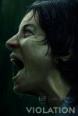

[侵犯](https://pewae.com/gaan/aHR0cHM6Ly9tb3ZpZS5kb3ViYW4uY29tL3N1YmplY3QvMzUxNjIxNjk=)

原名：Violation导演：Dusty Mancinelli / Madeleine Sims-Fewer主演：Anna Maguire / Jesse LaVercombe / Madeleine Sims-Fewer / Obi Abili / 贾斯敏·盖廖 / 辛提加·阿斯佩格类型：剧情 / 恐怖地区：加拿大首映时间：2020

杀人一段最好。
除此之外的剪辑玩火自焚。

[堕落色戒](https://pewae.com/gaan/aHR0cHM6Ly9tb3ZpZS5kb3ViYW4uY29tL3N1YmplY3QvNTExMDMwMg==)

原名：Decadencia导演：华金·罗德里格斯主演：Alejandro Estrada / Nataly Umaña / Roberto Palazuelos类型：剧情 / 爱情地区：墨西哥首映时间：2015

跟色戒有个毛线的关系。
女主角身材爆赞+1星。
从五十度开始，这种类型的片子太多了，都分不清是不是纯为了卖肉了。

[红发女郎](https://pewae.com/gaan/aHR0cHM6Ly9tb3ZpZS5kb3ViYW4uY29tL3N1YmplY3QvMTMwODEyMw==)

原名：赫い髪の女导演：神代辰巳主演：三谷升 / 中村亚湖 / 宫下顺子 / 山口美也子 / 山谷初男 / 石桥莲司 / 绘泽萠子 / 阿藤快 / 高桥明类型：剧情 / 情色地区：日本首映时间：1979

名不副实，逻辑混乱，单调乏味。

[好莱坞性战](https://pewae.com/gaan/aHR0cHM6Ly9tb3ZpZS5kb3ViYW4uY29tL3N1YmplY3QvMTA0NDExNzk=)

原名：Hollywood Sex Wars导演：保罗·萨皮亚诺主演：Christine Nguyen / Dominique Purdy / Jacqui Holland / Jenae Altschwager / Suzy Kaye / 艾丽·简 / 马里奥·迪亚兹类型：喜剧地区：美国首映时间：2011

叫假体大战更合适。
非常乱。

[自杀小队](https://pewae.com/gaan/aHR0cHM6Ly9tb3ZpZS5kb3ViYW4uY29tL3N1YmplY3QvMzU2OTkxMA==)

原名：Suicide Squad导演：大卫·阿耶主演：乔尔·金纳曼 / 卡拉·迪瓦伊 / 威尔·史密斯 / 斯科特·伊斯特伍德 / 本·阿弗莱克 / 杰·科特尼 / 杰伊·埃尔南德斯 / 杰瑞德·莱托 / 玛格特·罗比 / 维奥拉·戴维斯类型：动作 / 奇幻 / 犯罪地区：美国首映时间：2016

怎么能做到把一个片子拍得这么无聊又这么长？后悔下了加长版。
小丑女和小丑的感情线太腻歪。

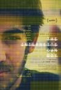

[互联网之子](https://pewae.com/gaan/aHR0cHM6Ly9tb3ZpZS5kb3ViYW4uY29tL3N1YmplY3QvMjU3ODUxMTQ=)

原名：The Internet导演：布莱恩·耐本伯格主演：亚伦·斯沃茨 / 劳伦斯·莱斯格 / 埃沃·蒂姆 / 塔伦·斯蒂伯里克纳-考夫曼 / 彼得·艾克斯莱 / 戴维·西格尔 / 戴维·西罗塔 / 本·威克勒 / 科利·多克托罗 / 罗恩·怀登类型：传记 / 纪录地区：美国首映时间：2014

作为一个下载看盗版的人实在没脸评论这片子。

[送你一朵小红花](https://pewae.com/gaan/aHR0cHM6Ly9tb3ZpZS5kb3ViYW4uY29tL3N1YmplY3QvMzUwOTY4NDQ=)

导演：韩延主演：刘浩存 / 吴晓亮 / 夏雨 / 孔琳 / 岳云鹏 / 易烊千玺 / 朱媛媛 / 李晓川 / 陈祉希 / 高亚麟类型：剧情地区：大陆首映时间：2020

开头和结尾都不好，中间还行，片长水分也很大。
刘浩存灵气十足，老谋子看人眼睛真毒。
整体上说导演对不起赵英俊。

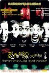

[恐怖热线之大头怪婴](https://pewae.com/gaan/aHR0cHM6Ly9tb3ZpZS5kb3ViYW4uY29tL3N1YmplY3QvMTMwNjk4NA==)

导演：郑保瑞主演：何超仪 / 吴镇宇 / 周励淇 / 张佳佳 / 李灿森类型：恐怖地区：香港首映时间：2001

香港很少见的纯恐怖不搞笑片。
香港很少见的大BOSS没出现纯靠氛围制造紧张的片。
何超仪真是对这种题材情有独钟啊。

[禁室培欲爱的俘虏](https://pewae.com/gaan/aHR0cHM6Ly9iYWlrZS5iYWlkdS5jb20vaXRlbS/npoHlrqTln7nmrLLniLHnmoTkv5jomY8vMTA0NDExNzA=)

导演：伍文拯主演：何华超 / 吴允龙 / 坂上香织 / 雷凯欣类型：犯罪地区：香港首映时间：2006

题材相当罕见，女的囚禁男的。
拍的相当糟烂，也就是个网大的水平。
原来2006年的时候竟然还有找日本艺术家来当主演的港片呢。

[沙丘](https://pewae.com/gaan/aHR0cHM6Ly9tb3ZpZS5kb3ViYW4uY29tL3N1YmplY3QvMzAwMTExNA==)

原名：Dune导演：丹尼斯·维伦纽瓦主演：丽贝卡·弗格森 / 乔什·布洛林 / 哈维尔·巴登 / 夏洛特·兰普林 / 大卫·达斯马齐连 / 奥斯卡·伊萨克 / 巴布斯·奥卢桑莫昆 / 张震 / 戴夫·巴蒂斯塔 / 斯特兰·斯卡斯加德类型：冒险 / 剧情 / 科幻地区：美国首映时间：2021

不管原著有多牛逼，这都不是一部好电影，真的是困死我了。

[悬崖之上](https://pewae.com/gaan/aHR0cHM6Ly9tb3ZpZS5kb3ViYW4uY29tL3N1YmplY3QvMzI0OTMxMjQ=)

导演：张艺谋主演：于和伟 / 余皑磊 / 倪大红 / 刘浩存 / 张译 / 朱亚文 / 李乃文 / 沙溢 / 秦海璐 / 赵毅类型：剧情 / 动作 / 悬疑地区：大陆 / 香港首映时间：2021

于和伟身份揭露前可以给9分，但是后半部分硬是把悬念给整没了，可惜。
秦海璐的角色显得很多余。
张艺谋对色彩和镜头的运用太棒了。

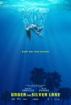

[银湖之底](https://pewae.com/gaan/aHR0cHM6Ly9tb3ZpZS5kb3ViYW4uY29tL3N1YmplY3QvMjY3ODYzMTc=)

原名：Under the Silver Lake导演：大卫·罗伯特·米切尔主演：丽兹·科菲 / 丽莉·吉欧 / 佐莎·马梅特 / 克里斯·加恩 / 卢克·拜恩斯 / 安娜贝尔·德克斯特-琼斯 / 安德鲁·加菲尔德 / 托弗·戈瑞斯 / 斯凯·埃洛巴 / 杰克逊·江恩类型：剧情 / 喜剧 / 惊悚 / 犯罪地区：美国首映时间：2018

一个故弄玄虚的故事，但基调相当欢快。
隔壁的老女人始终也没给个正脸。
配乐相当骚气。

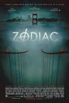

[十二宫](https://pewae.com/gaan/aHR0cHM6Ly9tb3ZpZS5kb3ViYW4uY29tL3N1YmplY3QvMTc4MTEyNg==)

原名：Zodiac导演：大卫·芬奇主演：伊莱亚斯·科泰斯 / 坎迪·克拉克 / 安东尼·爱德华兹 / 小罗伯特·唐尼 / 布莱恩·考克斯 / 杰克·吉伦哈尔 / 科洛·塞维尼 / 约翰·卡洛·林奇 / 约翰·特里 / 约翰·盖兹类型：传记 / 剧情 / 悬疑 / 惊悚 / 犯罪地区：美国首映时间：2007

重在参与。
小罗伯特唐尼还是会习惯性地耍帅。

[军中乐园](https://pewae.com/gaan/aHR0cHM6Ly9tb3ZpZS5kb3ViYW4uY29tL3N1YmplY3QvMjA1MTUwNzA=)

导演：钮承泽主演：万茜 / 吴志庆 / 廖启智 / 洪胜德 / 王柏杰 / 石知田 / 苗可丽 / 阮经天 / 陈建斌 / 陈意涵类型：剧情 / 历史 / 爱情地区：台湾 / 大陆首映时间：2014

瑕疵比较多的好作品。
陈建斌、阮经天奉献出了极高的水平，以及不张嘴的陈意涵。
万茜有些过。

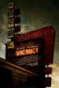

[针孔旅馆](https://pewae.com/gaan/aHR0cHM6Ly9tb3ZpZS5kb3ViYW4uY29tL3N1YmplY3QvMjAwMjk1NA==)

原名：Vacancy导演：尼姆罗德·安陶尔主演：Ethan Embry / Frank Whaley / Kate Beckinsale / Luke Wilson / Scott G. Anderson类型：剧情 / 恐怖 / 悬疑 / 惊悚地区：美国首映时间：2007

前半部分不见血的紧张感满分。
后面一小段则落入了俗套。
贝金赛尔演这个大材小用了。

[密室逃生](https://pewae.com/gaan/aHR0cHM6Ly9tb3ZpZS5kb3ViYW4uY29tL3N1YmplY3QvMjcxMDk2Nzk=)

原名：Escape Room导演：亚当·罗比特尔主演：丹·格伦伯格 / 亚当·罗比特尔 / 佩泰·塞彭克 / 保罗·汉普赛尔 / 尼克·多达尼 / 杰·埃利斯 / 杰米-李·蒙尼 / 杰西卡·萨顿 / 泰勒·拉塞尔 / 泰勒·莱伯恩类型：悬疑 / 惊悚地区：南非 / 美国首映时间：2019

几个密室谜题没有大的逻辑失误，这就是最大的优点了。
紧迫感足够。
废话比较多。

[性爱狂想曲](https://pewae.com/gaan/aHR0cHM6Ly9tb3ZpZS5kb3ViYW4uY29tL3N1YmplY3QvMTMwMDE5Mw==)

原名：Getting Any?导演：北野武主演：不破万作 / 北野武 / 十贯寺梅轩 / 大杉涟 / 寺岛进 / 小林昭二 / 左时枝 / 日野阳仁 / 柳忧怜 / 水上龙士类型：喜剧地区：日本首映时间：1994

无厘头无国界。
可惜最后致敬变蝇人蛮无聊的。

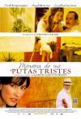

[苦妓追忆录](https://pewae.com/gaan/aHR0cHM6Ly9tb3ZpZS5kb3ViYW4uY29tL3N1YmplY3QvNDAxOTYxMg==)

原名：Memoria de mis putas tristes导演：卡尔森·亨宁主演：Arturo Beristáin / Edison Ruíz / Marco Treviño / Paola Medina Espinoza / Rodrigo Oviedo / Verónica Terán / 亚力杭德拉·巴罗斯 / 伊万格丽娜·索莎 / 加斯东·梅洛 / 埃米利洛·艾切瓦利亚类型：爱情地区：丹麦 / 墨西哥 / 美国 / 西班牙首映时间：2012

全片这是说了个寂寞啊，瞬间对马尔克斯的其他作品兴趣全无。

[古畑任三郎 最后之舞](https://pewae.com/gaan/aHR0cHM6Ly9tb3ZpZS5kb3ViYW4uY29tL3N1YmplY3QvMTA1NTg0MDY=)

原名：Furuhata Ninzaburo: Final Dance导演：松田秀知主演：松岛菜菜子 / 田村正和 / 石井正则 / 西村雅彦类型：悬疑 / 犯罪地区：日本首映时间：2006

松岛菜菜子真是全方位无死角的美啊。
日剧的SP要算电影吧，节奏方面一塌糊涂，水剧情的地方太多；要不算吧，还确实比普通剧集要精致。
谢谢您，田村正和先生。

[换爱大冒险](https://pewae.com/gaan/aHR0cHM6Ly9tb3ZpZS5kb3ViYW4uY29tL3N1YmplY3QvMjY2OTQ4MDk=)

原名：Swinger导演：米格尔·芒奇-法尔斯主演：丹·扎赫勒 / 乔治·凯特 / 卡尔·埃里克·佛肯托普 / 埃米尔·伯克·哈特曼 / 娜塔莉·玛杜诺 / 拉斯马斯·伯托夫特 / 特丽丝·丹斯卡尔德 / 皮尔·艾格霍姆 / 碧尔特·诺伊曼 / 米勒·迪内森类型：喜剧 / 情色 / 爱情地区：丹麦首映时间：2016

要说尺度，还得看欧洲电影。
“我本将心向明月，奈何明月照沟渠”的故事，对中年人的心态把握得很准。
实在是太讨厌结局了！

[詹妮弗的肉体](https://pewae.com/gaan/aHR0cHM6Ly9tb3ZpZS5kb3ViYW4uY29tL3N1YmplY3QvMjI5NTQwMQ==)

原名：Jennifer导演：卡瑞恩·库萨马主演：Colin Askey / J·K·西蒙斯 / Juno Rinaldi / Nicole Leduc / Ryan Levine / Sal Cortez / 亚当·布罗迪 / 克里斯·帕拉特 / 凯尔·加尔纳 / 梅根·福克斯类型：喜剧 / 奇幻 / 恐怖地区：美国首映时间：2009

詹妮弗的肉体，也就是现实中梅根·福克斯的肉体，布满细毛。
剧情鬼扯就算了，这种片竟然还不给奶看，当然差评。

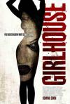

[女孩闺房](https://pewae.com/gaan/aHR0cHM6Ly9tb3ZpZS5kb3ViYW4uY29tL3N1YmplY3QvMjEzNDg0NDU=)

原名：Girl House导演：乔恩·克劳兹 / 特雷弗·马修斯主演：Alice Hunter / Baylee Wall / Isaac Faulkner / Slaine / Wesley MacInnes / 亚当·迪马克 / 卡麦伦·比康多瓦 / 妮可·福克斯 / 查斯蒂·巴勒斯特罗斯 / 祖勒卡·席尔瓦类型：恐怖 / 惊悚地区：加拿大首映时间：2014

以B级片的要求来衡量，干得相当不错，要血有血，要肉有肉。
死法也还算有创意，尤其那个用塑料袋自杀的。
女主不脱终究留有遗憾。

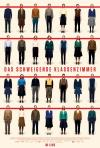

[沉默的教室](https://pewae.com/gaan/aHR0cHM6Ly9tb3ZpZS5kb3ViYW4uY29tL3N1YmplY3QvMjc2MDg3ODU=)

原名：Das schweigende Klassenzimmer导演：拉斯·克劳梅主演：乔纳斯·达斯勒 / 伦纳德·施彻 / 卡莉娜·N.维斯 / 布尔格哈特·克劳斯纳 / 弗洛里安·卢卡斯 / 戈茨·舒伯特 / 汤姆·格兰门兹 / 米夏埃尔·格维斯戴克 / 罗夫·凯尼斯 / 罗纳尔德·策尔费尔德类型：剧情 / 历史地区：德国首映时间：2018

暗潮汹涌，心情澎湃。
套用何勇一句歌词：为了真理，为了正义，哥们义气不能少哇。
觉得豆瓣早晚会和谐掉这部电影的条目。

[超能敢死队](https://pewae.com/gaan/aHR0cHM6Ly9tb3ZpZS5kb3ViYW4uY29tL3N1YmplY3QvMzIxMjM5OA==)

原名：Ghostbusters导演：保罗·费格主演：丹·艾克罗伊德 / 克里斯·海姆斯沃斯 / 克里斯汀·韦格 / 内森·科德里 / 凯特·麦克金农 / 埃涅·赫德森 / 塞西莉·斯特朗 / 安迪·加西亚 / 托比·哈斯 / 梅丽莎·麦卡西类型：动作 / 喜剧 / 科幻地区：美国首映时间：2016

中规中矩的翻拍。

[第四张画](https://pewae.com/gaan/aHR0cHM6Ly9tb3ZpZS5kb3ViYW4uY29tL3N1YmplY3QvNDI1MzQ0OC8=)

导演：钟孟宏主演：关颖 / 周咏轩 / 戴立忍 / 梁赫群 / 毕晓海 / 纳豆 / 罗北安 / 郝蕾 / 金士杰 / 陈希圣类型：剧情 / 犯罪地区：台湾首映时间：2010

写满了刻意。
结尾处的小花招画蛇添足。
戴立忍和金士杰不知是不是用了配音，腔调很做作。

[卫斯理之霸王卸甲](https://pewae.com/gaan/aHR0cHM6Ly9tb3ZpZS5kb3ViYW4uY29tL3N1YmplY3QvMTI5ODAxNC8=)

导演：徐小明主演：元华 / 元奎 / 周世乐 / 徐宝凤 / 徐小明 / 曹荣 / 曾江 / 李赛凤 / 钱嘉乐类型：动作 / 奇幻地区：香港首映时间：1991

徐小明对冒险片和合拍这件事真是情有独钟。
跟卫斯理关系不大，倪匡竟然也同意拍了。
故事和动作都很老套。

[猛鬼狐狸精](https://pewae.com/gaan/aHR0cHM6Ly9tb3ZpZS5kb3ViYW4uY29tL3N1YmplY3QvMzAyMDU0My8=)

导演：梁佐治主演：吴刚 / 吴君如 / 成奎安 / 曹查理 / 楚原 / 胡枫 / 苑琼丹 / 陈加玲 / 黎小田类型：动作 / 喜剧 / 奇幻 / 恐怖地区：香港首映时间：1991

模式化的搞笑鬼片。
陈加玲退出演艺圈真乃一大损失。

[毕业会考](https://pewae.com/gaan/aHR0cHM6Ly9tb3ZpZS5kb3ViYW4uY29tL3N1YmplY3QvMjYzNDAzMDUv)

原名：Graduation导演：克里斯蒂安·蒙吉主演：弗拉德·伊凡诺夫 / 拉雷什·安德瑞斯 / 玛丽亚·德拉格斯 / 莉亚·巴格纳 / 阿德里安·蒂蒂耶尼 / 马利娜·马诺维奇类型：剧情 / 家庭地区：罗马尼亚首映时间：2016

社会主义国家的日常？
拍得比较含蓄，点到为止，就有些意犹未尽，尤其结局。

[青春似火](https://pewae.com/gaan/aHR0cHM6Ly9tb3ZpZS5kb3ViYW4uY29tL3N1YmplY3QvNDI0NjM5NC8=)

导演：董克娜 / 辛静主演：杨雅琴 / 辛静 / 鲁非类型：剧情地区：大陆首映时间：1976

给这部片子定位很难，一方面其水平确实比较低下，故事漏洞百出；另一方面却能通过它了解当年在表面上究竟是个什么样子，真希望所有人看一遍这部电影。
女主人公以现在的标准评判，是十足的反派，标准的啥啥斗争脸。
生动演绎了什么教上纲上线。

[封神：妲己](https://pewae.com/gaan/aHR0cHM6Ly9tb3ZpZS5kb3ViYW4uY29tL3N1YmplY3QvMzU2NjMxMTIv)

导演：刘迪洋主演：何珮瑜 / 刘頔 / 沈震轩 / 钟欣潼 / 马睿瀚类型：动作 / 古装地区：大陆首映时间：2021

作为钟欣桐的同龄人，只能说挣钱虽然不丢人，但人各有志。
都拍成这样了，片尾还留尾巴准备上续集呢？
而且技术组明显对阿娇充满了恶意：明明身材娇小偏偏给设计大垫肩的服装；明明胖的厉害却一个劲给仰角镜头。

[亲密治疗](https://pewae.com/gaan/aHR0cHM6Ly9tb3ZpZS5kb3ViYW4uY29tL3N1YmplY3QvNjg3NTQyMC8=)

原名：The Sessions导演：本·列文主演：Annika Marks / W·厄尔·布朗 / 威廉姆·H·梅西 / 海伦·亨特 / 穆恩·布拉得古德 / 约翰·浩克斯类型：剧情地区：美国首映时间：2012

好莱坞知名女星艺术之旅之海伦亨特。
从第二个保姆出场就盼着她脱，然而并没有。
男主角全程躺着演，难度相当之大。

[皮皮鲁与鲁西西之罐头小人](https://pewae.com/gaan/aHR0cHM6Ly9tb3ZpZS5kb3ViYW4uY29tL3N1YmplY3QvMzM5NzMwNzcv)

导演：于飞主演：于书瑶 / 刘一莹 / 刘向卿 / 庄则熙 / 朱近桐 / 李淏东 / 洪悦熙 / 温淳棣 / 田雨 / 白瑶类型：儿童 / 喜剧 / 奇幻地区：大陆首映时间：2021

低龄化且与原著差别太大，郑渊洁太纵容他儿子了。
年代感营造得不错。
特效太烂。

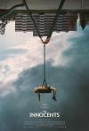

[无辜者](https://pewae.com/gaan/aHR0cHM6Ly9tb3ZpZS5kb3ViYW4uY29tL3N1YmplY3QvMzQ5NzAzMjUv)

原名：The Innocents导演：埃斯基尔·沃格特主演：Birgit Nordby / Georg Grøttjord-Glenne / Irina Eidsvold Tøien / Kadra Yusuf / Kim Atle Hansen / Lisa Tønne / Marius Kolbenstvedt / Mina Yasmin Bremseth Asheim / Nor Erik Vaagland Torgersen / Sam Ashraf类型：恐怖 / 惊悚地区：挪威首映时间：2021

邪恶小男孩和邪恶小女孩的刻画很出色，尤其是小女孩，从哪找来的。
慢节奏的惊悚片也可以把气氛搞得飞起。
剧情有点扯，怎么有超能力的小孩就凑一块儿了。

[我是谁：没有绝对安全的系统](https://pewae.com/gaan/aHR0cHM6Ly9tb3ZpZS5kb3ViYW4uY29tL3N1YmplY3QvMjU5MzIwODYv)

原名：Who Am I导演：巴伦·博·欧达尔主演：利奥波德·霍尔农 / 卡塔琳娜·马茨 / 埃利亚斯·穆巴里克 / 小安托万·莫诺特 / 崔娜·蒂虹 / 李奥那多·卡劳 / 汉娜·赫茨施普龙 / 汤姆·希林 / 沃坦·维尔克·默林 / 阿尔恩特·施韦林·索瑞类型：悬疑 / 惊悚 / 犯罪地区：德国首映时间：2014

把黑客的氛围渲染得特别好，情节也紧凑，尽管猜到最后有反转也能欣然接受。
把网络世界具现化这种拍法非常带劲。
缺点有二：女主太老，女检察官智商不太在线。

[李茂扮太子](https://pewae.com/gaan/aHR0cHM6Ly9tb3ZpZS5kb3ViYW4uY29tL3N1YmplY3QvMzU0NDQ5OTgv)

导演：高可主演：于洋 / 克拉拉 / 冯秦川 / 宋小宝 / 常远 / 李海银 / 杜晓宇 / 王成思 / 艾伦 / 魏翔类型：古装 / 喜剧地区：大陆首映时间：2022

烂得平平无奇。
常远最大的问题过于用力，马丽的问题是这类角色演太多，同质化严重。
化妆师给马丽磕一个吧。

[秘密账号](https://pewae.com/gaan/aHR0cHM6Ly9tb3ZpZS5kb3ViYW4uY29tL3N1YmplY3QvMzUwMDk3NjEv)

原名：裏アカ导演：加藤卓哉主演：仁科贵 / 市川知宏 / 布施绘里 / 松浦祐也 / 泷内公美 / 浅野堇 / 田中要次 / 神尾枫珠 / 神户浩类型：剧情 / 爱情地区：日本首映时间：2021

算是个表演型人格的悲剧吧，好像表演型人格很容易没有好下场？
男主角渣得很有特色。
倒是一开始抢了女主工作的女配是个正常人。

[世界奇妙物语 2017年春季特别篇](https://pewae.com/gaan/aHR0cHM6Ly9tb3ZpZS5kb3ViYW4uY29tL3N1YmplY3QvMjcwMDY4OTYv)

原名：世にも奇妙な物語 2017年春の特別編导演：后藤庸介 / 小林义则 / 岸川正史 / 松木创 / 植田泰史 / 河野圭太 / 纸谷枫主演：中条彩未 / 今井悠贵 / 北香那 / 唐田英里佳 / 塚地武雅 / 山中崇 / 山崎纮菜 / 广田亮平 / 杉野遥亮 / 村上新悟类型：剧情 / 奇幻 / 悬疑地区：日本首映时间：2017

关于梦境的专题讨论，四个小故事里后两个都比较套路。
串场的文字游戏很有趣。
梦男是比较有想法的故事，可惜发力不足，软绵绵的。

[致命录像带94](https://pewae.com/gaan/aHR0cHM6Ly9tb3ZpZS5kb3ViYW4uY29tL3N1YmplY3QvMzUxMTYzMjUv)

原名：VHS94导演：Chloe Okuno / 提莫·塔哈亚托 / 珍妮弗·里德 / 瑞恩·普劳斯 / 西蒙·巴雷特主演：Sean Patrick Dolan / 安娜·霍普金斯 / 德鲁·维尔戈维尔 / 达克斯·拉维纳类型：恐怖 / 惊悚地区：美国首映时间：2021

水准之上，起码比上一部强多了。
最喜欢第二个守灵的故事。
第四个故事水准有些差。

[月球](https://pewae.com/gaan/aHR0cHM6Ly9tb3ZpZS5kb3ViYW4uY29tL3N1YmplY3QvMzA3MzEyNC8=)

原名：Moon导演：邓肯·琼斯主演：凯文·史派西 / 卡雅·斯考达里奥 / 多米妮克·麦克艾丽戈特 / 山姆·洛克威尔 / 本尼迪克特·王 / 罗宾·查克 / 马尔科姆·斯图尔特 / 马特·贝里类型：剧情 / 悬疑 / 科幻地区：英国首映时间：2009

这个世界上克隆人题材最好的电影。
配乐出色，凸显紧张感和孤独感。
唯一的缺憾是确实被钱限制了。

[巴黎Q娘](https://pewae.com/gaan/aHR0cHM6Ly93d3cuaW1kYi5jb20vdGl0bGUvdHQxODc5MDMwLw==)

原名：Q导演：laurent-bouhnik主演：déborah-révy / gowan-didi / hélène-zimmer类型：剧情 / 爱情地区：法国首映时间：2011

激情戏确实很大胆，但总体上莫名其妙。
澡堂子里的对话过于玄奥。

[长津湖](https://pewae.com/gaan/aHR0cHM6Ly9tb3ZpZS5kb3ViYW4uY29tL3N1YmplY3QvMjU4NDUzOTIv)

导演：徐克 / 林超贤 / 陈凯歌主演：史彭元 / 吴京 / 周小斌 / 唐国强 / 张涵予 / 易烊千玺 / 朱亚文 / 李岷城 / 李晨 / 杨一威类型：剧情 / 历史 / 战争地区：大陆 / 香港首映时间：2021

不是烂片，却也没太出色，片长过长主次不分是最大的问题。
刘秘书的剧情完全没必要应该剪掉。
非战争场面的调色非常不舒服。

[吉祥如意](https://pewae.com/gaan/aHR0cHM6Ly9tb3ZpZS5kb3ViYW4uY29tL3N1YmplY3QvMzUwNjgyMzAv)

导演：大鹏主演：刘陆 / 大鹏 / 王吉祥 / 王庆丽类型：剧情 / 家庭地区：大陆首映时间：2021

这片子类型太特殊了，能拍出来真的是天意，家庭责任这种事真的是一言难尽。
大鹏真的是个狠人，他父母在镜头前也是够能装的。
前半部分《吉祥》接近满分，后半部分《如意》剪辑的过于刻意了。

[绿帽子](https://pewae.com/gaan/aHR0cHM6Ly93d3cuaW1kYi5jb20vdGl0bGUvdHQwNDE2OTQz)

导演：刘奋斗主演：喜子 / 廖凡 / 李梅 / 李海滨 / 海一天 / 董立范 / 郭涛类型：剧情地区：大陆首映时间：2004

全场北京话高能，老北京就这操行了。
一个关于捉奸的故事，最后澡堂子里高潮迭起。
第一个故事跟第二个联系太弱了。

[玩命三日](https://pewae.com/gaan/aHR0cHM6Ly9tb3ZpZS5kb3ViYW4uY29tL3N1YmplY3QvMzQ0MzQwMDYv)

导演：刘仪伟主演：姜妍 / 姬他 / 张嘉益 / 闫妮类型：剧情 / 喜剧地区：大陆首映时间：2021

一切都辣眼睛。
在网大里都算不上出色的作品，是怎拿到龙标的？

[阴阳镇怪谈](https://pewae.com/gaan/aHR0cHM6Ly9tb3ZpZS5kb3ViYW4uY29tL3N1YmplY3QvMzU3MTMwMjUv)

导演：张涛主演：侯桐江 / 傅小爽 / 刘亚津 / 吴建飞 / 安富强 / 巴多 / 曹雪飞 / 李元元 / 李明 / 李立群类型：恐怖 / 惊悚地区：大陆首映时间：2022

一部网大这是花了多少公关费，才能引起我这样的人关注，能回本吗？
所有演员，包括金巧巧和李立群在内，都演技浮夸。
看三分钟就能猜到结局的量产货。

[人生果实](https://pewae.com/gaan/aHR0cHM6Ly9tb3ZpZS5kb3ViYW4uY29tL3N1YmplY3QvMjY4NzQ1MDUv)

原名：人生フルーツ导演：伏原健之主演：树木希林 / 津端修一 / 津端英子类型：纪录地区：日本首映时间：2017

平平淡淡的老夫妻，做自己想做的事。
慢慢来。

[摩登龙争虎斗](https://pewae.com/gaan/aHR0cHM6Ly93d3cuaW1kYi5jb20vdGl0bGUvdHQwMTEwNTQxLw==)

导演：钟继昌主演：姜皓文 / 梁思敏 / 王霄 / 西瓜刨 / 许蓓 / 郑浩南 / 郭少芸 / 黄霑类型：喜剧 / 犯罪地区：香港首映时间：1994

描写保险职场，乱入的色情戏有些脱节。
黄霑的摸鱼论真乃妙论。
郑浩南梁思敏这对糊咖还真是有糊的道理。

[人狼](https://pewae.com/gaan/aHR0cHM6Ly9tb3ZpZS5kb3ViYW4uY29tL3N1YmplY3QvMTMwNjI1NS8=)

原名：人狼 JIN-ROH导演：冲浦启之主演：中川谦二 / 仙台惠理 / 古本新之辅 / 吉田幸纮 / 堀部隆一 / 大木民夫 / 广田行生 / 木下浩之 / 武藤寿美 / 藤木义胜类型：剧情 / 动画 / 奇幻 / 惊悚地区：日本首映时间：1999

略失望，这题材虽然在动画领域比较少见，但在真人电影中可没什么新鲜。
所谓尔虞我诈身不由己，正是中国官场小说宫斗小说里都被写烂了，能深刻到哪儿呢。