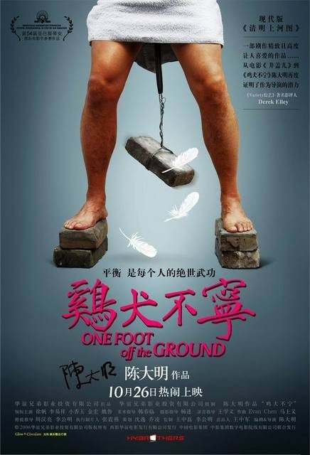

昨天上午安全检查,个人工作机的安全是个重点,所以**前天下午**没干别的,光卸载软件了.卸载的东东有

ACDSee,Adobe Reader,Photo Shop,iTune,QuickTime,暴风影音,winamp,迷你歌词,ReadBook,Nero,VS.net2003,Visio,DAEMON Tools,FlashFXP,SybaseASE,PowerBuilder7/8/9,PowerDesigner,Sybase client,SQL Server,InstallShield,CoolEdit,MSDN,googleEarth,google talk,google桌面,QQ,MSN live messenger,Firefox,Rssowl,迅雷,金山词霸,windows优化大师,超级兔子魔法设置,Dreamwaver,Picasa,Sourceinsight,UltraEdit,EditPlus2,WB Editor,Zoundry,WinZip,WinRAR等等.

换句话说,就是除了Office,诺顿和VC,以及花了大价钱买回来的PlatformBuilder以外,几乎不能装其他任何东东,连Firefox和MSN这样不会有版权问题的都不可以用.WinRAR还是因为工作实在需要,在卸载了破解版之后,又到官网下载安装了个试用版.

所以,**昨天下午**基本上**又**什么活都没干–光忙活装软件了.同事小李子卸载太上瘾,随意把声卡驱动卸载了,至今仍未找到让耳机出声的方法…

P.S:蔡幸娟的一时没找到链接,所以换成了羽泉和苏慧伦的,题目也换了.

