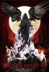
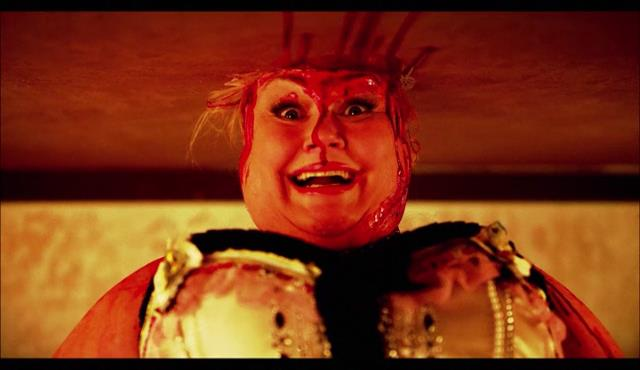

分三天看完了《26种死法》的最新一部（21/2）。总的印象是失望。前两部都是惊喜多于失落，而这一部是没有惊喜，极少意外，N多失望。

[26种死法2.5：M号档案](https://pewae.com/gaan/aHR0cHM6Ly9tb3ZpZS5kb3ViYW4uY29tL3N1YmplY3QvMjYxNjM2NDQv)

原名：ABCs of Death 2.5导演：Ama Lea / Baris Erdogan / Brett Glassberg / Carlos Faria / Clint Kelly / Cody Kennedy / Jason M. Koch / Peter Czikrai / Rodrigo Gasparini / Ryan Bosworth主演：Ali Arslan / Anastasia Baranova / Beat Billson / Dani Barker / David Blanka / Don Bridges / Ilker Arslan / John Beck / John Cianciolo / Josh Christensen类型：喜剧 / 恐怖地区：美国首映时间：2016

这部片子的出品挺有趣。在第二部结尾的时候，制片人在字幕里痛骂了一番批评第一部的人，并信誓旦旦地说要在2016年出续集。这次制片人在片头敲了好长好长的序言。大概的意思是说哥在网站上征集了超过500部“M”开头的3分钟短片，从中精选了26部组成了这个电影。因为不再是A-Z，所以不能算正式版3，只能是2.5版M档案。

正因为参与拍摄的都不是正经导演，而大多是独立电影人甚至吃瓜群众，所以质量下降就在所难免。第一部井口升那样的大变态和第二部轮回的黏土动画那样的好点子，这次一个都没有。

这个系列太过猎奇，所以发行了半年多了都没有字幕。不但没中文字幕，连因为字幕也求不得，是块地地道道的“生肉”。我这可怜的听力只能看个囫囵，某些依赖台词的故事完全不知所云。挑几个印象深刻的说说。
**“Make Believe”**
两个小萝莉在花园里救助奄奄一息的大叔，用泥巴抹伤口用“魔法粉末”撒在身上并念咒什么的，终于成功地把大叔折腾死了。小萝莉离开后，杀人凶手出现，把大叔埋了。小萝莉再来的时候，没看到大叔，以为他上了天堂，很高兴。
我就喜欢这种诋毁熊孩子的段子。

**Malnutrition**
末日世界，妹子为了抢一个罐头打死了同类，然后又跟丧尸殊死搏斗，最后跑进了一个仓库，发现架子上全是罐头。可是她已经被丧尸咬了，以后不能以罐头为食了。
题目起得挺好，题材也不错，就是拍得太过一本正经了。

**Marauder**
类似《疯狂的麦克斯》，镜头感配乐都不错。就是故事太俗。

**Mariachi**
某人被朋友拉去酒吧听死亡金属，听得头昏脑胀。救星墨西哥三人组出现，打死了男主以外的包括歌手和听众在内的所有人。然后拽着男主开始弹奏墨西哥传统音乐。
讽刺意味挺浓的，可惜特效做得不好，血飚的不够。

**Meat**
创意满分。人与食物互换身份。
看完觉得餐厅里坐着的都是鸡腿。

**Mobile**
绑匪通过短信跟幕后老大联系。幕后老大指挥绑匪卸手指拔舌头挖眼球。最后来了一句“Put them all back”——原来幕后老大睡着了，他儿子在玩手机。
非常完整的小短片，唯一的遗憾是血飚得太少。

**Muff**
故事非常简单，老嫖客遇上胖妓女。但是两位主演的表情都非常到位。
其实有时候电影只要把故事讲清楚就好，不用那么多弯弯绕。

7/26，这是就是我给出的分数。
片子总体来说不怎么重口，就是26个猎奇故事。比题图的那部差得远了。
有感兴趣的可以试试。