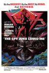

[007之海底城](https://pewae.com/gaan/aHR0cHM6Ly9tb3ZpZS5kb3ViYW4uY29tL3N1YmplY3QvMTI5MjkzOA==)

原名：The Spy Who Loved Me导演：刘易斯·吉尔伯特主演：乔治·贝克 / 伯纳德·李 / 卡罗琳·莫罗 / 库尔德·于尔根斯 / 格佛雷·肯 / 沃尔特·戈塔尔 / 理查德·基尔 / 罗杰·摩尔 / 芭芭拉·贝芝 / 迈克尔·比灵顿类型：冒险 / 动作 / 惊悚地区：英国首映时间：1977

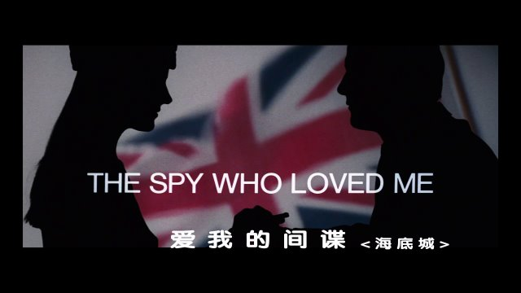

007这个系列，是我观影史上真正的鸡肋。要说不重要吧，从电视台到录像带到VCD到BT下载到电影院，它做到了观看介质的全覆盖，真没少看；要说重要吧，它毫无创新性，每一部都是见微知著——飙车美女飞天遁地轰轰轰叭叭叭，看1部跟看20部，看二十世纪70年代还是二十一世纪10年代，看罗杰摩尔还是丹尼尔克雷格，愣是没多少差别。
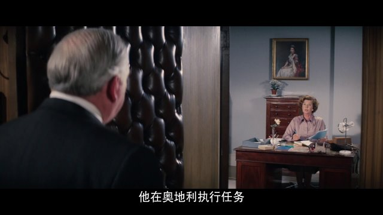

1992/1993年，辽宁二台一周一集，用了几个月的时间，连续播放了到那时为止的所有007。007本身不是我的菜，但是架不住我爹对枪战片非常感兴趣，可以说是期期不落，我虽然不太感冒，但大周末的总不能早早睡觉吧，也跟着看。007这个系列的一个特点是片长都在2小时左右，那时好像是晚上9：50开始放，到播完都是午夜时分了，这就触了我妈的逆鳞。结果就是这14部有的是我没看，有的是看一半睡着了，有的是看一半被我妈掐了，有的是前一半睡着了，后面醒了接着看。断断续续，一团浆糊。
如果要只挑一部来说话，就犯了难。我印象中的几个镜头，似乎放在哪部片子里都适用。于是乎只能从印象最深最确定的一个镜头下手，为了找那么一个镜头，我把90年代之前的007刷了一半——这个系列本就差不多嘛。这个镜头最后说。
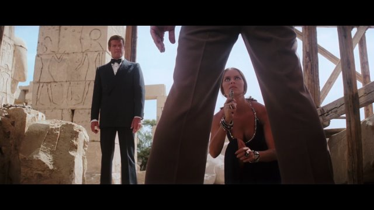

众所周知，邦德系列的看点从来就不是邦德。早期的007电影，对小孩子来说最大的看点是各种间谍道具。这部片里最神奇的是一辆白色莲花跑车。陆地上能喷屎，海里能喷墨。哦对，最神奇的就是能下水。影史上仅次于蝙蝠车的神奇汽车啊！
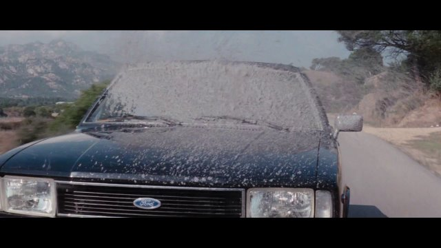
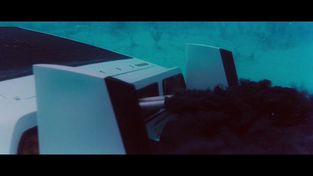

飙车戏是007系列的一个特色。这部里的飙车戏比较一般，敌方先后出动了汽车、摩托和直升飞机，但不知为什么不肯大家操家伙一起上，非要一个一个上前送人头。尤其最后直升机的驾驶员是个长相比较怪异的美女。
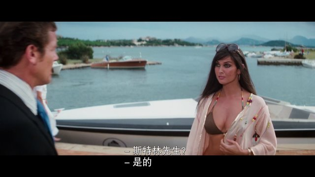

因为这次的车是两栖的，所以还有一段水下追逐戏，紧迫感其实不太强，但是以70年代的技术来说，这段的水下摄影应该是花了大价钱的。
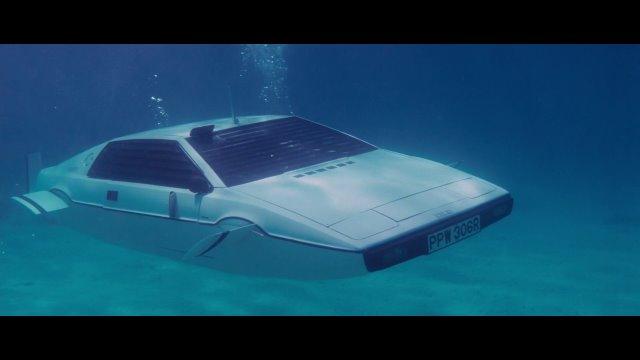

众所周知，邦德系列的看点从来就不是邦德。本作出现的反派大钢牙是007系列里最巨代表性的坏人之一。扮演钢牙的演员可能是个巨人症，本身就高~~达~~大狰狞。而剧情中也给他加了很多暴力的戏份。可惜智商不太在线的样子。大钢牙咬钢筋的名场面出现在下一部《太空城》，这一部里没太强调钢牙的正面作用，反倒是被邦德开动电磁铁搞了个贴脸杀。
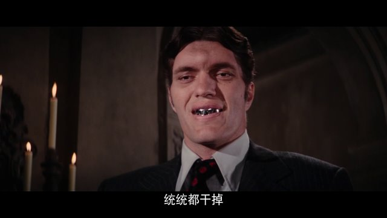
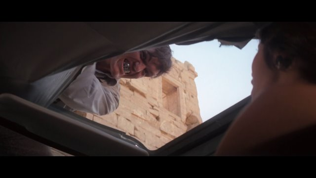
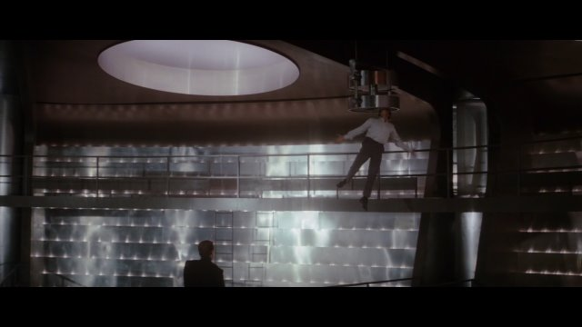

众所周知，邦德系列的看点从来就不是邦德。这一部的邦女郎在邦德60年的泡妞历史中看来，平平无奇。上比不上苏菲玛索和伊娃格林的风情万种[[1]](https://pewae.com/2024/06/review-the-spy-who-loved-me.html#inner_anchor_1)，下也不似杨紫琼那般骨骼清奇。这位有东欧血统的美女最深刻的印象，来自于全片八成以上的低胸装扮，另外的便是好莱坞大片嘲讽毛熊的日常：奇怪斯拉夫英文口音。
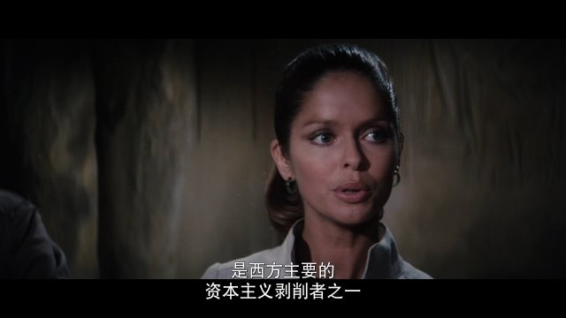
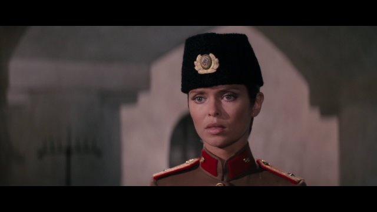

本片片名非常之不贴切。早期的14部007港版译名非常规整：《铁金刚XXYYY》。XX是二字动词，勇破/大战/勇战之类；YYY是三字名词，甚至第15、16部也不过是把YYY变成YYYY而已。内地一开始沿袭港译名，只是把铁金刚替换成007，后来才一点一点拨乱反正。但是这部从头至尾就叫海底城，就很离谱。因为反派的基地在一个酷似海底小纵队里章鱼堡的一个潜水器里。其使用面积也就不到千平的样子，怎么配叫做“城”呢？？片名《The Spy Who Loved Me》直译过来是“那个间谍爱过我”，在剧情里是个双关，指的是女主的间谍男朋友在出场的时候被邦德干掉了，然后女主又爱上了邦德。
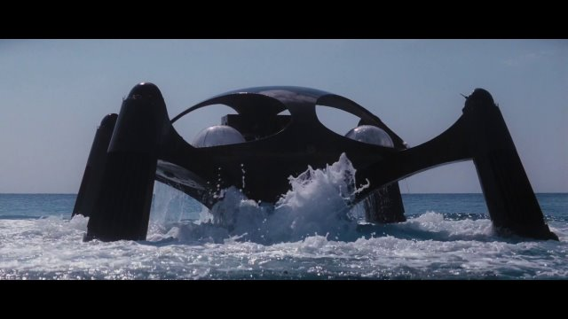

最后说说主角罗杰摩尔吧。同样众所周知，罗杰摩尔根本不擅长动作戏。偏偏本片还有一段好长的空手单挑戏，一拳一脚都肉乎乎的，看得人想快进。
至于剧情？我们在谈007呢伙计，哪里来的剧情？
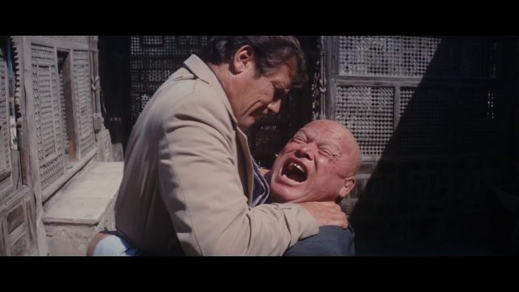

记忆中的镜头：片尾出字幕前，邦德跟邦女郎缠绵（这是传统），一群人围观（这也是传统），于是俩人拉上了窗帘（这才是记忆点）。
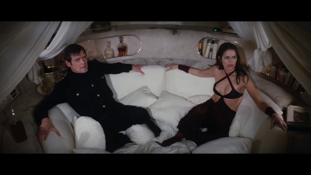
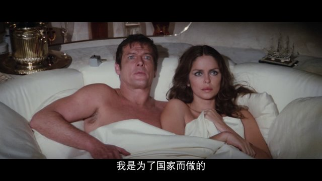
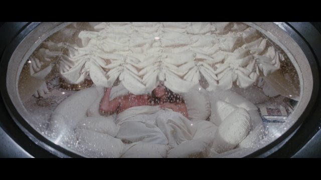

---

- [(1)](https://pewae.com/2024/06/review-the-spy-who-loved-me.html#inner_ref_1)：地球球花演邦女郎的时候已经是五旬老太了，不在讨论之列