[405谋杀案](https://pewae.com/gaan/aHR0cHM6Ly9tb3ZpZS5kb3ViYW4uY29tL3N1YmplY3QvMTMwMzY5OC8=)

导演：沈耀庭主演：严翔 / 仲星火 / 史久峰 / 吴喜千 / 张嬿 / 徐敏 / 沈耀庭 / 牛犇 / 祁明远 / 陈烨类型：悬疑 / 惊悚地区：大陆首映时间：1980

这是部名气很大的国产悬疑侦破片，在80年代到90年代前期的寒暑假里经常播放。现在的媒体把它吹捧成在那个年代票房过亿。但是这种既不能证明，也不能证伪的流言，笑笑就过去了。我小时候向来只知道《少林寺》保持了多年票房最高的记录，其余一概不认识。
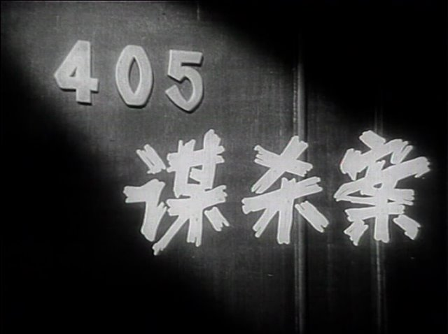

这是本系列第一次出现黑白片。我并不排斥黑白片。黑白彩色，只有年代不同，没有高下之分，各有各的精彩。
按说1980年上影厂是完全有技术拍摄彩色片的，所以有人怀疑本片采用黑白胶片拍摄，是为了烘托片子中压抑的气氛。我觉得这纯是想多了，就不能是电影厂清黑白胶片的库存么？
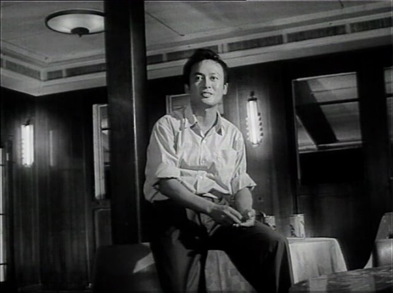

跟数以万计的“破案片”一样，本片也是采用了抽丝剥茧，第一嫌疑人不是真正的犯人这样流俗的故事框架。稍微有所不同的是，故事的时间线设定在1976年。幕后黑手对男二进行栽赃，是为了消灭他手上的造反派私造军火的罪证。在那个年代，拍这种刑侦男主不敌上级压力的故事，其创新精神还是可嘉的。
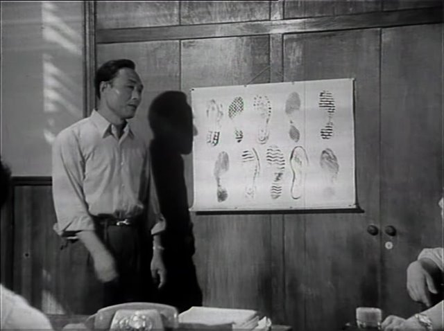

满脸正气、一辈子没演过坏人的仲星火先生饰演侦察员陈明辉。
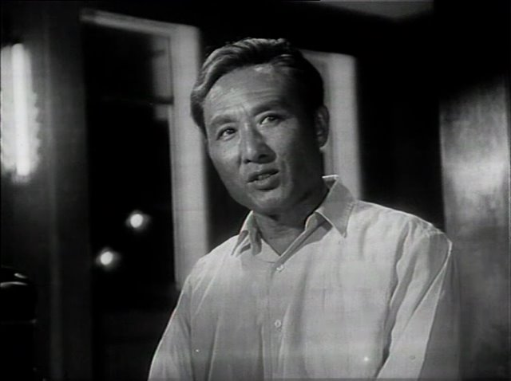
他不顾上级阻挠，找到了玻璃杯作为关键证据的真正来源，并且不远千里远赴黄山找到了凶手作案用的鞋，并锁定了线索人物揪出了犯罪团伙。可谓有勇有谋。只是编剧为了突出黑恶势力的猖獗，给安排了好几场挨揍的戏。仲先生拍摄本片时已经五十多岁了，无论是现实中还是片中都没有还手之力，被揍得惨兮兮。这几场打戏应该也没有什么高人调教，颇乱。
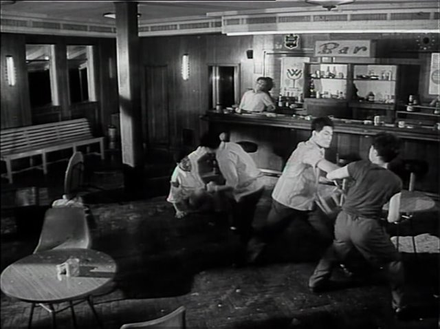
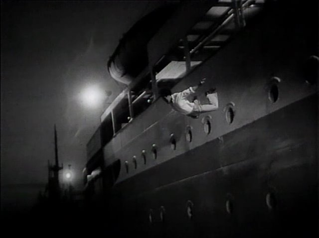

另外一位熟脸是牛犇先生。牛先生的戏路要宽得多。本片里他饰演的是反派公安局长手下的看守所狗腿子，友情客串性质，戏份不多。
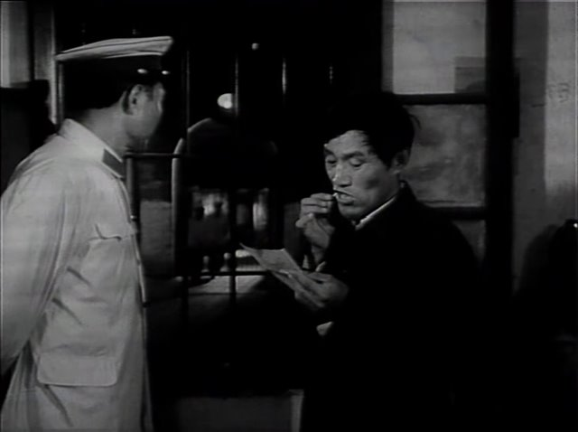

演被栽赃的男二的严翔，几乎也没演过坏人。气质上感觉略微像TVB的中年刘松仁。饭堂里的标语挺有意思的，涛哥是不是在这样的地方吃过饭啊……
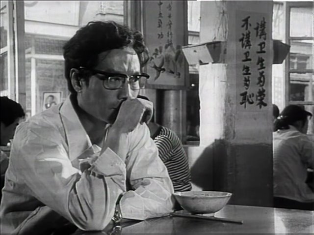

作为关键证据的玻璃杯被揭穿的过程颇为好笑：仲星火找到了嫌犯单位，了解到单位里为了防止员工把玻璃杯带走，特意在杯底点了红点作为暗记。所以作为证物的杯子有红点，说明是有人把单位的带有嫌犯指纹的被子调换到了案发现场，而不是被害人房间里本来的杯子。可是，工厂为了防止杯子被偷，不是应该直接在杯子上喷上某某厂某某车间吗？做暗记还不是该拿照样拿。
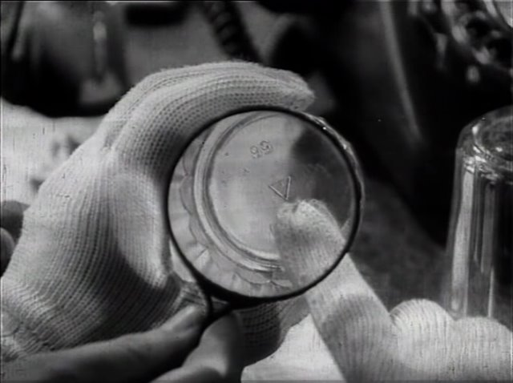

杯子的后续发展有些小爽，幕后黑手直接找上仲星火，把他偷偷从证物室带出的玻璃杯直接给摔了，死无对证无法翻案。
玻璃杯碎裂的画面，据说当年上了高科技，高速摄影机和糖做的玻璃。实际上这里还不如不用慢镜头，慢镜头一上就穿帮了，玻璃哪有这个碎法的。
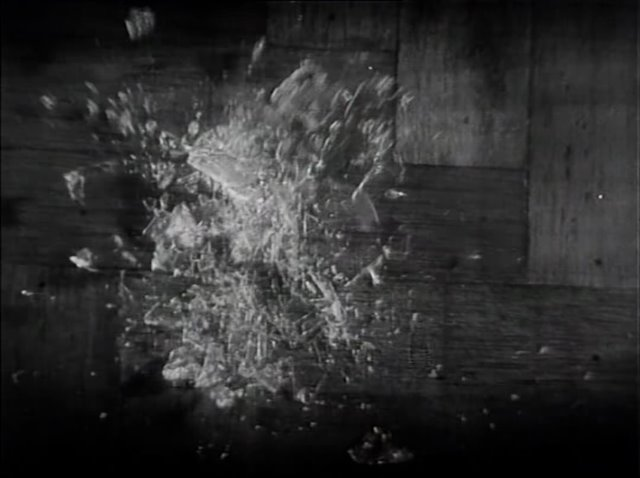

也正是因为丢失了关键的证据，仲星火只能通过劫狱的方式把严翔给私下放掉，而不是像当时的主流电影那样来个大圆满结局。挺好。只是最后一个镜头，是仲星火揭穿领导阴谋之后，来了一口真相大白的事后烟，实在太不养生了点。
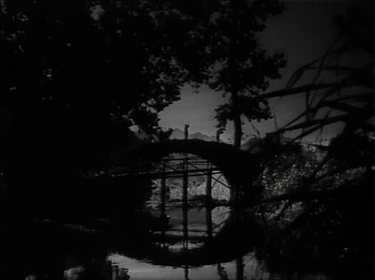
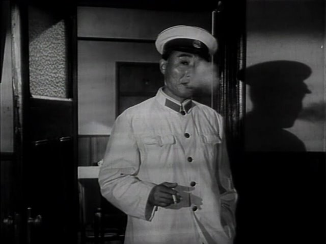

看年代片的一个乐趣是体会当时的风情。就像这里，能认出这个车标的怎么也得40岁往上了吧。
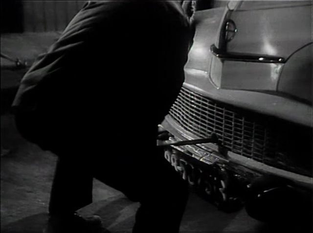

本片没有太多的外景，却也能看出当时的一些风气。比如，穿花衬衫戴墨镜的一般身上都有事，不是流氓就是便衣。
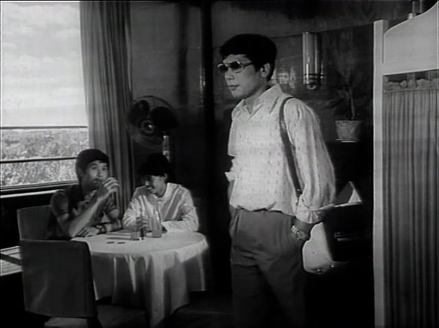
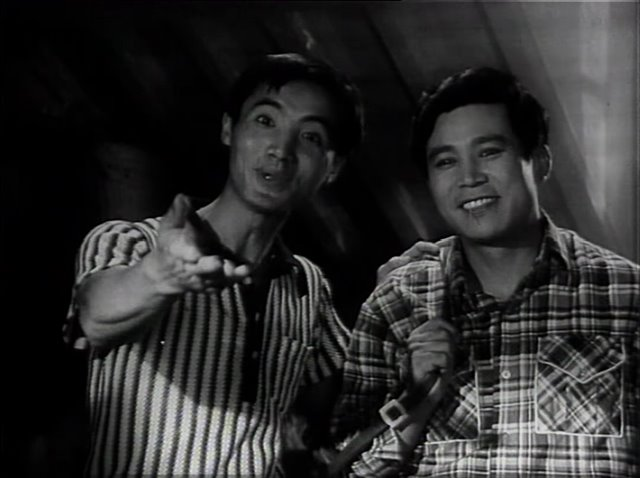

比如，（想象中）上海中产人家里的布置。
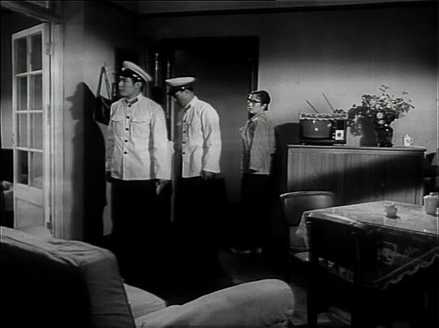
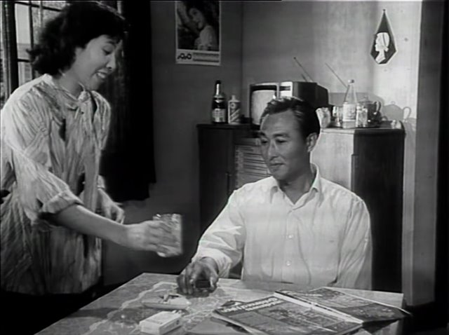

记忆中的镜头：死者女朋友在案发现场浮夸地大喊一声：“啊——”
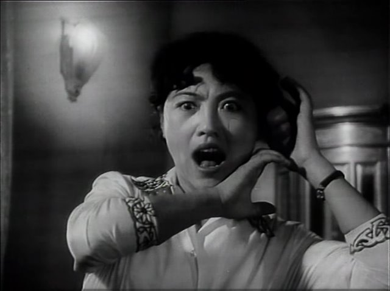
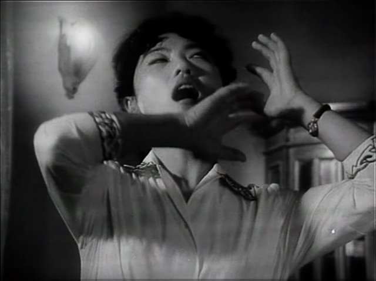