1990年春节，正月初七，老妈单位发了两张电影票。老爹不愿意陪她去，就带着我去了。因为女人出门的麻烦事儿，到电影院的时候，已经开场20分钟了。而又过了半个小时之后，老妈觉得片子太血腥，带着我提前退场了。这部看得没头没尾的片子，就是今天要说的《The Running Man》。直接用英文标题，是因为本片有两个译名《过关斩将》和《威龙猛将》，而且知名度相当，容易引起误会。
其实那个时候太小，还以为阿诺、舒华和辛力加是三个人来着，根本没觉得这片子有多血腥。只是存了一个不上不下的怨念。很久之后的一个暑假，通过租录像带的方式，我才补全了这个故事。
几年前《饥饿游戏》上映，陪老婆在电影院半梦半醒之间想到，这电影难道不是把阿诺的片又翻拍了一遍？找到下载后就扔一边了。直到要写这个系列。

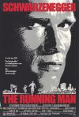

[过关斩将](https://pewae.com/gaan/aHR0cHM6Ly9tb3ZpZS5kb3ViYW4uY29tL3N1YmplY3QvMTI5MjYyNi8=)

原名：The Running Man导演：保罗·迈克尔·格拉泽主演：Dweezil Zappa / Jim Brown / 杰西·温图拉 / 玛利亚·康柯塔·阿隆索 / 阿诺·施瓦辛格类型：动作 / 惊悚 / 科幻地区：美国首映时间：1987

不要以为我用Running Man做标题是标题党。我真的怀疑，棒子国发明娱乐节目的时候，是不是也向好莱坞买了版权。看看这片头动画，简直是一个妈生的～
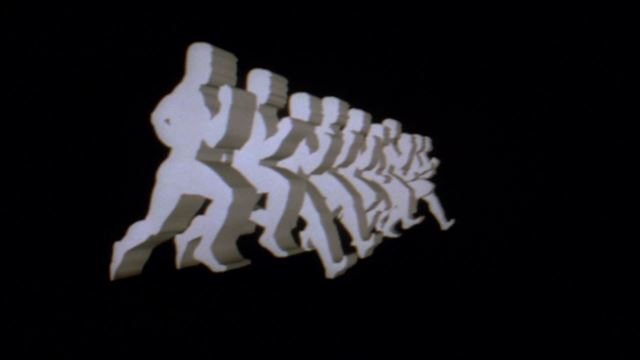
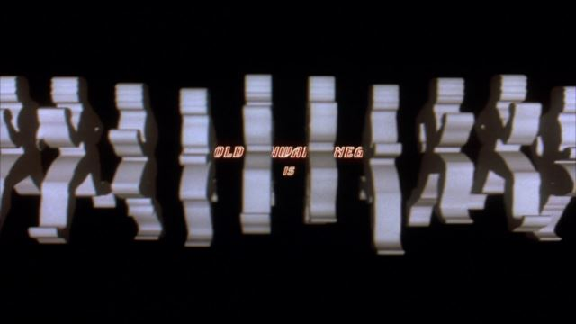

先说说故事梗概吧。
虽然本片整体水准不太高，编剧可是大名鼎鼎的史蒂芬金。尤其是2017年这年份太微妙了，金先生是穿越者吗？
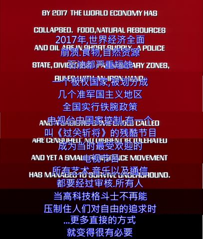
2017年，世界进入独裁政府阶段，能源和粮食都不足，全世界的人就指着一档叫《过关斩将》的节目活着。这个节目每期会挑选一个监狱里的罪犯，放进特定的场地，作为闯关者。然后放入若干追杀闯关者的人，这些人被叫做斩将者。3小时内闯关成功的闯关者会被赦免一切罪行，过上悠哉悠哉的生活。
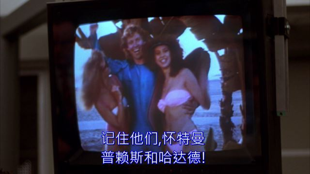
阿诺本来是政府警察部队的飞行员，在一次任务里不愿意攻击暴动的平民，于是被扔进监狱。不久后恰逢监狱暴动，他因为强大的武力值成为暴动队伍的得力干将，从监狱里跑了出来。他在跟女友去机场的路上被再次抓住。制片人觉得他前警察的身份很有搞头，于是在节目里把他刻画成杀人魔王，用一起暴动的小伙伴的性命作为要挟，要他作为闯关者参加《过关斩将》。进入节目后，阿诺当然是遇神杀神遇佛杀佛，两个小伙伴也恰到好处的领了盒饭。中途女友因为偷原始录像资料被抓也被扔进游戏。后来阿诺成功地入侵卫星，把女友偷到的原始资料通过电视节目播放到了全世界，平反昭雪。制片人当然也被阿诺干死了。
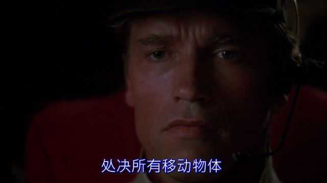

年轻时候的阿诺，胶原蛋白含量还蛮高的。其实这片里他表现并不好，恶意装酷，角色性格塑造得不鲜明。影片不出彩一半要怪他。
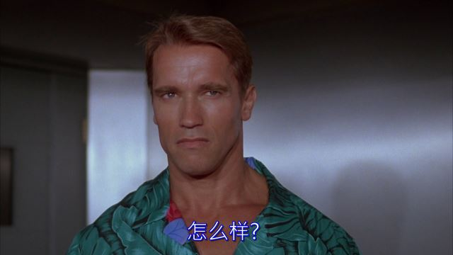

本片的大反派制片人+主持人，感觉比饥饿游戏里的那个有派。
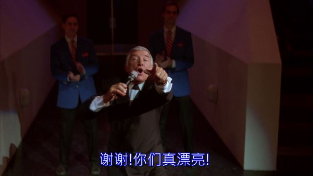

监狱暴动。我瞄着大表姐开了一枪，未曾想，北野武君先倒下了。
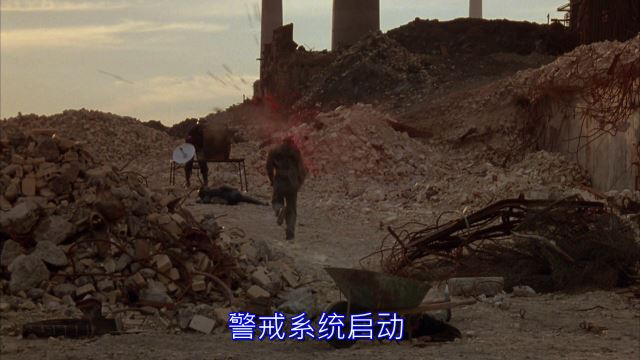
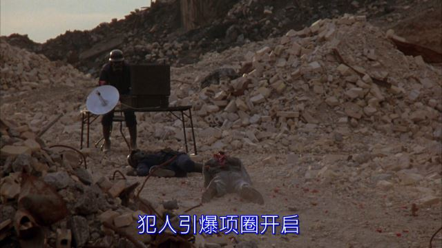

葛民辉表示，来替星爷挨一枪。
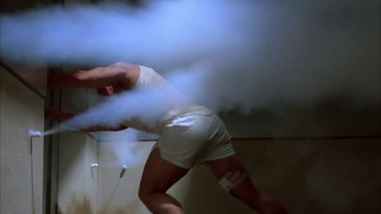

导演恶搞阿诺。
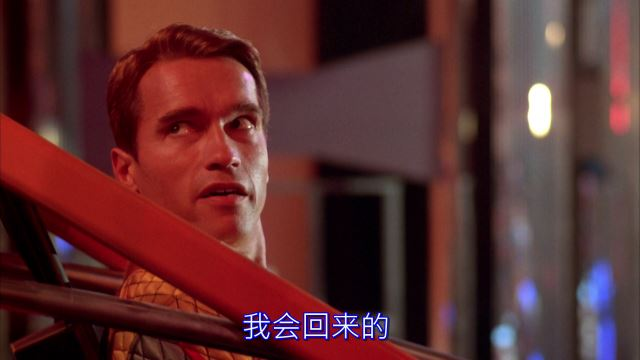

以及千万不要得罪字幕君
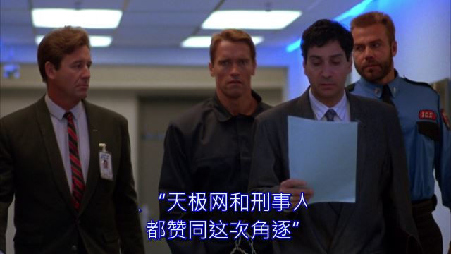

节目开始。看到这开场舞，我想到下一篇该写什么了，不过那片子一般人印象应该都不深。
中间那位独角仙姐姐的发型在80年代也很惊悚啊！
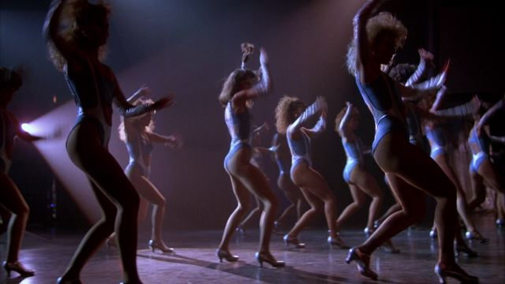

迫不及待的场外观众1。
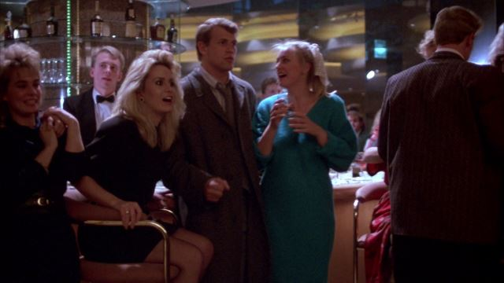

独角仙姐姐其实是负责敲开场锣的。
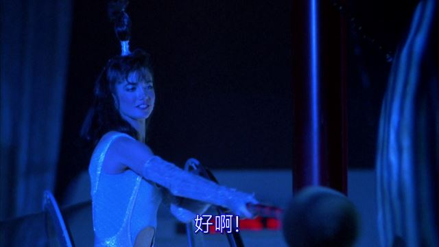

第一位斩将者，是个穿冰球装备且把曲棍球棍改装成类似恶魔城里死神拿的镰刀的人，冰球被改造成了炸弹，场地也是冰面。后来这个BOSS被阿诺埋伏，利用场地围墙上的铁丝网配合冰面上BOSS冲起来的高速度绞死了。这位BOSS的扮演者看职员表里叫田中，一种似曾相识的感觉，可能80年代总龙套出现吧。
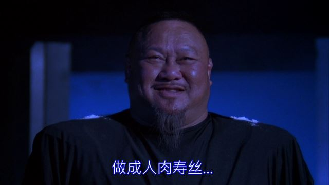
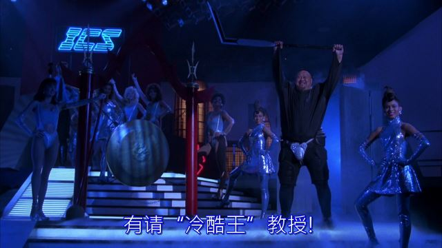
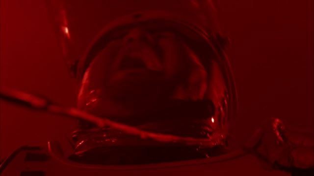

女主被抓进游戏。这个女主长得有点儿像宣萱和米歇尔罗德里格斯的结合体。
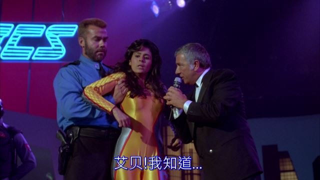

BOSS2电锯人和BOSS3放电人同时出场。闯关者在追逃之下也分成了两队。阿诺和黑人一组不知干啥，眼镜宅男和女主一组去破解卫星密码。
电锯人重伤了黑人，被阿诺抢了电锯之后分尸了。当年俺娘就为了因为点儿血就不让我往下看了。说起来这片儿应该算B级，也不知当年怎么在国内获得公映资质的。
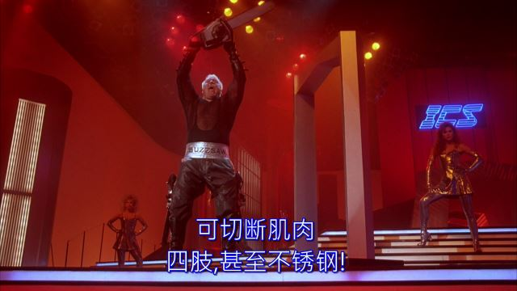
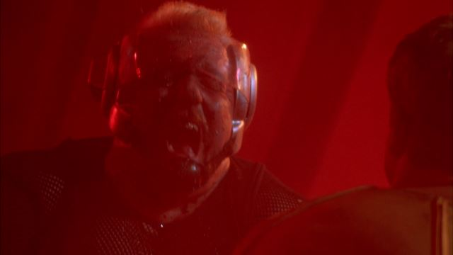
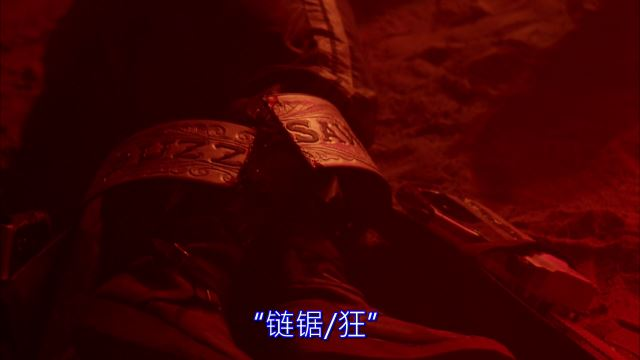

放电人是个装备流搞笑角色。以唱歌剧的形式出场。他恰好在眼镜男破解完密码的时候赶到，直接电死了眼镜男。反正密码已经在女主手上了，眼镜男非死不可啊。
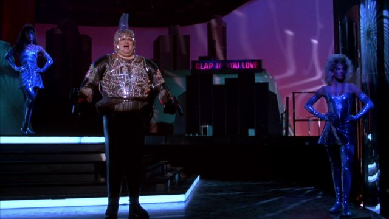
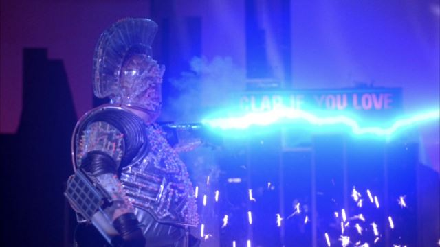
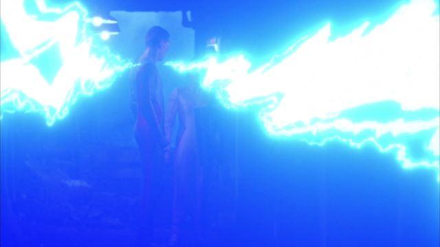

他还电了女主一把。可女主一点儿事都没有。可能有（电）容奶大吧。淫者见淫，again。
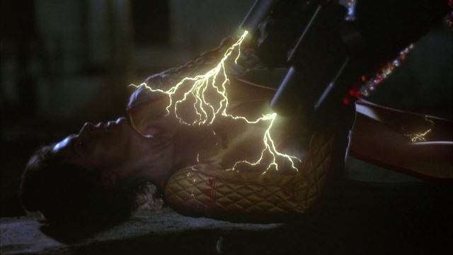

阿诺放过了无力反抗的放电男。这段在电视节目里掐了没播。
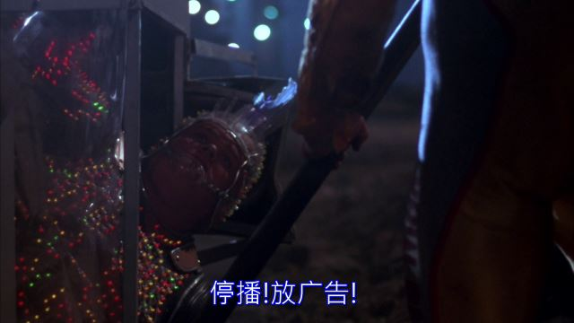

黑人贡献了重要的任务地点之后也挂了。瞬间无数RPG躺枪。谁都知道阿诺必胜，所以你死得还真是没什么价值……
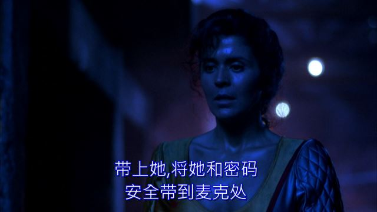
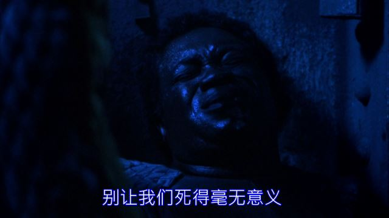

第四关喷火男。装备相当于红警里的火箭兵+星际里的火焰兵。抓到女主之后废话太多，被阿诺从身后偷袭剪断了输油管，一个照明弹送回老家。
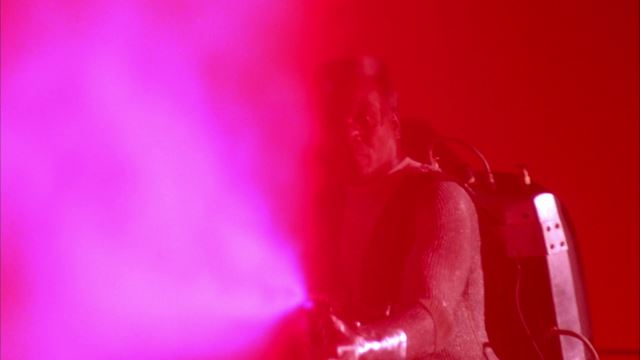
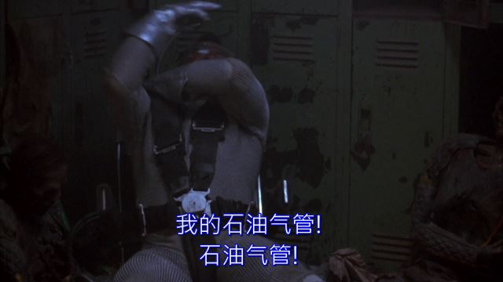
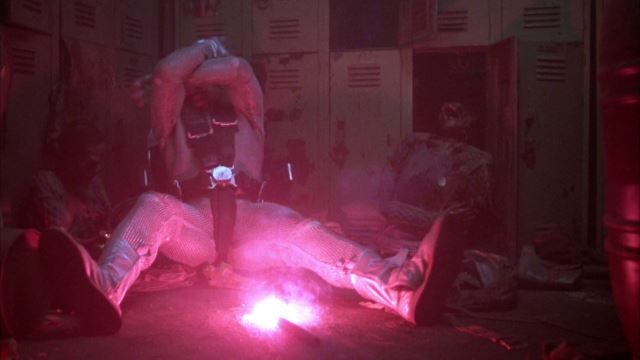

女主发现了往届闯关成功者的尸体。很奇怪地不知道用什么办法给录了下来。还有她被抓住而偷盗的录像没有被搜走，也很奇怪。
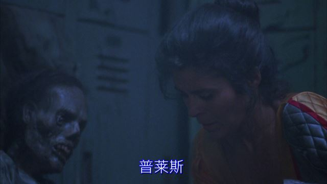

喷火男出场的时候，场内外已经有人开始倒戈了。
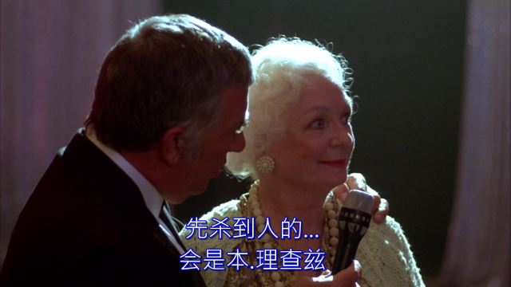
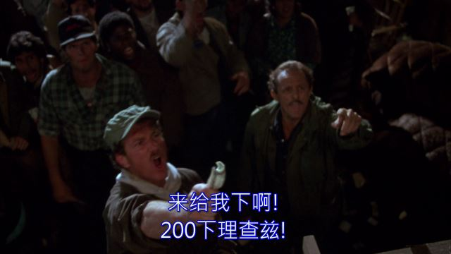

最后一个守关BOSS，什么队长的，拒绝出场。于是制作方紧急动用特效团队，编了个阿诺被杀死的结局。80年代开这种脑洞，怪不得史蒂芬金能挣那么多钱。
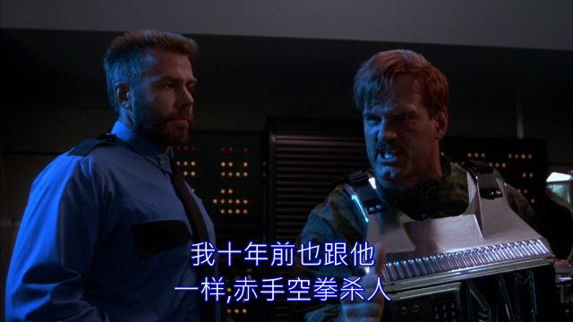
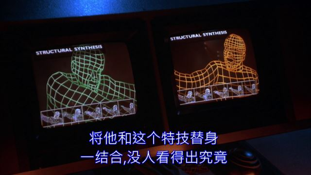
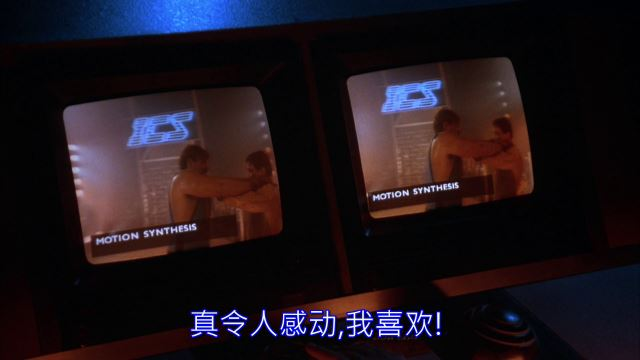

制片人在被反攻之后还在瞎BB，虽然他说得挺对的，可还是被炮决了。
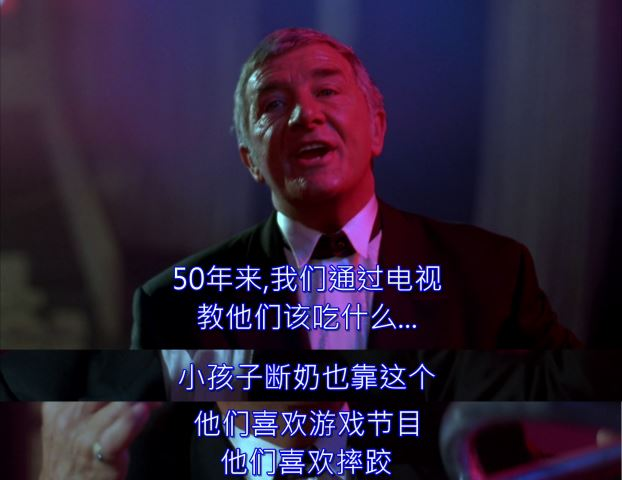
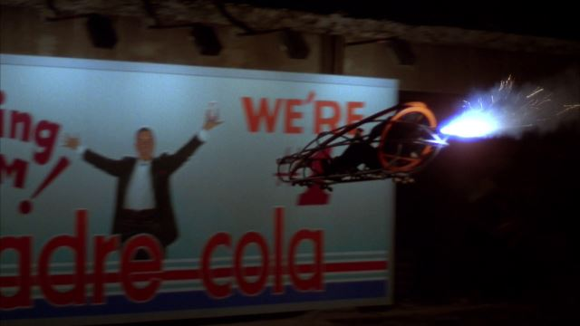

镜头take到场外观众2。跟1几乎毫无差别。所以人家本子是想写愚民才不会管什么正义和邪恶，只要热闹就好了。但整部片根本没拍出感觉来。剧本明珠暗投。
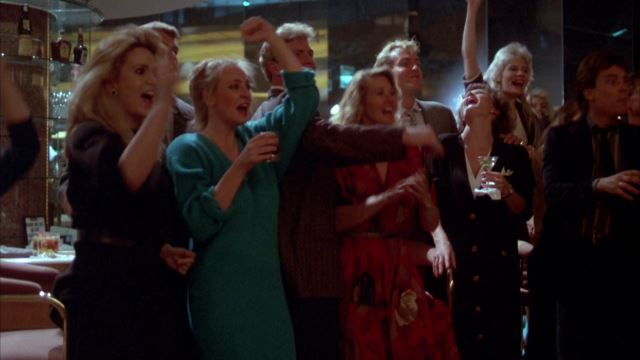

Happy Ending。
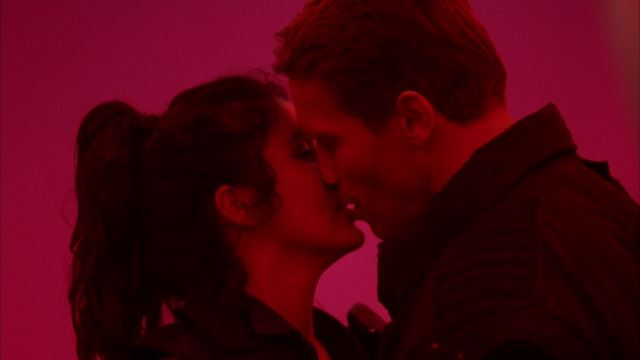

路易斯，你是不是想起机械战警了？