一不留神就搞了个动作片三连发，弄得我好像多喜欢动作片似的。所以提前乱入一部，只是为了说明，我还是更喜欢喜剧片和B级片。

[七只狐狸](https://pewae.com/gaan/aHR0cHM6Ly9tb3ZpZS5kb3ViYW4uY29tL3N1YmplY3QvMzYwOTEwNS8=)

导演：朱延平主演：叶倩文 / 孙越 / 尔冬升 / 方正 / 林青霞 / 许不了 / 陶大伟类型：动作 / 喜剧地区：台湾首映时间：1985

片子很冷门，质量也难说有多高。这部片子的正式名字叫《X陷阱》，现在一般要搜《情怨陷阱》才能找到，在本地播出的时候用的是另一个更好记的名字《七只狐狸》。
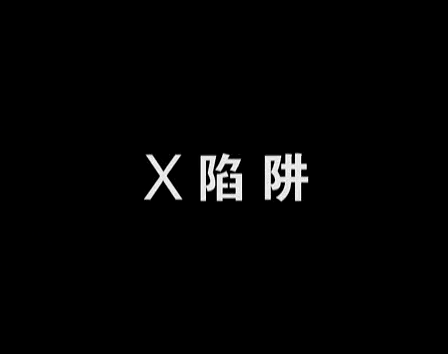
彼时正好是1994年暑假。晚上首播的时候没赶上开头，挺遗憾的；第二天上午被老妈打发去给姥姥和大舅送东西，赶回家之后又没看到开头，深以为憾。进入到网络时代之后就一直在四处搜索这部片子。可02年左右的时候，只能搜到另一部名称很像的《七只狐狸八条狗》。搜主演的话，我记忆也出现了偏差，只记得有林青霞、叶倩文和光头佬麦嘉，林叶的profile上只记录过《七只狐狸》。线索就此中断。

又过了几年，在一个回顾倪敏然的节目里看到了同台的方正和许不了，立刻意识到记忆里的不是光头佬，而是这两个家伙。更换关键字再次搜索，终于找到了这部片子。可惜没高清版本。
这俩家伙是小报记者，跟踪富翁孙越想在他身上挖大新闻。
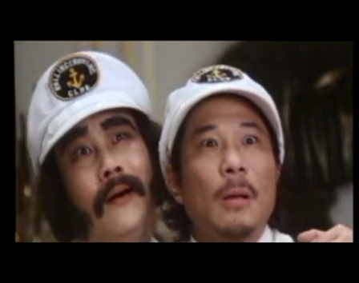

叶倩文的出场却是震撼性的。我觉得我小时候没看到叶倩文的大腿舞算亏大了。当然如果真看到了可能我妈就不让我看下去了。叶倩文演的是酒吧的舞女，被老狐狸孙越要求假扮自己的女儿，报酬是遗产。为老狼的助唱团看了第四季《我是歌手》的决赛，何老师念错Sally姐名字的时候，当时我就拍桌子了——毛毛虫你究竟有没有童年啊！Sally姐演的角色大多叫Sally这也能忘。
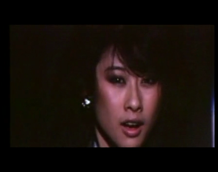
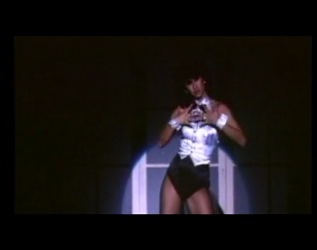

吃软饭的爱情骗子陶大伟。陶喆你爹跟张菲是同一款的你造吗？
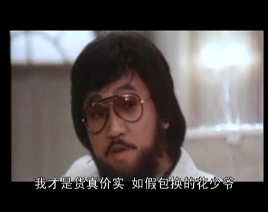

盗贼尔冬升和他的女朋友林青霞。尔冬升年轻的时候真tm帅！他妈能生出秦沛姜大卫尔冬升这三种不同的款，更厉害。
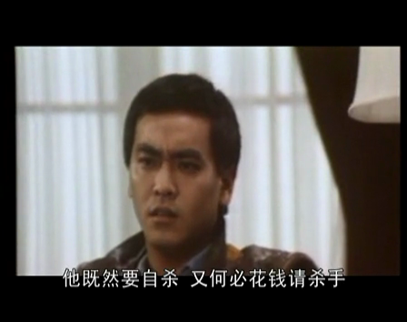
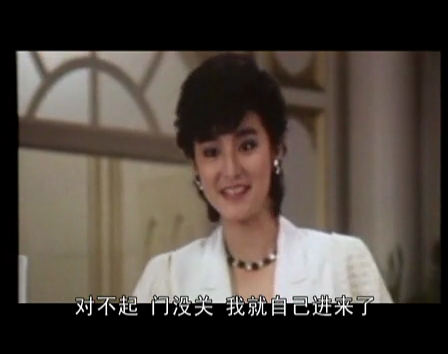

老狐狸孙越。感觉这老头儿就没演过好人。后面的管家和管家婆很容易让人想起徐锦江和苑琼丹。
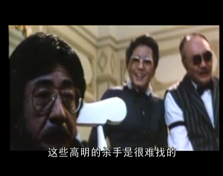

剧情发展，老狐狸登报说找私生子继承遗产，于是许不了、尔冬升和陶大伟都宣称自己是私生子入住孙越的大别墅。假养女叶倩文，假报社记者林青霞以及许不了的跟班方正也一起住了进来。
首先孙越说私生子应该是有黑道背景的，所以让管家比划一套黑道手势让三个人对答。这一段是相当传统的老段子了，但看着还是想笑。倒不是因为故事如何，而是因为台式小剧场那种套路加几位大咖的做作的动作和表情。
虽然优酷这渣版本很难看清表情。
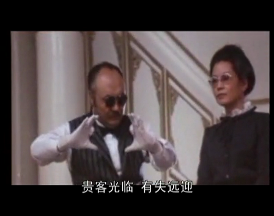
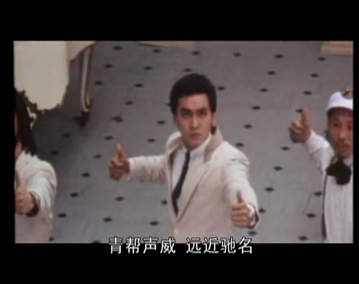

这个晚上孙越就死掉了，说是想在自己快乐的时候死去，所以雇了个杀手杀死自己。
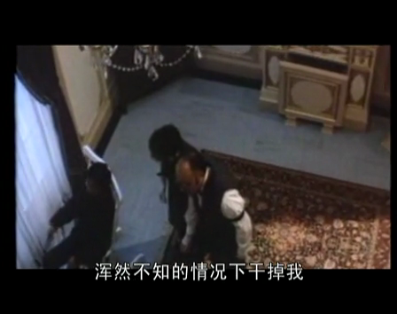

死前用录音机录了一段遗嘱。列了个单子，让每个私生子候选人去找一些乱七八糟的东西，可以用各种办法获得，但就是不能拿钱买。每个东西有不同的积分，积分最高的得遗产。于是，片子进入了最欢乐的部分。
镜头交待的有陶叶组合色诱农民偷马、尔林组合碰瓷诈轮胎、方许组合碰瓷未果等。
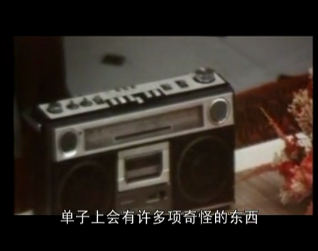
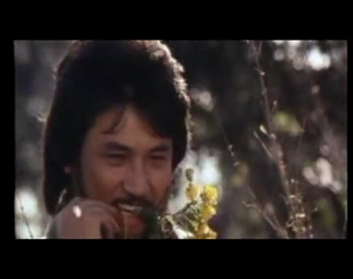

当年，全片印象最深的就是这里林青霞和叶倩文在加油站骗加油机的片段。
先出场的是叶陶组合。叶说：“景色好美哦，想去游泳。”又对俩工作人员说：“要换衣服，借你们房间用一下。”然后俩工作人员借口肚子疼，让陶自己加油而跑去偷窥。当然加油机被陶大伟拖走了。
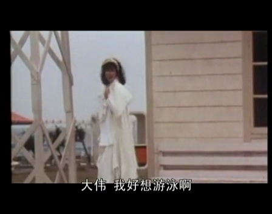
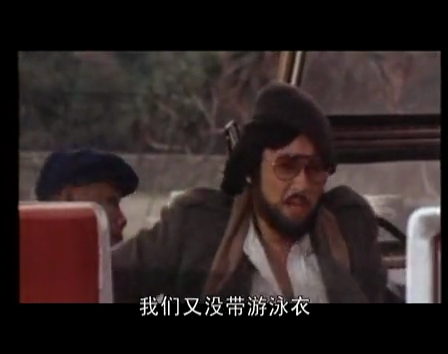

然后林青霞就出场了。台词更狠：“人家想裸泳不行啊!”然而同样的招数不仅圣斗士无效，对加油站的死龙套也没什么用处。二人强抢过关。
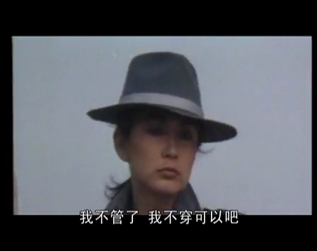

最后清算，方正的造型能让人把隔夜饭吐出来。
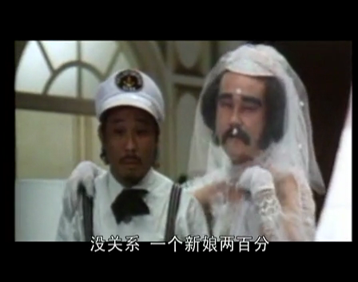

接着，孙越就像三国无双五丈原里的诸葛亮一般诈尸了。他痛斥这几个王八蛋：“你们都不是我的儿子，我的儿子不会在我尸骨未寒的时候来分我的家产。”打一巴掌之后又给了个甜枣，表示几个人可以在他死后平分他的遗产。
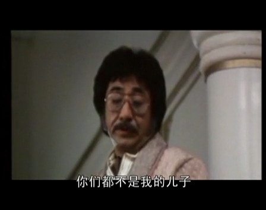

接下来孙越就又被杀手杀死了。并且杀手故弄玄虚，在公寓里玩了一出谁是凶手的游戏，所有人吓得够呛，最后下手的竟然是管家夫妇。
此后剧情急转直下，原来孙不仅没什么遗产，反而早就破产，欠了一屁股债。六个替死鬼焦头烂额应付各路牛鬼蛇神，对媒体拼命阐述孙越是被杀手杀死的。
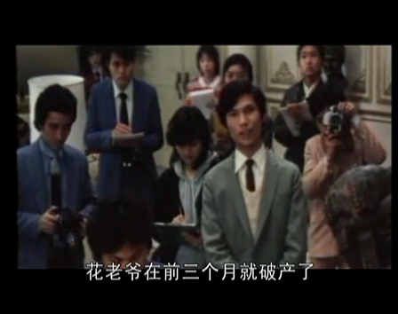

然后，剧情再次反转。鬼鬼祟祟的保健医生领了一笔保险金，管家夫妇跟再次诈尸的孙越汇合，准备跑路去美国。
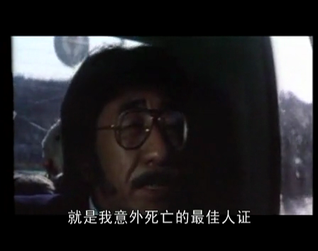

再再次反转，六人组拦下了孙越，表示“我们早已看穿一切”。老狐狸决定带着六只小狐狸一起跑路。
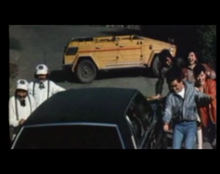

最后留一个开放式结局，算是不错的收尾。总之，不考虑渣画质的话，这部片冲剧情还算值得一看。