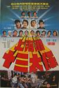

[上海滩十三太保](https://pewae.com/gaan/aHR0cHM6Ly9tb3ZpZS5kb3ViYW4uY29tL3N1YmplY3QvMTQ2NjU3NC8=)

导演：张彻主演：刘德华 / 姜大卫 / 朱海玲 / 李修贤 / 梁家仁 / 江生 / 狄龙 / 王羽 / 程天赐 / 陈观泰类型：动作地区：台湾首映时间：1984

这片子看得晚，93年暑假在大药丸子家看的。当时是帅刘跑去租的，冲刘德华的名头，岂料刘天王在这片里只是个男配N。
男配却也绝对不丢份，因为这片根本没主角的，而片子里唯一的女性角色如果算女主角的话，刘德华作为女主角的对手，也可以算作男猪？
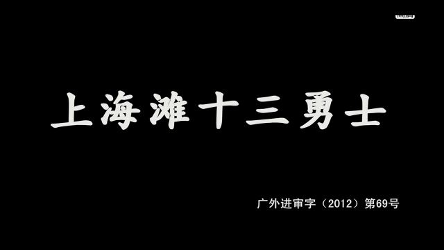

93年看84年的片子，也是有厚重的年代感的。本片算是一代宗师张彻先生拍的全家福。剧情什么的完全不重要，追求的就是一个打字，从头干到尾，火爆非常。套用任天堂的命名方法，那就是“张彻全明星大乱斗”。
所谓十三太保，是指“一夫当关、教头快刀、浪子富翁、学生少爷、熊虎鹰豹、眼镜烟嘴、长枪难逃”
顺口溜其实也很有趣。除了陈观泰以外，反过来就是这些人的武力排名。
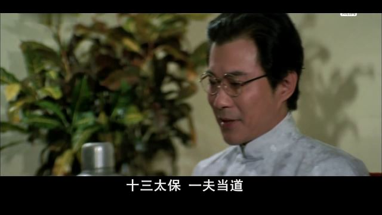
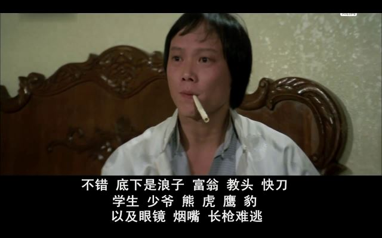

第一个出场的是王羽，张彻先生第一代的御用，演了个贼。王羽先生是张彻先生成名作《独臂刀》的主演，84年的时候已经中年发福，演不得动作片了，所以只是客串了一下，算是大师兄亮个门户。
王羽有个闺女，叫王馨平，可以算在那种只红了一首歌（别问我是谁）的歌星序列里。现在能记得王馨平的人也不多了。
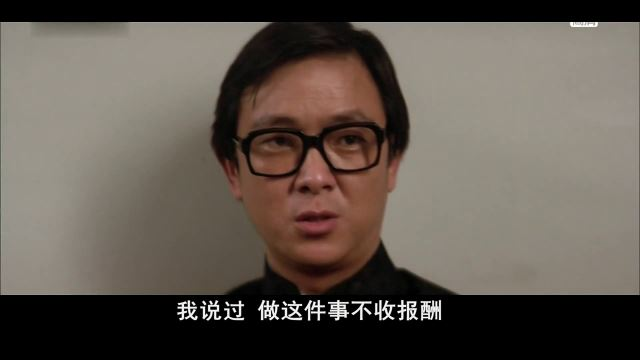

反派的大人物是常枫老爷子演的，这老头演了一辈子老头，印象深的是93版倚天里的张三丰。
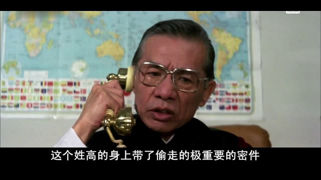

二师兄陈观泰演“一夫当关”。只有一丢丢打戏，同样活到了最后。注意，他是穿棕色衣服的。
说起来这个大哥当得颇有些狼狈——自己身边有卧底，直接把“眼镜”葬送了，收入来源、赌场的“浪子”和码头的“教头”身边也都有卧底；行动路线嘛，被对手掌握个底儿掉，处处追杀堵截；装备也不行，人家有狙击枪有大片刀，而自己这边只有短棍；人手也不够，“烟嘴”“眼镜”“富翁”“学生”“少爷”都可以算是被围殴死的。老大出来装个逼，然后手下接连去送死，也算是七八十年代的类型片特色了。
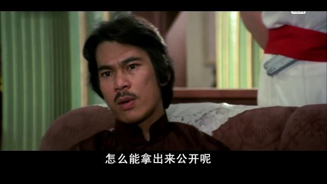

动作戏第一个出场的是“长枪”李修贤。据传张彻先生不是太喜欢李修贤，这部片就是证据之一。李大佬出场5分钟就领便当了，连特写都没几个。
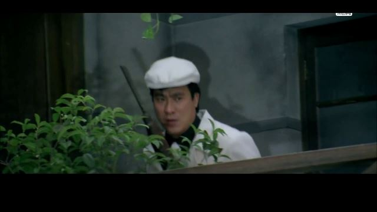

“烟嘴”“眼镜”都是邵氏动作片里的老面孔，也都不出意外顺利地领了便当。烟嘴的好多台词都是为了引出后面的剧情生加的，那一本正经硬凹的样子还挺萌的。
扮演烟嘴的演员江生37岁就英年早逝了。
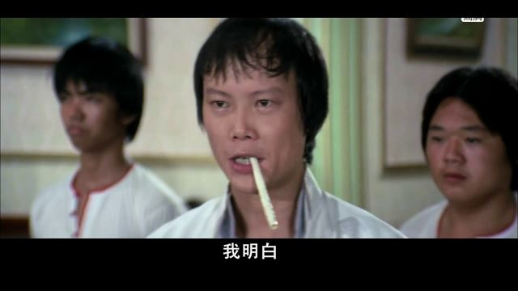

“眼镜”出场时间不长，就被叛徒一刀捅了肚子，不久领盒饭了。有趣的是，眼镜要挂的时候，眼镜的眼镜掉在地上摔碎了，被保护的高先生竟来了一句：“你就是十三太保里的‘眼镜’！”真想送他一句MMP。话说这个高先生的角色设计得非常冷血，宠辱不惊，十三太保一个一个死在眼前也无动于衷，片刀在眼前晃来晃去也熟视无睹，充分体现了革命党人的视（mei）死（xin）如（mei）归（fei）。
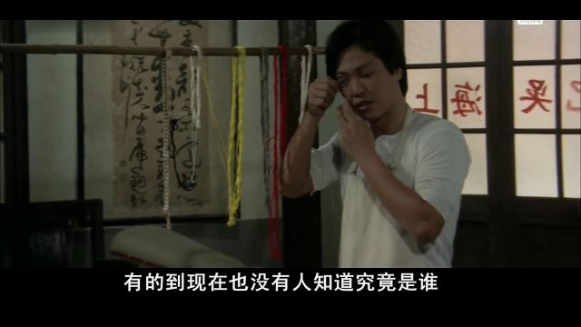

接下来出场的是“富翁”梁家仁。也就是大家熟悉的武状元。这人不知为何，我看来总带着一股猥琐气质，即使本片里演了个富翁，也仍旧像个土鳖暴发户。
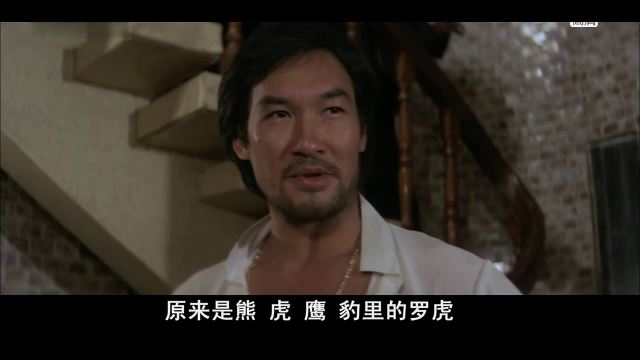

演“虎”的哥们短小精悍，目露凶光。其战绩在反派里排名第二，怼掉了“富翁”、“学生”。总觉得他神似《赌侠》里那个反派玻璃花眼，可查了一下并不是同一人。这人也并非等闲之辈，他后来转做幕后，是我们所熟悉的《包青天》的导演。
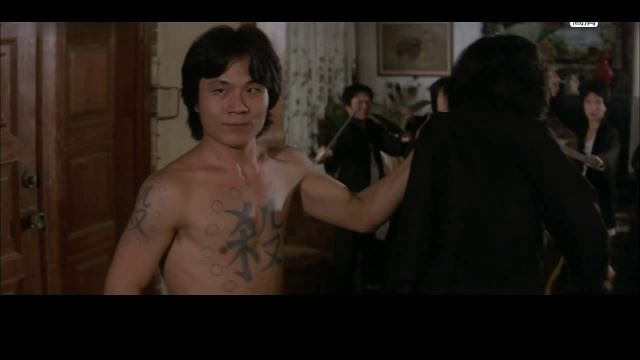

十三太保正义一方大部分人的战斗力实在是渣，前面烟嘴眼镜都是被小喽罗弄死的，这边“富翁”1V1也没弄过“虎”，当然这跟他有个丧门星妹妹有关。
丧门星不听她哥的话，让躲起来不躲，还出声音暴露目标，被对方抓了人质，不仅武状元投鼠忌器，还坑死了后来来帮忙的刘德华（学生）。
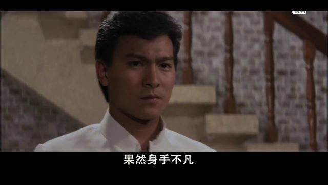
那时的刘天王出道时间不长，能出演这样的片子完全是天上掉馅饼——张彻用他来代替因车祸去世的付声。付声先生现存的影片大多是看不下去了，可他在泡妞界的地位可谓一时无两，有兴趣的请自行搜索。
话说付先生是张彻的得意弟子，张为其安排了独一无二的戏份，可惜生不逢时。刘德华被选中候补，据说是因为当时的baby fat跟付神似。看看偏爱的待遇吧，全片唯一的一段感情戏回忆杀就是留给了初出茅庐的刘德华。（修贤大哥表示：我有一句NMP不知当讲不当讲……）
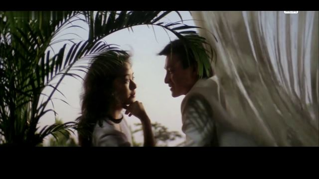

伴随风华绝代的姜大卫华丽登场的是一局非常精彩的2V2。姜先生年轻的时候一直在演浪子，片子里也叫“浪子”叶不凡，武器是装逼范十足的围巾。话说本片从头打到尾，在动作设计上不玩一些花样是不成的。开头立仆的李修贤使狙击枪不算，“烟嘴”玩空手入白刃，“眼镜”用指虎，“学生”用冲绳式双拐，“浪子”用围巾，“大豹”使钢爪，“熊”用扇子，“教头”耍棍，“快刀”用的是小匕首。
虽然姜大卫面熟，但真正记住名字的却是他生涯晚期出演的电视剧《刺马》，虽然是辫子戏，但依旧很帅，可奇怪的是我一直不觉得周杰伦如何帅。
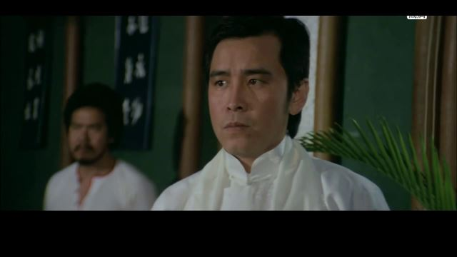

2V2正方的另外一人是“少爷”。其扮演者是张彻在台湾发掘的演员李中一，据说“少爷”这个角色是量身打造的，帅得掉渣，风头似乎压过了刘德华。可惜这人终究没红起来。
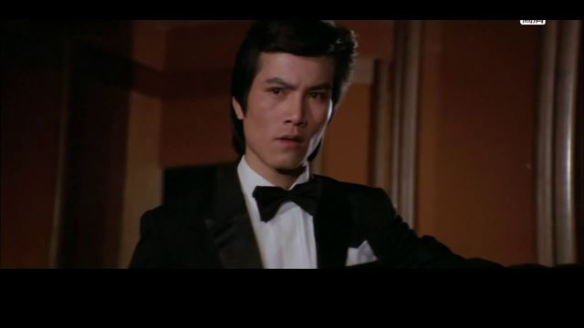

演“大豹”的戚冠军是反派组里名气最大的一个，演惯了主角的。除了能打倒也没别的本事，八十年代后期就销声匿迹了。
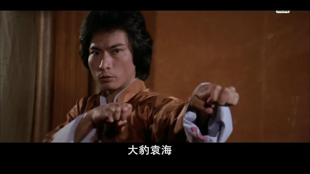

“熊”这位老大爷一直活跃在影坛，从来没演过好人。本片里有个奇怪傻笑的人设，加上用的武器是折扇，不禁让人联系这是否是在揶揄楚留香。可又没查到秋官跟张彻有什么过节，据说张彻夫人和肥肥反倒是闺蜜关系。
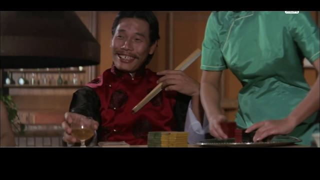

本来是“浪子”“少爷”完胜的一局，却被“快刀”横插了一刀。姜大卫被一刀毙命，“快刀”凸显杀手本色。这是个亦正亦邪的人物，由大明星程天赐出演。
“快刀”简直是个变态，先杀浪子叶不凡，随后追杀高先生，把“教头”的手下杀了个七七八八，继而“被你们不怕死的精神感化”，倒戈秒杀“小豹”，跟教头一起杀了“鹰”和一个反派首领。尘埃落定的时候又突然反水，挑战教头，打着打着自己送死，理由是“违反了杀手的规矩”。看似有型，其实毫无逻辑。程天赐全程非常潇洒。
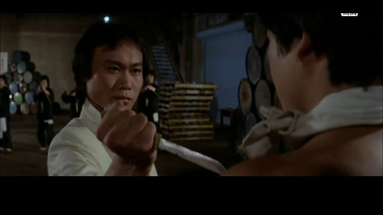

“鹰”出场太晚，也是演了一辈子反派的熟面孔。
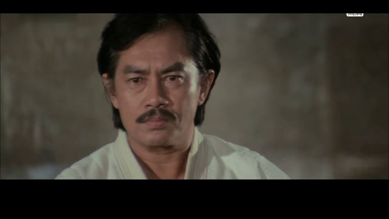

“小豹”身材矮小，动作设计的不如大豹舒展。
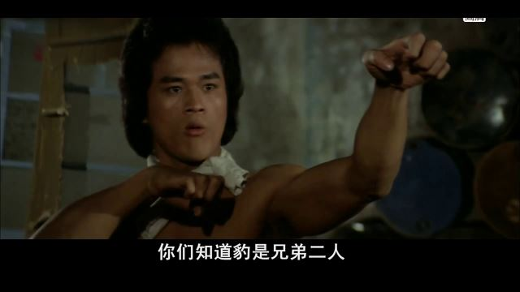

守关的“教头”是狄龙大哥。这时他已不再年轻，戴上了帽子。此时的发迹线跟他不久后《英雄本色》里应该相差不远。作为最后的大轴和张彻最宠爱的弟子，狄龙本事是真高，一直处于一挑二的状态，只是碗口粗的齐胸棍的设定太蛋疼，远比不上觉远和尚耍棍的视觉效果。
狄龙身穿褐色衣服，也预示了他会活到最后。
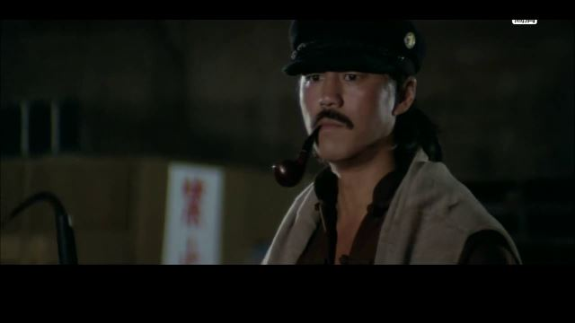

张彻的片子有个特点，凡是穿白衣的都要死，如果像紫龙一样裸身上场的更要死，而且最喜欢的死法就是腹部被捅得血乎哩啦的。本片中烟嘴、眼镜、富翁、学生、虎、少爷、大豹小豹、以及最后的快刀都是这样的死法。其中大豹被少爷抓了两块肋骨下来，场景也算刺激。相比之下，备受宠爱的姜大卫死的时候是个全尸已是开恩了。典型的例子还蛮多的，眼镜不仅一身白，而且戴了个白围裙，所以很快就挂了；“快刀”武力极高，但白衣出场，就觉得玄乎，后来打着打着竟然把衣服给脱了，然后就死了；大豹本来穿黄，属于安全色，可是好死不死非要学紫龙光膀子，不久就挂掉；负责追杀的十三太保之外的啸天，前两次都穿黑色，屁事没有，最后一场穿白的，分分钟被neng死。
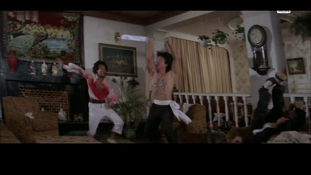
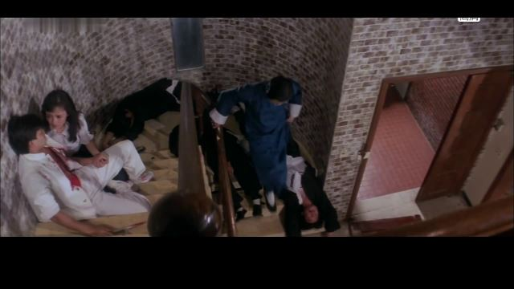
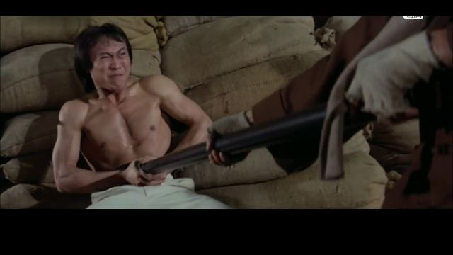
只有“熊”是穿红色却死掉的，难道是导演嫌他太丑?

剧情是真没什么了，反正当年看过之后甚至连动作戏都记不住，只能记得十三太保的外号和武器，然后在学校里打打杀杀。
现在人管那叫cosplay。