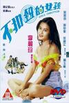

[不扣纽的女孩](https://pewae.com/gaan/aHR0cHM6Ly93d3cuaW1kYi5jb20vdGl0bGUvdHQwMTA5MzQ1)

导演：黄泰来主演：吴妙仪 / 徐锦江 / 李丽珍 / 杨玉梅 / 梁思浩 / 邵仲衡类型：喜剧 / 爱情地区：香港首映时间：1994

这是一部本身乏善可陈的三级片，借这部片子说点题外话。
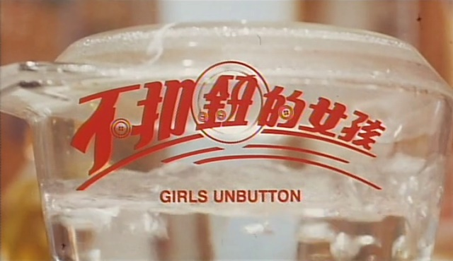

今年是本人大学毕业20周年，同时也是工作20周年。当年我并不是一毕业就找到了工作，而是拿到毕业证后在家里又蹉跎了几个月，直到10月份才正式成为打工人。加之当年4月中旬就因为非典被隔离在家里不能返校，这半年的时间是我一生中最闲散的时光。每天足不出户，除了吃饭就是在屋里打游戏。后来游戏实在打腻了，才发展出看电影这一分支爱好。
是的，03年以前的我根本就不算是个电影爱好者。但现而今我的观影数量已经在2800部以上了。因此03年是我看片的一个分水岭，从这一年开始，我对新片的出品时间逐渐失去概念，只会记得“我看过”，却记不得“我什么时间看过”，也是刷片量暴增的一个副作用。所以，从今年往后，这个专题的“20年”对于我的记忆来说也将会是一个小小的挑战，当脑力游戏吧。
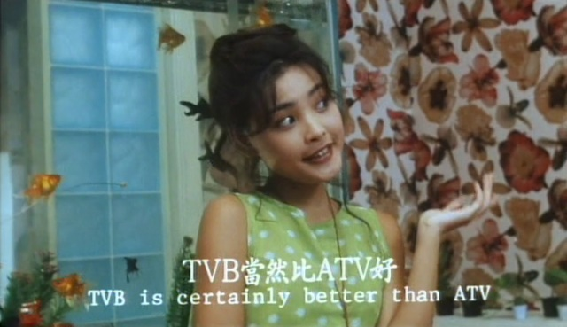

那个年代也是BT最鼎盛的年代，只需要一个合适的关键字，就能找到想要的东西。
甚至都不用刻意找，各大BT资源站自然有课代表总结出的“翁虹全集”、“李丽珍全集”、“舒淇全集”、“叶玉卿全集”、“杨思敏全集”、“徐若瑄全集”、“玉X团”全集、“强X”全集……
当然是一通大补特补，这部片就是在那时“补”回来的。
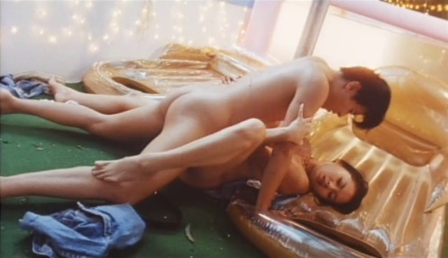

回到片子本身，这是李丽珍参演的第四部三级片，但却是“下海”的第三部，因为中间有一部《郎心如铁》是因为血腥被评为三级，李丽珍参演却并没有脱。P.S:《郎心如铁》是非常棒的片子，推荐！
李丽珍主演的前三部都市题材三级片有个共同点，就是强调脱的自然。本片开场就很猛，不到5分钟看点就来了，又过了三分钟，跟李丽珍演对手戏的哥们儿就消失了，后面再也没出现过。
当年李丽珍这一脱，完全是为了红。27岁年龄虽然不大，但她那时已经在娱乐圈混了10年了，一直是小花瓶一只。寻求突破完全可以理解。但哪怕脱了，她这时演戏也没开窍。等她琢磨明白应该怎么演戏，已经是新世纪的事儿了。
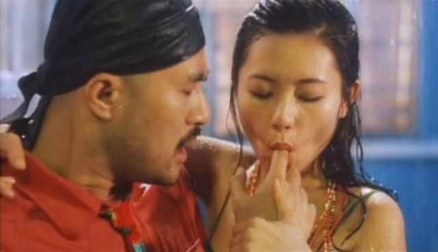

片子就是给李丽珍量身定做的三级轻喜剧，一直在强调李脱的自信。其实李本身本钱并不雄厚，跟叶玉卿完全没法比，小输舒淇翁虹，只比温碧霞强一丢丢。
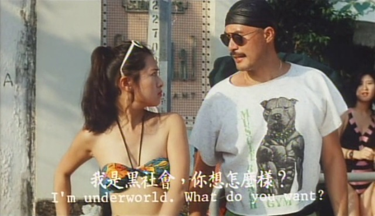

找来三位男搭档演了三段故事。第一位是三级片钉子户徐锦江大哥。
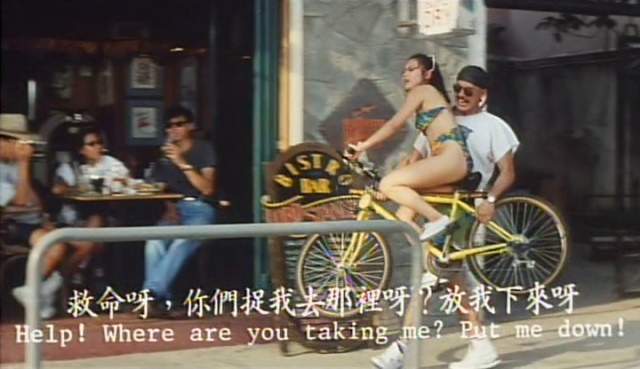
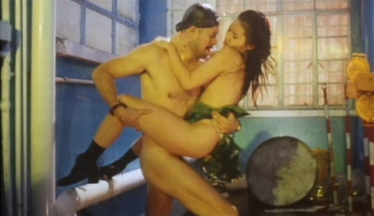

徐大哥差点走光，非常罕见……
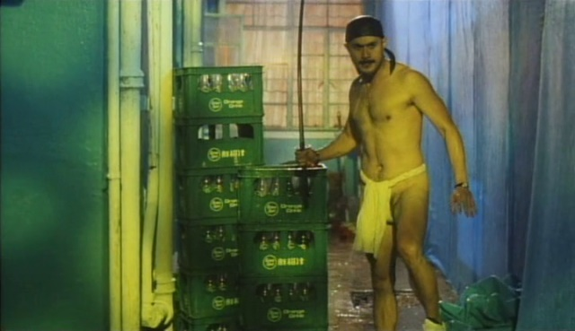

第二位是邵仲衡。估计片方也是蹭《大时代》的热度，让“方婷”和“丁孝蟹”再续前缘。
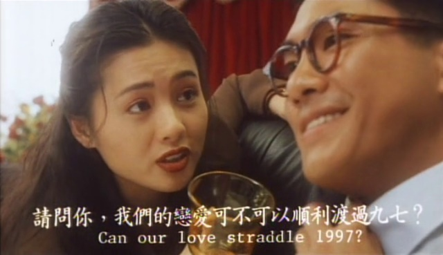
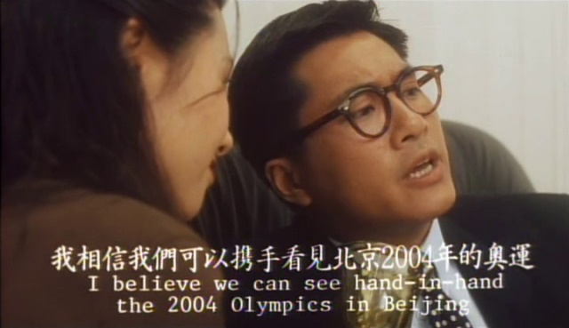

第三位是总演倒霉蛋的梁思浩，难得演了次主角。本片里也被猪肉淋了个从头到脚。虽然有跟李丽珍的激情戏补偿，但有一场水中爱爱的镜头，估计也没少吃苦头。
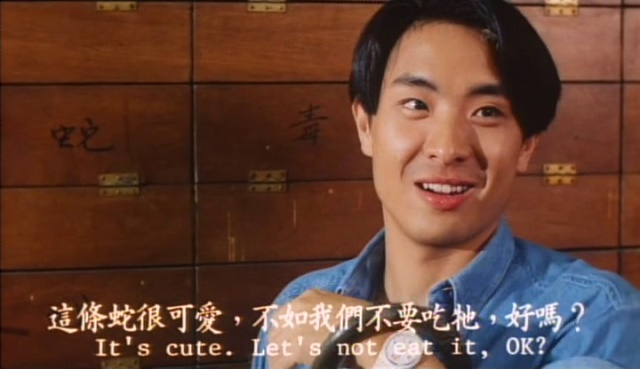

照香港三级片的惯例，除了李丽珍这匹头马外，还有三位为艺术牺牲的女艺人。她们是演李丽珍死党的吴妙仪、洪玉兰，以及演梁思浩姐姐的范爱洁。尤其范爱洁，实力非常雄厚。
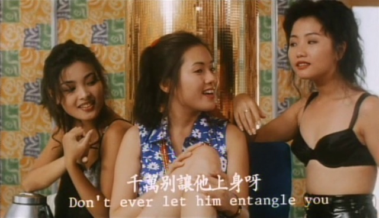

最后强调一句，本片非常无聊。如果不想关注现年57岁的老阿姨27岁时的样子，完全可以忽略本片。