[依波拉病毒](https://pewae.com/gaan/aHR0cHM6Ly93d3cuaW1kYi5jb20vdGl0bGUvdHQwMTE2MTYzLw==)

导演：邱礼涛主演：叶先儿 / 尹扬明 / 张露 / 成奎安 / 罗莽 / 陈妙瑛 / 黄秋生类型：恐怖 / 犯罪地区：香港首映时间：1996

本片早就在名单之上。
早在14年西非闹埃博拉病毒的时候，就想把这部片子拿出来写一写的。但是掐指一算，我是在2000年1月份大学第一学期期末考试期间看的片，当时并未满足“看片20年”的自我约束条件，遂作罢。
本以为再也找不到那么切合的时间条件了。谁料到2020年，刚满20年，这个契机就又出现了，虽然我很不希望遇见它。
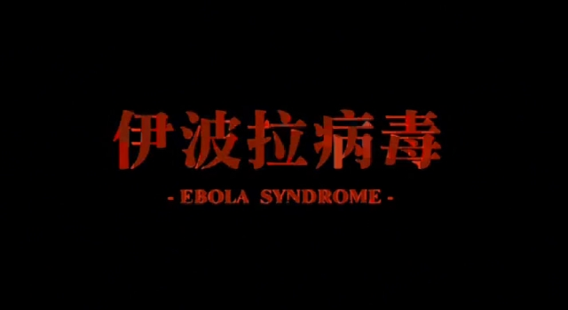

邱礼涛是我比较喜欢的一位香港导演，他拍摄邪典片可谓相当有一套。血腥暴力色情这些要素说起来容易，想拍好却很难。邱礼涛的片子往往能在血腥之余制造出一种癫狂的氛围，非常难得。
本片最典型的氛围营造就是开头黄秋生被捉奸要被大傻切小弟弟，奋起杀人的一场戏。黄sir由一开始的自保转变成激情杀人，用麻将桌neng死大哥，极度带感。
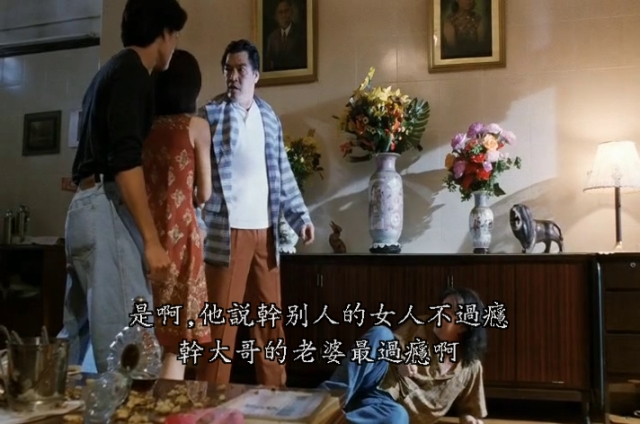

本片在艺术成就以及历史地位上，跟邱黄二人合作的前一部作品《人肉叉烧包》是无法相提并论的。只有小技巧，没有大突破。在非洲卖人肉汉堡包的一段剧情，根本就是《人肉》的翻版，区别只在于两个黄秋生是性格不同的变态。一个是冷静而疯狂，一个是逗比而无脑。
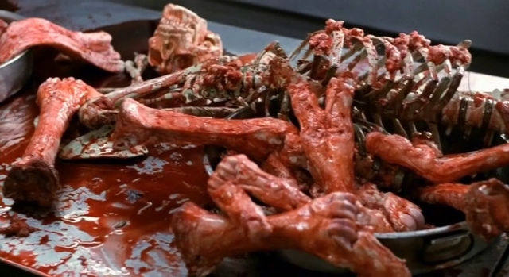

简单说一下故事。黄秋生扮演的阿鸡在香港跟大嫂通奸被发现，杀了大哥大嫂和跟班小弟，跑路去南非。在南非的一家餐厅打工。一天，阿鸡跟老板去部落买廉价猪肉的时候适逢部落闹瘟疫，阿鸡在河边上了一个发病严重的部落女人。回餐厅后阿鸡发烧，老板娘和老板怕瘟疫想弄死阿鸡，却被退了烧的阿鸡反杀，做成了人肉汉堡包。此时阿鸡成为没有症状的超级毒人。他利用老板的身份和钱跑回香港，一路祸祸，直到被英勇的香港阿sir同归于尽。
非洲群演真的很丑，难为黄sir为艺术献身。
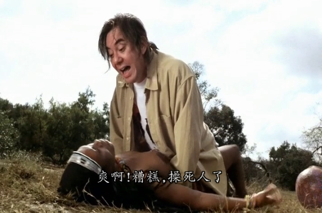

有了很暴力，很黄还会远吗？很遗憾几位为艺术而献身的女演员并不能搜索到更多的资料。演南非老板娘的那位SunLu演技还是在线的，可除了几部三级片也没任何信息留下。现在能找到简历的，都是没脱的。其中演阿鸡女朋友的可是当时TVB的小花旦陈妙瑛（《洗冤录》聂枫）。

在这个时点上回顾，当然会注意片子里关于传染病和预防的剧情。南非的讲中文的医生还是很注意的，先把传染源罗莽的嘴用口罩堵上。其实我觉得，现在国家要求出门戴口罩，并不是为了不被别人传染，而是不让你传染给别人。说得好听而已。
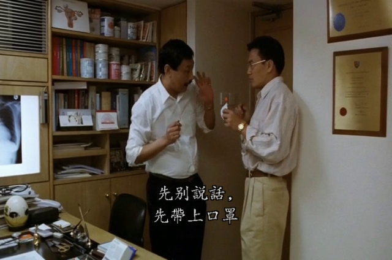

当年的防护服。
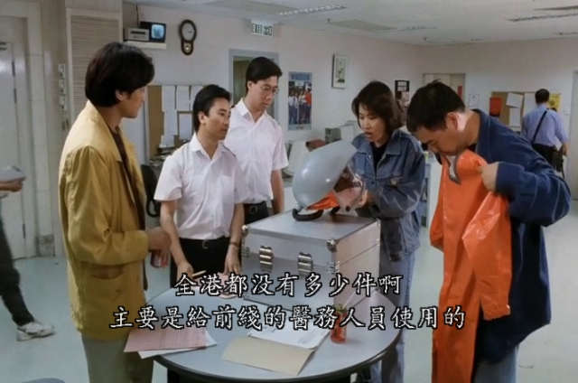
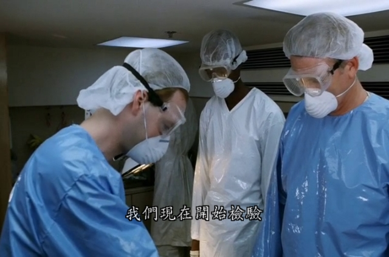

片子里的伊波拉病毒发病的时候动作很夸张——口吐白沫四肢抽搐，生怕观众看不出来病了。这点殊为不美，只要气氛到位，用不着如此夸张的。有个小混混被黄一个喷嚏喷死了。到死的时候特写镜头才看清小混混是客串的八两金演的。
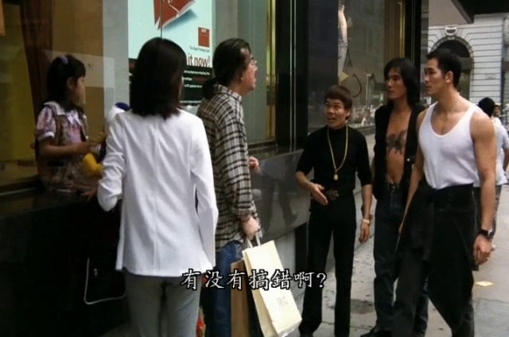

比较典型的是阿鸡的身份败露之后，满大街糟蹋路人。片中的病毒并没有新冠这么厉害，所以黄秋生必须咬自己的胳膊，然后“含血喷人”才行。可能当时的编剧还不知道有气溶胶传染这回事，所以设计成必须体液传播。
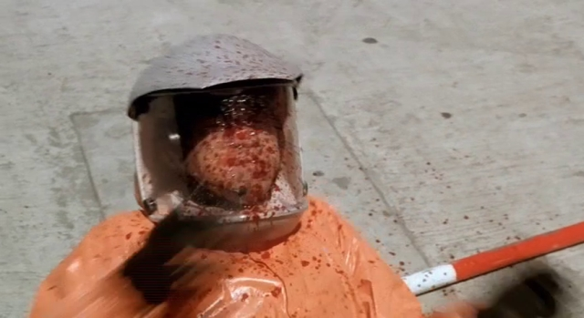

演南非老板的是罗莽大哥。仔细一琢磨，文艺片这东东罗大哥也没少演。
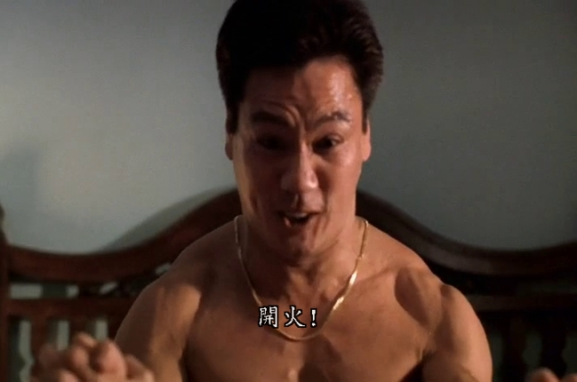

二十年前，在宿舍里看这片的时候，对病毒的传染性叹为观止，什么一个喷嚏喷死的小混混啊，一口痰传染的售货员都成了那几天的谈资。谁知若干年后，比片子里的病毒更可怕的传染病真的大规模流行了起来呢？真真是白云苍狗。
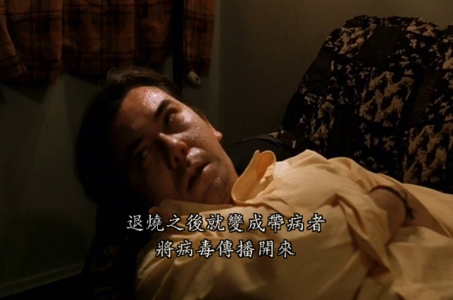

记忆中的镜头，也是黄秋生先生永载影史的两个变态造型之一。
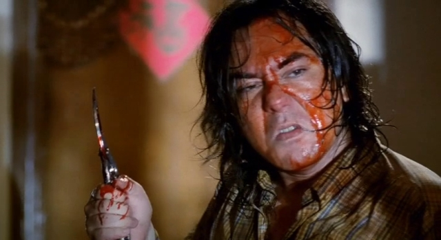