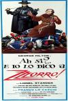
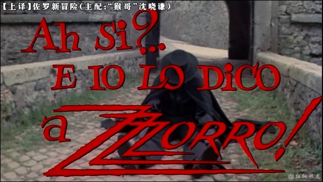
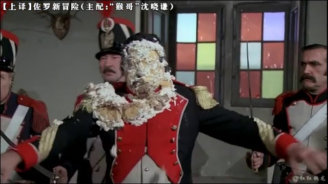
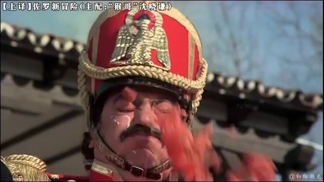
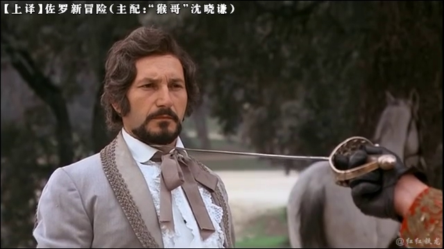
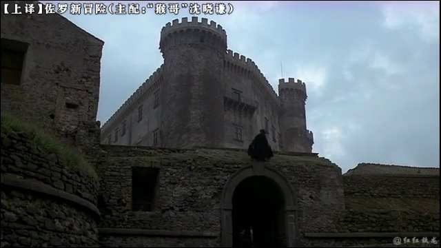
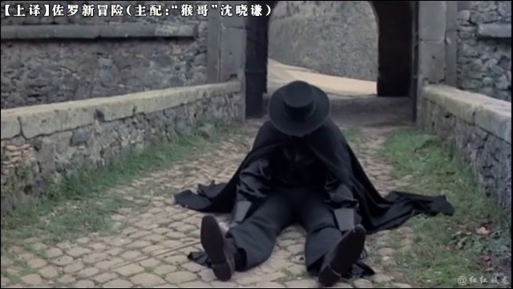

[佐罗新冒险](https://pewae.com/gaan/aHR0cHM6Ly9tb3ZpZS5kb3ViYW4uY29tL3N1YmplY3QvNDMyODAzOS8=)

原名：Ah sì? E io lo dico a Zzzorro!导演：Franco Lo Cascio主演：Charo López / George Hilton / Lionel Stander类型：冒险 / 喜剧 / 西部地区：意大利 / 西班牙首映时间：1975

本片又双叒叕是小学包场看的电影。其实小时候看的电影大多数我都是能记得名字和一两个镜头的。刨去爱国主义教育片，我倒是很愿意把他们一一都列一遍，只要能找到资源。
只可惜，很多片子只是记忆中的美好。比如本片，重温之后发现实在是没太多可说的。
那就多聊点儿别的吧。

片子虽然拍摄于70年代，但我们小学大概是在1989年才组织看的。七八十年代改革开放后，国家很是引进了一批各国的优秀电影，70年代居多，再往前的也有，他们统统拥有一个名字——“译制片”。其质量又以上译厂出品的质量为最佳。
因为多了一道翻译的工序，所以译制片的出厂并不遵照其拍摄时间，而要以离开翻译厂的时间为准。因此看的时候它并不是很“老”，换句话说，配音的时间不长。

我其实记不清究竟是在1988年还是1989年看的这片了，但绝对不是1990年，因为我记得当时的班主任。
小学时，我们看大多数电影都得排着队牵着手，步行大约3里地，去大钢（大连钢厂）文化宫。在路上离文化宫比较近的地方有个不太大的街边公园，偶尔看完电影，老师还会让我们进公园里玩一会儿。那个公园应该完全是钢厂出钱维护的，里面有座落差非常高的铁皮滑梯，有铁索和铁棍焊在一起让孩子像猴子一样爬来爬去的“泸定桥”，有三层的钢棍焊成的迷宫，还有三五架大秋千。跟现在的塑料游乐设施相比堪称钢铁朋克。

但是吧，《佐罗新冒险》这片似乎是在上午看的，那就没机会在公园玩了。
看完电影返回学校路过公园的时候，班主任忽然冒出来一句：“同学们，以后你们来公园可以，但千万别上公园后山，后山有坏人。”
这是句相当突兀的安全提示。因为途中我们甚至会经过一小片稀疏的乱葬岗，死小孩们在坟头上追跑打闹老师都没提醒过要注意什么安全。

直到很多年以后，我都工作好几年了，难得遇到一位根正苗红的钢厂子弟同事。小时候不到2公里的距离自然成了拉近关系的纽带。谈到他家的地方时，他说：“我家就在‘炮山’边上。”
我问：“什么炮山？”
他说：“就是XX公园的后山啊。上面一群大婶，几十块钱一炮，这都多少年了，你竟然不知道？从你们学校来大钢看电影，就是从炮山西边绕了个小半圈啊。”
这才理解了当年老师的良苦用心。

说回这部无聊的片子。全球人民群众喜闻乐见的动作喜剧。而且是跟风片。当年的那部原版法意合拍的《佐罗》可谓家喻户晓，然后就有了这部意西合拍的《佐罗新冒险》。讲的是一些西班牙百姓反抗拿破仑入侵的故事。说百姓还不太准确，因为片尾打跑了拿破仑军队之后，他们又自觉地找回了原来的领主。

故事的设定在现在看来俗套透了：一个小混混，在真佐罗摔烂屁股之后被强行套上佐罗的行头，带领反抗军打法国鬼子。其动作设计和娱乐效果都像极了耳熟能详的《A计划》。另外主角有个喝了酒才能打的设定，妈蛋我都不知道是不是应该相信袁八爷的原创性了。（本片拍摄于1976年，而《醉拳》诞生于1978年。）

其实原版《佐罗》我们也是在电影院看的。有一说一，这个世界上耍剑帅得过阿兰德龙的人还没出生。不过依稀记得正片的观看反倒是在本片之后。所以为我们科普欧洲击剑运动的光荣任务也是落在了本片而不是原版上。小男孩之间用木棍决斗是常有的事，只不过像钢剑那样有硬度有弹性粗细合适的木棍不太好找，所以模拟的斗剑往往会演变成拿棍子互抡。多年以后看奥运击剑比赛，解说员科普击剑运动，说剑分三种，花剑只能刺，佩剑可刺可砍，重剑以砍为主。心中竟产生了一种我们从小玩的也是贵族运动的错觉。毕竟砍也算嘛。

小孩子眼中这类片子当然是热闹的，然而热闹过后，30多年过去，记忆中的镜头仅剩一个：
真佐罗耍帅，跟自己的坐骑没配合好，直接坐到地上，“屁股摔烂了”。

