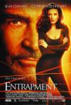

[偷天陷阱](https://pewae.com/gaan/aHR0cHM6Ly9tb3ZpZS5kb3ViYW4uY29tL3N1YmplY3QvMTMwMDA2OS8=)

原名：Entrapment导演：乔恩·阿米尔主演：凯瑟琳·泽塔-琼斯 / 威尔·帕顿 / 文·瑞姆斯 / 肖恩·康纳利 / 莫里·柴金类型：动作 / 惊悚 / 爱情 / 犯罪地区：美国首映时间：1999

1999年秋天，我考上了大学。很快就跟宿舍里的小伙伴攒了[自己人生中的第一台电脑](https://pewae.com/2010/07/living-on-net-for-10-years-2.html)。
老六是我们宿舍里最小的一个。他并没有参与入股，其人对玩游戏也没什么兴趣。他唯一的爱好就是看好莱坞动作片。几乎每个周末，他都会跑去租一两张VCD回来，借我们的电脑一起观赏。电脑刚配上的第三或第四个星期，我们就阖宿舍一起观赏了这部当年的大片。
而且就在同年11月，跟某小贝的球迷跑去校外的录像厅看丰田杯直播。晚上6点开始比赛，下午两点就要提前买票进场（付三场录像的价钱）。开始前老板放的垫场片之一也是这片。故此印象颇深。
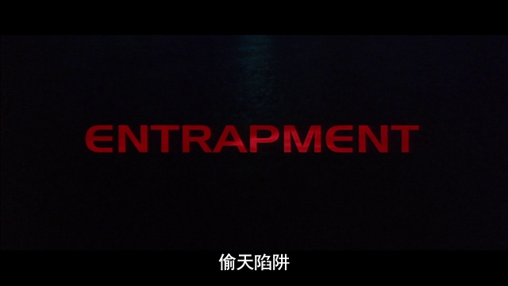

影片是部披着高科技外皮，以雌雄大盗互害为引子的腐臭的爱情片。这部电影配角戏份很少，几乎就是肖恩·康纳利和凯瑟琳·泽塔-琼斯的二人转表演配合各种黑科技效果。
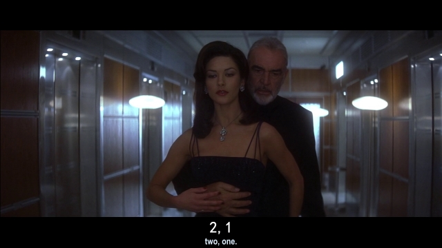

老六当时租片，就是冲着泽塔-琼斯去的。因为他那时每个月买电影杂志，上面吹捧凯瑟琳·泽塔-琼斯是“让世界惊诧的美丽”。其实这个时期的泽塔-琼斯马上就30岁了，颜值已经在下降期。但这位英国美人的五官确实有种很“正”的美，非常符合东方人的审美习惯。她的骨架很大，生完孩子复出之后给人的感觉就只剩“壮硕”了。本片差不多是她最后的性感时刻。后来我另找到过她20岁时主演的法国版《一千零一夜》，那才叫一个美艳不可方物，还有福利呢！（可惜光盘已经读不出来了，tt0098961）
凯瑟琳艳压全场，始终处于外放的表演状态。片中她秀了穿衣服和不穿衣服的身材，秀了舞蹈和瑜伽功底，秀了演技。甚至还有一句中文台词“毛主席说：‘百花齐放’。”当年见识浅，这句词一出宿舍里笑倒一片。
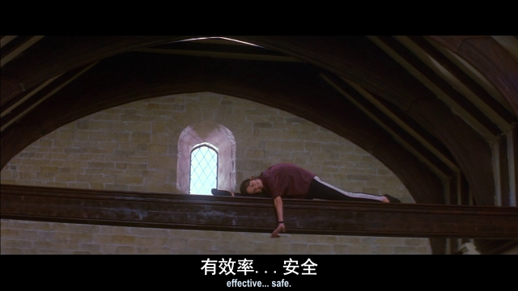
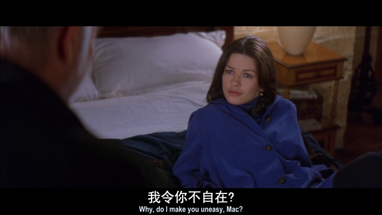

我认为，在这个星球上所有长嘴的人类女演员中，泽塔-琼斯是嘴型漂亮的那个。
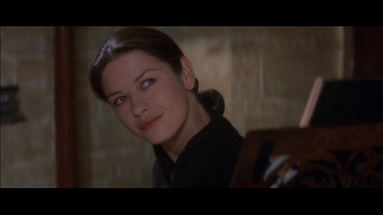

康纳利那时已经年近70，始终表现得很稳。而且全片里也没什么动作戏，双子塔走钢丝那段应该是替身。
第一次看的时候，我就发现康纳利的口音非常独特，几乎所有的【s】都会发成【sh】，跟沈阳苏家屯地区不分平翘舌的习惯非常接近。第二次看的时候才被小贝球迷同学科普，这是苏格兰口音不是苏家屯口音，是老头的特色。《勇闯夺命岛》的时候咋就没感觉哩？废话！《勇》看的是电影频道国配版啊！
《皇家赌场》之前所有的007我确实都刷过一遍，印象最深的是《巡弋飞弹（Never say never again）》这部本身出身不纯正而未列入007正传的作品。那正是老爷子最后一次演邦德。不过那部片焦点全在金·贝辛格这位邦女郎身上，完全没在意007的死活。
也没更多可以缅怀的，毕竟不属于自己的年代。
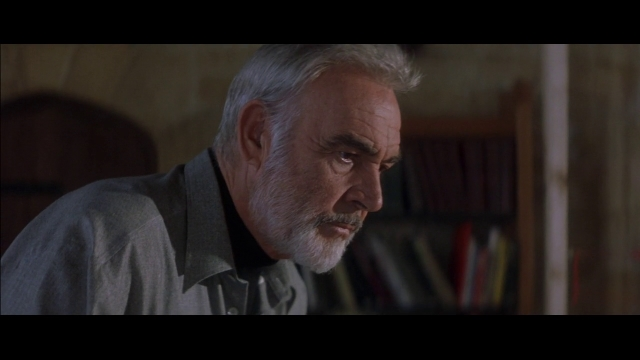

其余看点寥寥。开场顶楼悬索偷画创意上不新鲜，不过是结合高科技有些酷炫。老六看到泽塔-琼斯钻红绳那段的时候，曾无耻地要求停下回看。一边看还一边念叨：“太有创意了，太有创意了！”当时就被我怼回去了：“你是没看过《纵横四海》吧！”
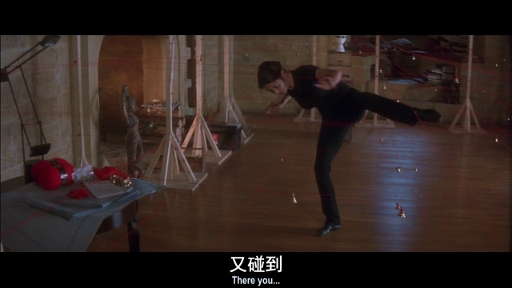

其实当年的好莱坞已经开始注重亚洲元素。两人偷的艺术品是中国的，地点是在当时的世界最高的吉隆坡双子塔。好像曾经的世界第一高楼总会在电影里呈现出多灾多难的状态，但只要从第一的宝座上掉下来，立刻就会少很多片约。从帝国大厦，到威利斯大厦，到双子塔，到台北101，再到哈里发塔。
来自中国的展品，密码也是中文的“别用炮打蚊子”。可能是论语里的“杀鸡焉用牛刀”。
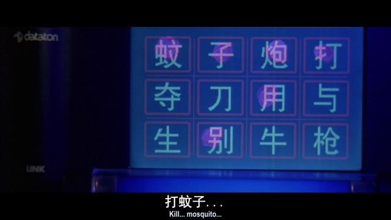
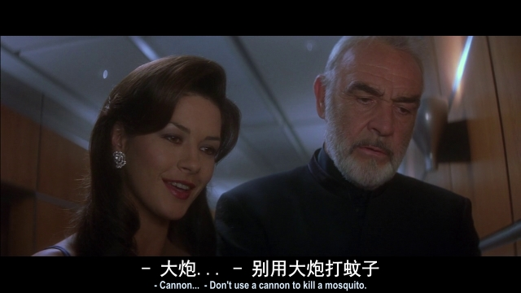

1999年特流行的一个话题就是世纪末。两人的行动也是利用了银行调试“千年虫”的流程上的漏洞。其实千年虫的问题属于提前发现的逻辑缺陷，虽然采取了大量措施，但终究是那时的程序员们的容错处理写得太出色了，连个屁大的水花都没曾掀起。
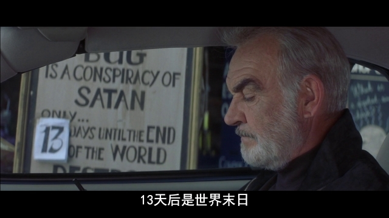
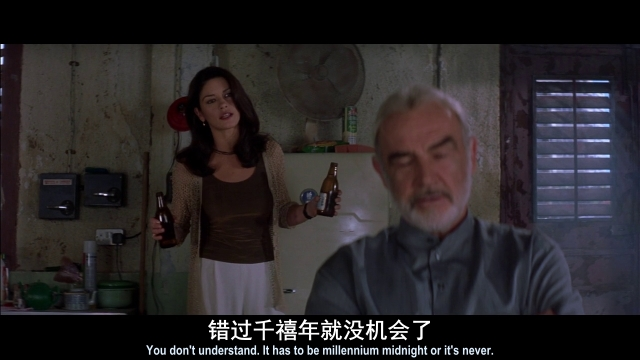

记忆中的镜头：
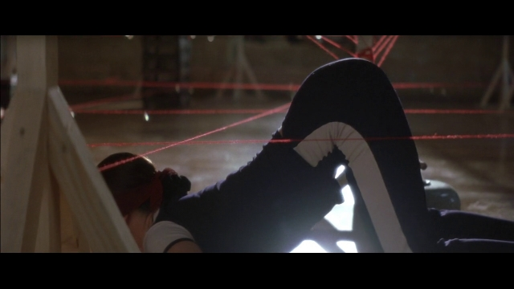