[傻冒经理](https://pewae.com/gaan/aHR0cHM6Ly9tb3ZpZS5kb3ViYW4uY29tL3N1YmplY3QvMTI5OTg0MC8=)

导演：段吉顺主演：冯远征 / 宋丹丹 / 陈佩斯 / 陈强类型：喜剧地区：大陆首映时间：1988

这次回忆一下陈佩斯先生。
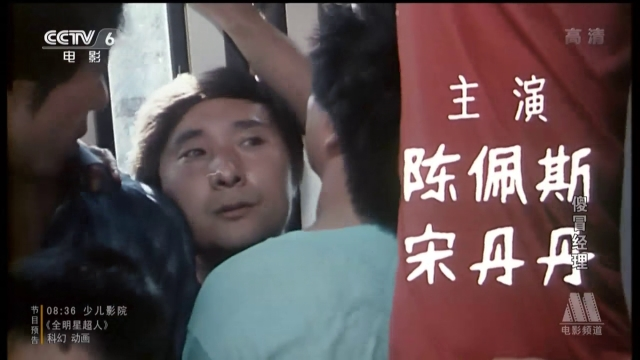
陈佩斯一直是国内喜剧创作的先行者。因为陈强老先生的戏剧背景，所以陈佩斯的作品总是通过戏剧冲突来制造笑料，这跟相声演员下海，二人转演员上台通过语言搞笑的方法截然不同。这也就造成了，陈佩斯的喜剧电影，往往没那么“爆笑”。
本片拍摄于1988年，是陈小二为主角的“天生我才必有用”系列的第三部。陈佩斯的这个系列电影，在90年代初中期的时候经常在AV2和AV6套重放。前三部都只能算轻喜剧，第四部最搞笑，第五部更像傅艺伟的大女主戏。个人认为，本片是全系列笑料最少的一部，甚至到了结局的时候根本是个悲剧。
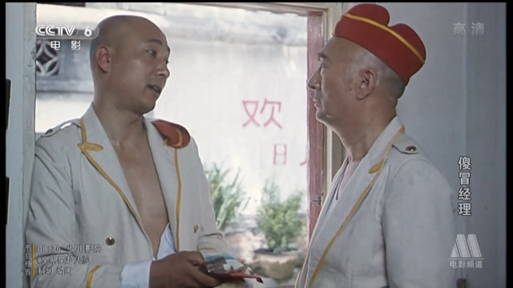

本片故事承接上一部《二子开店》。说的是陈小二创业成功，开办旅店之后守业失败的故事。故事中，陈佩斯开办的“比家美”旅舍内忧外患。在外部频繁遭遇工商、税务、公安、市政以及街道大妈和社会流氓的刁难；在内部遭遇了员工的阳奉阴违。最终陈小二众叛亲离，把店让了出去，连他爹都同意撤掉他的经理职务，甚至女朋友也要被好朋友拐跑了。

阵容方面，除了陈佩斯陈强父子老搭档，还有固定搭配的黄玲女士演陈佩斯他妈。这位老太太从1978年的《瞧这一家子》开始就演陈佩斯的妈，以至于很长一段时间里我都以为他们真是一家子来着。
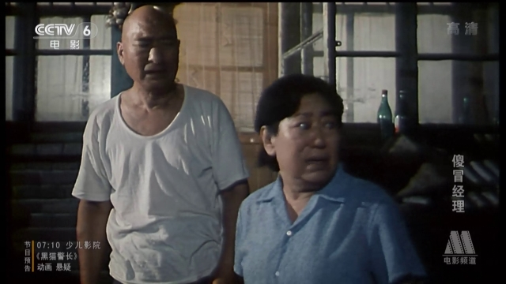

女主角由前一部的张静林换成了宋丹丹。宋丹丹自然不是丑人，但即使是年轻的时候也自带一种平民气质，完全不会让人觉得她是美女。
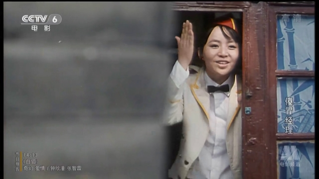

男二也从梁天换成了冯远征。有种说法是因为女主和男二都黑化了，所以梁天和张静林都辞演了，真伪难辨。不过宋丹丹可要大牌多了，由此推断该说法不可信。
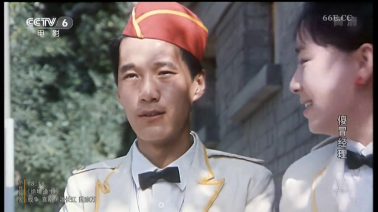

下面介绍一下豪华的搭戏阵容：
工商局的雷恪生老师。因为陈小二不长眼色不肯隐形行贿而嫉恨在心。陈小二把被各路神仙刁难的事情捅到报社后，各部门都很难看。雷使了个捧杀之计，让陈小二当个体协会会长。令他出钱出力还不讨好里外不是人，可谓老奸巨猾。
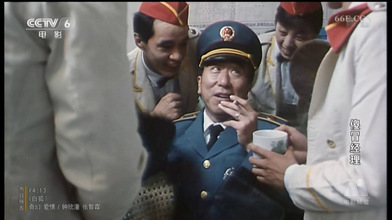

税务局的常蓝天老师。各种名目的税和费，晚交一天也要收滞纳金。严格来说并不算刁难。后来冯远征使坏，故意在发票本上动手脚，被他发现，直接导致了陈小二下课。
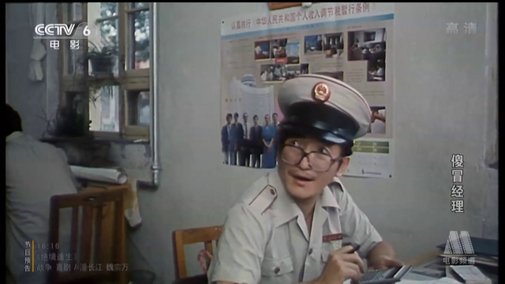

市政的职员表里写成了黄绍泉的黄少泉老师。下发任务让各单位买市政的一串红花盆摆在门口，陈小二不干，摆上了自家的月季。然后就被市政盯上了，黄老师专门盯着陈佩斯的旅店门前抓烟头纸屑，抓到就罚。陈强没办法，坐到门口反盯梢。这段戏特有意思。时至今日，“门前三包”仿佛也没人再提了，城管的行为却依旧是那么low。
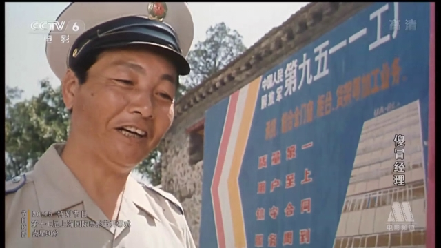

街道大妈陈立中老师。摊派耗子药。
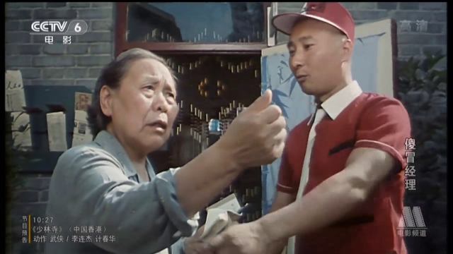

竞争对手的宋春丽老师。宋老师太有老干部派头了，这个反派出戏。
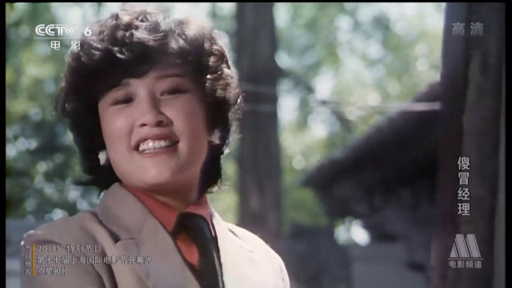

街头流氓赵小锐老师。后来当着公安的面逼债。赵老师这时浑身腱子肉，后来为了演李逵绝对是增肥了。影片的最高潮是由发票事件引发的多堂会审。官方各路神仙齐聚，一起批评陈小二身上的各种毛病。而流氓最后出现，当着公安的面直接要使用暴力催债，成了促使陈小二离职的最后一根稻草。赵老师两眼一瞪，嗯，流氓和悍匪差得也不多嘛！
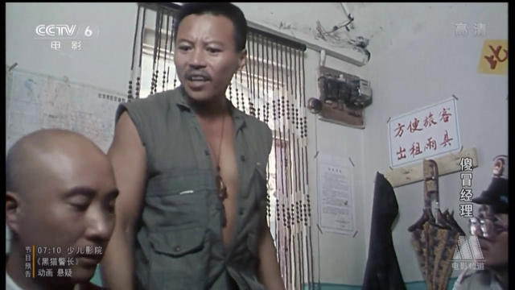

南霸天面子大，找来王翻译官和胡汉三客串旅客。
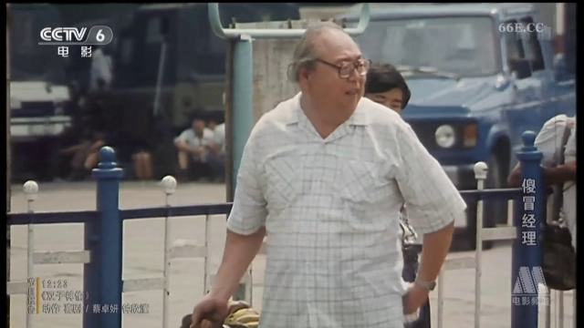
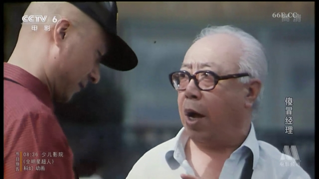

以及客串火车站执勤人员的穆铁柱老师。在电影中客串似乎是中国男篮的一个传统，穆铁柱以后，巴特尔、马健、孙悦、王治郅、易建联、孙明明也都干过。穆铁柱应该是目前电影演得最多的一个。
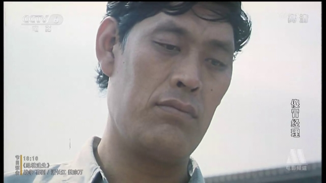

笨是一种美德。陈佩斯扮演的陈小二，坚持遵守法律，坚持良心开店。不仅被体制的各种小官僚整得死去活来，而且为嫌挣钱少的各路员工所嫌弃。陈佩斯估计也没想到，这片子成功预言了十年之后跟央视打官司的自己吧。两个黑化的人物很有典型性。冯远征是坚持认为做生意就应该赚钱，什么违规拉客虚假宣传虚开发票偷税漏税都是必须的；而宋丹丹则是虽然理解，却想转变陈佩斯的观念。陈佩斯坚持了，冯远征赢了，宋丹丹失败了，后俩人走到了一起，讽刺。

回忆这部片子，并不是说它有多好，而是为了那时宽松的审查力度点个赞。换今天，别说公安税务工商不答应，就算是街道和个体协会也能让本片胎死腹中。
同时缅怀一下那些在或不在了的老戏骨们以及记得住或者记不住的记忆中的童年。
比如惊鸿一现的中国第一家前门肯德基。
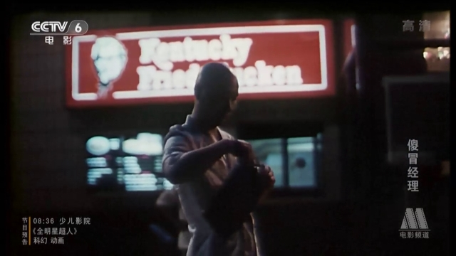
比如“大团结”。
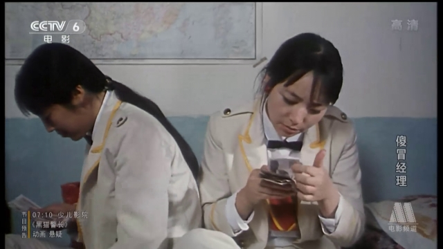

记忆中的镜头一：宋丹丹色诱陈佩斯。
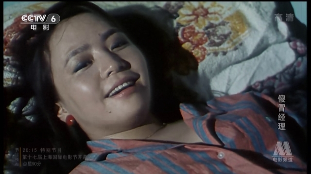
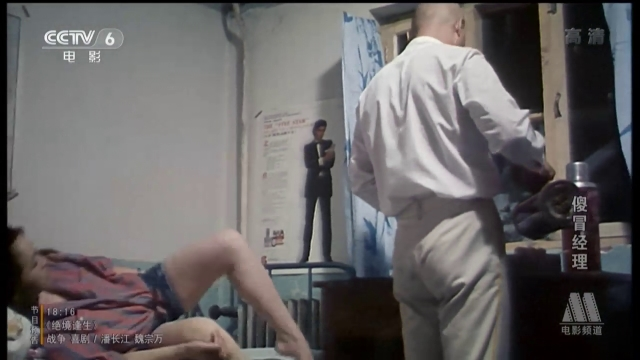
记忆中的镜头二：宋春丽宋丹丹掐架前先摘耳环。
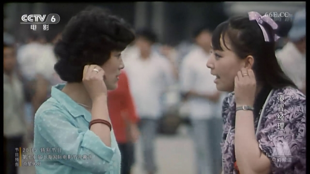