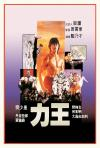

[力王](https://pewae.com/gaan/aHR0cHM6Ly9tb3ZpZS5kb3ViYW4uY29tL3N1YmplY3QvMTMwODkxMi8=)

导演：蓝乃才主演：丹波哲郎 / 何家驹 / 叶蕴仪 / 大岛由加利 / 曾近荣 / 杉崎浩一 / 樊少皇 / 陈治良 / 黄国梁 / 黄贵雄类型：动作 / 惊悚 / 犯罪地区：香港首映时间：1992

写《南拳王》的时候，@仓颉 兄就提起过力王；后来写《黑太阳731》，我哥@sanpi 也提起了力王。这力王就这么有名么？
是的。
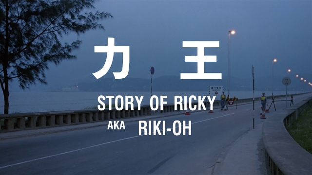
90年代中前期，《力王》可以说是录像厅的招牌主打，要是没这片压阵，录像厅都开不下去。自古以来黄暴一体，“黄色录像”不敢公开宣传，那就只能以极致的暴力作为卖点。可以说，《力王》满足了所有向往猎奇和暴力观众的需求。
我小时候就（敢）没进过录像厅，租带时问过几次，永远租不到。上大学后倒是为看球进过几次，但彼时连VCD都已经进入末法时代，垫场的永远是周星驰、杜琪峰或者好莱坞大片，无缘一睹风采，故而一直耿耿于怀。
所以我一直以为自己没看过力王。2003年非典期间回不去学校，天天百无聊赖地找各种资源。忽然想起这部片，就找到资源打算大快朵颐。
下来之后才发现，这片我一年多以前（2002年寒假）跟老爸吃午饭的时候某电视台放过。只不过当时没看到开头，右侧小字也绝对不是《力王》这个标题。
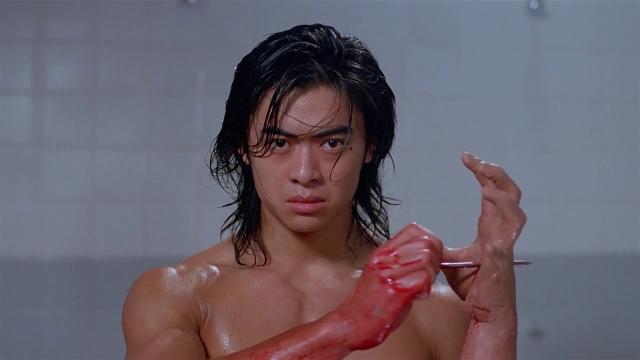

本片改编自日本漫画，又找来了不疯魔不成活的鬼才导演蓝乃才，故而漫画里血流成河的夸张风格被完美地复刻了下来。力王第一次小试身手就直接弄残一位，体现了本片的尺度。
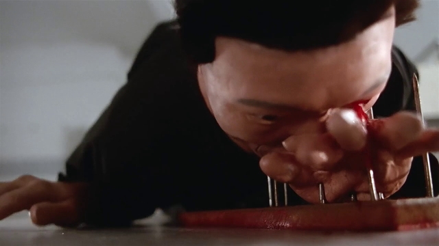

爽就完了，根本不需要什么逻辑，满嘴刀片第二天连个疤都没有，在地里埋了7天出来照样生龙活虎，这样的不合理设定比比皆是。越往后越过瘾，什么捏碎脑袋、挖肠子，爆眼球、飙血浆，差不多B级片该有的要素都全了。
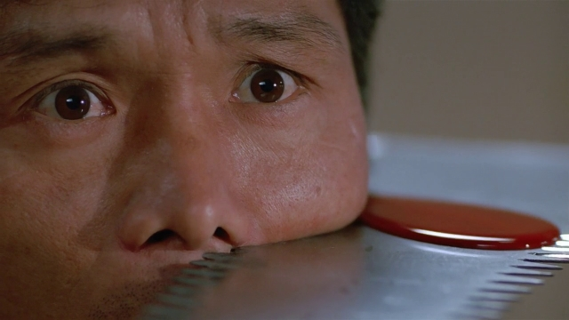
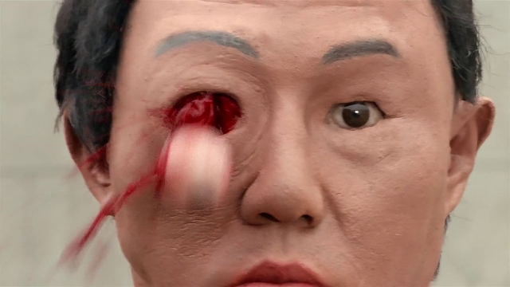
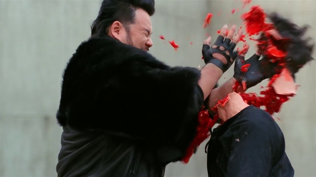
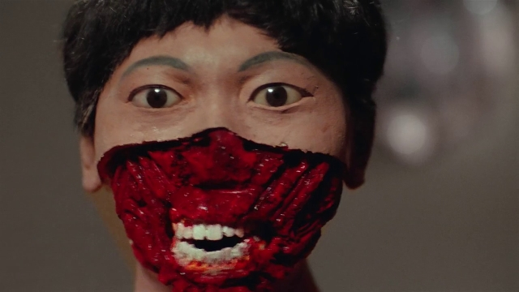
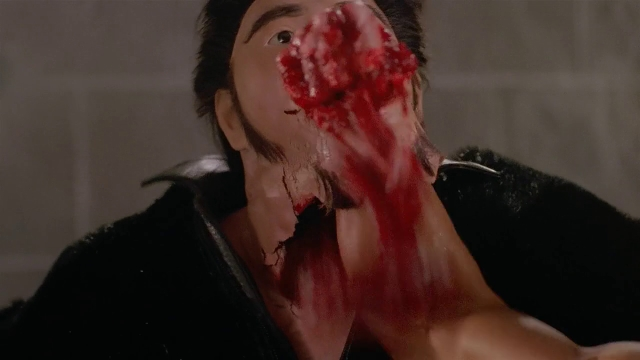
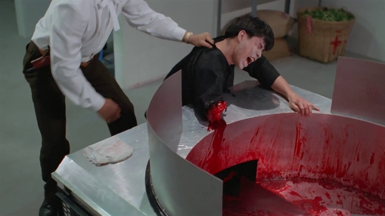

男主角是大眼肌肉男樊少皇先生。看过力王之后才了解，为什么97天龙播的时候有那么多人对樊少皇演虚竹这个傻小子耿耿于怀——好钢用在了火柴棍儿上。樊少皇演力王的时候才20岁，有颜有肉，这涨鼓鼓的身子会招来多少老阿姨啊！而且由于本片是漫改作品，动作有意搞得很夸张。贺力王即使没事儿站着的时候也是两膀子端在那里凹造型——站街卖肉风。樊少皇自己在访谈里也说过，这部片子他拍得很轻松，虽然是动作片，但并不花俏，只要摆个架子突出力量感即可。
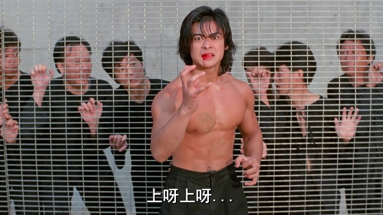
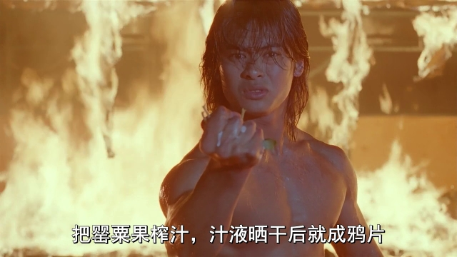

最活跃的反派是提过一次的樊梅生。要说影二代出道的时候，父兄辈提携一把很正常：陈强之于陈佩斯，王天林之于王晶，成龙之于房租名，秦沛之于尔冬升，蒋雯丽之于马思纯，宋丹丹之于巴图无一不是竭力铺路。最典型是成龙，为了给房租名搞个露脸的机会，屈尊到《千机变》这种体量的片子里去客串。但是像樊梅生这样扮反派被儿子打的，确实罕见。当然，像我这样的人，觉得唯一的遗憾就是樊梅生是被何家驹一枪射爆的，而没有被樊少皇打死。
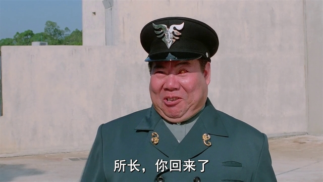
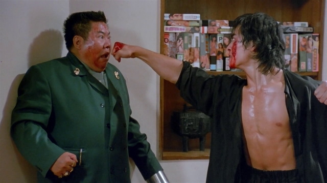
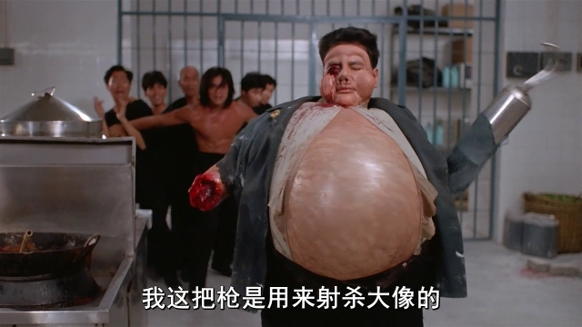

英姿飒爽的大岛由加利演了个次级别的中BOSS，片中没提但应该是反串男的，国配的声音非常奇怪。不过本片的服装设计对大岛不利，显得她腿特别短。最后阶段奉献了一张经典表情包。
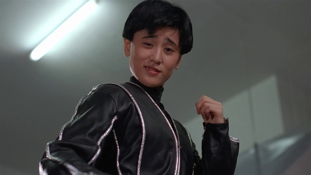

名义上的大BOSS是四大恶人之一的驹哥。驹哥在片发挥得并不充分，比樊梅生可差了不少，可能是受了发型影响。最后决战时还嗑药变身应该就不再是驹哥本人了，变身后越看越像三岛平八。
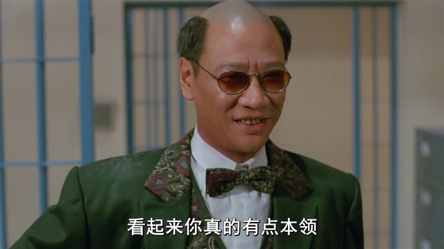
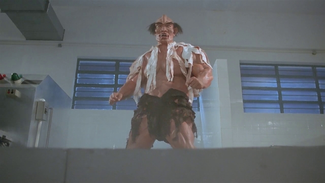

一番苦战之后，驹哥被磨成肉酱。
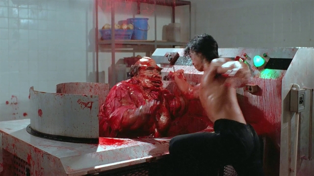
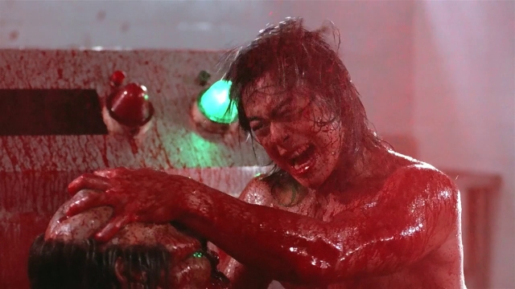

无处不在的死胖子……
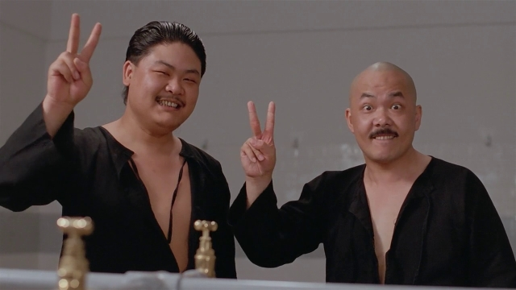

记忆中的镜头一：
力王胳膊筋被挑断，直接用灵活的嘴和左手打个结接起来。
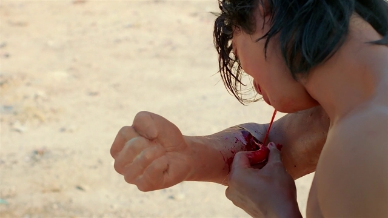

记忆中的镜头二：
一拳轰开监狱围墙。
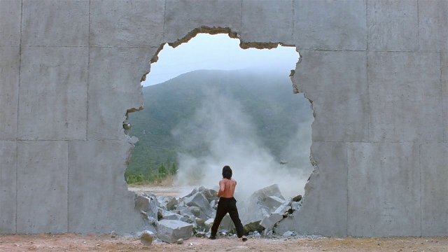