这部电影简直冷僻得没朋友。支撑我维持记忆的，与其说是情节，不如说是一股怨念。

[十二点零一分](https://pewae.com/gaan/aHR0cHM6Ly9tb3ZpZS5kb3ViYW4uY29tL3N1YmplY3QvMTQ0MDE1MS8=)

原名：12:01导演：Jack Sholder主演：Cheryl Anderson / Constance Marie / Paxton Whitehead / 乔纳森·斯沃曼 / 尼考拉斯修尔维 / 杰里米·皮文 / 格伦·莫肖尔 / 海伦·斯雷特 / 罗宾·巴特利特 / 马丁·兰道类型：喜剧 / 惊悚 / 爱情 / 科幻地区：美国首映时间：1993

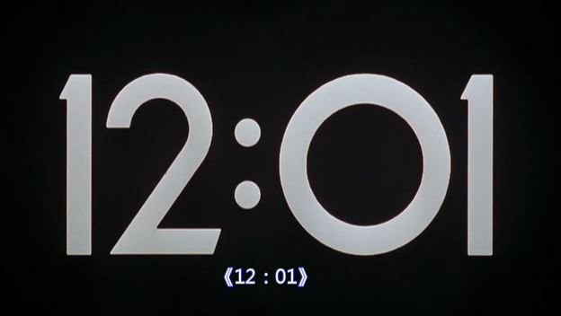
那是1995年寒假，快要过春节的一个周二晚上。CCAV6的“海外剧场”播了这部片子。那时候对周二的原声配字幕电影还蛮期待的，所以开头是看全了。
可海外剧场本身播的就晚（好像是十点档），老妈又几次三番催我睡觉，看了大约一半就被强迫上床了。
倒也没什么，第二天再看白天的重播呗，反正放假。
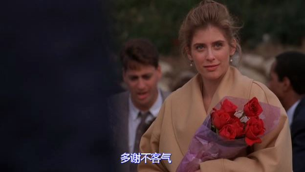
孰料第二天一早猪猪约去他家打扑克，到了下午一点就坐不住了，借口要过年了老妈让擦玻璃，赶紧赶回了家。
目的当然是为了看重播。看到最后男女主人公跟BOSS决战，忽然停电了。虽然只停了不到20分钟，却成功地令我错过了结局。
只能悻悻地擦玻璃了。
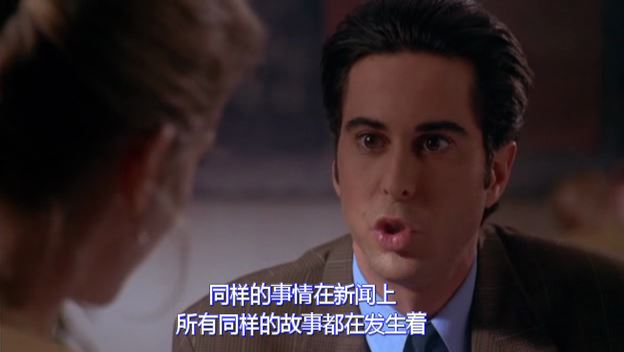
这以后的日子里，经常没事就切到CCAV6，妄图补完最后的那个小尾巴，可直到大学毕业，也没什么进展。AV6仿佛根本没重播过这部电影。
这时已经进入了BT的时代，也开始尝试搜索。可其英文名《12：01》这种数字加特殊字符的组合实在太坑了，找到的只是一堆堆的发布时间回帖时间……
后来有了豆瓣，我用了穷举法，找了若干跟“电影频道”“科幻”有关的豆列，终于找到了片子的介绍。
用中文名搜就是分分钟搞定的事儿了。唯一的遗憾是射手的字幕跟片源不同步。
本片是非常非常正统的硬科幻题材——某疯狂科学家的实验导致时间不断反弹，周三的12:01分会跳回到周二，这个地球上所有的人都在重复这一天。唯有在实验室外围打下手的男猪能保留记忆。男猪因为目睹到女猪被枪手灭口而决定改变这一切顺便泡个妞。
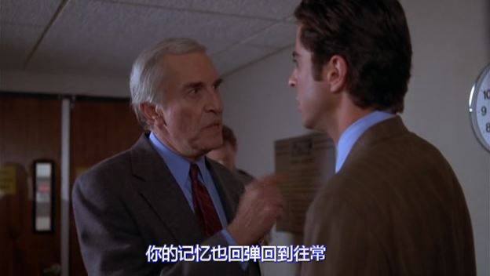
第一次重复，男猪跟女猪搭了话，女猪还是被射杀了。
第二次，男猪提醒了女猪，女猪将信将疑还是被射杀了。
第三次，男猪和女猪躲开了杀手，找到了有嫌疑的人，成功上了床。
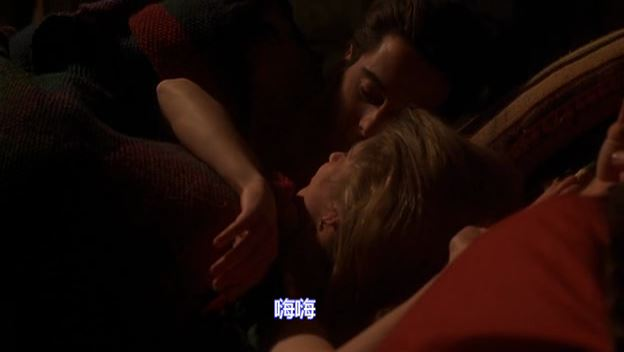
第四次，男猪和女猪找到了真相，双双被射杀。
第五次，男猪早上出门心不在焉，直接被对面的车撞死。
第六次，终于弄死了大BOSS，时钟能顺利跳过12：01了，大结局撒花。
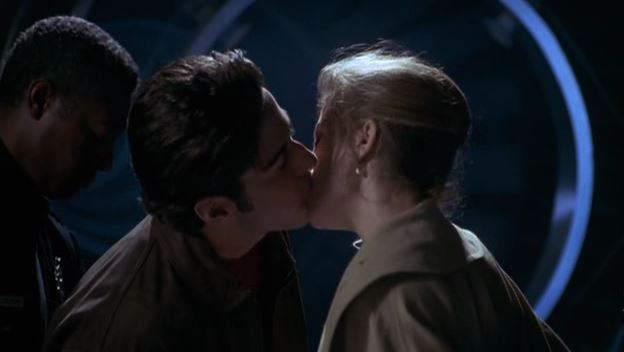

题材不新鲜，但演得好。尤其是难度最大的第二天（第一次重复），无论主角还是龙套，都演绎得非常到位。不过我倒是最喜欢第五天的故事，非常出人意料——你不是有大把地机会可以重来吗？好，早起到收工不到五分钟，这样的一天你满意吗？但说实话第三第四和第六次的剧情真的都非常烂。
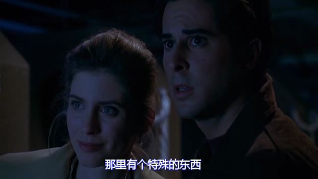

女主角的大眼睛非常漂亮，演过最出名的角色是女超人。男女主演应该都是电视咖，这片本来就是fox电视台拍的电视电影，成本应该是非常低的。电影频道引进了一部电视电影，这听起来一点毛病没有。
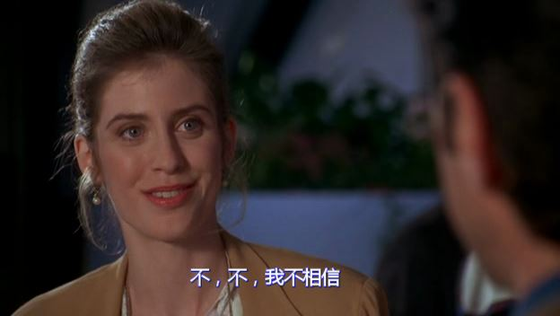

第二次和第四次重复，男猪的狱友竟然是丹尼特乔！！想想墨西哥老斑鸠那时候也没什么名声，应该是纯龙套而不是客串吧。
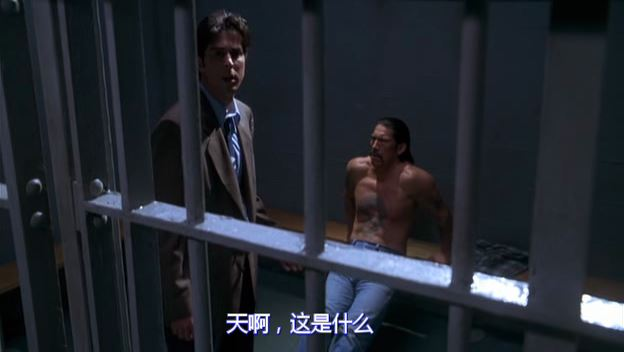
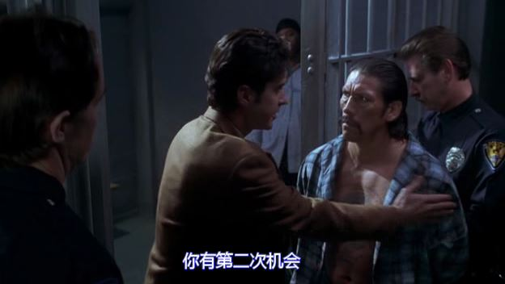

我喜欢看老片的一个原因是片子里能找到年代的记忆。比如本片里那种满大街扁装的小轿车，到了新世纪之后就再也见不到了。再比如表现高科技的实验室，控制台按键一排一排的，跟90年代的麻将机设计得差不多，而查询访客记录的电脑终端，是蓝底白字的命令行模式……
这实验室布景虽然简陋，却是实景搭的。在电脑特技泛滥的今天，这样的布景是再也见不到了。
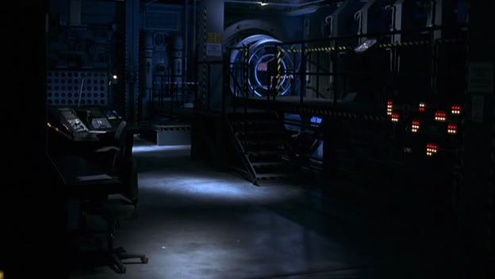

本片的主旋律是一首跳动的钢琴曲，非常骚气，要是有原声带就好了，反正我是没找到。