虽然只是一部普通的赌博/犯罪/喜剧片，但这部影片在我的童年时代的地位非常重要。

[千王1991](https://pewae.com/gaan/aHR0cHM6Ly9tb3ZpZS5kb3ViYW4uY29tL3N1YmplY3QvMTMwNTYyNS8=)

导演：于仁泰主演：乐韵 / 任达华 / 叶子楣 / 梁天 / 梁朝伟 / 泰迪·罗宾 / 黄百鸣类型：喜剧地区：香港首映时间：1991

这部片子的正式名是《千王》。但可能是同质影片太多的缘故，一般称为《千王1991》。
录像机/单放机的磁鼓是个比较娇贵的东西，而且当年的VHS带本身质量良莠不齐，看几盘录像之后磁鼓就会变脏，这时候就需要用清洁带进行清理。又有一种说法，清洁带本身也对机器的寿命有消极影响，最好的办法是用质量好的带子把磁鼓上的磁粉蹭下来。
我家里质量最好的带子就是这盘《千王1991》，上面那句话看懂了的话，就会明白为什么这片我看过不下30遍了。
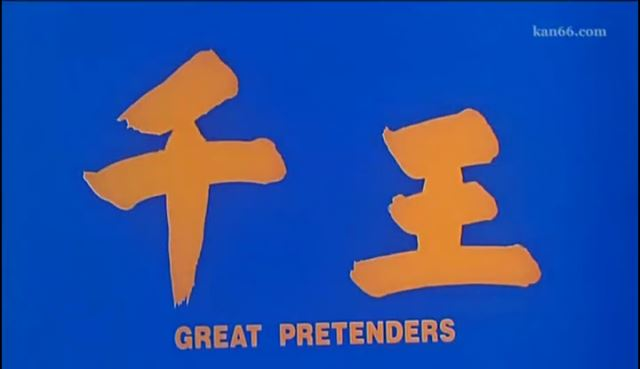

虽然是跟风的赌片类型，但黄百鸣和于仁泰呈现的是老千技术流的一面，尤其是麻将里如何通过暗号手势串通的一段，实在记忆犹新：

> 摸牌时从下往上摸是要吃牌，从上往下是要碰牌；
> 出牌前右手在桌子上敲一下再打出去表示自己听牌了，牌出手后五指分开放在桌上表示要条子，握拳表示要筒子，手放腿上表示要万子；
> 左手食指跟中指分开要一四七，中指跟无名指分开要二五八，无名指跟小指分开要三六九；
> 左手拇指放在食指指尖表示要小的，二节要中间，三节要最大的；
> 把最右面的牌往里面的1234顺位插表示要东西南北风，把最左面的牌往里面的123顺位插表示要中发白。

1993年的暑假，我跟大酒两个在我们家把这套东东演练了两天之后出去大杀四方，没出八圈就被人识破了——我们俩都听牌之后，谁都不愿意给对方做嫁衣裳，每次摸牌都要在桌子上敲一下之后一顿比划，谁还看不出来啊？！
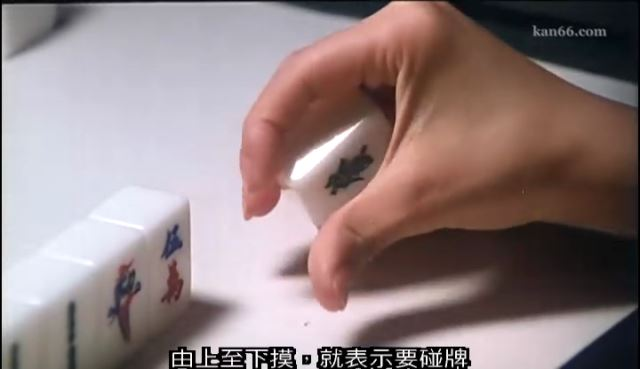
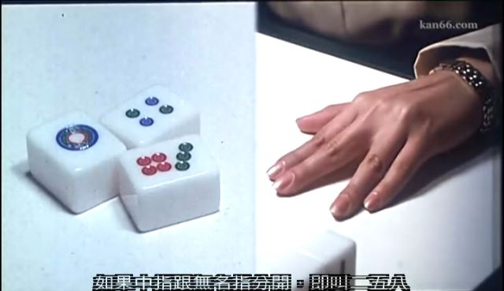
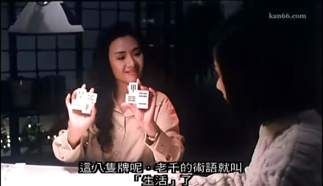

黄百鸣在编剧的时候对老千的“千”，强调的方向不是“赌”，而是“骗”，所以这片子跟别的赌片比，给人的感觉完全不同。故事也是围绕着骗子们的一个又一个套路展开：
首先是梁朝伟出场，用路上捡表的老段子做头盘。伟仔用卓越的演技把老掉牙的故事演得非常真实。梁朝伟手上的钱还没捂热乎，就被追债的一顿教训，给剃了光头。可能梁朝伟那时拍古装片，反正全剧假发出场，充满喜感。
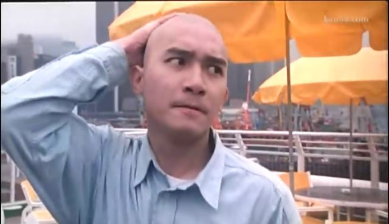

然后是女一号（？）新加坡丧夫女大款登场，换现在一看这头衔就知道是骗子，但当时可没觉得有这种套路。梁朝伟买通司机，雇人讹诈并英雄救美，不在话下。
单独说一下这位女演员，艺名乐韵，本片字幕里叫乐慧。模样非常之周正，乍一看有点像张雨琦。此女不出名，却是个有故事的人。据说当年她参加了红楼梦的选拔，被选中演王熙凤，却渴望到香港淘金，自己放弃了机会。到香港以后傍上了电影界的大佬罗烈，当了几年小三。受罗烈照顾演了几部影视剧，也没红起来。后来迟迟不得转正，自杀了。这女的面部一直没什么表情，不红也正常。
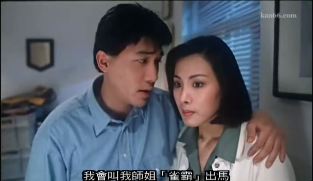
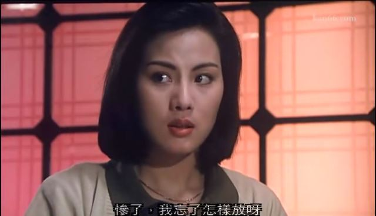

梁朝伟这次使出了明着ABC合伙坑D，实际上要坑B的手段，约乐慧和师姐叶子楣一起坑凯子任达华。然后插叙，师姐叶子楣闪亮登场。
上次说三级片的时候说过，叶子楣女士是光脱不露的艳星的典型代表。只要不露点，什么尺度都可以玩。叶的颜属实一般，但车头灯实在太亮眼了。黄百鸣这个老流氓给叶子楣安了个哮喘患者的身份，一激动就大口大口呼气，观众跟大胸都此起彼伏的。顺便说一句，叶子楣真的是没主动漏过点，唯二露点片是被黑社会胁迫的，其余的有露点也是用替身。
叶子楣也是套路开场，她跟三个邻居分别约好打麻将的时候互相松张，赢钱之后赢的钱对半分。然后叶子楣就轮流给三个人点炮，也就是输的越多，挣的就越多。其实这里面有个bug，除非是叶子楣输出去的钱不算，否则按照片子里演的三家赢一家输的话，叶子楣还是要赔钱的。
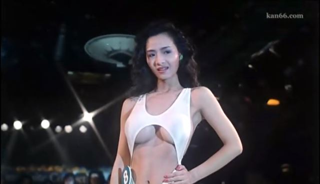

三个人的目标是任达华，一个有钱的gay。豆瓣的一句影评我特别喜欢：小鲜肉们看看，任达华当年是怎么演gay的！
接下来剧情反转，任达华抵押给乐慧的字条是真，而乐慧给的却是假钞。乐翻脸不认人，要凭字据收梁朝伟的店。梁无奈去找自己的老大黄百鸣。
黄百鸣出马又设了个局，用褪色墨水写支票，赢回了字据。
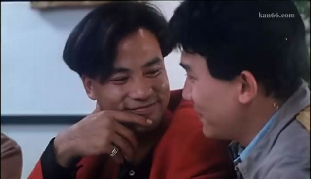

黄百鸣又表示不能让你吃亏，咱们再去干一票大的，千个放高利贷的做慈善吧。这地方就败笔了，你骗人就骗人好了，却非要找个高大上的做慈善的理由，假。
高利贷头子叫龙在天，看名字就不是好人。扮演者是香港的梁天，我就没见过他演好人。
几个人做局，叶子楣勾引梁天，干柴烈火之际让对方误认为误杀了人，混乱中趁机把钱A走。
黄百鸣把弄来的钱捐给警察局长，保得平安，最后龙在天不得不请“泰斗”来要把钱赢回去。
结果黄百鸣跟“泰斗”又设了个套儿……对了，泰斗是身残志坚的泰迪罗宾客串的。
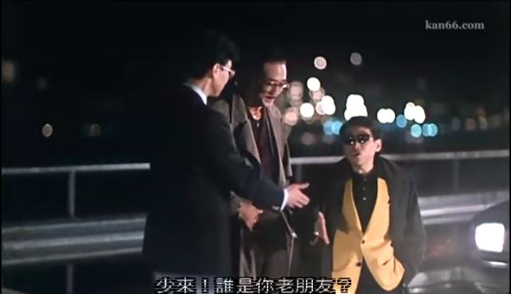

跟王晶的屎尿屁相比，新艺城方面的喜剧技术含量要高一点。黄百鸣编剧的风格挺适合我的调调。
虽然他编剧的时候夹私货，安排了叶子楣大凶撞自己撒娇的情节，以及任达华袭凶的镜头。
可能跟片子里的黄百鸣目的一样，贿赂不了警察署长，~~回落~~贿赂警察署长的弟弟也是一样的。
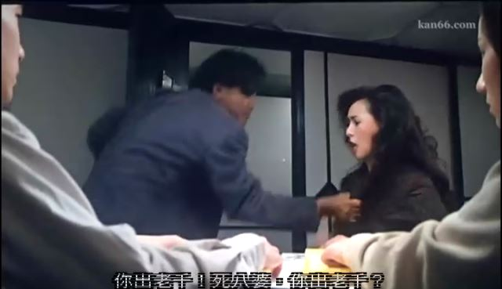

这个系列写了这么多了，第一次推荐。虽然是赌片，但赌得很有创意。没看过这片的可以下载一观，真的是节奏紧凑笑点足的佳作，别嫌老。
起码这片有胸看啊！