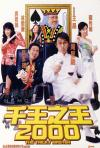

[千王之王2000](https://pewae.com/gaan/aHR0cHM6Ly9tb3ZpZS5kb3ViYW4uY29tL3N1YmplY3QvMTMwNDY3Ny8=)

导演：王晶主演：关秀媚 / 卢惠光 / 叶竞生 / 吴君如 / 吴志雄 / 周星驰 / 张家辉 / 林熙蕾 / 段伟伦 / 王晶类型：喜剧地区：香港首映时间：1999

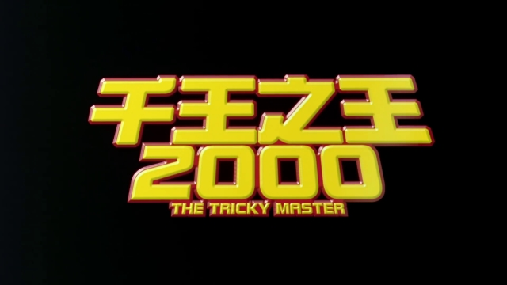
跟以前出现的很多片子一样，从各种意义上说，这部电影都算不上好，更是跟“经典”二字毫不搭嘎。选了这么个片子，主要是因为这两天我过着过着，忽然想起来距离自己大学入学已经过去了20多年了。确切说是22年。时间真是一件可怕的东西。等到了2004年，我想我心中关于老片的那条界线怕就要完全扭曲了。
1999年10月，跟宿舍的大哥和三哥[凑钱买了台破机器](https://pewae.com/2010/07/living-on-net-for-10-years-2.html)。虽然那是VCD方兴未艾，DVD崭露头角的年代，但这D那D的都跟咱穷学生没太大关系，一字记之曰贵。最受穷学生欢迎的是压缩盘。当时最流行的压缩格式是rm[[1]](https://pewae.com/2021/09/review-the-tricky-master.html#inner_anchor_1)，一张CD上能存普通码率的4个电影，码率高一点的就只能放两个。5块钱一张或者10块钱3张。当时，我5块钱买了一张合集，两部片子是《赌侠大战拉斯维加斯》和这部《千王之王2000》。算当年的新片。
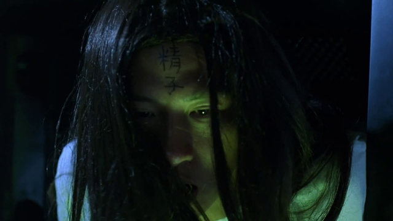

片名够土了。99年、2000年的时候大批的娱乐产品，包括但不仅限于图书、电影、唱片、游戏，都喜欢把诸如99、2000、千禧、世纪之类的符号加到自己的主标题或副标题[[2]](https://pewae.com/2021/09/review-the-tricky-master.html#inner_anchor_2)了，仿佛这几个字是什么兑奖密码，到2001年1月1日就piu地一下过期了似的。
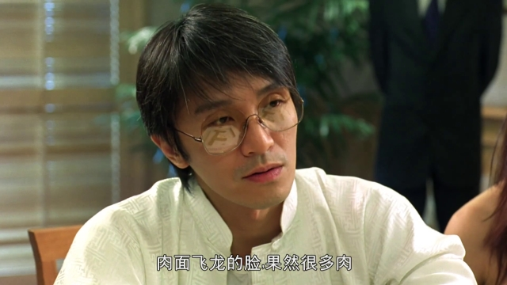

本片是顶着周星驰名号的喜剧大片，在寝室里看的时候也是呼朋唤友。片子放完，大家普遍对整个故事反应平平，唯独对一位演员众口一词地提出表扬。这位演员就是——“初恋”林熙蕾。这张碟上的两部片子，刚好是林女士大银幕演出的前两部片，导演都是王晶。要说王晶也算是捧女明星的大高手，林熙蕾在片中表现得可骚可娇，妩媚中带有青涩甜美，对得起在片中“初恋”的外号。林在那几年里特别火爆，广告代言不断，更是成了富商杀手，隔三差五就会上个小报头条啥的。但究其演艺事业则是演技毫不见长，颜值稳步下降，很长一段时间就只是个花瓶。直到2006年才有所突破，可怜那时脸上已经满是玻尿酸了。
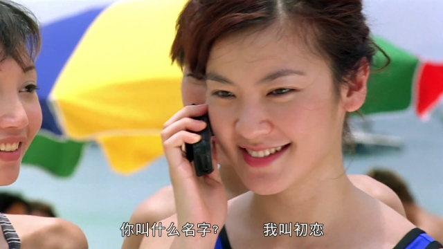

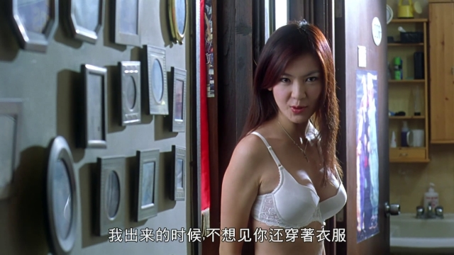

印象里从这部片子开始，王晶的喜剧灵感彻底枯竭，再也没有及格线以上的喜剧片问世（其它类型偶尔还有能看得过去的作品）。死胖子翻来覆去就那么几样，这片子里都用到了：比如炒当时的热点，本片里有cos基努和贞子。
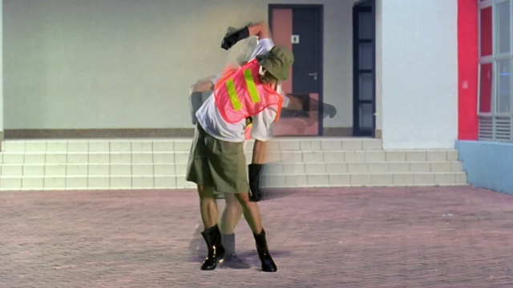
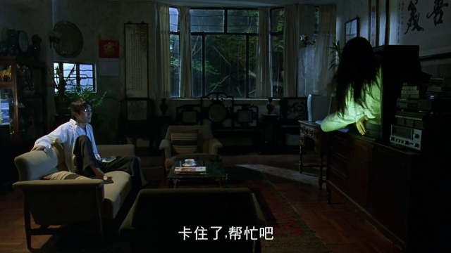

比如“致敬”，一身红裙的八两金显然是在致敬邱淑贞，而他片里的名字是“聋五”。
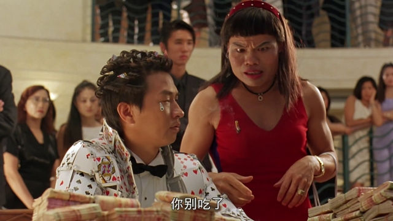
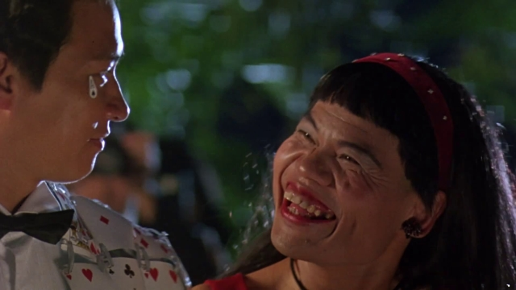

比如女装大佬。

比如碰瓷现实中的巨鳄。
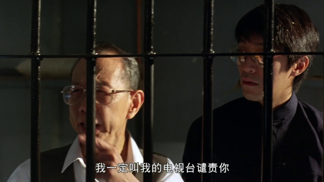
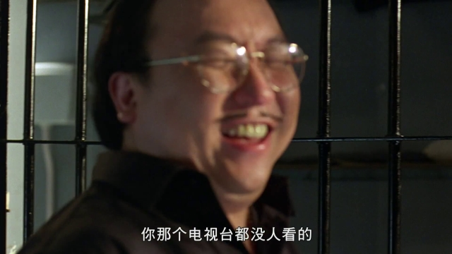

当然还有屎尿屁大王无穷无尽的屎尿屁。
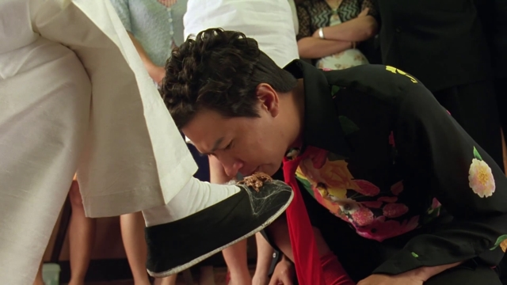

但是，本片很神奇的，所有的梗都烂掉了。从头看到尾，没有一个片段是能让人笑出声的。众所周知的，这是周星驰跟王晶的最后一次合作，片子拍完后王对周开炮，说他不敬业拿钱还多。周星驰在片中确实很颓废，无精打采的样子。但片子不好却绝对不是周的原因，根本没有所谓喧宾夺主那回事。我看来失败的原因有二，首当其冲就是王晶的本子不好。其次是主演渣渣辉不行。渣渣辉同学其实很早就出道了，但若论起手眼身法步这些演戏的本事，他最多只占个勤勉。他的影帝真的是一点一点熬出来的。在1999年的时间点上，可以说根本不是演喜剧男主角的料。
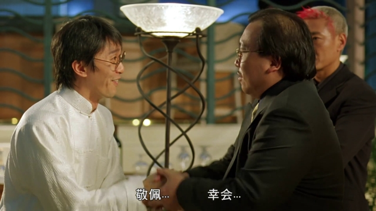

片子里不光只有周星驰。这部作品可以算是王晶早年配角系的全家福。梦遗大师、石榴姐、楚人美、基哥、B哥、八两金、达闻西、舞王修、宋世杰、田鸡、如花这些人济济一堂，但就没有一个演得出彩，都像在打卡下班。两位女主演，吴君如同样无精打采，甚至比周星驰还要丧；而关秀媚跟张家辉一个毛病，担不起。
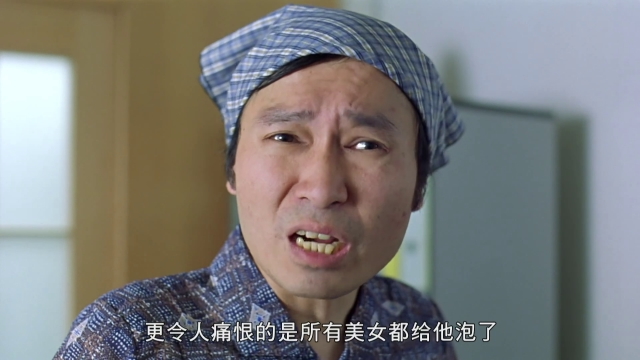

奉献巅峰演技的人也有，就是王晶本人了。王晶虽然很喜欢在自己的片子里露脸，但担当戏份很重的反一却很少见。“肥螳螂”算是死胖子为数不多能让人记住的角色。
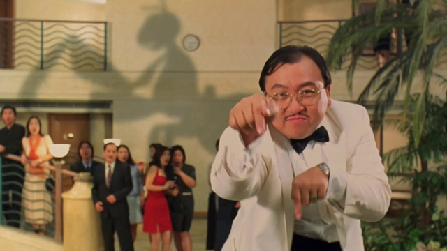

虽然喜剧部分不怎么样，快结束的时候有段打戏倒挺精彩的，周星驰过了一把cos李小龙的瘾[[3]](https://pewae.com/2021/09/review-the-tricky-master.html#inner_anchor_3)。
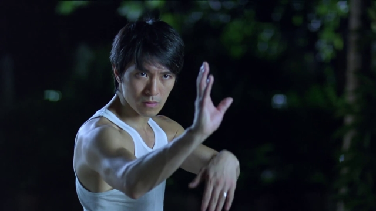

记忆中的镜头：
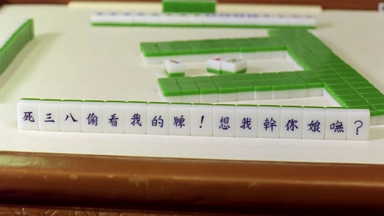

---

- [(1)](https://pewae.com/2021/09/review-the-tricky-master.html#inner_ref_1)：1999年还没有开发出rmvb，rm格式是固定码率，遇到激烈动作的场面就会变成一团浆糊。
- [(2)](https://pewae.com/2021/09/review-the-tricky-master.html#inner_ref_2)：伤心1999，走过1999，谢谢你的爱1999，99秘技宝典，99个人在1999，少女地狱一九九九，爱在2000，我去2000年，LOVE2000，模拟城市2000，幻想曲2000，明星志愿2000，沙丘2000，抢滩登陆2000，二千年之恋，瑞星千禧世纪版，千禧金瓶梅之我为嫂狂，化骨龙与千年虫，妹力新世纪，人人都有个小板凳我的不带入二十一世纪，新世纪，世纪末精选，世纪大富翁
- [(3)](https://pewae.com/2021/09/review-the-tricky-master.html#inner_ref_3)：本片早于《功夫》